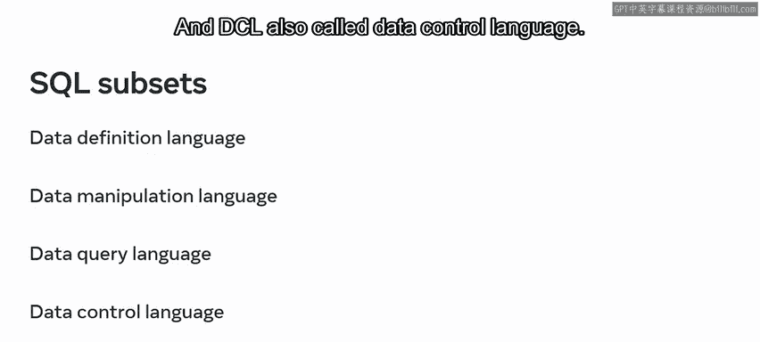
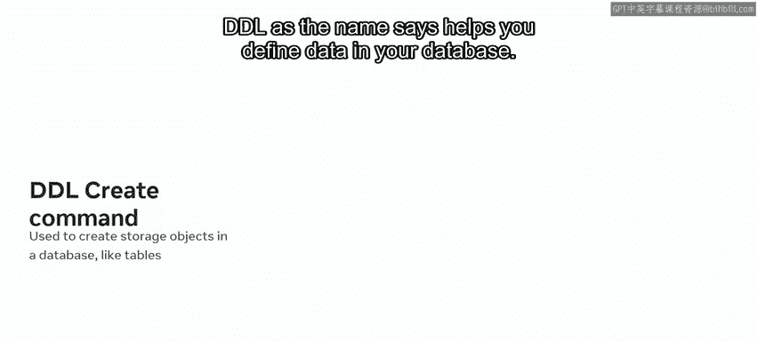
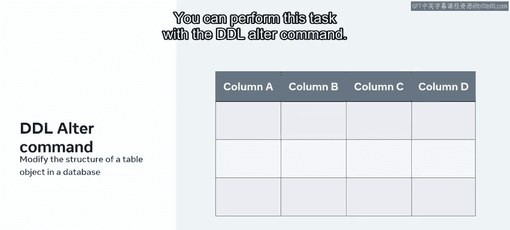
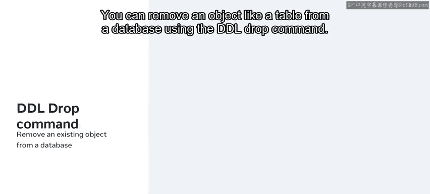
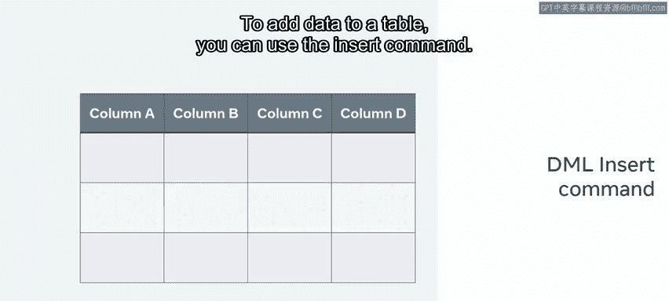
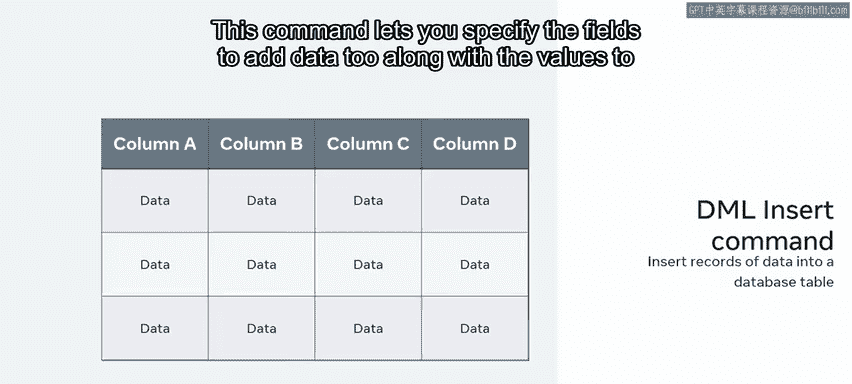
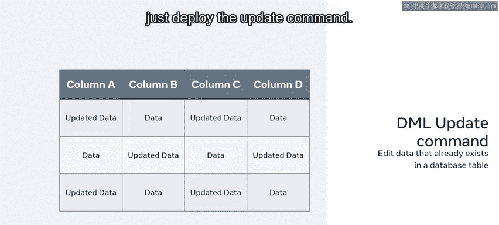
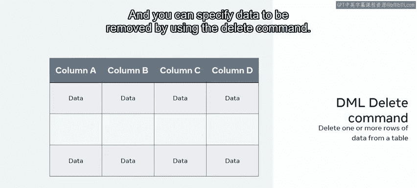
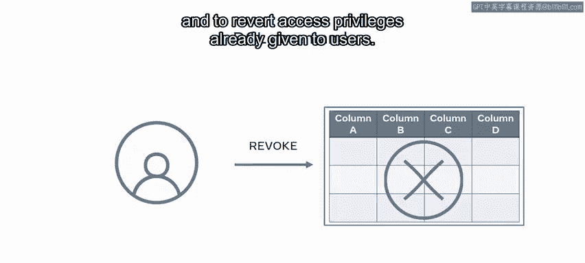

# 入门 8：SQL用法 🗃️

在本节课中，我们将学习SQL（结构化查询语言）的核心操作及其子语言。你将了解如何使用SQL来创建、读取、更新和删除数据库中的数据，并理解SQL的不同功能分类。

---

想象一下，你刚被雇佣来为一家大学创建数据库。首先，你需要创建表格来存储大学各个方面的数据。接着，你需要向这些表格中插入数据，并在情况发生变化时修改这些数据。这是一项繁重的工作。但借助SQL和CRUD操作，这一切都能实现。

如果不熟悉这些操作，没关系。在接下来的几分钟里，你将学习如何解释构建数据库时SQL语法的任务，并展示对SQL子集和子语言的理解。让我们回到大学数据库的场景。

你如何在数据库中实现所有这些更改呢？答案是借助Web开发者所称的CRUD操作。执行CRUD操作是处理数据库时最常见的任务。CRUD代表创建、读取、更新和删除。用操作术语来说，即创建、添加或插入数据，读取数据，更新现有数据以及删除数据。

除了这些操作，SQL还能完成许多其他任务。根据SQL的用途，它可以被划分为多个子部分或子语言。这些包括DDL（数据定义语言）、DML（数据操纵语言）、DQL（数据查询语言）和DCL（数据控制语言）。

上一节我们介绍了SQL的总体功能，本节中我们来详细看看这些子语言及其命令，首先从数据定义语言（DDL）开始。

## 数据定义语言（DDL）🏗️

顾名思义，DDL帮助你定义数据库中的数据。

但“定义数据”是什么意思呢？在将数据存储到数据库之前，你需要创建数据库以及相关的对象（如表）来存储数据。为此，SQL的DDL部分有一个名为 **`CREATE`** 的命令。

然后，你可能需要修改已创建的数据库对象。例如，你可能需要通过添加新列来修改表的结构。你可以使用DDL的 **`ALTER`** 命令来执行此任务。

你还可以使用DDL的 **`DROP`** 命令从数据库中移除一个对象（如表）。

了解了如何定义数据库结构后，接下来我们看看如何操作其中的数据。

## 数据操纵语言（DML）🛠️

数据操纵语言（DML）命令用于操纵数据库中的数据，例如插入、更新或删除数据。大多数CRUD操作都属于DML。

要向表中添加数据，你可以使用 **`INSERT`** 命令。

此命令允许你指定要添加数据的字段以及要插入的值。

如果你需要编辑已插入表中的数据，只需使用 **`UPDATE`** 命令。

你可以使用 **`DELETE`** 命令来指定要删除的数据。

到目前为止，我们已经学习了如何添加数据库对象并管理其中的数据。那么，如何读取或检索这些数据呢？

## 数据查询语言（DQL）🔍

要读取存储在数据库中的数据，你可以使用数据查询语言（DQL）。DQL定义了 **`SELECT`** 命令来检索数据。

**`SELECT`** 允许你从一个或多个表中检索数据，让你能够根据首选的筛选条件指定所需的数据字段。

最后，我们还需要了解如何控制对数据的访问。

## 数据控制语言（DCL）🔐

你还可以使用DCL（数据控制语言）来控制对数据库的访问。例如，使用DCL命令，你可以控制对数据库中存储数据的访问。

**`GRANT`** 和 **`REVOKE`** 这两个DCL命令用于授予用户数据访问权限，以及撤销已授予用户的访问权限。

---

本节课中，我们一起学习了SQL作为数据库与其用户之间接口的作用。你现在应该熟悉了SQL的CRUD操作，并能够识别SQL在不同子语言（DDL、DML、DQL、DCL）中的操作。掌握这些核心概念是进行有效数据库管理和开发的基础。