# 入门 9：SQL的优点 🚀

在本节课中，我们将要学习SQL语言的核心优势。通过了解这些优点，你将明白为何SQL成为与关系型数据库交互的首选工具。

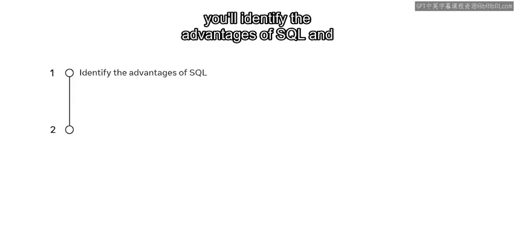

现在，你可能已经熟悉了数据库的基础知识，甚至接触过一些简单的SQL语法。那么，开发者为何选择使用SQL来与数据库交互呢？SQL之所以成为数据库领域的流行语言，是因为它提供了诸多优势。接下来，我们将识别SQL的主要优点，并演示这些优点如何协助完成数据库任务。

SQL是关系型数据库与其用户之间的接口或桥梁，为Web开发者提供了广泛的优势。让我们来具体看看其中的几点。

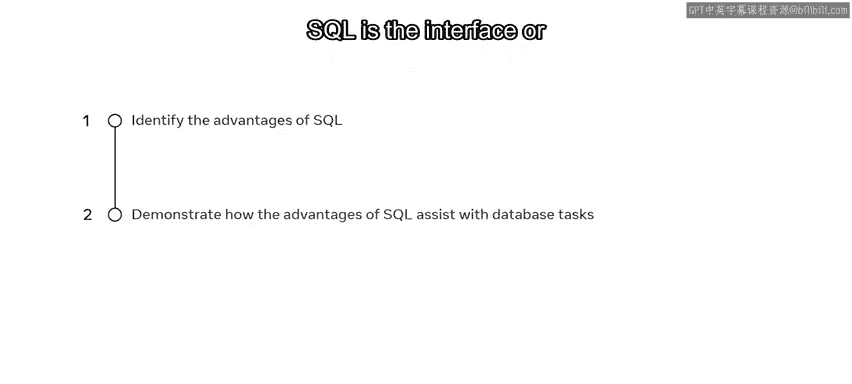

## 优势一：易于学习与使用 📚

SQL最大的优点之一是使用它所需的编码技能非常少。它本质上只是一组关键词。执行基本的CRUD操作（即对数据库进行增加、创建、更新和删除任务）并不需要编写很多行代码，因此它是一种对开发者或用户非常友好的语言。

## 优势二：交互性与高效性 ⚡

SQL的交互性使其更加用户友好，因为它允许开发者在短时间内编写复杂的查询。因此，如果你需要在下一个项目中处理关系型数据库，你只需要知道在何时使用哪些关键词即可。

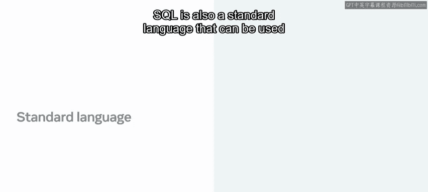

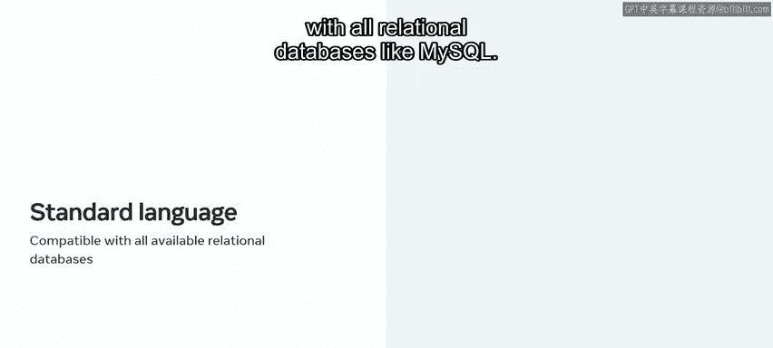

## 优势三：标准化与广泛支持 🌐

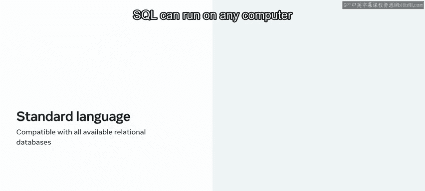

SQL也是一种标准语言，可以与所有关系型数据库（如MySQL）一起使用。这也意味着有大量的支持和信息可供参考。一旦安装了数据库软件，SQL就可以在任何计算机上运行。

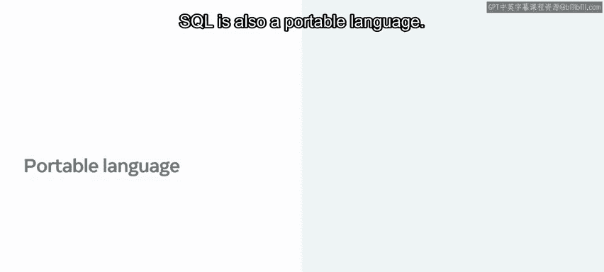

## 优势四：可移植性 🔄

SQL还是一种可移植的语言。一旦你编写了代码，它就可以在任何硬件、任何操作系统或平台上使用，无论你在哪里需要它。例如，如果你在桌面电脑上编写SQL代码，然后将其移动到生产服务器环境，它在两个地方都能以相同的方式运行。

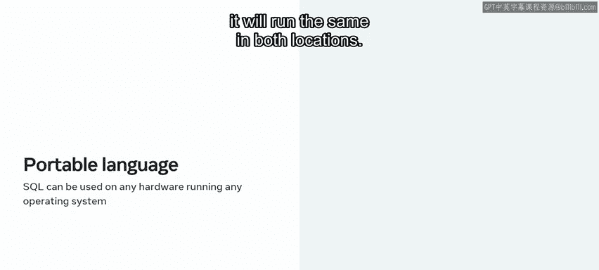

## 优势五：功能全面 🛠️

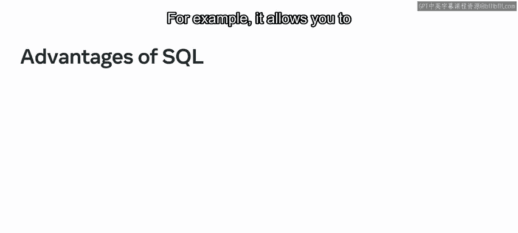

此外，SQL是一种全面的语言，涵盖了数据库管理和管理的所有领域。例如，它允许你创建数据库、插入、更新和删除数据、在多个用户之间检索和共享数据以及管理数据库安全。

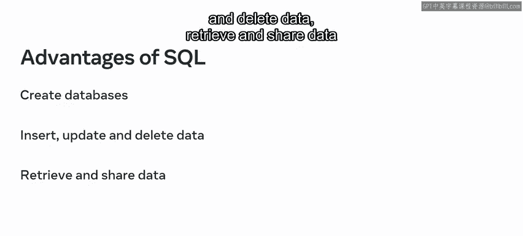

这是通过SQL的子集实现的，例如：
*   **DDL** 或数据定义语言
*   **DML**，也称为数据操作语言
*   **DQL** 或数据查询语言
*   **DCL**，也称为数据控制语言

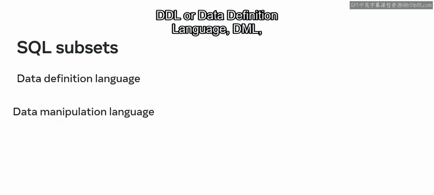

## 优势六：处理大数据高效迅速 📊

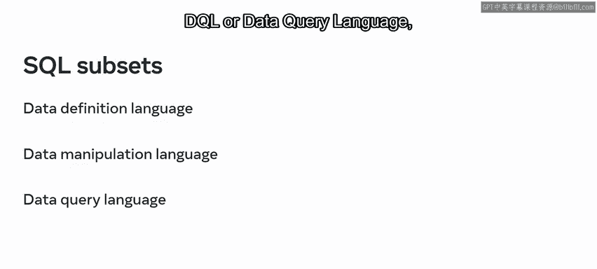

SQL的最后一个优点是，它允许数据库用户快速高效地处理大量数据。

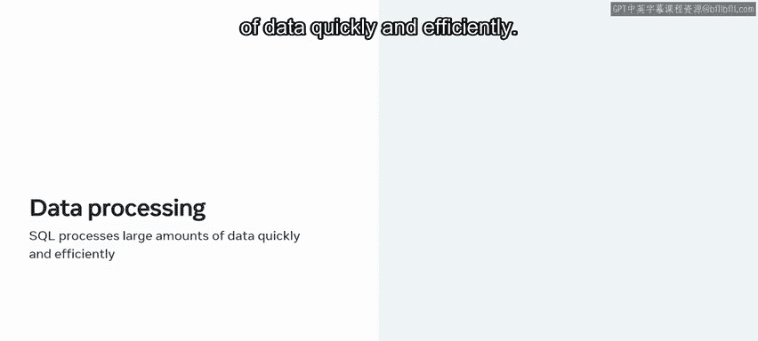

---

本节课中，我们一起学习了SQL是一种**简单、标准、可移植、全面且高效**的语言，可用于与关系型数据库进行通信和协作。掌握这些优点，你就在精通SQL的道路上迈出了坚实的一步。