# 入门 10：SQL语法介绍 🗄️

在本节课中，我们将学习如何使用SQL（结构化查询语言）与数据库进行交互。我们将重点介绍SQL的三个核心子集：数据定义语言（DDL）、数据操纵语言（DML）和数据查询语言（DQL），并通过创建一个简单的大学数据库示例来演示其基本语法。

## 概述

SQL是与数据库交互的标准语言。与其他编程语言一样，需要熟悉其语法和子集才能有效使用。接下来，我们将学习如何使用DDL创建数据库和表，使用DML来插入、更新和删除数据，以及使用DQL来查询和读取数据。

## 使用DDL创建数据库和表

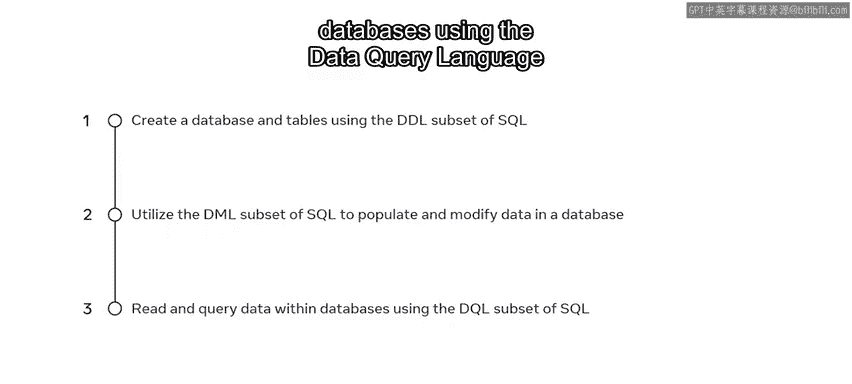

上一节我们介绍了SQL的基本概念，本节中我们来看看如何使用数据定义语言（DDL）来构建数据库的结构。

DDL主要用于定义和修改数据库结构，例如创建数据库和表。

以下是创建数据库的基本语法：

```sql
CREATE DATABASE database_name;
```

例如，要创建一个名为“College”的数据库，可以执行以下命令：

```sql
CREATE DATABASE College;
```

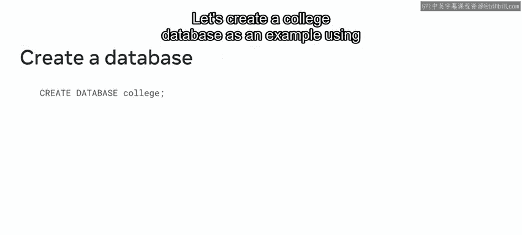

创建数据库后，下一步是创建表。😊

创建表同样使用DDL，语法如下：

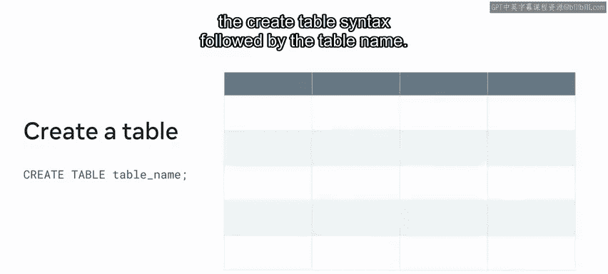

```sql
CREATE TABLE table_name (
    column1 datatype,
    column2 datatype,
    ...
);
```

例如，在“College”数据库中创建一个“student”表，用于存储学生信息：

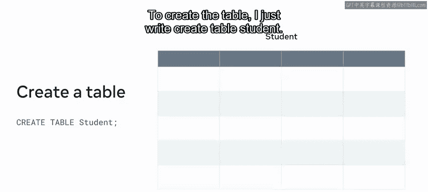

```sql
CREATE TABLE student (
    ID INT,
    first_name VARCHAR(50),
    last_name VARCHAR(50),
    date_of_birth DATE
);
```

对于要添加到数据库中的每个新表，重复上述步骤即可。

## 使用DML操作数据

现在我们已经有了数据库和表的结构，本节中我们来看看如何使用数据操纵语言（DML）来填充和修改表中的数据。

DML用于插入、更新和删除数据库中的记录。

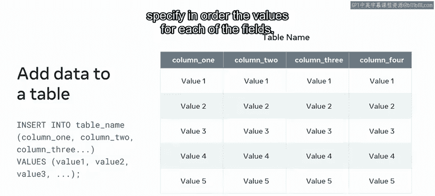

要向表中插入数据，使用 `INSERT INTO` 语句。其语法是插入一行数据到指定表中。

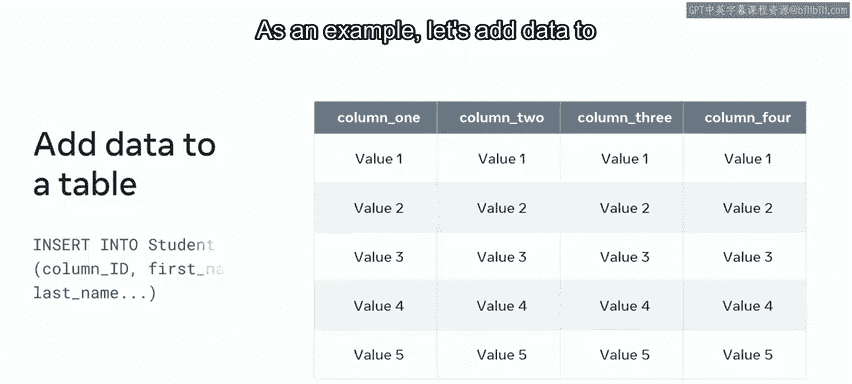

以下是插入数据的基本语法：

```sql
INSERT INTO table_name (column1, column2, ...)
VALUES (value1, value2, ...);
```

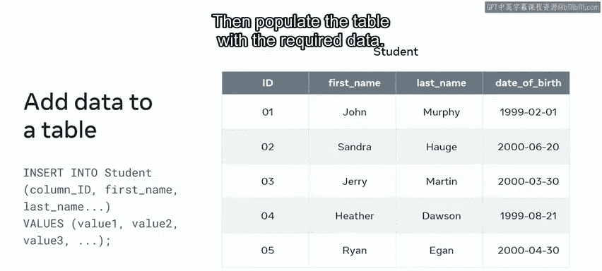

例如，向“student”表中添加一名学生的数据：

```sql
INSERT INTO student (ID, first_name, last_name, date_of_birth)
VALUES (1, ‘John‘, ‘Murphy‘, ‘1999-05-15‘);
```

如果需要更新或修改现有数据，例如更正一名学生的出生日期，可以使用 `UPDATE` 语句。

以下是更新数据的基本语法：

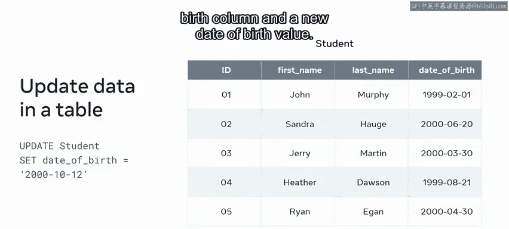

```sql
UPDATE table_name
SET column1 = value1, column2 = value2, ...
WHERE condition;
```

例如，将ID为2的学生的出生日期更新为新的日期：

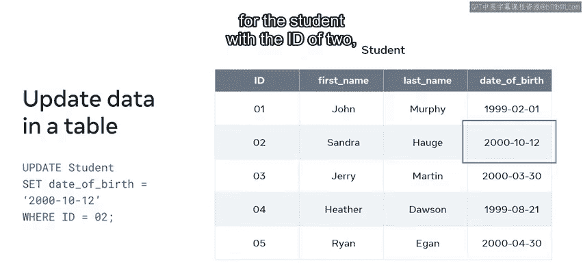

```sql
UPDATE student
SET date_of_birth = ‘2000-01-20‘
WHERE ID = 2;
```

如果需要从表中删除数据，可以使用 `DELETE` 语句。😊

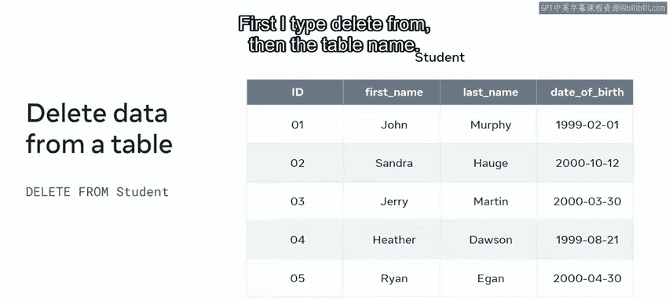

以下是删除数据的基本语法：


```sql
DELETE FROM table_name
WHERE condition;
```

例如，删除ID为3的学生记录：

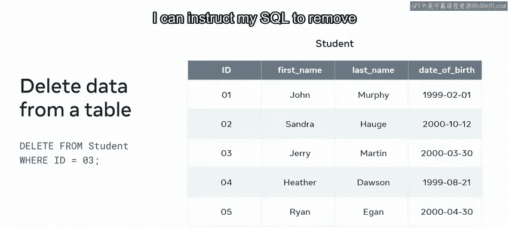

```sql
DELETE FROM student
WHERE ID = 3;
```

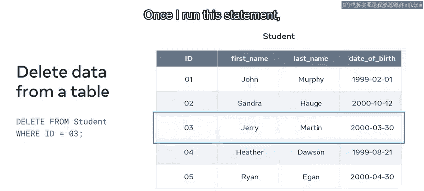

执行此语句后，该学生的数据将从表中移除。

## 使用DQL查询数据

我们已经学会了如何添加、更新和删除数据，本节中我们来看看如何读取数据库中存储的数据。

这时就需要用到SQL的数据查询语言（DQL）。DQL的主要语句是 `SELECT`，顾名思义，它用于从数据库中选择数据。

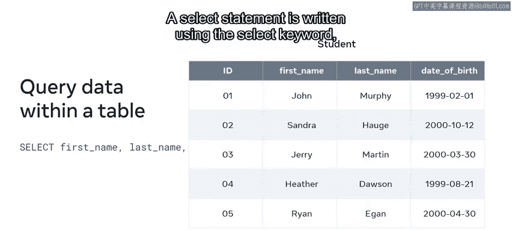

一个 `SELECT` 语句的基本语法如下：

```sql
SELECT column1, column2, ...
FROM table_name
WHERE condition;
```

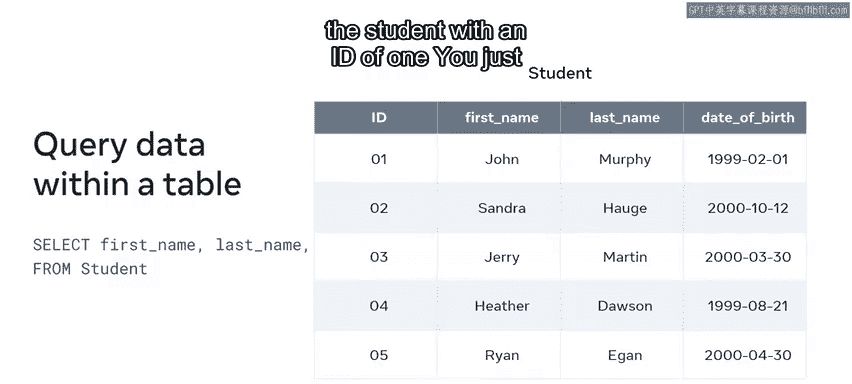

例如，查询“student”表，找出ID为1的学生的姓名：

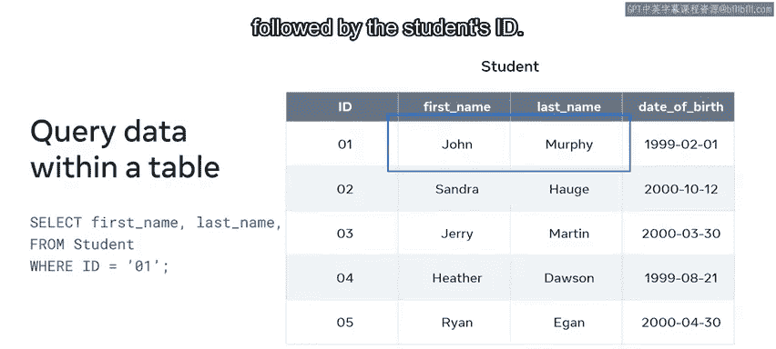

```sql
SELECT first_name, last_name
FROM student
WHERE ID = 1;
```

此查询将返回结果“John Murphy”。

## 总结

本节课中我们一起学习了SQL语法的基础及其三个核心子集：DDL、DML和DQL。我们使用DDL创建了数据库和表，使用DML进行了数据的插入、更新和删除操作，并使用DQL执行了简单的数据查询。目前只需对这些概念建立初步的工作熟悉度即可，在本专业的后续课程中，我们将对每个子集进行更深入的探索，并有机会亲自实践。😊