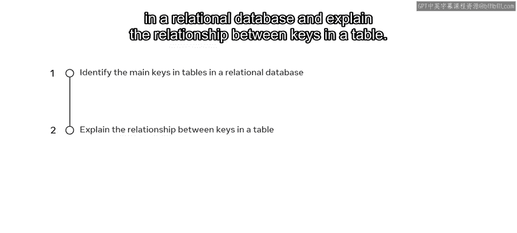
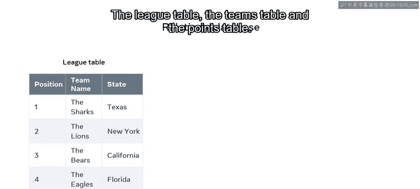
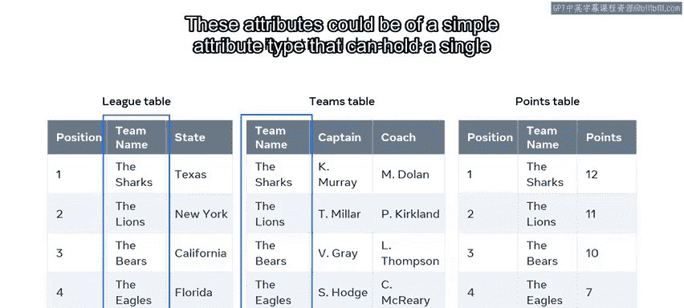
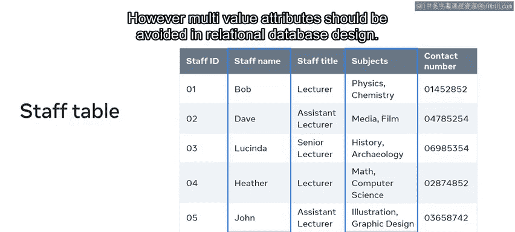
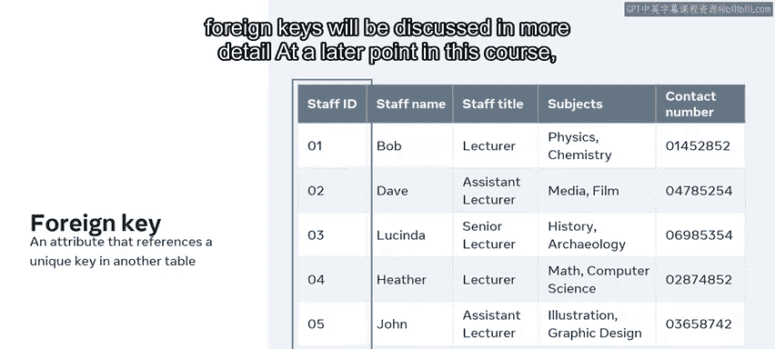

# 入门 12：数据库表中的键类型 🔑

在本节课中，我们将要学习关系型数据库中表之间建立联系的核心机制——键。理解不同类型的键是掌握数据库表设计与关系的基础。

## 概述

在课程的这个阶段，你可能已经熟悉了关系型数据库模型。但要完全理解关系型数据库模型的工作原理，你首先需要理解数据库中的表是如何关联的。本质上，表之间的关系是通过使用键来建立的。通过本视频的学习，你将能够识别关系型数据库表中使用的主要键类型，并解释表中键之间的关系。

## 关系型数据库模型基础

关系型数据库模型基于两个主要概念：定义为表的实体，以及连接到相关表的关系。要理解这个模型如何工作，你需要了解关系型数据库中存在的不同键属性。

为了演示，我们使用一个体育比赛的例子，它使用三个表来跟踪联赛信息：联赛表、球队表和积分表。

## 表的属性

每个表都有相关的列，每一列代表表实体的一个属性。联赛表跟踪每支球队在联赛中的位置、队名以及所代表的州。球队表跟踪队名、队长和教练。积分表记录球队在联赛中的位置、队名以及本赛季获得的积分。

请注意，球队表中包含了队名，这个属性也属于联赛表。这些属性可以是能保存单个值的简单属性类型。

例如，在一个学院的员工表中，每个员工姓名的属性在每一行都有一个单一的值。

它们也可以是能拥有多个值的多值属性，例如所教科目的列表。然而，在关系型数据库设计中应避免使用多值属性。你将在课程后面了解更多关于这个概念的内容。

## 键属性类型

让我们使用员工表的例子来探索一些键属性的示例。以下是关系型数据库中存在的不同类型的键属性。

### 键属性

这是一个用于唯一标识表中单个数据记录的值。例如，在员工表中，键属性是员工ID。这个属性在表的每一行都有唯一的值，因此它是唯一标识每条数据的完美方式。

### 候选键属性

这是指在表的每一行都包含唯一值的任何属性。在员工表的例子中，员工ID和联系电话都是候选键的示例。每一行都有一个新的唯一值。其他列可能包含重复信息，因此它们被指定为非键属性。

### 复合键

复合键是由两个或更多属性组成，以在每一新行中形成唯一值的键。在员工表中，一个复合键的例子是员工姓名和员工职位的组合，前提是表中没有其他相同的组合实例。通常在无法识别单一属性键时，会考虑使用复合键。

### 主键

关系型数据库还必须包含一个主键，你应该已经熟悉这个概念。在员工表中，员工ID是主键。

### 备用键

备用键，也称为次键，是未被选为主键的候选键。就像主键一样，它是一个在每一行都包含唯一值的列。对于员工表，联系电话是每一行的次键。

### 外键

外键是表中的一个属性，它引用另一个表中的唯一键。通常，外键引用另一个表的主键。例如，员工ID也可能是学院数据库中一个或多个表的外键。主键和外键之间的关系将在本课程后面详细讨论。

## 总结

本节课中，我们一起学习了关系型数据库中不同类型的键。你了解了键属性、候选键、复合键、主键、备用键和外键的定义与作用。理解这些键是设计高效、无冗余的数据库表并建立正确表间关系的关键。在后续课程中，我们将深入探讨如何利用这些键来构建复杂的数据库关系。