# 入门 13：模块小结

在本节课中，我们将对“数据库介绍”模块的核心内容进行回顾与总结。我们将梳理你所学到的关于数据库、SQL以及数据库结构的基础知识。

## 概述

你已经完成了本模块的学习，即数据库入门介绍。在本模块中，你探索了数据库和数据的基础知识，初步了解了SQL（结构化查询语言），并研究了数据库的基本结构。现在，是时候回顾你学到的关键知识点、概念以及掌握的技能了。

## 数据库与数据基础回顾

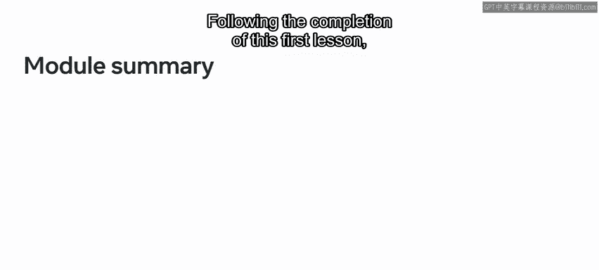

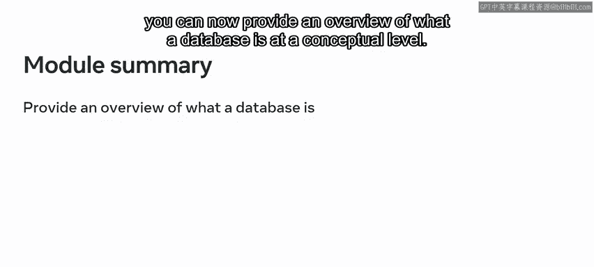

模块从数据库和数据的介绍开始。完成第一课的学习后，你现在能够：

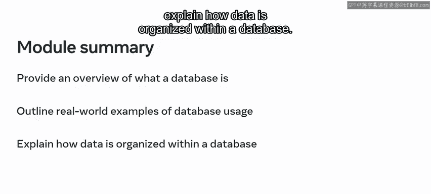

*   从概念层面概述什么是数据库。
*   列举数据库在现实世界中的应用实例。
*   解释数据在数据库中是如何组织的。

上一节我们介绍了数据库的基本概念，本节中我们来看看数据库内部数据的关系与类型。

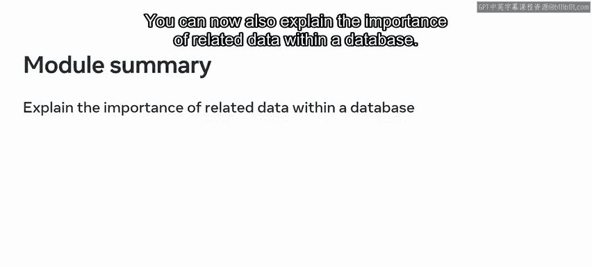

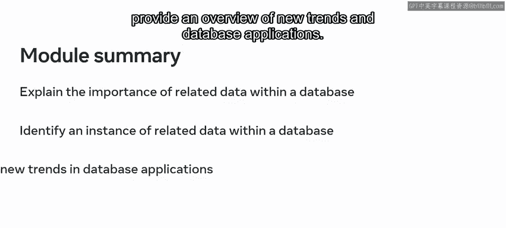

你现在还能解释数据库中相关数据的重要性，识别数据库内相关数据的实例，并概述数据库应用的新趋势。

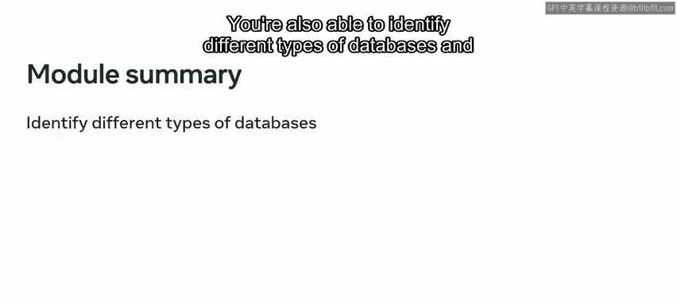

此外，你能够识别不同类型的数据库，并对数据库的演进历程提供一个高层次的概述。

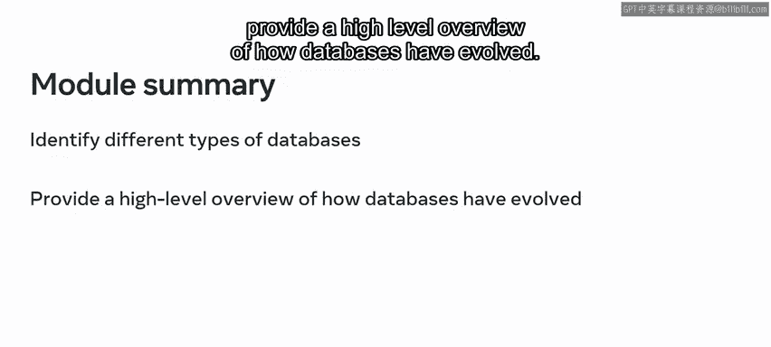

## SQL入门知识梳理

在探索了数据库和数据之后，你接着被引入了SQL的世界。😊

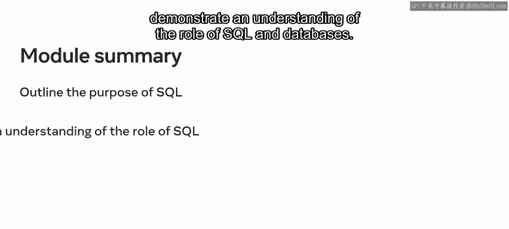

这一课的重点是SQL（结构化查询语言）的基础。在这节课中，你学习了如何概述SQL的用途，并理解SQL和数据库所扮演的角色。😊

以下是SQL的主要优势：

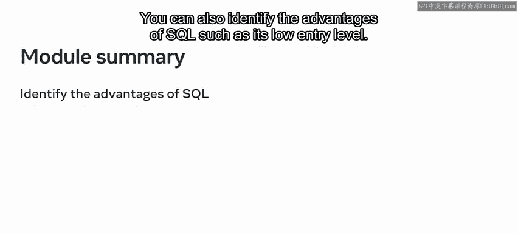

*   **低入门门槛**：易于学习。
*   **应用广泛**：用途多样。
*   **跨操作系统可移植性**：可在不同系统上使用。

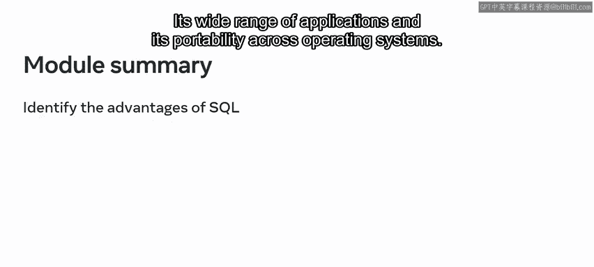

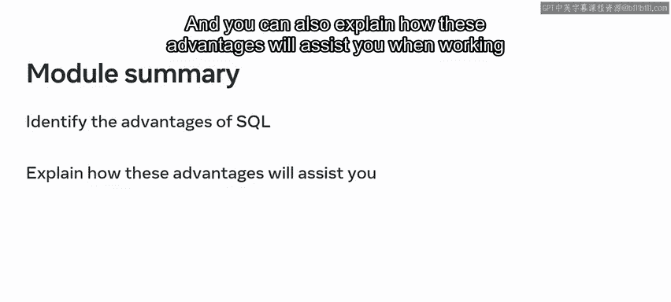

你现在也能解释这些优势将如何帮助你在处理数据库时更加得心应手。

并且，你能够概述SQL中DDL（数据定义语言）、DML（数据操作语言）和DQL（数据查询语言）语法的基本用法，并识别数据库中使用的主要SQL命令。

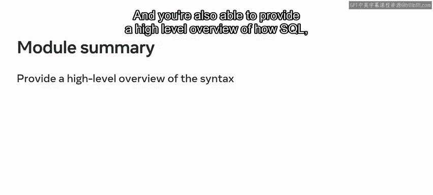

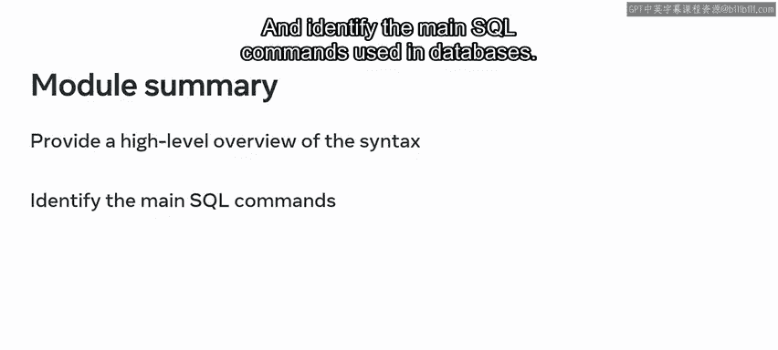

## 数据库结构核心总结

在本模块的最后一课，你探索了数据库的基本结构。

现在你已经完成了本课的学习，你可以解释数据库表的概念，概述表的用途，并识别数据库表的关键组成部分，例如列、行、数据类型和键。😊

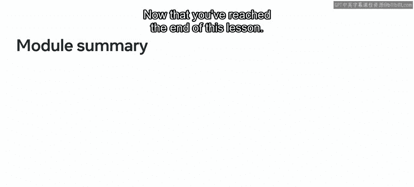

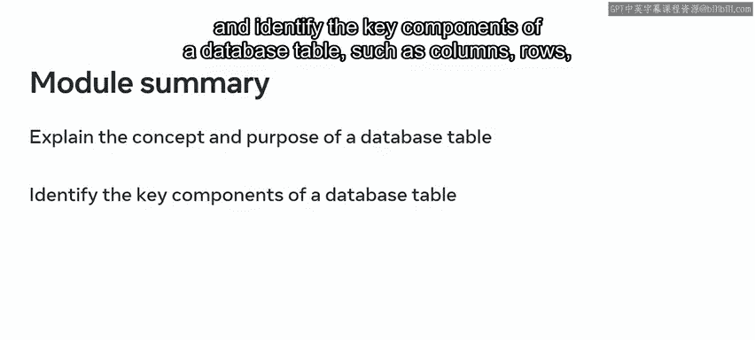

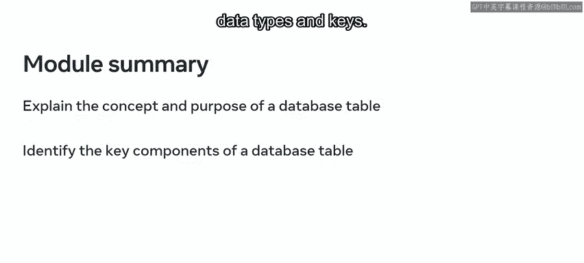

## 总结

本节课中我们一起学习了数据库的基础知识。你现在已经熟悉了数据库的基本原理，可以解释它们如何存储数据，识别通过SQL与数据库交互的方法，并概述数据库的基本结构。这为你开启数据库学习之旅奠定了良好的基础。

做得好。