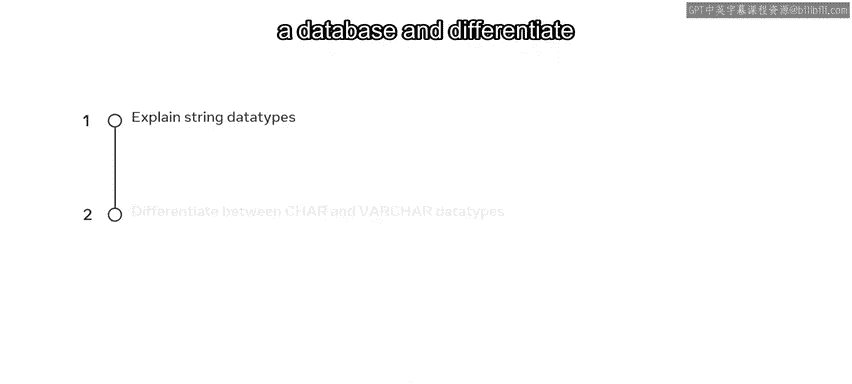
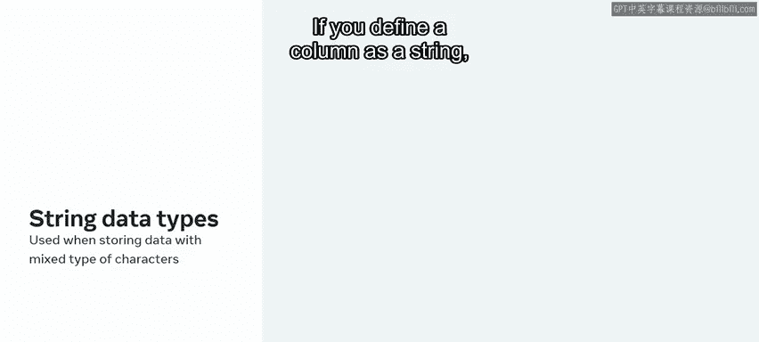
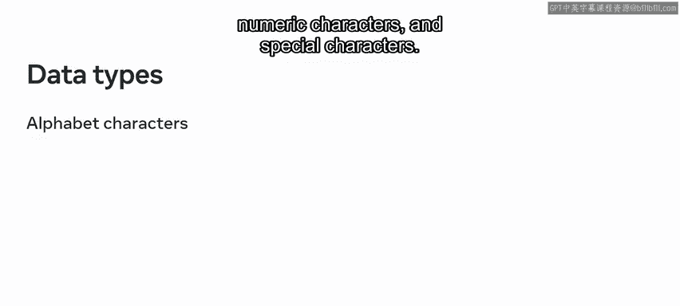
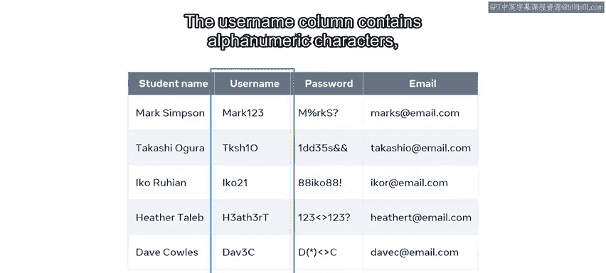
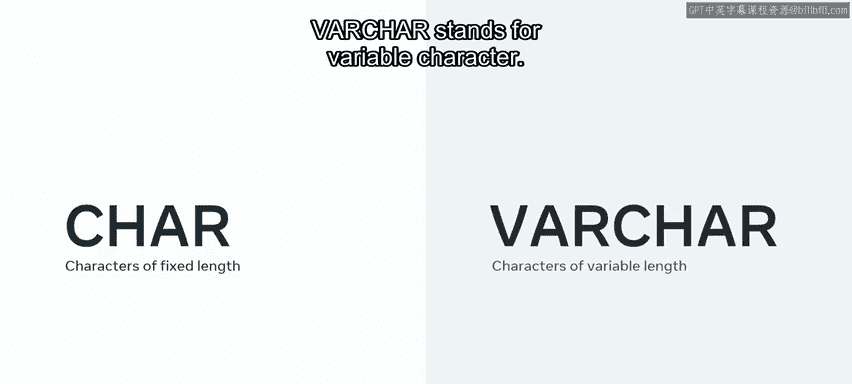
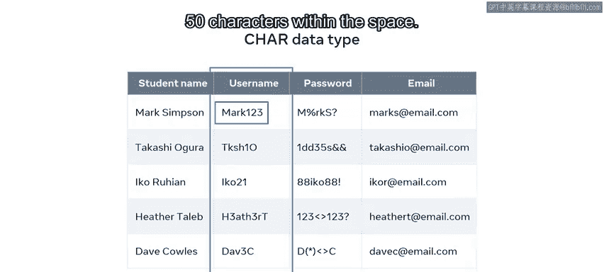
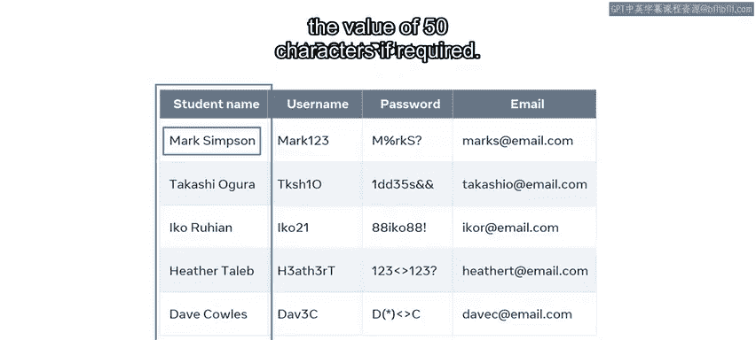
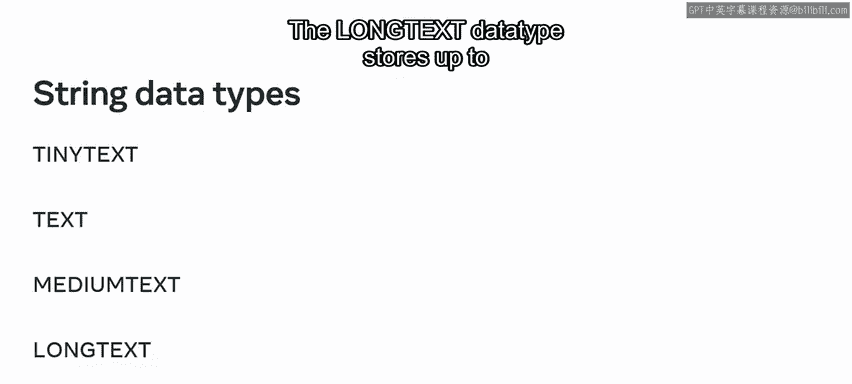

# 入门 15：字符串数据类型 📚

在本节课中，我们将要学习数据库中的字符串数据类型。你将了解字符串数据类型的定义、用途，并重点区分 `CHAR` 和 `VARCHAR` 这两种最常用的类型。通过学习，你将能够为数据库表中的列选择合适的数据类型，以确保数据的完整性和存储效率。

## 字符串数据类型简介

在数据库中创建表时，必须定义列名以及该列将存储内容的数据类型。字符串数据类型用于定义列的数据类型，特别是在该列需要同时接受数字和文本字符的情况下。

为了确保数据完整性，必须保证只有有效的值被插入表中。例如，当你打算存储包含多种字符类型的数据时，就应该使用字符串数据类型。如果你将一列定义为字符串类型，那么任何类型的文本都可以被插入，这包括字母字符、数字字符和特殊字符。

## 字符串数据类型示例

让我们通过一个例子来进一步了解字符串数据类型的工作原理。

以大学数据库中的学生表为例，该表存储了学生登录学校在线门户的信息。信息存储在以下四列中：`student_name`（学生姓名）、`username`（用户名）、`password`（密码）和 `email_address`（电子邮件地址）。其中，`student_name` 列仅包含字母字符，`username` 列包含字母数字字符，而 `password` 和 `email` 列则包含混合的字符类型。

## 主要字符串类型：CHAR 与 VARCHAR

“字符串数据类型”是一个通用术语，指代数据库中不同的字符串数据类型。最常用的字符串数据类型是 `CHAR`（代表 Character，字符）和 `VARCHAR`（代表 Variable Character，可变字符）。

上一节我们介绍了字符串数据类型的通用概念，本节中我们来看看这两种具体的类型。

*   **`CHAR`** 数据类型用于保存固定长度的字符。
*   **`VARCHAR`** 数据类型用于保存可变长度的字符。

### CHAR 数据类型详解

`CHAR` 意味着字符的给定长度是预先确定的，在声明后无法更改。列属性被定义为 `CHAR`，后跟括号中的字符长度。

例如，`CHAR(50)` 表示该列每个字段只允许占用 50 个字符的空间。如果你希望维持一个预定义大小的字符长度，`CHAR` 是最佳选择。

在学生表的例子中，你可以为 `username` 列设置最大长度为 50 个字符，在 SQL 中使用 `CHAR(50)`。例如，表中有一条记录的用户名是 “Mark123”，总共 7 个字符。然而，由于该列被定义为 `CHAR(50)`，这个用户名在存储空间中仍会占据 50 个字符的长度。

### VARCHAR 数据类型详解

`VARCHAR` 数据类型的工作方式与 `CHAR` 类似，但它是可变长度的。这意味着长度可以改变，不是固定的。

当你无法确定列字段中可能插入多少个字符时，通常使用 `VARCHAR`。因此，你可以在 SQL 中键入 `VARCHAR(50)`，以允许最多 50 个字符的任何输入。

在学生表示例中，`student_name` 列很可能包含不同长度的姓名，因此你可以将 `student_name` 列在 SQL 中定义为 `VARCHAR(50)`。这意味着每个学生的姓名只占用其名字字符数量的空间。例如，“Mark Simpson” 占用的空间远少于 50 个字符，但如果需要，该字段最多可以容纳长达 50 个字符的姓名。

## 其他常用字符串类型

除了 `CHAR` 和 `VARCHAR`，还有一些其他常用的字符串数据类型，适用于存储不同长度的文本。

以下是几种常见的文本类型及其典型用途：

*   **`TINYTEXT`**：用于定义需要少于 255 个字符的列，例如短段落。
*   **`TEXT`**：用于定义少于 65,000 个字符的列，例如一篇文章。
*   **`MEDIUMTEXT`**：用于定义最多 1670 万个字符的列，例如一本书的文本。
*   **`LONGTEXT`**：该数据类型最多可存储 4GB 的文本数据。

## 总结 🎯

本节课中我们一起学习了数据库中的字符串数据类型。你现在应该能够解释字符串数据类型在数据库中的用途，并且能够区分不同的字符串数据类型，包括 `CHAR` 和 `VARCHAR`。`CHAR` 用于固定长度的字符串，会占用预定义的空间；而 `VARCHAR` 用于可变长度的字符串，只占用实际内容所需的空间。根据数据的特点选择合适的类型，对于优化数据库存储和性能至关重要。