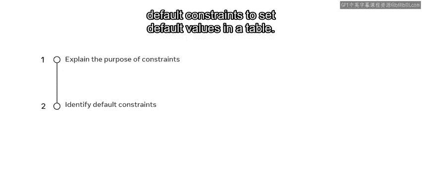
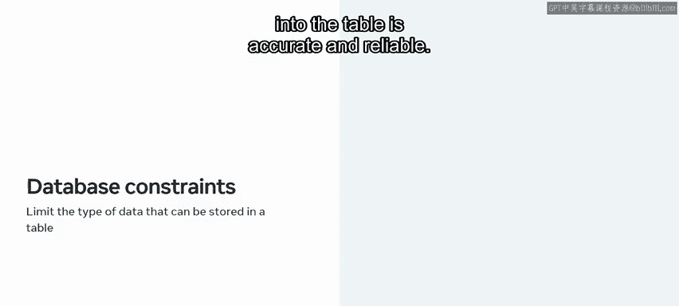
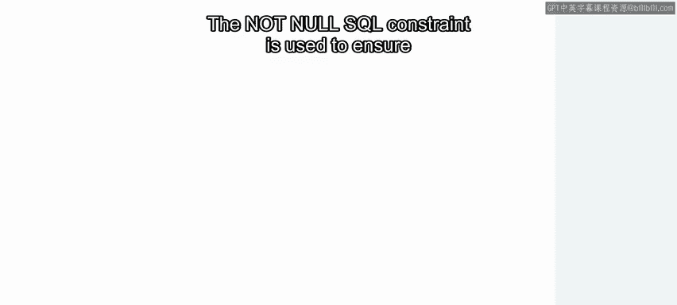
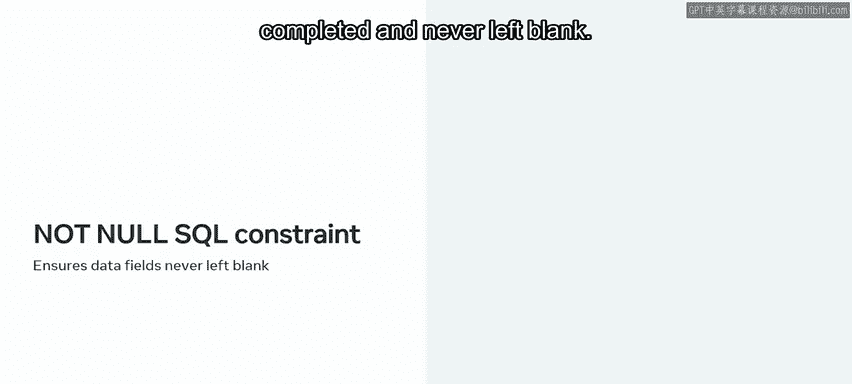
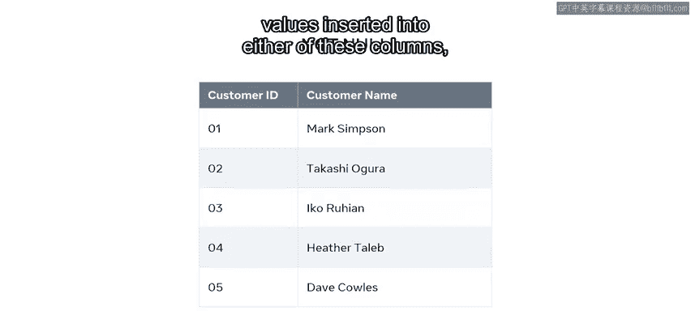
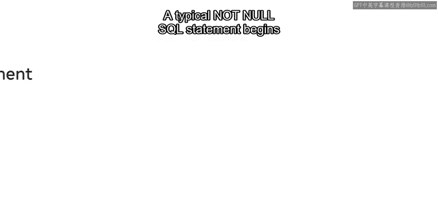
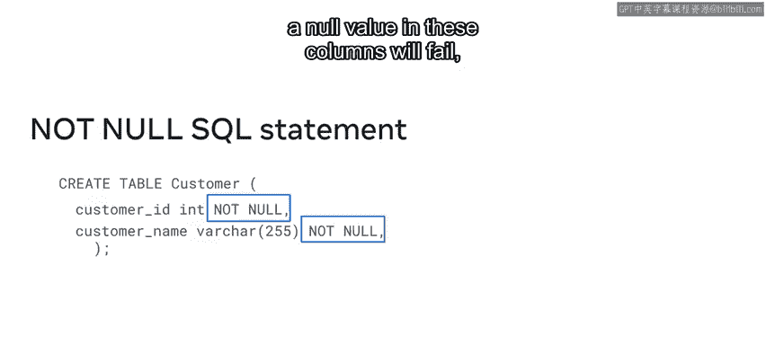
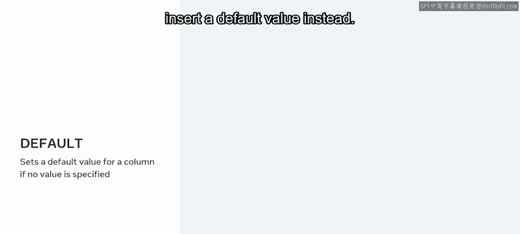
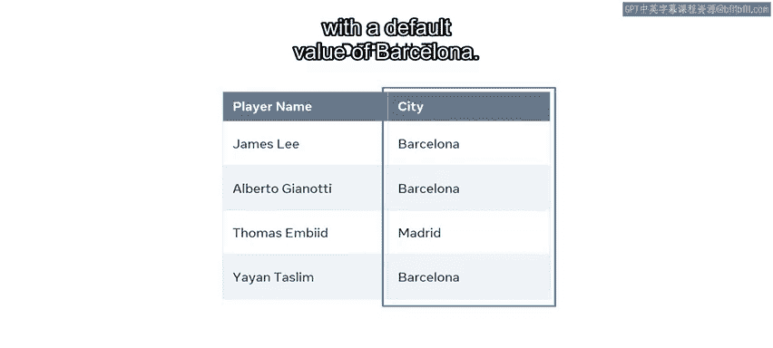
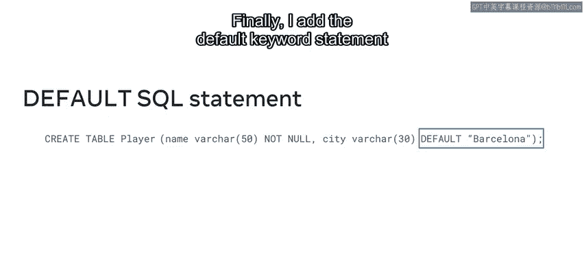

# 16：默认值约束

在本节课中，我们将学习数据库约束的概念，特别是两种常用的约束：`NOT NULL` 和 `DEFAULT`。我们将了解它们如何确保数据的准确性和可靠性，并通过具体的SQL语句示例来掌握其应用方法。



## 数据库约束概述



为了确保数据库中数据的准确性和可靠性，必须限制可以存入数据库表的数据类型。

数据库约束用于限制可以存储在表中的数据类型，这确保了插入表中的所有数据都是准确和可靠的。

如果数据库检测到约束与数据操作之间存在冲突，则会中止这些操作。冲突的一个例子可能是尝试向表中插入或上传无效数据。数据库会识别出数据无效并拒绝它。

约束可以是列级别的，即规则适用于特定列；也可以是表级别的。例如，可以使用外键约束来防止破坏表之间链接的操作。我们将在后续课程中更详细地演示这一点。

两种最常用的数据库约束包括：
*   **`NOT NULL`**：一种防止字段为空值的方法。
*   **`DEFAULT`**：一种分配默认值的方法。


## NOT NULL 约束

上一节我们介绍了约束的基本概念，本节中我们来看看 `NOT NULL` 约束的具体作用。





`NOT NULL` SQL约束用于确保数据字段始终被填写，永远不会留空。

让我们用一个在线商店的表示例来探索这个概念，该表记录客户的ID和姓名。该表在其 `customer_id` 和 `customer_name` 列中记录这些数据。这些列必须始终包含数据。如果没有数据或值插入到这些列中的任何一列，则新客户记录的创建将被中止。

`NOT NULL` 约束是通过SQL语句实现的。一个典型的 `NOT NULL` SQL语句从在数据库中创建一个基本表开始。



以下是创建该表的SQL语句示例：



```sql
CREATE TABLE customer (
    customer_id INT NOT NULL,
    customer_name VARCHAR(255) NOT NULL
);
```

在这个语句中：
*   使用 `CREATE TABLE` 子句，后跟 `customer` 来定义表名。
*   在一对括号内，添加两列：`customer_id` 和 `customer_name`。
*   为每列定义相关的数据类型：`INT` 用于存储数值的 `customer_id`，`VARCHAR` 用于存储字符串值的 `customer_name`。
*   最后，为每列声明一个 `NOT NULL` 约束。这确保了两列都不会接受空值。

现在，任何试图在这些列中放置空值的操作（如插入或更新数据）都将失败。

## DEFAULT 约束



了解了如何强制字段不为空后，接下来我们看看 `DEFAULT` 约束如何在表中工作。

`DEFAULT` 约束为列设置一个默认值，前提是没有指定其他值。这意味着，如果没有为列中的特定字段输入数据，那么表将自动插入一个默认值。



为了更好地理解默认值，让我们看一个存储足球俱乐部数据库球员记录的表。该表名为 `player_table`，包含两列。第一列是 `player_name`，列出球队中每位球员的姓名；第二列是 `city`，列出每位球员来自哪个城市。

该俱乐部的大多数球员都来自巴塞罗那，因此我可以将 `city` 列的默认值指定为 `Barcelona`。这意味着我不必为每位新球员在 `city` 字段中重复输入 `Barcelona`。如果表中没有输入值，那么每个字段将自动填充默认值 `Barcelona`。

让我们看看 `DEFAULT` 命令是如何整合到SQL语句中的。

以下是创建该表的SQL语句：



```sql
CREATE TABLE player_table (
    player_name VARCHAR(255) NOT NULL,
    city VARCHAR(255) DEFAULT 'Barcelona'
);
```

在这个语句中：
*   首先，使用 `CREATE TABLE` 命令创建一个表，并将其命名为 `player_table`。
*   然后，在一对括号内，输入列名，为每列分配字符串数据类型。
*   为 `name` 列分配 `NOT NULL` 约束。
*   最后，为 `city` 列添加 `DEFAULT` 关键字语句，后跟默认值 `'Barcelona'`。

现在，当我向表中添加新球员的数据时，对于来自巴塞罗那的球员，我不需要输入 `Barcelona`，它会自动插入。



## 课程总结


本节课中，我们一起学习了数据库约束的重要性。你现在应该能够解释数据库约束是**在列或表级别强制执行规则的方法**。具体来说，我们掌握了：
*   **`NOT NULL` 约束**：确保关键字段（如ID和姓名）永远不会为空，保障了数据的完整性。
*   **`DEFAULT` 约束**：为常用值设置默认项，简化了数据输入过程，提高了效率。

熟练运用这些约束是设计健壮、可靠数据库的基础。