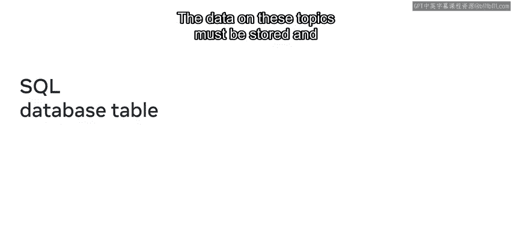
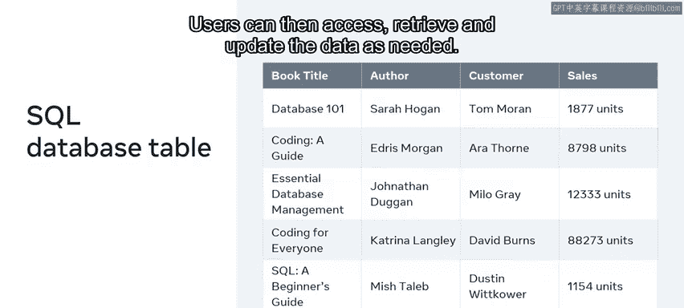
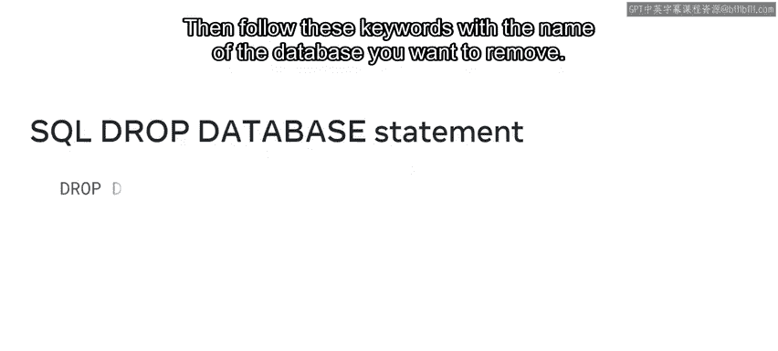
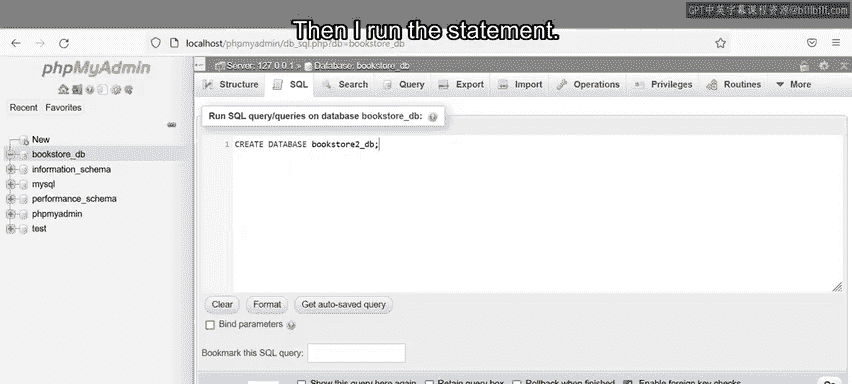
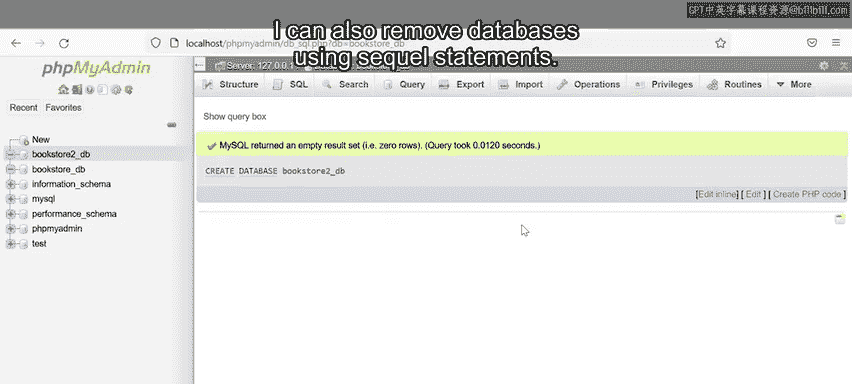
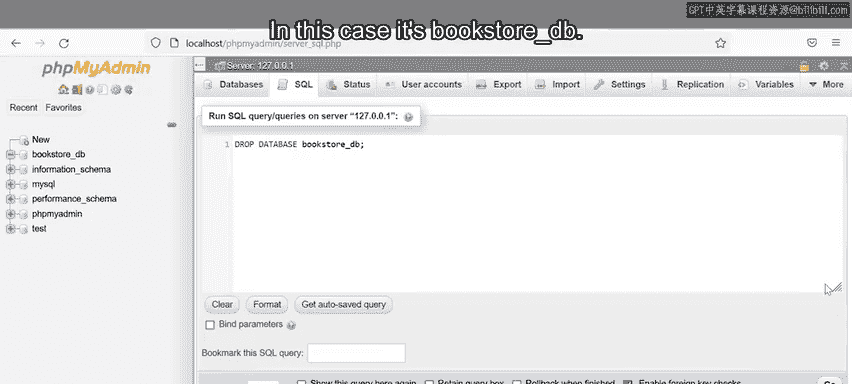
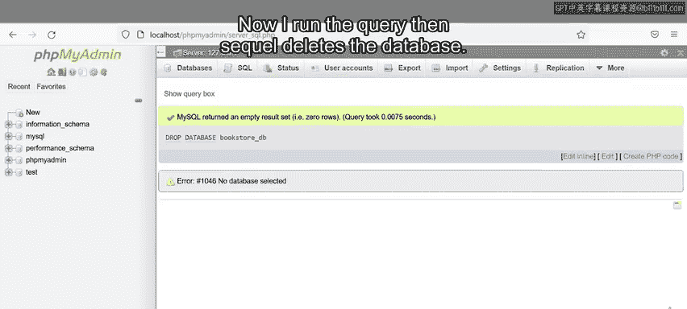

# 17：创建和删除数据库 🗄️

在本节课中，我们将学习如何使用SQL语句来创建和删除数据库。这是管理数据存储空间的基础操作，对于构建和维护任何应用程序都至关重要。

---

你刚刚被一家在线书店聘用，负责构建和维护能够存储数百万本书籍和客户信息的数据库。

但我们该如何开始创建和修改那些存储不断扩展的信息、或处理来自全球数百万订单的数据库呢？

这些问题的答案在于SQL的创建和删除命令。在本视频中，你将学习如何使用SQL语法创建数据库，同时也会了解如何删除一个数据库。

然而，在创建数据库之前，你首先需要明确它的目的。例如，如果你正在为一家在线书店构建数据库，那么你的数据库需要记录诸如书名、作者、客户和销售等数据。

这些主题的数据必须被存储并组织在数据库的相关表中。




之后，用户可以根据需要访问、检索和更新这些数据。




---


## 如何创建数据库？ ➕


那么，如何使用SQL语法创建数据库呢？要创建一个数据库，只需输入 `CREATE DATABASE` 关键字，然后跟上你的数据库名称。

以下是创建数据库的基本语法：

```sql
CREATE DATABASE database_name;
```

---

## 如何删除数据库？ ➖



关于移除或删除数据库呢？要删除一个数据库，只需输入关键字 `DROP DATABASE`，然后跟上你想要删除的数据库名称。

以下是删除数据库的基本语法：

```sql
DROP DATABASE database_name;
```


---

## 实战演示 🛠️

上一节我们介绍了创建和删除数据库的基本语法，本节中我们来看看这些命令的实际操作。

为了演示，让我们使用SQL语法创建第二个书店数据库。首先，我输入关键字 `CREATE DATABASE`，然后跟上我的新数据库名称。在这个例子中，数据库被命名为 `bookstore2_DB`。

在创建新数据库时，我总是使用有意义且相关的名称，这有助于使我的工作文档更清晰。数据库名称必须是唯一的，并且最多只能有63个字符。如果我的数据库名称不符合这些要求，将会出现错误信息。最后，我在语句末尾添加一个分号，然后运行该语句。





于是，新的数据库 `bookstore_DB2` 出现在左侧边栏中。这样，我就创建了第二个数据库。

我也可以使用SQL语句删除数据库。





首先，我选择SQL选项卡，然后在出现的代码框中输入我的查询。我输入关键字 `DROP DATABASE`，然后跟上我想要删除的数据库名称，在这个例子中是 `bookstore_DB`。




现在我运行查询，SQL就会删除该数据库。




---


## 总结 📝

本节课中我们一起学习了如何使用SQL语法创建和删除数据库。你掌握了 `CREATE DATABASE` 和 `DROP DATABASE` 这两个核心命令，并了解了在命名数据库时需要注意的唯一性和长度限制。这是管理数据库生命周期的基础，为后续学习创建表、插入数据等更复杂的操作打下了坚实的基础。