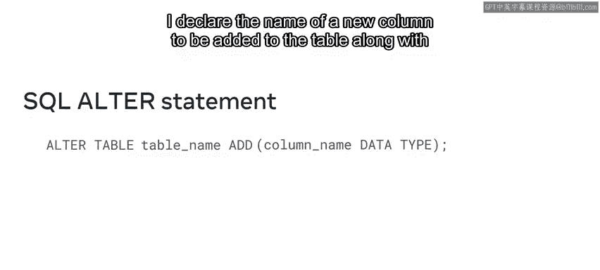
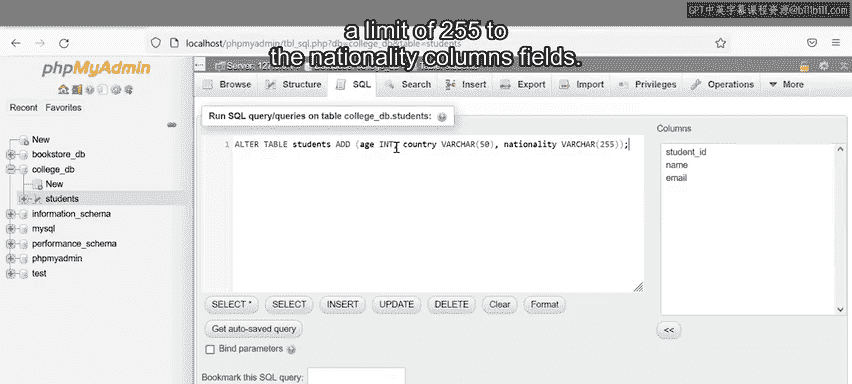
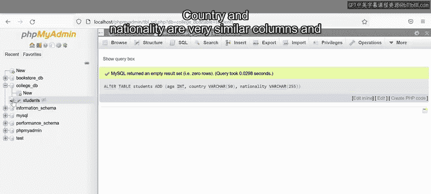
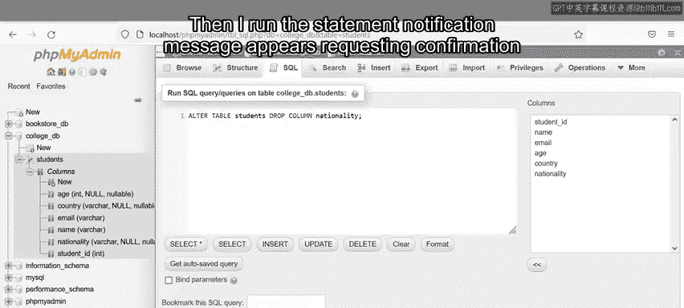
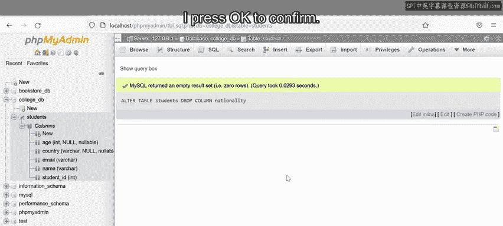
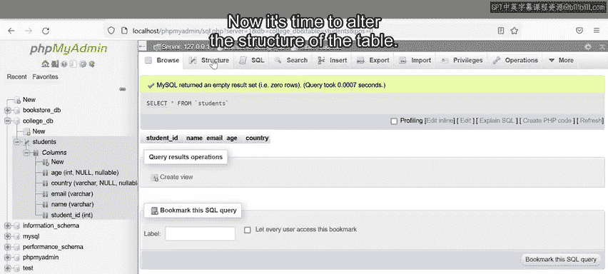
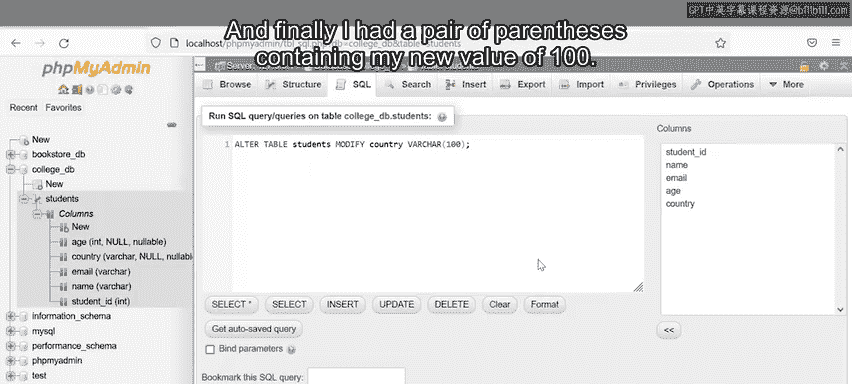

# 入门 19：ALTER TABLE语句 🛠️

在本节课中，我们将要学习如何使用SQL的`ALTER TABLE`语句来修改数据库表的结构。你将学会如何为现有表添加新列、删除不需要的列，以及修改列的数据类型或约束。

## 概述

上一节我们介绍了如何创建数据库和表。本节中我们来看看如何修改已存在的表。数据库表的结构并非一成不变，开发者经常需要根据需求调整表的设计，例如添加新字段或删除旧字段。SQL提供了`ALTER TABLE`语句来完成这些任务。

## ALTER TABLE 语句基础

`ALTER TABLE`语句的基本语法用于告知数据库需要修改哪个表。其核心结构如下：

```sql
ALTER TABLE table_name
ADD column_name data_type;
```

*   `ALTER TABLE` 是关键字，表示要修改表。
*   `table_name` 是要修改的表的名称。
*   `ADD` 是关键字，表示要添加内容（此处为列）。你也可以使用其他关键字如 `DROP` 或 `MODIFY`。
*   `column_name data_type` 定义了要添加的新列的名称及其数据类型。



## 实践示例：添加新列

在开始修改表之前，你需要确保已有一个包含数据的数据库和表。在本例中，我们有一个名为 `college` 的数据库，其中包含一个 `students` 表，该表目前有 `id`、`name` 和 `email` 三列。

现在，我们需要为 `students` 表添加三个新列：`age`、`nationality` 和 `country`。

以下是添加这些列的SQL语句：

```sql
ALTER TABLE students
ADD (age INT, country VARCHAR(50), nationality VARCHAR(255));
```

*   我们首先指定要修改的表是 `students`。
*   使用 `ADD` 关键字，并在括号内列出要添加的列及其定义。
*   `age INT` 表示添加一个名为 `age`、数据类型为整数（INT）的列。
*   `country VARCHAR(50)` 表示添加一个名为 `country`、可变字符类型（VARCHAR）且最大长度为50的列。
*   `nationality VARCHAR(255)` 同理，最大长度设为255。

执行此语句后，`students` 表就新增了这三列。

## 实践示例：删除列

添加列后，我们发现 `nationality`（国籍）和 `country`（国家）两列信息可能重复。为了简化表结构，我们可以删除 `nationality` 列。



以下是删除列的SQL语句：

```sql
ALTER TABLE students
DROP COLUMN nationality;
```



*   语句开头同样是 `ALTER TABLE students`。
*   使用 `DROP COLUMN` 关键字，后接要删除的列名 `nationality`。
*   执行时，数据库通常会请求确认，确认后该列即被永久删除。

## 实践示例：修改列定义

上一节我们删除了冗余的列。本节中我们来看看如何修改现有列的定义。例如，我们觉得 `country` 列的50字符长度限制可能不够，希望将其扩展到100字符。





以下是修改列定义的SQL语句：



```sql
ALTER TABLE students
MODIFY country VARCHAR(100);
```

*   我们使用 `MODIFY` 关键字来修改已有列的定义。
*   其后指定要修改的列名 `country` 以及新的数据类型和约束 `VARCHAR(100)`。
*   执行此查询后，`country` 列的最大字符长度就更新为100了。

## 总结



本节课中我们一起学习了如何使用 `ALTER TABLE` 语句来动态调整数据库表的结构。我们掌握了三个核心操作：
1.  使用 `ADD` 关键字为表添加新列。
2.  使用 `DROP COLUMN` 关键字删除表中现有的列。
3.  使用 `MODIFY` 关键字修改现有列的数据类型或约束。

通过掌握这些技能，你可以灵活地维护和优化数据库表，使其更好地适应不断变化的应用需求。