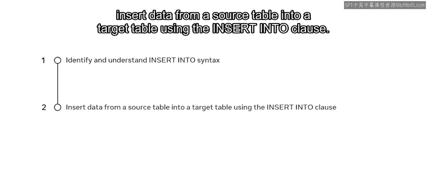
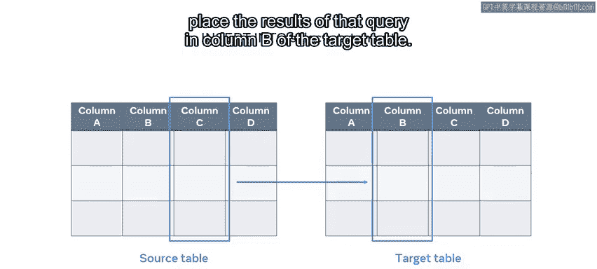
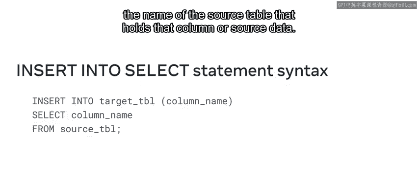
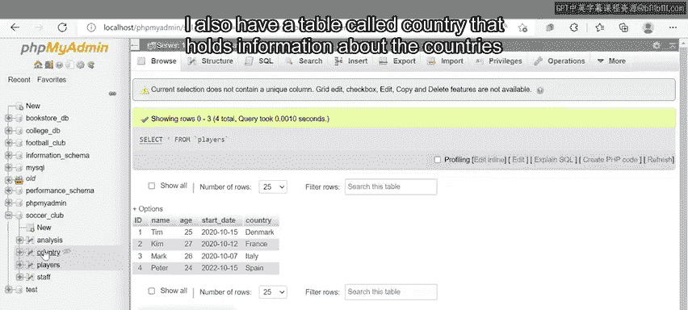
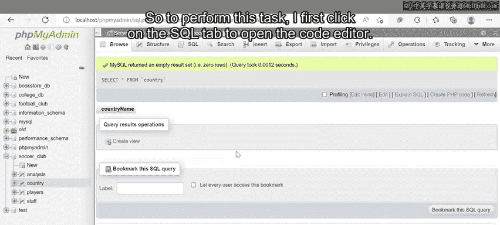
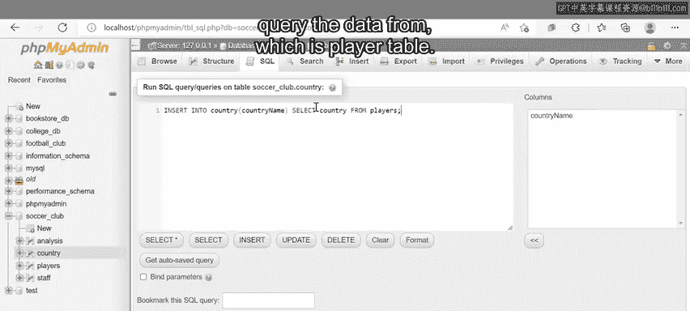
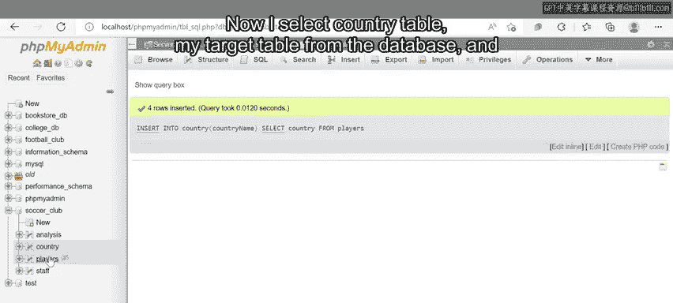
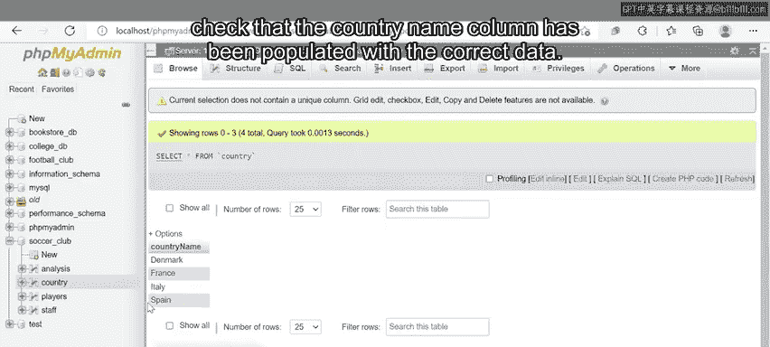

# 入门 22：INSERT INTO SELECT语句

在本节课中，我们将要学习如何使用 `INSERT INTO SELECT` 语句，从一个或多个表中查询数据，并将结果插入到另一个目标表中。这是一种高效的数据迁移和填充方法。

## 理解 INSERT INTO SELECT 语句



上一节我们介绍了数据操作的基本概念，本节中我们来看看 `INSERT INTO SELECT` 语句的具体作用。

本质上，`INSERT INTO SELECT` 语句用于从源表的列中查询数据，并将查询结果放入目标表的列中。



例如，你可以使用 `INSERT INTO SELECT` 语句查询源表中 `column C` 的数据，并将查询结果放入目标表的 `column B` 中。

## 语句语法结构



了解了其作用后，我们来看看它的语法结构。以下是 `INSERT INTO SELECT` 语句的基本语法示例：

```sql
INSERT INTO target_table (target_column)
SELECT source_column
FROM source_table;
```

以下是语法的分步说明：
1.  首先输入 `INSERT INTO` 子句，后跟目标表的名称以及要插入数据的列名。
2.  然后输入 `SELECT` 关键字，后跟要从源表中提取数据的列名。
3.  最后输入 `FROM` 关键字以及包含该列或源数据的源表名称。



## 实战演练：填充国家数据

现在，我们通过一个具体的例子来演示如何使用 `INSERT INTO SELECT` 语句。我们将使用一个足球俱乐部数据库中的表。

在开始查询之前，我们先快速了解一下这些表。该数据库中有一个名为 `Players` 的表，它保存了球队中四名不同球员的记录。

此外，还有一个名为 `Country` 的表，用于保存这些球员所属国家的信息。但目前 `Country` 表中缺少国家名称数据，即它是空的。我可以使用 `INSERT INTO SELECT` 语句执行 SQL 查询来填充这些缺失的数据。



还记得本节开头提到的源表和目标表的例子吗？在这个实例中，`Players` 表是我需要查询的源表，而 `Country` 表是 SQL 将放置我查询结果的目标表。

为了从源表查询数据并用它填充目标表，我需要编写一个 `INSERT INTO SELECT` 语句。请注意，为了演示方便，我已经将 `Players` 表中的球员数据按照其在 `Country` 表中必须出现的顺序进行了组织。

以下是执行此任务的具体步骤：
1.  首先，点击 SQL 标签页打开代码编辑器。
2.  然后，编写 `INSERT INTO` 命令，后跟我的目标表名称，即 `Country` 表。
3.  接着，在一对括号内声明查询数据必须插入到的列名。在这个例子中，该列名为 `country_name`。
4.  下一步，输入 `SELECT` 关键字，并声明我要在源表中查询的列，即 `country`。
5.  最后，输入 `FROM` 关键字，并声明我要从中查询数据的源表名称，即 `Players` 表。
6.  在查询语句末尾添加分号，然后运行它。

执行查询后，我从数据库中选择 `Country` 表（我的目标表），并检查 `country_name` 列是否已填充了正确的数据。



## 总结





本节课中我们一起学习了 `INSERT INTO SELECT` 语句。你现在已经知道如何查询源表中的数据，并将其插入到目标表中，从而高效地填充或迁移数据。