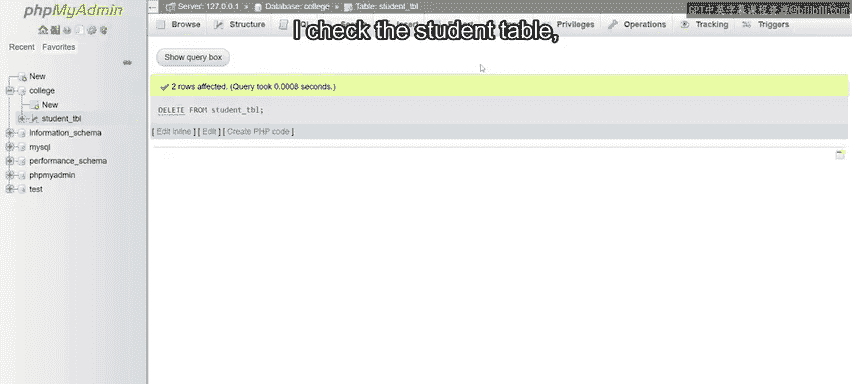
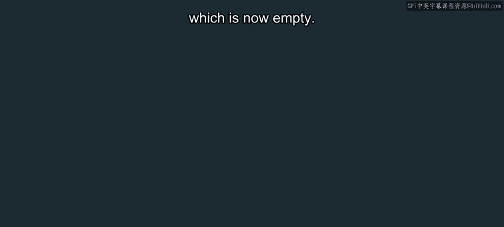

# 入门 24：删除数据 📝

在本节课中，我们将学习如何使用 SQL 的 `DELETE` 语句从数据库表中删除数据。我们将通过三个具体示例，分别演示如何删除单条记录、多条记录以及表中的所有记录。理解 `DELETE` 语句的正确用法对于管理数据库内容至关重要。

## 删除单条记录示例

上一节我们概述了本节课的目标，本节中我们来看看如何从表中删除单条特定记录。

我将使用大学数据库中的学生表，目标是删除姓氏为 Miller 的学生记录。

我进入 phpMyAdmin 的 SQL 选项卡，编写一个以关键字 `DELETE FROM` 开头的删除语句。

然后我指定表名为 `student_table`。我添加一个 `WHERE` 子句和条件来指定要删除的数据。

我需要数据库扫描学生列表，识别出姓氏值为 Miller 的记录。

然后将该记录从表中删除。因此我输入 `WHERE`，后跟 `last_name = 'Miller'`。

我随后按下“执行”按钮来运行这条语句。

我收到一条确认信息，表明 Miller 的记录已从数据库中删除。

我然后可以在左侧面板访问学生表，以确保 Miller 的记录或实例已被移除。

## 删除多条记录示例

了解了单条记录的删除后，现在我们来探索另一个例子，这次从学生表中删除多条记录。

现在我想删除工程系两名学生的记录。

语句的开头部分与上一个示例相同。

我以 `DELETE FROM` 关键字开始，后跟我正在使用的表名，即 `student_table`。

`WHERE` 子句是本例的关键区别。

我输入 `WHERE`，后跟 `department = 'Engineering'`。

这指示 SQL 识别 `department` 列中值为 `Engineering` 的所有记录。

并将这些行从表中移除。但我需要小心。

如果我未正确指定 `WHERE` 子句，那么表中的所有记录都将被删除。

现在我已经完成了语句的编写，我选择“执行”来运行它。

我然后通过点击左侧面板中的表来检查它。

并确认两名工程系学生的记录已从表中删除。

## 删除所有记录示例

最后，让我们快速了解如何删除表中的所有记录。在这个任务中，语法与前几个示例大体相同。

关键区别在于我去掉了 `WHERE` 子句，因此现在我的语法只是声明 `DELETE FROM student_table`。

我去掉了 `WHERE` 子句，所以现在我的语法只是声明 `DELETE FROM student_table`。

换句话说，我指示数据库删除学生表中的所有记录。然后我点击“执行”。

并确认删除操作。一旦删除被确认，我检查学生表。



该表现在是空的。



我现在知道所有记录都已被删除。

## 核心语法总结

以下是本节课涉及的 `DELETE` 语句核心语法：

*   **删除特定记录**：使用 `DELETE FROM` 结合 `WHERE` 子句来指定条件。
    ```sql
    DELETE FROM table_name WHERE condition;
    ```
*   **删除所有记录**：仅使用 `DELETE FROM` 语句，不包含 `WHERE` 子句。
    ```sql
    DELETE FROM table_name;
    ```


**重要提示**：`DELETE` 操作是不可逆的。在执行不带 `WHERE` 子句的 `DELETE` 语句前务必谨慎，因为它会清空整个表。


## 课程总结

本节课中我们一起学习了 SQL `DELETE` 语句的使用。我们通过三个循序渐进的示例，掌握了如何删除单条记录、根据条件删除多条记录以及清空整个表。请始终牢记，在执行删除操作，尤其是批量删除时，仔细核对 `WHERE` 条件至关重要，以避免意外数据丢失。