# 入门 26：SQL算术运算符 🧮

在本节课中，我们将要学习SQL中的算术运算符。这些运算符能帮助我们在数据库中执行数学计算，例如计算员工薪资调整或津贴变化。通过掌握它们，你可以高效且准确地处理数据。

## 什么是SQL运算符？

上一节我们介绍了算术运算符的应用场景，本节中我们来看看运算符本身是什么。


运算符是SQL中特定的单词或字符，用于在数据库中执行各种操作。它们类似于造句时使用的连词，或者计算器上用于执行计算的按键。

## 为什么需要了解运算符？

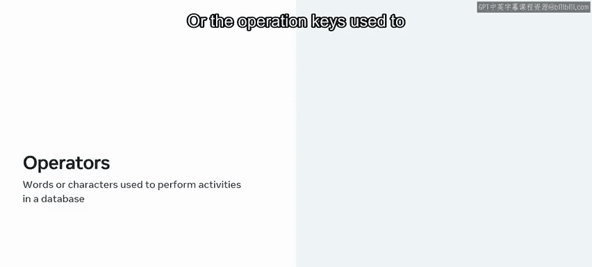

当处理数据库中的数据时，你经常需要出于不同目的来查询和操作数据。SQL运算符使你能够根据需要操作数据，以执行这些不同的活动。

例如，你可以使用算术运算来计算员工剩余的年假天数，或者比较员工是否达到了公司目标。

## SQL运算符的类型

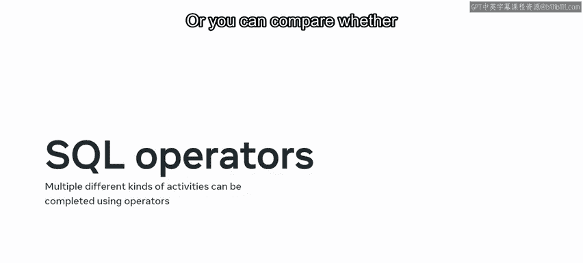

SQL中有多种类型的运算符，每种都有不同的功能。让我们先重点探索算术运算符。

算术运算符在计算机语言中常用于执行计算并返回结果。与数学中的常见算术运算符类似，你可以在SQL中使用算术运算符在数据库中进行数学运算。

以下是SQL算术运算符及其符号：

*   **加号 (+)** 用于加法。
*   **减号 (-)** 用于减法。
*   **星号 (*)** 用于乘法。
*   **正斜杠 (/)** 用于除法。
*   **百分号 (%)** 用于取模（返回除法运算的余数）。

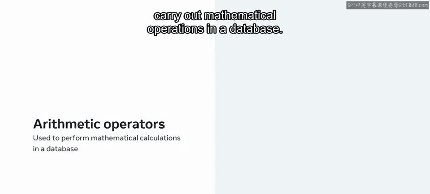

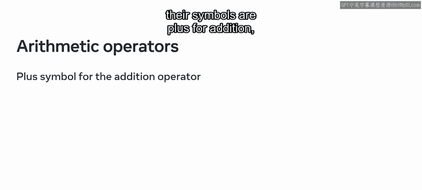

## SQL算术运算如何工作？

在执行计算时，一个运算符作用于两个操作数并返回结果。

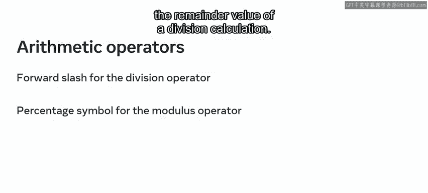

例如，一个加法运算符可以取两个操作数 `5` 和 `5`，并返回结果 `10`。用公式表示就是：`5 + 5 = 10`。

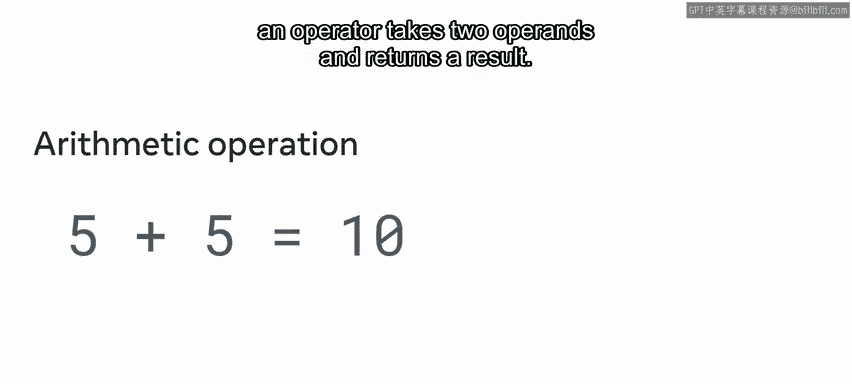

在SQL中，你可以通过使用 `SELECT` 命令来应用相同的概念。

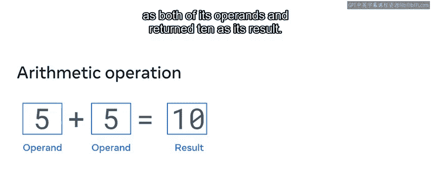

让我们用加法运算符来说明这个概念。你可以使用 `SELECT` 命令，后跟第一个操作数、加法运算符和第二个操作数。就像前面的例子一样，SQL会计算两个操作数并产生结果。

```sql
SELECT 5 + 5;
```

你可以用其他算术运算符重复这个SQL语法：
*   使用减法运算符 `SELECT 5 - 5;`，输出结果是 `0`。
*   乘法运算符 `SELECT 5 * 5;` 返回结果 `25`。
*   除法运算符 `SELECT 5 / 5;` 计算结果为 `1`。
*   取模运算符 `SELECT 5 % 5;` 的结果是 `0`，因为5除以5等于1，没有余数。

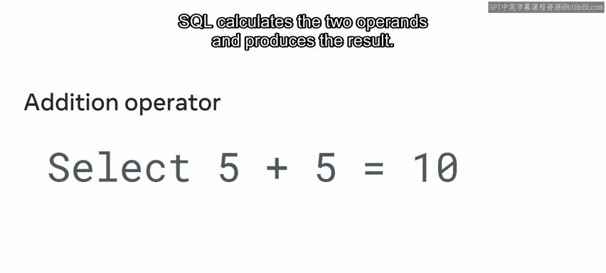

## 在SQL中使用算术运算符

现在，让我们更仔细地看看如何在SQL中使用这些算术运算符。我将演示如何使用算术运算符来执行基本的数学运算。

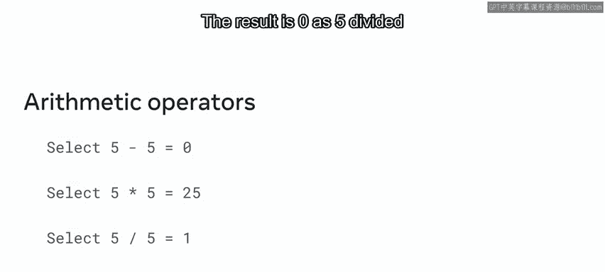

首先，让我们尝试一个加法运算来将两个数字相加。

1.  我使用 `SELECT` 命令。
2.  然后输入数字 `10` 和 `15`，用加号运算符 `+` 分隔。
3.  最后跟一个分号 `;`。虽然在这种情况下分号是可选的，但我仍然倾向于使用它，因为它代表一个SQL语句的结束。

`SELECT` 命令会检索 `10` 加 `15` 的和这个值，并将其显示在屏幕上。

```sql
SELECT 10 + 15;
```

运行此查询，查询会生成示例加法运算的结果，即 `25`。

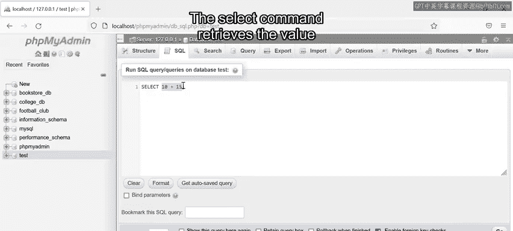

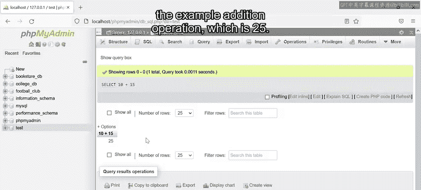

正如我执行这个加法操作一样，我同样可以使用减法、乘法、除法和取模运算符。

*   我可以使用减号 `-` 进行减法。
*   使用星号 `*` 进行乘法。
*   使用正斜杠 `/` 进行除法。
*   使用百分号 `%` 进行取模。

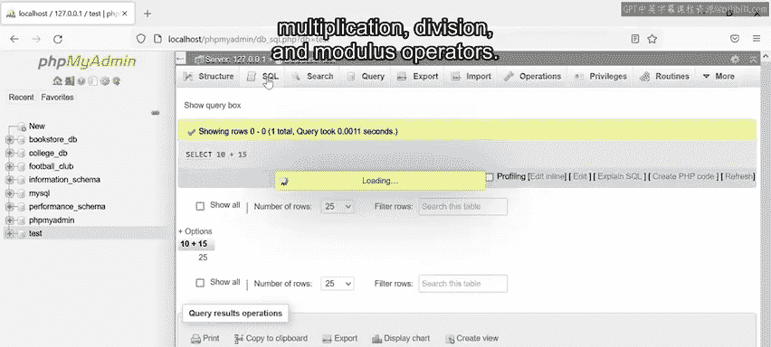

例如，我可以输入：

```sql
SELECT 100 % 10;
```

这将 `100` 除以 `10`，并给我除法运算的余数。在这种情况下，余数是 `0`，因为 `100` 除以 `10` 等于 `10`，没有余数。运行查询后，余数 `0` 就会显示出来。

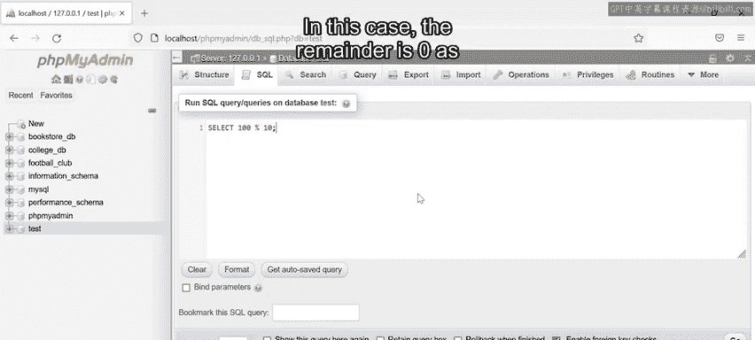

这就是你如何在SQL中使用运算符符号进行不同基本运算的方法。

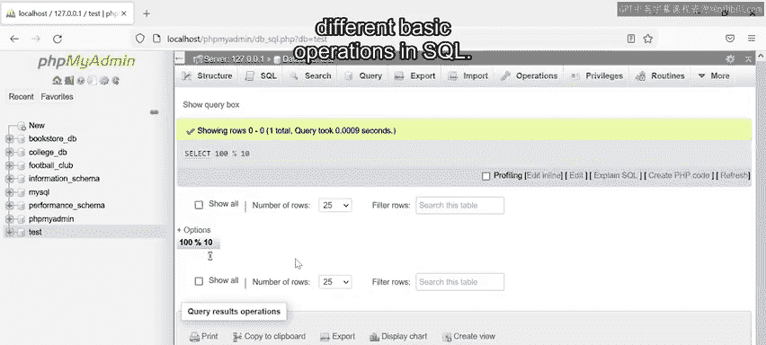

## 总结

本节课中我们一起学习了SQL算术运算符以及如何在SQL中使用它们执行基本运算。你现在已经了解了加法 (`+`)、减法 (`-`)、乘法 (`*`)、除法 (`/`) 和取模 (`%`) 运算符的用法。接下来，你已经准备好学习如何以更实际的方式应用这些算术运算符了。