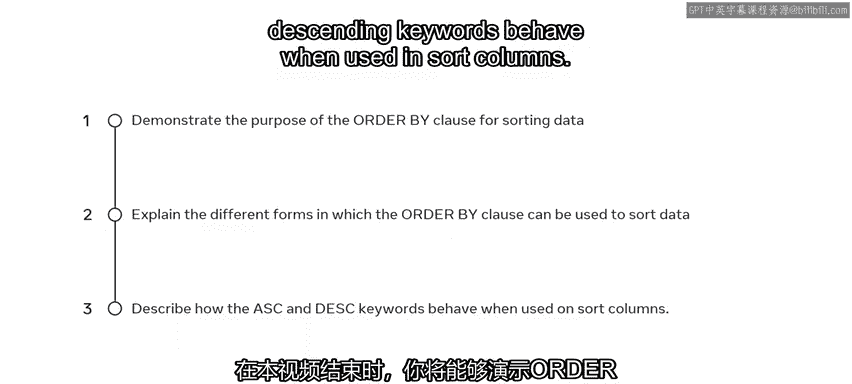
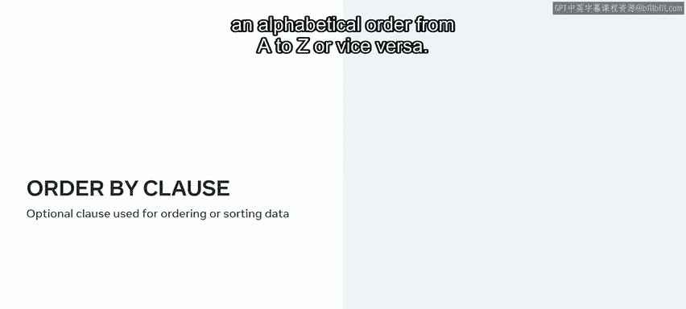
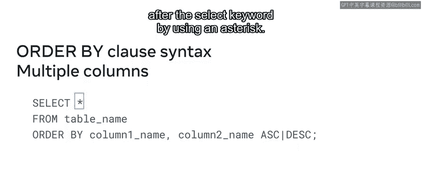
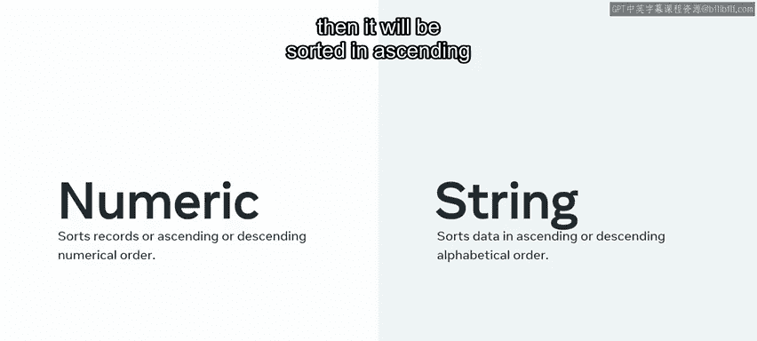
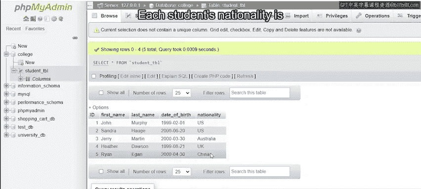
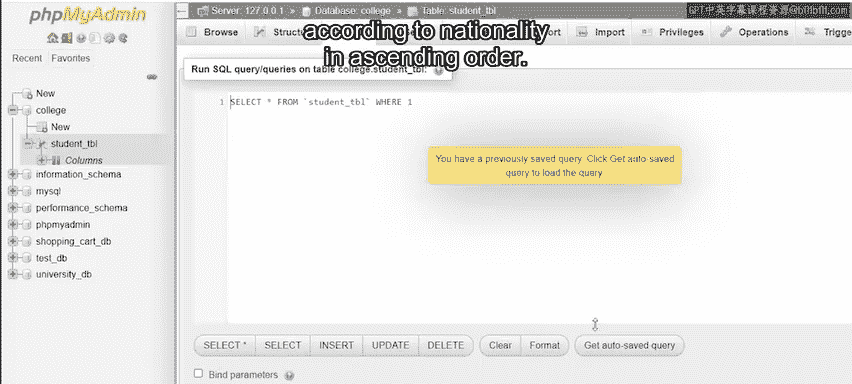
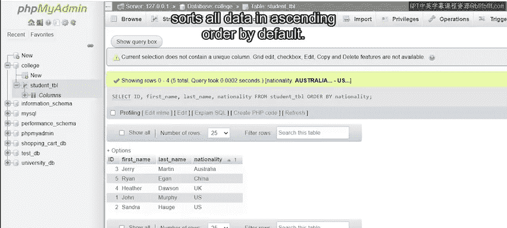
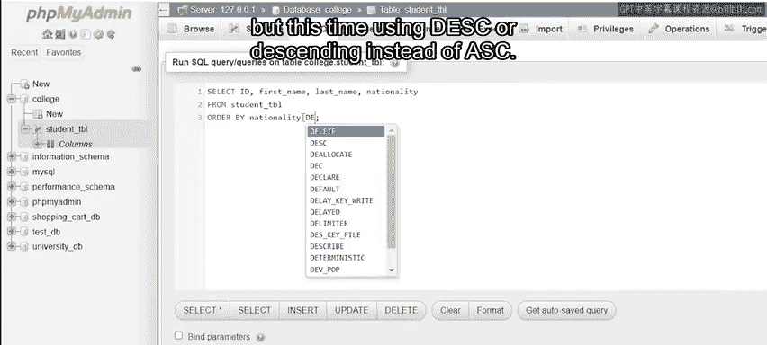
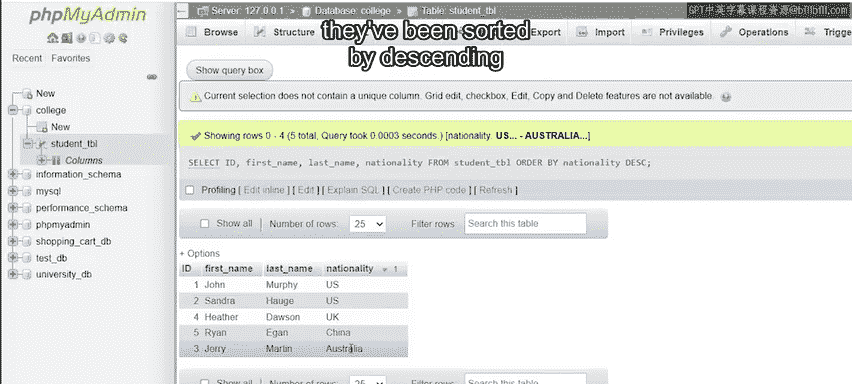
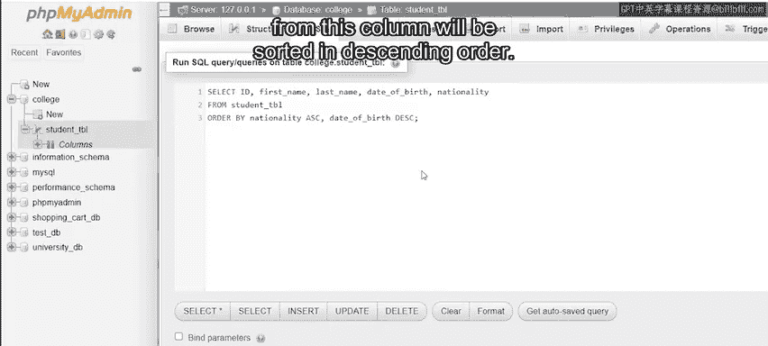

# 29：ORDER BY子句 📊

在本节课中，我们将要学习SQL中一个非常实用的子句——`ORDER BY`。它用于对数据库表中的数据进行排序。通过本课，你将能够理解`ORDER BY`子句的用途，掌握其基本语法，并学会如何使用它对单列或多列数据进行升序或降序排列。

## 探索ORDER BY子句的用途 🎯

上一节我们介绍了SQL的基本查询结构，本节中我们来看看如何对查询结果进行排序。`ORDER BY`子句是一个可选子句，可以附加在`SELECT`语句之后。它的主要目的是帮助数据按升序或降序进行排序。例如，你可以将一个学生姓名列表按字母顺序从A到Z排序，或者反之。



## 理解ORDER BY子句的语法 📝

为了更好地理解`ORDER BY`子句的工作原理，让我们先来探索其语法结构。

在其最基本的形式中，`ORDER BY`子句的语法如下：



```sql
SELECT column1, column2, ...
FROM table_name
ORDER BY column1 [ASC|DESC];
```

它以一个`SELECT`语句开始。然后是要排序的列名列表，每列之间用逗号分隔。接着是`FROM`关键字，后跟要排序的表名。最后，添加`ORDER BY`子句，后跟要排序的列名。在列名末尾，指定你希望数据排序的方式，可以通过指定`ASC`表示升序，或`DESC`表示降序。

但`ORDER BY`子句并不局限于单列排序。你也可以使用以下语法对多列数据进行排序。

以下是排序多列的语法示例：

```sql
SELECT column1, column2, ...
FROM table_name
ORDER BY column1 [ASC|DESC], column2 [ASC|DESC], ...;
```

与单列排序的关键区别在于，你必须在`ORDER BY`子句后键入每个列的名称。只需确保用逗号分隔每个列，并指定你希望每列是按升序还是降序排序。

你也可以通过在`SELECT`关键字后使用星号`*`来指定所有列。



```sql
SELECT *
FROM table_name
ORDER BY column1 [ASC|DESC];
```

这比逐一列出所有列要简便得多。

最后，同样重要的是要注意，表中数据的类型会影响其排序方式。如果列是数值数据类型，记录将按升序或降序的数值顺序排序。如果列是基于文本或字符串数据类型，则将按升序或降序的字母顺序排序。



## ORDER BY子句应用示例 💻

接下来，让我们探索一些在SQL语句中使用`ORDER BY`子句的示例。

### 按单列排序数据



让我们从一个按单列排序数据的示例开始。在这个例子中，我将使用一个列出大学学生详细信息的表。我需要按每个学生的国籍升序来排序或整理这些数据。因此，在这种情况下，`ORDER BY`的列必须是每个学生的国籍。每个学生的国籍列在表的第五列。

以下是实现此排序的SQL语句：

```sql
SELECT id, first_name, last_name, nationality
FROM student_table
ORDER BY nationality ASC;
```

我首先编写一个`SELECT`语句，后跟结果中想要的列名：`id`、`first_name`、`last_name`和`nationality`。然后我写上`FROM`关键字，后跟表名`student_table`。接着，我键入`ORDER BY`子句。然后我指定要按其排序数据的列名，即`nationality`。最后，我键入`ASC`，以便数据按升序排序。然后我执行该语句。

表现在已根据国籍按升序对所有学生进行了排序。请注意，即使我从代码末尾省略`ASC`，我仍然会得到相同的结果。这是因为`ORDER BY`子句默认按升序对所有数据进行排序。



让我们运行相同的语句，但这次使用`DESC`（降序）而不是`ASC`。





```sql
SELECT id, first_name, last_name, nationality
FROM student_table
ORDER BY nationality DESC;
```

表现在已第二次按国籍对学生进行了排序，但这次是按降序或反向字母顺序排序的。



### 按多列排序数据

最后，让我们探索一个按多列排序数据的示例。在这个例子中，我将按国籍和出生日期对学生进行排序。

以下是实现此排序的SQL语句：

```sql
SELECT id, first_name, last_name, date_of_birth, nationality
FROM student_table
ORDER BY nationality ASC, date_of_birth DESC;
```

首先，我编写`SELECT`语句。然后写上结果中想要的列名：`id`、`first_name`、`last_name`、`date_of_birth`和`nationality`。接着，我写上`FROM`关键字和表名`student_table`。然后，我键入`ORDER BY`子句，并指定要按其排序数据的列名，即`nationality`和`date_of_birth`。我在`nationality`后添加`ASC`，以便数据按国籍升序排序。我在`date_of_birth`后添加`DESC`，以便该列的数据将按降序排序。然后我运行该语句。



这将返回我的表，其中指定列的数据按照指示进行组织：国籍按字母顺序，出生日期从最年轻到最年长（降序）。

## 总结 ✨

本节课中我们一起学习了SQL的`ORDER BY`子句。你现在可以演示`ORDER BY`子句用于排序数据的目的，并且可以解释使用`ORDER BY`子句排序数据的不同形式。我们还通过示例练习了如何对单列和多列进行升序及降序排序。掌握`ORDER BY`是有效组织和分析查询结果的关键一步。