# 30：WHERE子句 📊

在本节课中，我们将学习SQL中**WHERE子句**的用途与使用方法。WHERE子句用于从数据库表中筛选出满足特定条件的记录，是数据查询中不可或缺的部分。

## 什么是WHERE子句？ 🔍

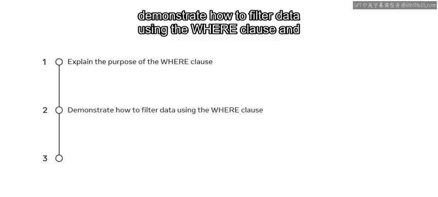

WHERE子句用于过滤数据。具体来说，它用于筛选并提取满足指定条件的记录。

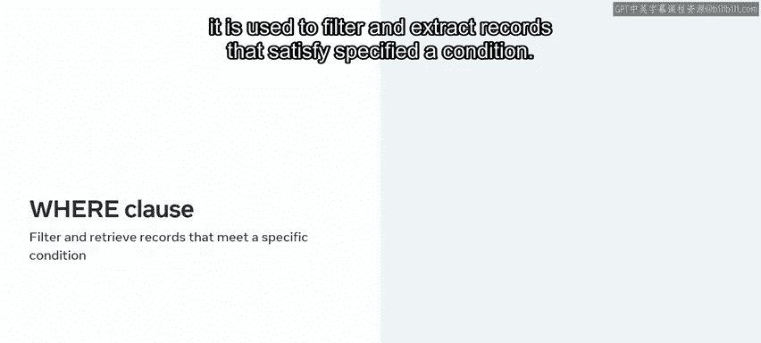

为了更好地理解WHERE子句的用法，我们可以先分解其在SQL SELECT语句中的语法结构。

## WHERE子句的语法结构 📝

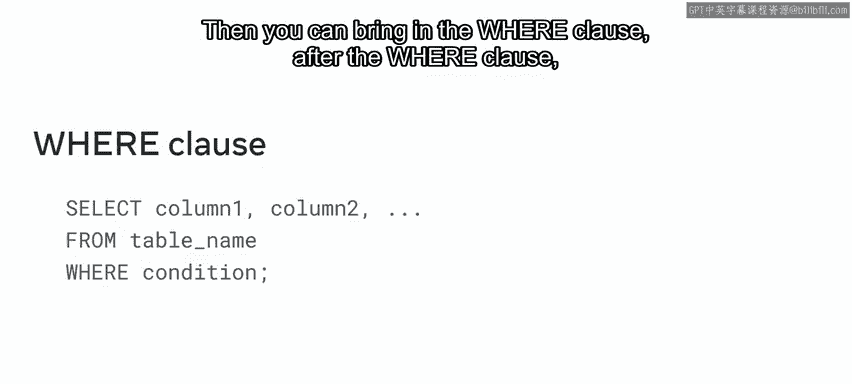

SQL SELECT语句的标准语法以`SELECT`关键字开始，后跟要查询的列名。接着是`FROM`子句，指定表名。然后可以引入`WHERE`子句。在WHERE子句之后，可以指定具体的筛选条件。

您可能想知道条件的作用是什么。条件使得从表中筛选并获取所需记录成为可能。您可以将条件视为筛选标准。

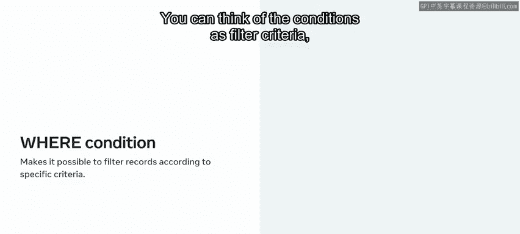

只有满足条件的记录才会被检索出来。例如，您可以使用条件来检查目标列的值是否等于某个特定值。

在列名和值之间，您可以放置一个**运算符**。

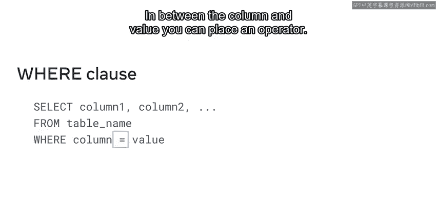

## 运算符与操作数 🔧

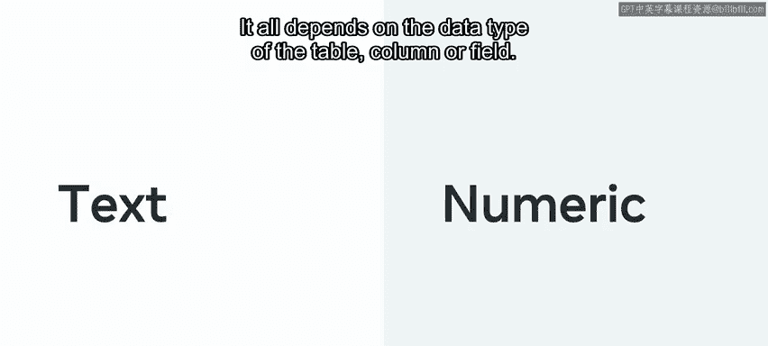

正如您刚刚了解到的，运算符后面跟着**操作数**。让我们更详细地了解一下。操作数可以是文本值或数值，这完全取决于表列或字段的数据类型。

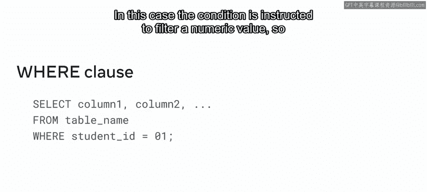

为了演示，我们来看一个例子：`student_id = 1`。在这个例子中，条件被指示去筛选一个数值，因此它作为一个筛选标准。

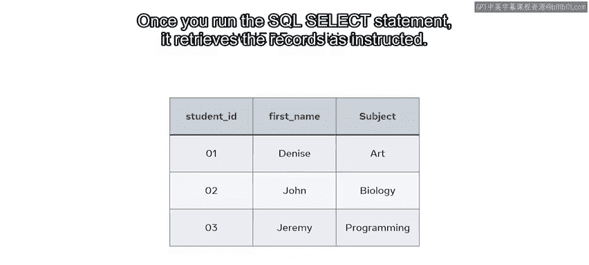

一旦您运行这个SQL SELECT语句，它就会按照指示检索出记录。

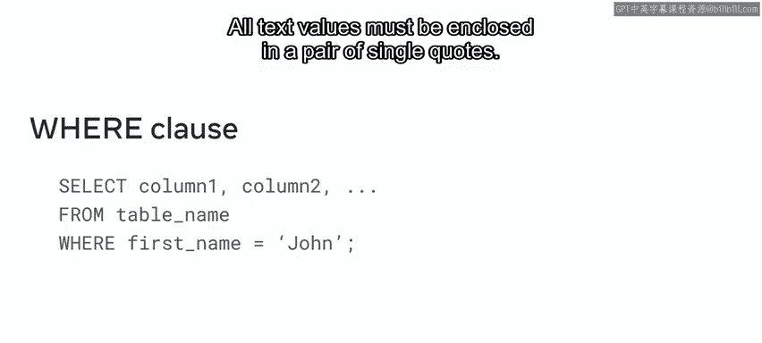

让我们看另一个例子：`first_name = 'John'`，这是一个文本值。所有文本值都必须用一对单引号括起来。

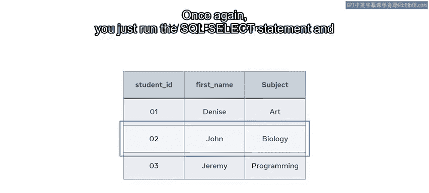

再次，您只需运行SQL SELECT语句，它就会筛选出所需的记录。

## 可用的运算符类型 📚

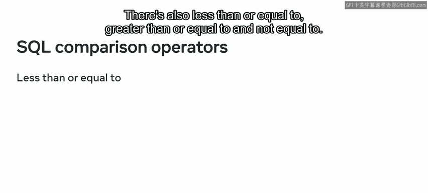

为了指定您的筛选条件，您可以使用多种运算符。您刚刚回顾了等号运算符的例子，其他运算符您可能在前面的课程中已经遇到过。

让我们快速回顾一下这些其他运算符。SQL比较运算符包括：
*   **等于** (`=`)
*   **小于** (`<`)
*   **大于** (`>`)
*   **小于或等于** (`<=`)
*   **大于或等于** (`>=`)
*   **不等于** (`<>` 或 `!=`)

除了这些符号，WHERE子句还可以使用`BETWEEN`、`LIKE`和`IN`运算符。
*   使用`BETWEEN`运算符，您可以筛选特定数值或时间日期范围内的记录。
*   `LIKE`运算符用于在WHERE子句的筛选条件中指定一个模式。
*   `IN`运算符用于为列指定多个可能的值。

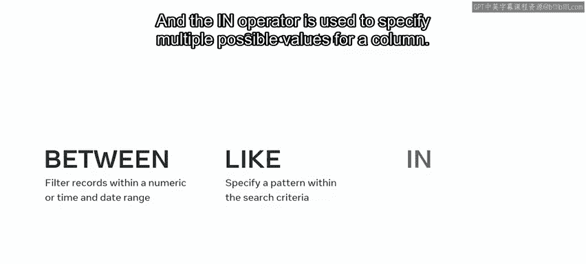

## WHERE子句实践示例 💻

现在，让我们探索一些在SELECT语句中使用WHERE子句的例子。

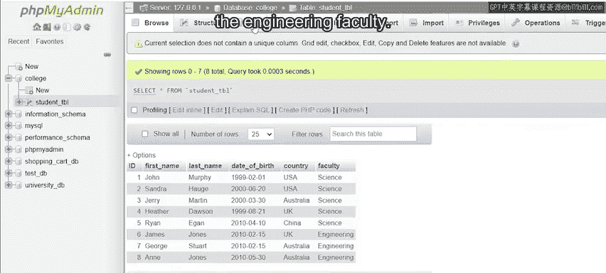

回想一下管理系希望为其工程和科学专业学生创建报告的场景。我可以使用WHERE子句来筛选出属于工程学院的学生的详细信息。

在这种情况下，我需要从学生表中检索所有详细信息（所有列），所以我写`SELECT * FROM student_table`。接着，我输入`WHERE`，后跟筛选条件。条件写为`faculty = 'Engineering'`。文本值`'Engineering'`需要用单引号括起来。这样，我就指示我的SQL只获取隶属于工程学院的学生详细信息。

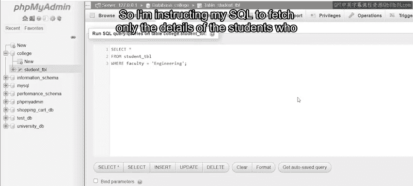

然后我运行查询。

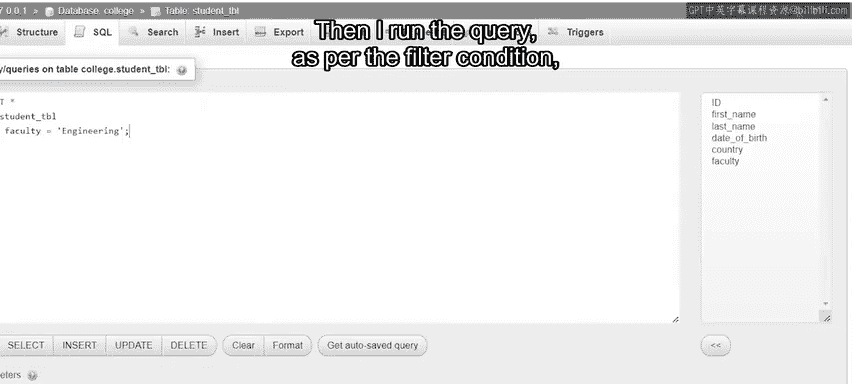

根据筛选条件，它确实检索出了学生表中列出的三位工程学院学生的记录。请注意，我本可以用其他运算符，如大于、小于、小于或等于、大于或等于、不等于，用法与这个WHERE子句条件中的等号运算符相同。

您可以将这些运算符中的任何一个与数值或操作数一起使用。

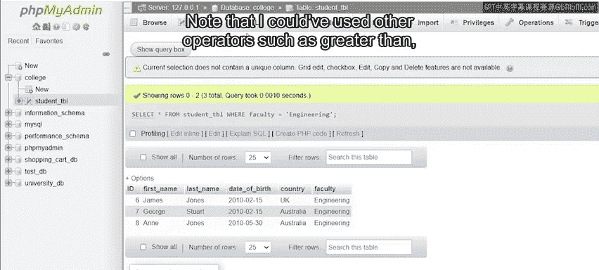

现在让我们回顾一些在WHERE子句条件中使用`BETWEEN`、`LIKE`和`IN`运算符的例子。

### 使用 BETWEEN 运算符

学院有一个针对特定年龄学生的财政援助计划，资助部门希望只通知符合条件的学生。我可以在WHERE子句条件中使用`BETWEEN`运算符来筛选学生表中的记录。

和之前一样，我输入`SELECT * FROM student_table`，后跟`WHERE`。在`WHERE`关键字之后，我指定筛选列为`DOB`（出生日期）。然后我插入`BETWEEN`运算符。最后，我给出日期范围`'2010-01-01' AND '2010-06-30'`。

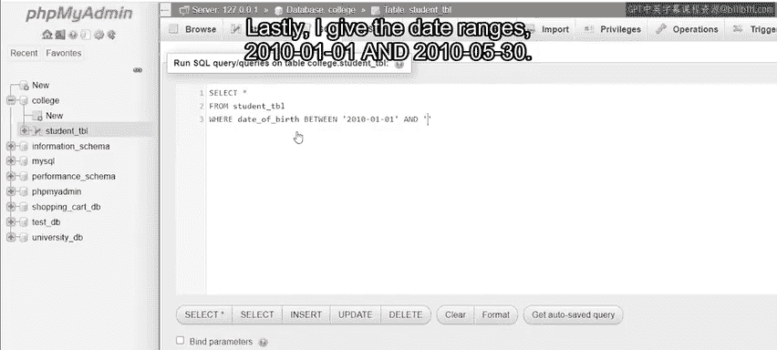

运行此查询会检索出四位出生日期落在指定日期范围内的学生的记录。

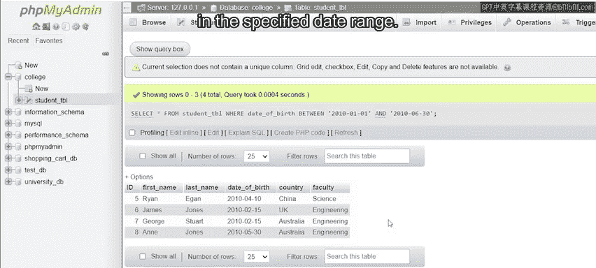

请注意，我在这里可以使用任何数值范围，不仅仅是日期。

### 使用 LIKE 运算符

对于下一个例子，假设管理部门需要科学学院学生的详细信息。我可以用`LIKE`运算符来实现，当您想在WHERE子句筛选条件中指定一个模式时，可以使用它。

在SELECT语句中，`WHERE`关键字之后，我输入`faculty`（学院列），然后是`LIKE`运算符，接着是`'Sci%'`（用单引号括起来）。模式中的百分号`%`是一个通配符，代表零个、一个或多个字符。下划线`_`也可以用来代表一个单一字符。

在这个例子中，我的WHERE子句要求我的SQL搜索并筛选`faculty`列中以`'Sci'`开头，后跟任意数量字符的值。所以我运行该语句，它筛选出了五位学院列值为`'Science'`的学生记录，即以`'Sci'`模式开头。

### 使用 IN 运算符

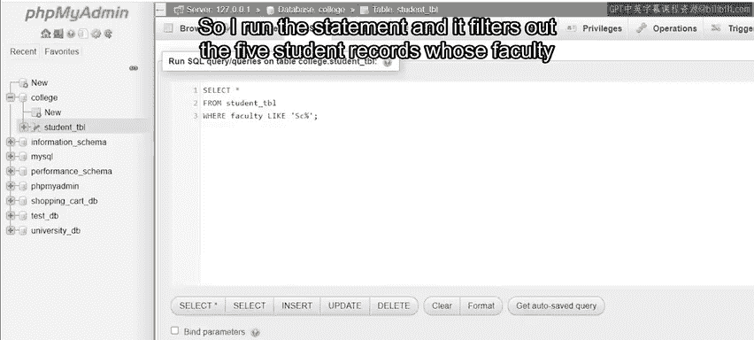

在最后一个例子中，管理部门需要了解在特定地点学习的学生的详细信息。

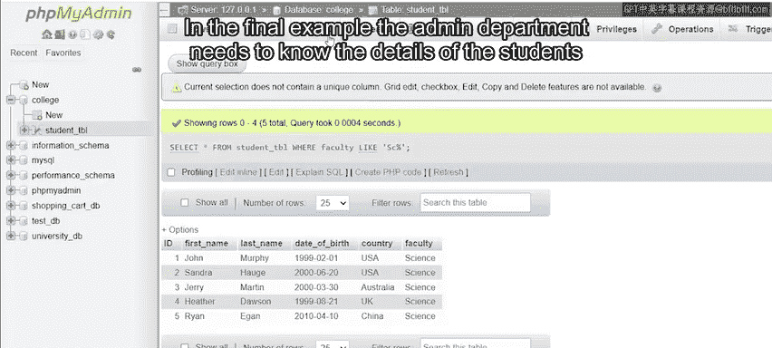

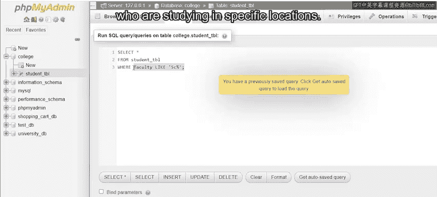

您可以在WHERE条件中使用`IN`运算符来检索相关的学生记录。请记住，`IN`运算符用于为列指定多个可能的值。

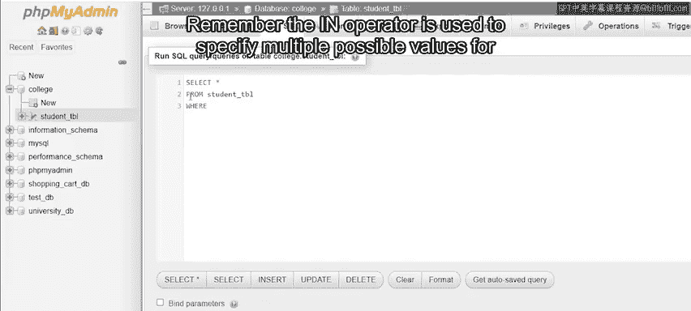

在SELECT语句中，`WHERE`关键字之后，我输入列名`country`，然后是`IN`运算符，接着是一对开括号。在括号内，我放置值`'USA'`和`'UK'`，每个都用单引号括起来。我的SELECT查询将筛选出`country`列值为`'USA'`或`'UK'`的所有学生记录。

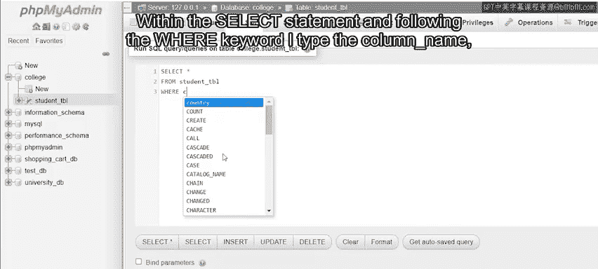

运行此查询返回四条记录，两位来自美国的学生和两位来自英国的学生。

因此，`IN`运算符在`country`列中搜索多个可能的值，并基于它们进行筛选。

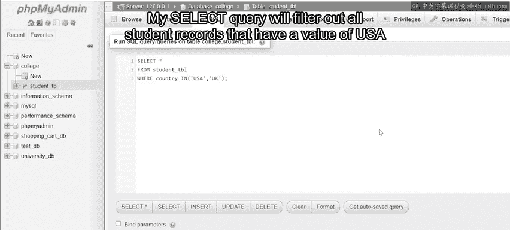

请注意，尽管本视频中的示例着眼于SELECT语句中的WHERE子句，但它也可以用于其他语句，例如`UPDATE`和`DELETE`。

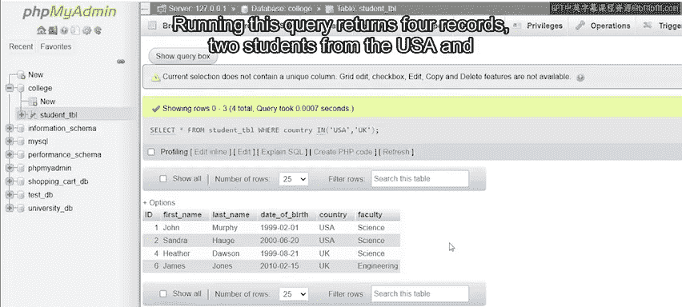

## 总结 📋

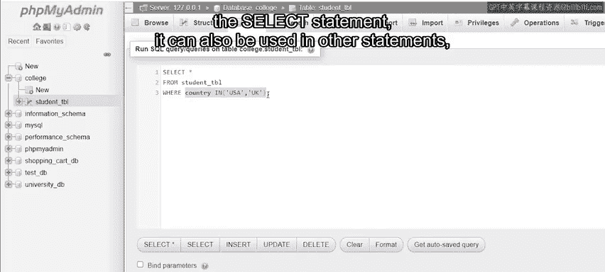

在本节课中，我们一起学习了什么是WHERE子句。您现在应该知道如何使用它来过滤数据，以及如何使用不同的运算符。

出色的工作。