# 31：SELECT DISTINCT子句 🎯

在本节课中，我们将要学习SQL中的`SELECT DISTINCT`子句。这个子句用于从数据库表中检索唯一不重复的值，是处理包含重复数据时非常有用的工具。我们将通过具体的例子来理解它的基本用法、在多列上的应用，以及它如何处理`NULL`值。

## 什么是SELECT DISTINCT？ 🤔

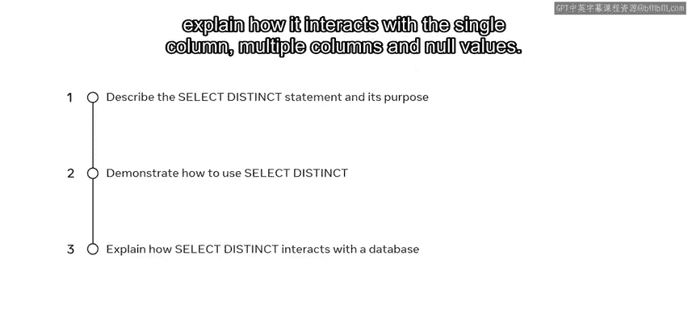

`SELECT DISTINCT`语句的核心功能是返回唯一不同的值。顾名思义，它从查询结果中消除所有重复的行，只保留每条不同的记录。

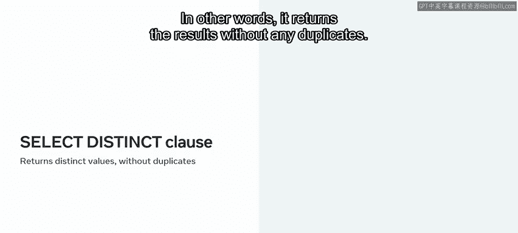

其基本语法结构如下：
```sql
SELECT DISTINCT column_name
FROM table_name;
```

## 处理单列中的重复值

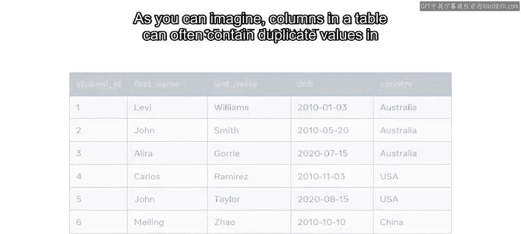

假设你有一个包含全球大学生记录的数据表。作为年度报告的一部分，你需要列出这些学生所属的所有不同国家。很可能许多学生来自同一个国家，那么如何检索出没有重复的结果呢？

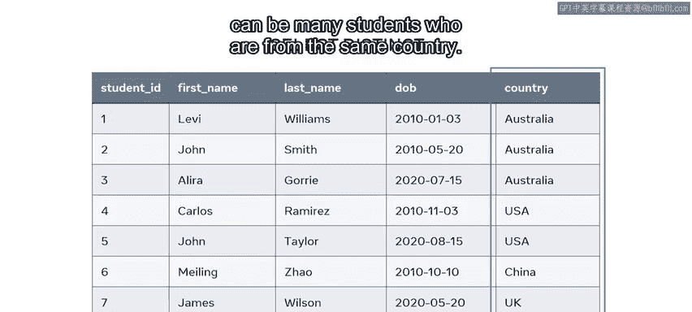

以下是一个学生表的示例，其中`country`列包含重复值：


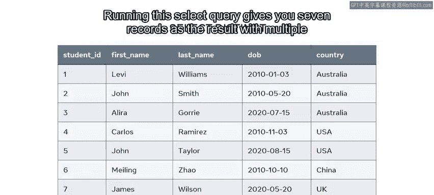

| 学生姓名 | 国家 |
| :--- | :--- |
| 学生A | 澳大利亚 |
| 学生B | 美国 |
| 学生C | 英国 |
| 学生D | 澳大利亚 | // 重复值
| 学生E | 美国 | // 重复值
| 学生F | 加拿大 |
| 学生G | 英国 | // 重复值

如果使用普通的`SELECT`语句：
```sql
SELECT country FROM students;
```
你将得到7条记录，其中“澳大利亚”和“美国”会出现多次。

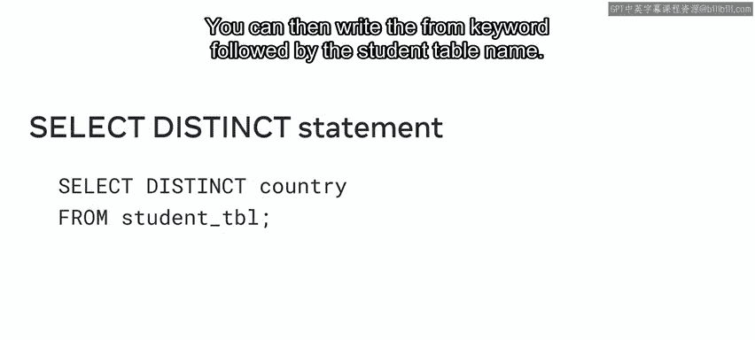

为了消除这些重复项并获取唯一的结果集，你需要使用`SELECT DISTINCT`语句：
```sql
SELECT DISTINCT country FROM students;
```
运行此语句后，结果中的每个国家将只出现一次，所有重复项都已被移除。

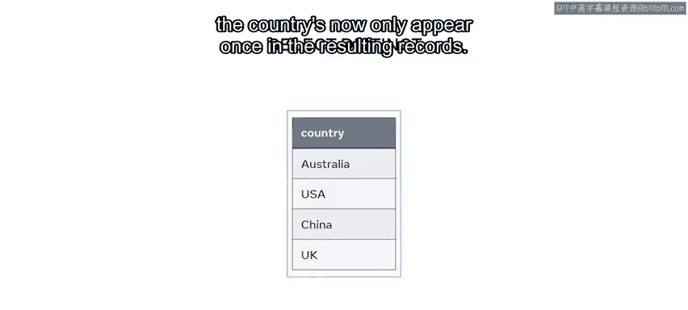

## 在多列上使用SELECT DISTINCT

上一节我们介绍了如何在单列上使用`DISTINCT`来获取唯一值。本节中我们来看看当`DISTINCT`应用于多列时会发生什么。

假设我们想确定不同院系（`faculty`）中分别有哪些国家的学生。我们可以同时指定`faculty`和`country`列：
```sql
SELECT DISTINCT faculty, country FROM students;
```
这条语句会返回`faculty`和`country`列的每一种唯一组合。例如，“科学院”可能有来自三个不同国家的学生，“工程学院”也可能如此。`DISTINCT`会将这些组合视为独立的记录，只返回不重复的组合。

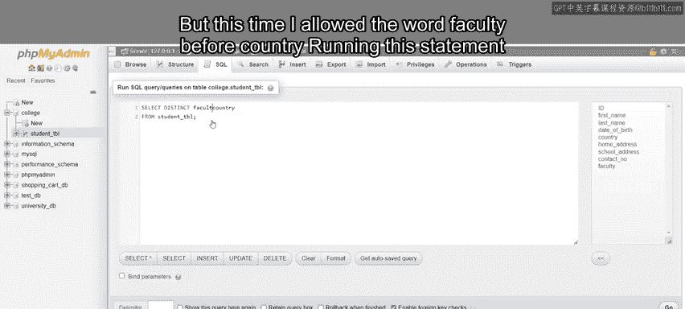

## SELECT DISTINCT与NULL值

现在，让我们探讨`SELECT DISTINCT`如何处理包含`NULL`值的列。

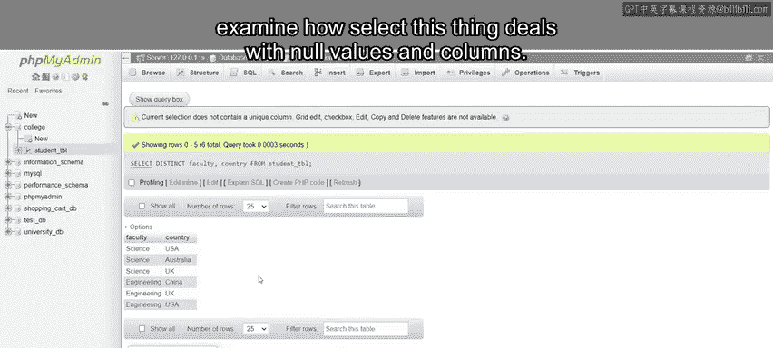

假设表中新增了一名来自美国的学生“Julia Smith”，但她尚未被分配院系，因此其`faculty`列的值为`NULL`。

当我们再次运行之前的多列`DISTINCT`查询时：
```sql
SELECT DISTINCT faculty, country FROM students;
```
查询结果将包含一条记录，其`faculty`为`NULL`，`country`为“美国”。这是因为`DISTINCT`子句将`NULL`视为一个唯一值。因此，`(NULL, ‘USA’)`被作为一个独特的院系与国家组合输出。

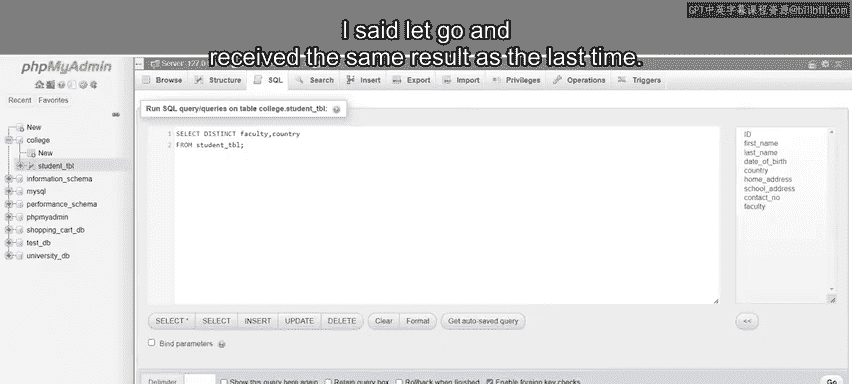

## 总结 📝

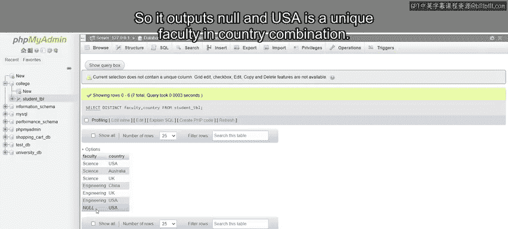

本节课中我们一起学习了`SELECT DISTINCT`子句的用法。我们了解到：
1.  `SELECT DISTINCT`用于从查询结果中消除重复行。
2.  它可以应用于单列，以返回该列的所有唯一值。
3.  当应用于多列时，它返回这些列值的所有唯一组合。
4.  `DISTINCT`将`NULL`视为一个有效的唯一值，并将其包含在结果集中。

掌握`SELECT DISTINCT`能帮助你更高效地分析和汇总数据，尤其是在需要获取不重复列表或进行初步数据探查时。