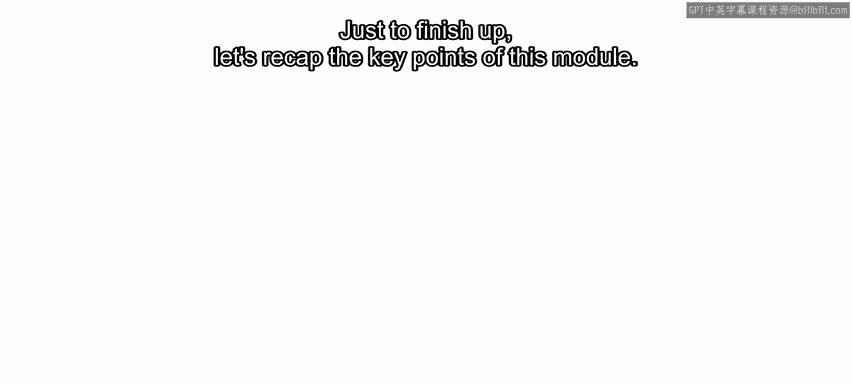
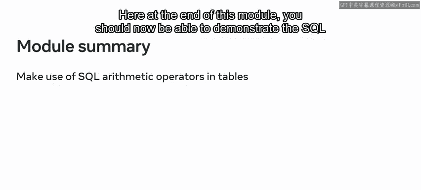
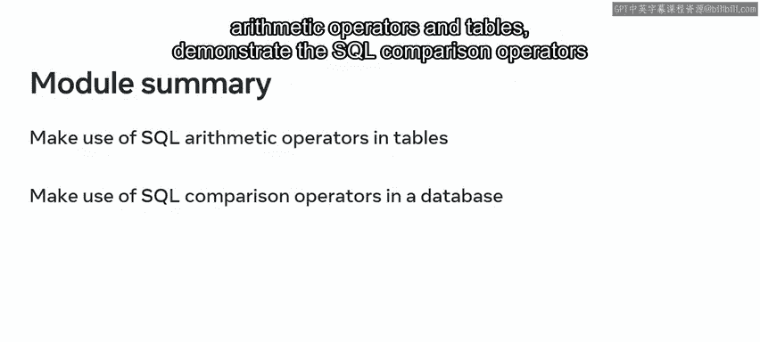
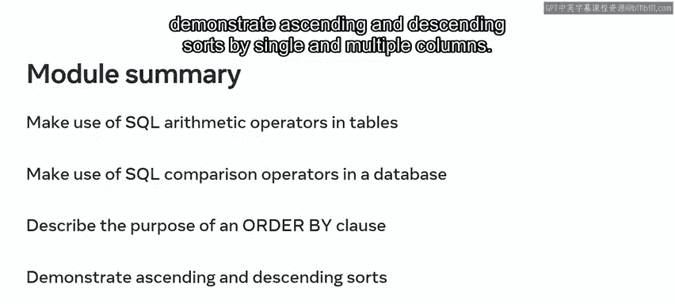
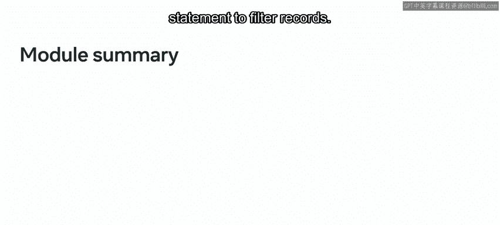
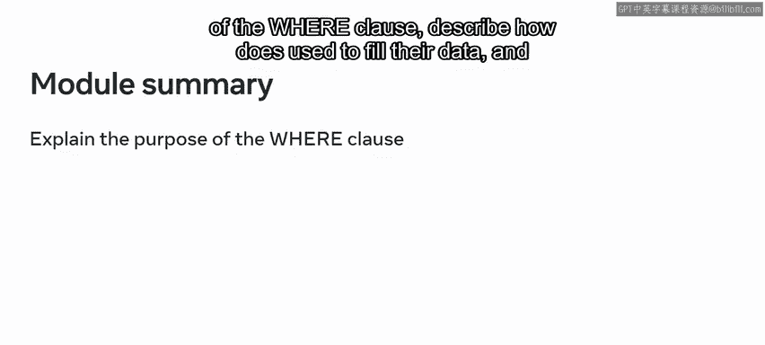
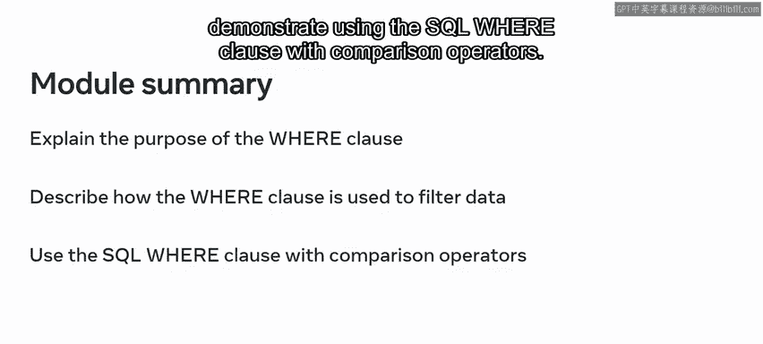
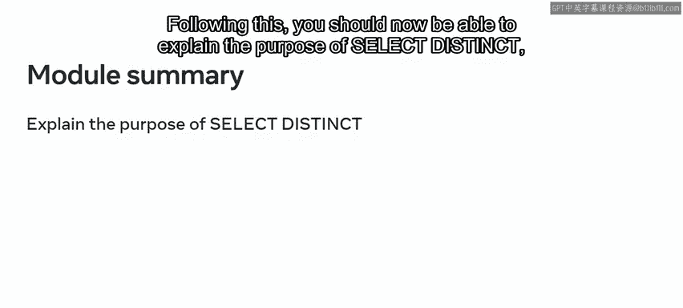
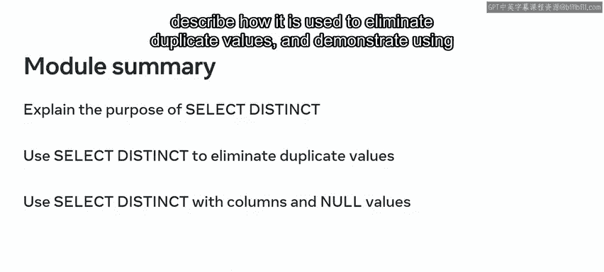
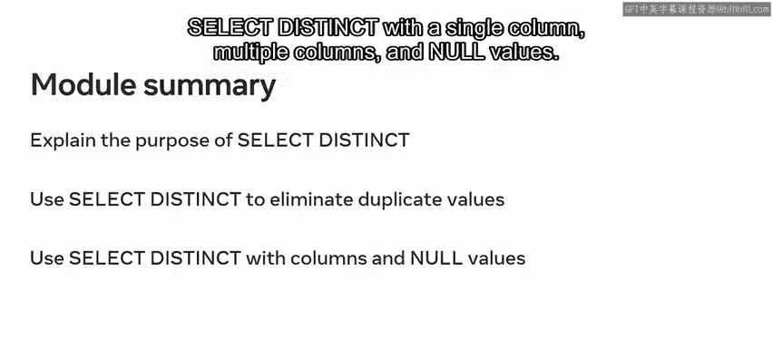

# 入门 32：模块小结 - SQL运算符以及对数据进行排序和筛选 📊

在本节课中，我们将一起回顾和总结SQL运算符、数据排序与筛选的核心知识。你将学习如何运用算术与比较运算符处理数据，如何使用`WHERE`和`ORDER BY`子句来筛选和排序数据，以及如何使用`SELECT DISTINCT`来消除重复值。

---

你已经完成了SQL运算符以及数据排序和筛选部分的学习。

在数据库中存储大量数据固然重要，但理解这些数据的意义更为关键。

因此，掌握使用SQL来操作数据成为了一项备受追捧的技能。你可能还记得，SQL运算符可以完成诸如算术运算和比较等任务。

数据可以使用`WHERE`子句进行筛选，并使用`ORDER BY`子句进行排序。

最后，让我们来回顾一下本模块的要点。

在本模块结束时，你现在应该能够演示SQL算术运算符在表中的使用。

演示SQL比较运算符在数据库中的使用，描述`ORDER BY`子句的用途，并演示基于单列和多列的升序与降序排序。

在关于数据筛选的视频中，`WHERE`子句与SQL `SELECT`语句结合使用来过滤记录。

对于`WHERE`子句，你现在应该能够解释其用途，描述它如何用于筛选数据，并演示如何将SQL `WHERE`子句与比较运算符结合使用。

最后，你还探索了`SELECT DISTINCT`子句。

完成这部分后，你现在应该能够解释`SELECT DISTINCT`的用途，描述它如何用于消除重复值，并演示在单列、多列以及包含`NULL`值的情况下使用`SELECT DISTINCT`。

完成本模块后，你现在应该能够对数据库中的数据执行一些SQL操作。

这是赋予数据真正价值的第一步。凭借你的SQL技能，数据库现在不再仅仅是一个存储仓库，它还是一个你可以深入探究并从中得出结论的工具。

---

## 总结 📝

本节课中我们一起学习了SQL的核心操作技能。我们回顾了如何使用算术和比较运算符处理数据，掌握了通过`WHERE`子句筛选特定记录，以及使用`ORDER BY`子句对结果进行排序。此外，我们还了解了`SELECT DISTINCT`在消除查询结果中重复值方面的应用。这些技能是将原始数据转化为有价值信息的基础，使你能够有效地分析和利用数据库内容。