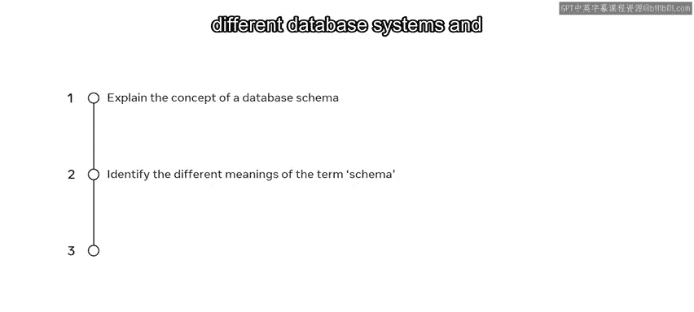
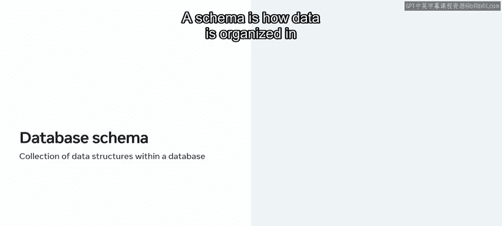
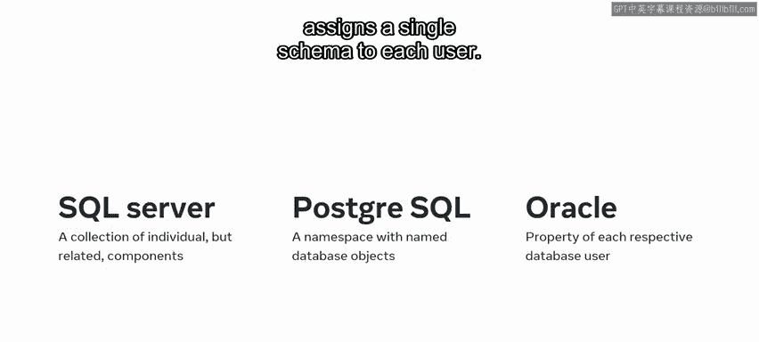
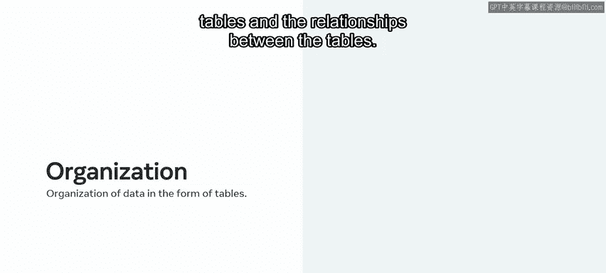
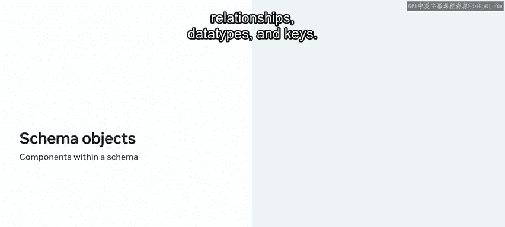
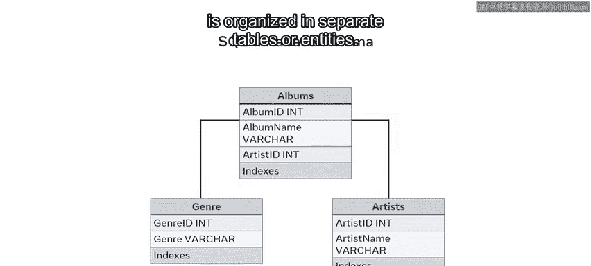
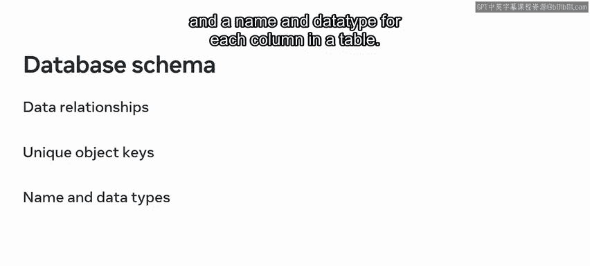
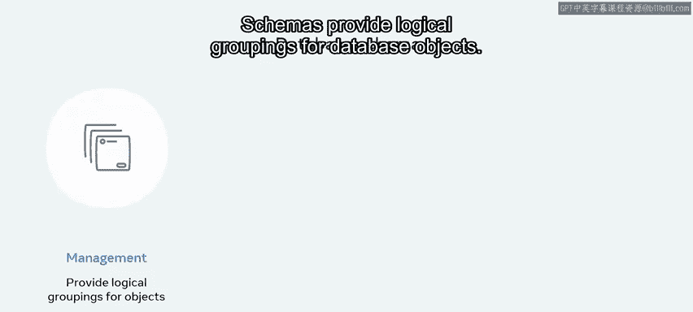
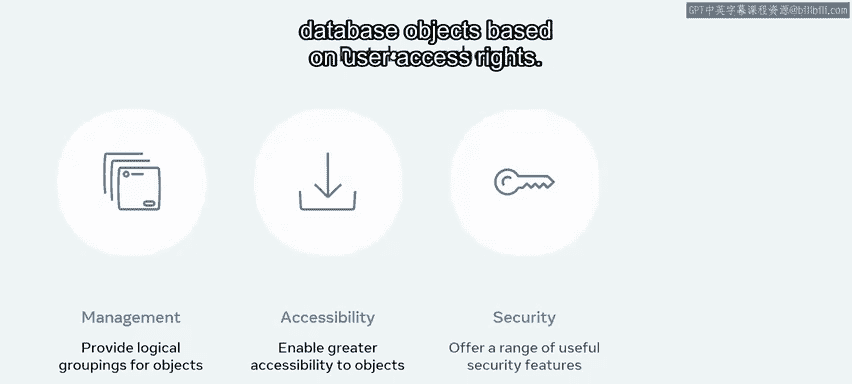
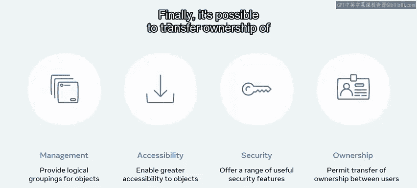

# 入门 33：数据库模式 🗂️

在本节课中，我们将要学习数据库模式的概念。数据库模式是数据库设计的蓝图，它定义了数据的组织方式和相互关系。理解模式对于规划和构建高效、安全的数据库至关重要。

## 什么是数据库模式？ 🧩

在开发数据库或软件应用程序之前，首先需要规划如何组织数据。这个规划被称为模式。它本质上是数据外观的蓝图。

上一节我们介绍了模式的基本定义，本节中我们来看看不同数据库系统对“模式”一词的具体解释。

## 不同数据库系统中的模式含义 🔄

“模式”的一般含义是信息的组织或分组以及它们之间的关系。然而，该术语在不同数据库系统中的定义有所不同。

以下是几种主要数据库系统中“模式”的含义：

*   **在MySQL中**：模式意味着数据结构的集合，或数据在数据库中存储方式的抽象设计。本质上，在MySQL中，模式（schema）和数据库（database）是可互换的术语。模式定义了数据在数据库中的组织方式以及与其他数据的关系。
*   **在SQL Server中**：数据库模式是不同组件（如表、字段、数据类型和键）的集合。
*   **在PostgreSQL中**：数据库模式是一个命名空间，其中包含命名数据库对象，如视图、索引和函数。
*   **在Oracle中**：系统为每个用户分配一个单一的模式。Oracle甚至以相应用户的名字来命名每个模式。

无论遇到哪种类型的数据库，在处理模式时需要理解的两个最重要的概念是相同的：以表形式组织数据，以及表之间的关系。

## 数据库模式的组成部分 🧱

现在我们已经了解了模式的含义，接下来详细看看它的构成部分。以SQL Server为例，一个模式由所谓的模式对象组成。

以下是构成数据库模式的主要组件：

*   **表（Tables）**：存储数据的基本单元。
*   **列（Columns）**：表中的字段，定义了数据的属性。
*   **关系（Relationships）**：表与表之间的连接。
*   **数据类型（Data Types）**：定义列中可以存储的数据种类，例如 `INT`、`VARCHAR(255)`、`DATE`。
*   **键（Keys）**：用于唯一标识记录（主键）或建立表间关系（外键）。

一个SQL数据库模式的例子可以是一个音乐数据库，其中包含艺术家、专辑和流派的数据，它们都存储在不同的表中。然而，这些表仍然可以通过各种键相互关联。

换句话说，该数据库中的数据被组织在独立的表或实体中，但这些表彼此相关。本质上，一个数据库模式由所有重要的数据及其关系、所有条目和数据库的唯一键，以及表中每一列的名称和数据类型组成。

## 数据库模式的优势 ✨

既然你已经熟悉了什么是数据库模式，让我们继续探讨使用数据库模式的优势。

以下是数据库模式提供的主要优势：

*   **提供逻辑分组**：模式为数据库对象（如表、视图）提供了逻辑分组，使管理更加清晰。
*   **便于访问和操作**：与其他可用方法相比，模式使得访问和操作这些数据库对象更加容易。
*   **增强数据库安全性**：可以根据用户的访问权限，授予、分离和保护数据库对象的权限，从而提高安全性。
*   **支持所有权转移**：可以在用户和其他模式之间转移模式及其对象的所有权。

## 总结 📝

本节课中我们一起学习了数据库模式的核心知识。我们了解到，数据库模式是一种表示数据库中数据存储方式的结构。你也明白了“模式”一词的含义如何在不同数据库系统中变化。最后，我们探讨了数据库模式在逻辑分组、易用性、安全性和管理灵活性方面带来的优势。掌握这些概念是成为一名合格数据库工程师的重要基础。