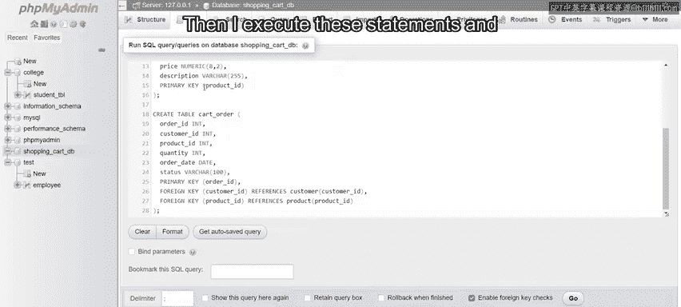
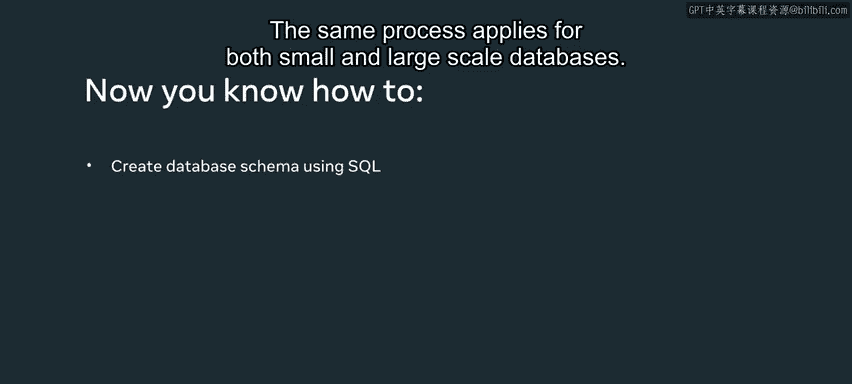

# 34：模式应用 🛒

在本节课中，我们将学习如何使用SQL创建一个简单的数据库模式。我们将通过构建一个包含三个表的购物车数据库模式来完成这个任务。

## 创建数据库

首先，我们需要创建一个新的数据库。我们将其命名为 `ShoppingCartDB`。

以下是创建数据库的SQL语句：
```sql
CREATE DATABASE ShoppingCartDB;
```
执行这条语句后，`ShoppingCartDB` 数据库将出现在左侧的资源管理器中。

## 创建数据表

现在，我们可以在新创建的数据库中创建所需的表。我们将创建三个表：`customer`、`product` 和 `cart_order`。

### 客户表

首先，我们创建 `customer` 表，它用于存储每位客户的以下信息：客户ID、姓名、地址、电子邮件和电话号码。

以下是创建客户表的SQL语句：
```sql
CREATE TABLE customer (
    customer_id INT PRIMARY KEY,
    name VARCHAR(100),
    address VARCHAR(255),
    email VARCHAR(100),
    phone VARCHAR(10)
);
```
在这条语句中，`customer_id` 的数据类型是整数，并被指定为 **主键**。其他字段均为可变字符类型，并设置了相应的字符长度限制。

### 产品表

接下来，我们创建 `product` 表，它用于存储产品ID、名称、价格和描述信息。

以下是创建产品表的SQL语句：
```sql
CREATE TABLE product (
    product_id INT PRIMARY KEY,
    name VARCHAR(100),
    price NUMERIC(8, 2),
    description VARCHAR(255)
);
```
这里，`product_id` 是整数类型的主键。`price` 字段使用了 `NUMERIC(8,2)` 类型，表示总共8位数，其中2位是小数。

### 购物车订单表

最后，我们创建 `cart_order` 表，它用于存储订单ID、客户ID、产品ID、数量、订单日期和状态。

以下是创建购物车订单表的SQL语句：
```sql
CREATE TABLE cart_order (
    order_id INT PRIMARY KEY,
    customer_id INT,
    product_id INT,
    quantity INT,
    order_date DATE,
    status VARCHAR(100)
);
```
`order_id` 被设置为此表的主键。然而，这个表引入了新的概念：**外键**。

## 理解主键与外键

在继续之前，让我们快速了解一下主键和外键是什么。

你可能已经注意到，`cart_order` 表中包含了 `customer_id` 和 `product_id` 字段，这两个字段也出现在另外两个表中。这是因为 `cart_order` 表中的这些字段直接链接到对应表中的相同字段。

为了建立这种关系，每个表必须包含一个**主键**。引用表则使用**外键**来指向外部源表（即被引用的表）。我们将在后续课程中更详细地学习主键和外键。

现在，让我们回到购物车数据库的例子。所有主键已经设置完毕，接下来需要为 `cart_order` 表设置外键。

## 添加外键约束

以下是添加外键约束的SQL语句：
```sql
-- 添加指向客户表的外键
ALTER TABLE cart_order
ADD FOREIGN KEY (customer_id) REFERENCES customer(customer_id);

-- 添加指向产品表的外键
ALTER TABLE cart_order
ADD FOREIGN KEY (product_id) REFERENCES product(product_id);
```
第一条语句创建了一个外键，将 `cart_order` 表的 `customer_id` 列链接到 `customer` 表的 `customer_id` 主键。
第二条语句类似，将 `cart_order` 表的 `product_id` 列链接到 `product` 表的 `product_id` 主键。



执行这些语句后，这些表将嵌套显示在左侧资源管理器的 `ShoppingCartDB` 数据库下方。

## 总结



本节课中，我们一起学习了使用SQL创建简单数据库模式的步骤。我们创建了一个名为 `ShoppingCartDB` 的数据库，并在其中定义了 `customer`、`product` 和 `cart_order` 三个表。我们了解了如何为表设置主键以唯一标识每条记录，以及如何使用外键在不同的表之间建立关系。这个过程对于创建小型或大型数据库都是适用的核心方法。