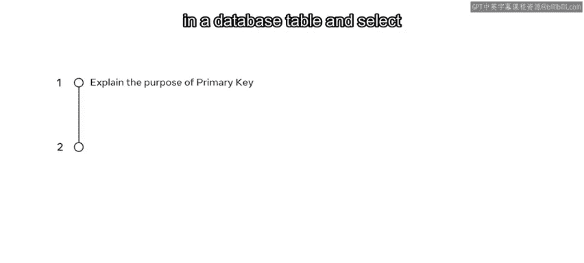
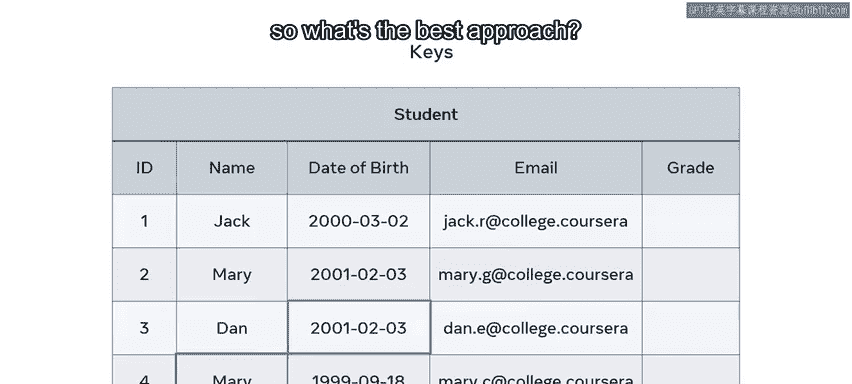
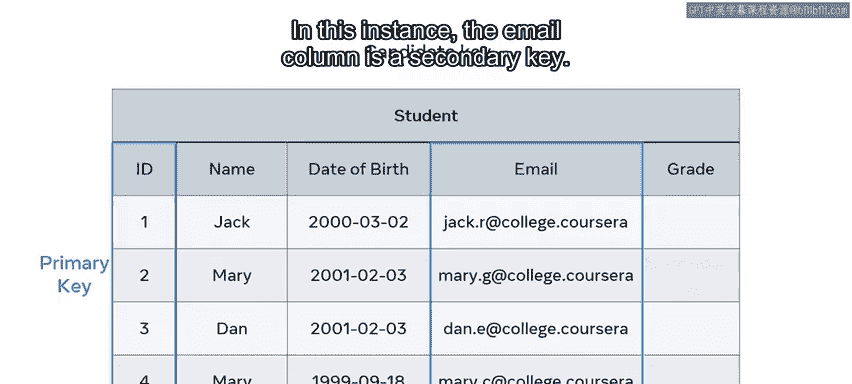
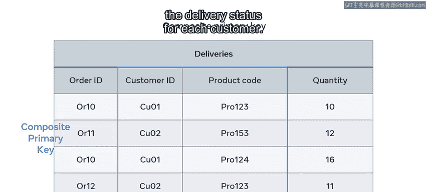

# 入门 37：主键 🔑

在本节课中，我们将要学习主键在数据库中的作用。你将了解如何为数据库表选择合适的主键，包括单列主键和复合主键，并理解它们在不同场景下的应用。

## 查询特定记录的挑战

到目前为止，你可能已经熟悉了在数据库表中查询值或记录。但如果表中的数据存在重复，你该如何查询特定的记录和值呢？

当遇到此类障碍时，你可以使用“键”作为解决方案。

## 主键的作用

在本课程中，你可能已经遇到过几个主键的例子。在这些例子中，主键被用作唯一标识一条记录并防止重复的方法。

让我们以一个学生表为例，该表包含五个属性：`ID`、`name`、`date of birth`、`email` 和 `grade`。我们如何识别特定的学生来录入其成绩呢？

例如，第二行名为 Mary 的学生。你需要做的就是找到 Mary 的唯一 `ID` 来标识她的数据记录。

然而，在这个例子中，你不能使用学生姓名列，因为表中有两个学生都叫 Mary。你也不能使用出生日期列，因为另一个叫 Dan 的学生与 Mary 的生日相同。

这些记录对 Mary 而言都不是唯一的，那么最佳方法是什么？

## 候选键与主键的选择

解决方案是定位一个“候选键”。这是一个对表中每一行都唯一的属性，并且它不能有空值，换句话说，它不能为空。

在这个例子中，有两个可能的候选键：`student ID` 和 `student email`。两列都包含每个学生的唯一值。因此，任何一列都可以被用作主键。

让我们将 `student ID` 指定为主键。未被选为主键的那一列则成为“备用键”或“次键”。在这个例子中，`email` 列就是次键。

## 复合主键的应用

但是，如果你在表中找不到唯一的列怎么办？也许所有行都有重复的值。在这种情况下，你可以创建一个“复合主键”。

这种键是两个或更多属性的组合。

让我们以一个在线商店的配送部门为例。他们有一个配送表，用于跟踪客户的配送订单。然而，表中没有哪一列在每一行都有唯一值。因此，没有哪一列可以被视为主键。

在这种情况下，最佳方法是将 `customer ID` 和 `product code` 列组合起来，为每条特定的数据记录创建一个唯一值。通过这两列，你可以确定哪位客户订购了哪种产品。因此，这两列共同构成了复合主键。这个键可以用来跟踪每位客户的配送状态。

## 总结

本节课中，我们一起学习了单列主键和复合主键。你现在应该能够识别在何种情况下使用哪一种主键最为合适。