# 40：什么是数据库规范化 📊

在本节课中，我们将要学习数据库规范化的概念。规范化是数据库设计中的一个核心过程，它通过优化表的结构来解决数据冗余、更新复杂和查询困难等问题。我们将通过一个具体的例子来理解什么是插入异常、更新异常和删除异常，并了解规范化如何帮助我们解决这些问题。

## 规范化简介

上一节我们介绍了创建数据库表的基本过程。本节中我们来看看，当表设计不当时会遇到哪些问题，以及如何通过规范化来解决。

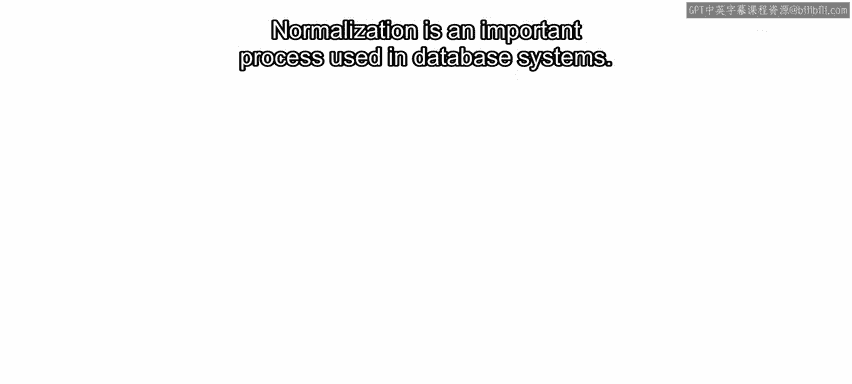

规范化是数据库系统中使用的一个重要过程。它通过减少数据重复、避免数据修改的连锁影响以及简化数据查询，来构建表结构，从而最小化各种挑战。

**公式表示规范化的目标：**
`规范化 = 减少数据冗余 + 避免更新异常 + 简化查询操作`

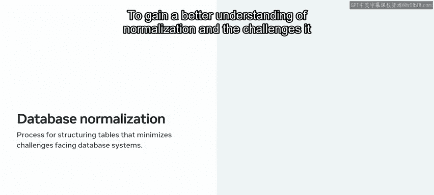

为了更好地理解规范化及其解决的问题，让我们先探索一个未规范化的表例子。

## 未规范化表示例

在这个例子中，我将使用一个大学选课表。😊 这个表有多个用途：它提供了大学生、课程和院系的列表，并概述了学生、课程和院系之间的关系或关联，还包含了每个院系负责人的姓名和联系方式。

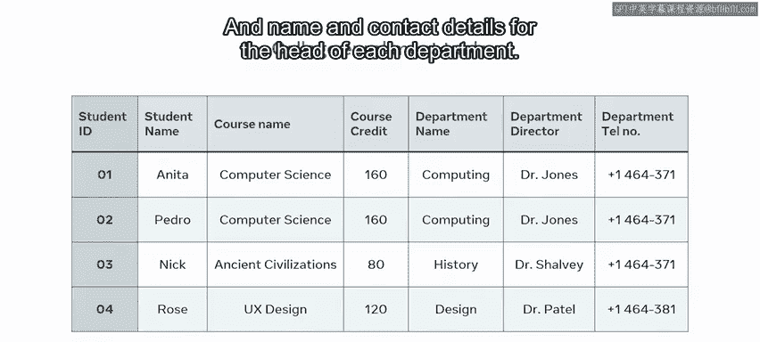

创建这种服务于多个目的的表会给数据库系统带来严重的挑战和问题。最常见的挑战包括插入异常、更新异常和删除异常。

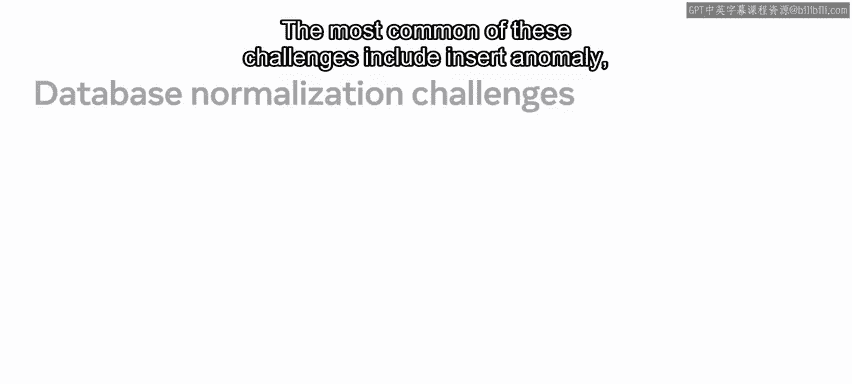

以下是这三种异常的简要介绍：

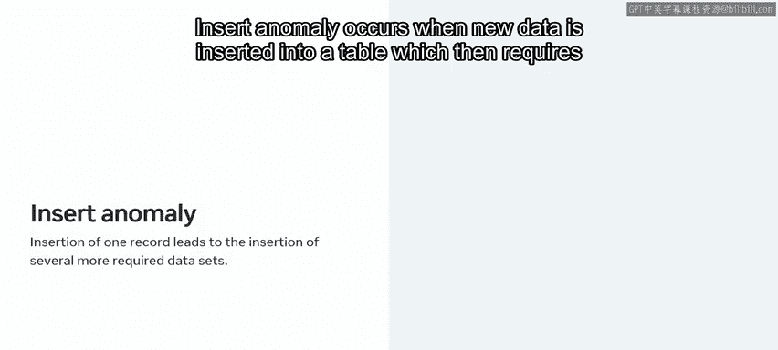

*   **插入异常**：当向表中插入新数据时，需要同时插入额外的、可能不相关的数据。
*   **更新异常**：更新表中的一条记录时，发现需要在表的多个地方进行相同的更新。
*   **删除异常**：删除一条数据记录时，会导致数据库中其他所需的数据集也被意外删除。

## 深入理解异常

现在，让我们逐一详细探讨这些异常。


### 插入异常

插入异常发生在向表中插入新数据时，需要同时插入额外的数据。

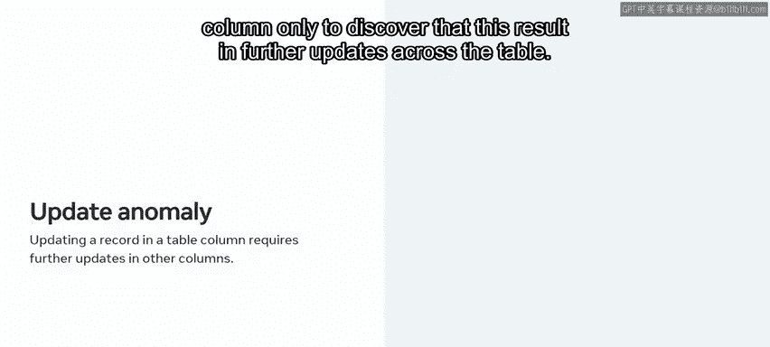

我将使用大学选课表来演示一个例子。在选课表中，`学生ID`列是主键。在可以向表中其他列添加新记录之前，主键列中的每个字段都必须包含数据。

例如，我可以在表中输入一个新的课程名称，但在没有招收新学生并为其分配ID之前，我无法添加任何新记录。而`ID`列不能包含空字段。因此，除非我插入新的学生数据，否则无法插入新课程。这就遇到了插入异常问题。

**代码示例说明主键约束：**
```sql
-- 假设 StudentID 是主键，不能为 NULL
INSERT INTO CollegeEnrollment (CourseName, Department) VALUES ('新课程', '新院系');
-- 上述操作会失败，因为未提供 StudentID
```

### 更新异常

更新异常发生在你尝试更新表列中的一条记录时，却发现这会导致表中多处需要进行更新。

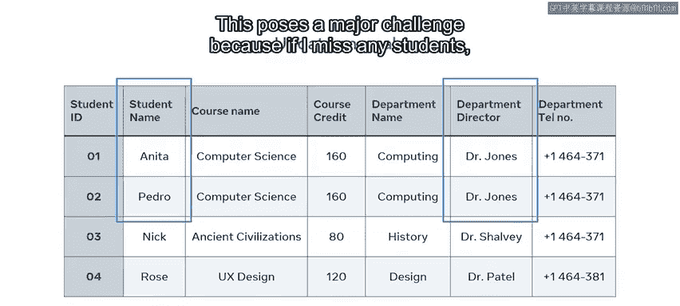

让我们再次回到大学选课表，以理解更新异常是如何发生的。在选课表中，课程和院系信息为选修该课程的每个学生重复或复制。这种重复增加了数据库存储量，并使数据变更的维护变得更加困难。

我通过一个场景来演示：计算系的主任琼斯博士离职，由另一位主任接替。现在，我需要用新主任的名字更新表中所有出现琼斯博士的地方。我还需要更新该系所有注册学生的记录。这带来了重大挑战，因为如果我漏掉任何学生，那么表中就会包含不准确或不一致的信息。这就是更新异常问题的典型例子。

### 删除异常

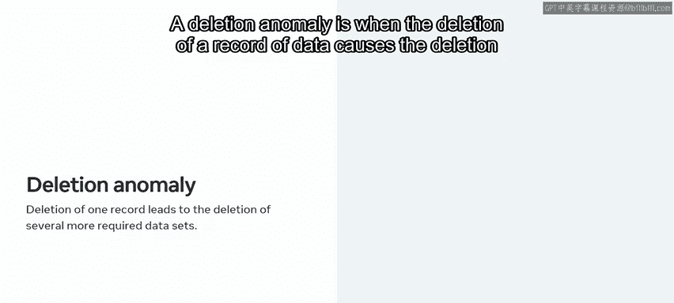

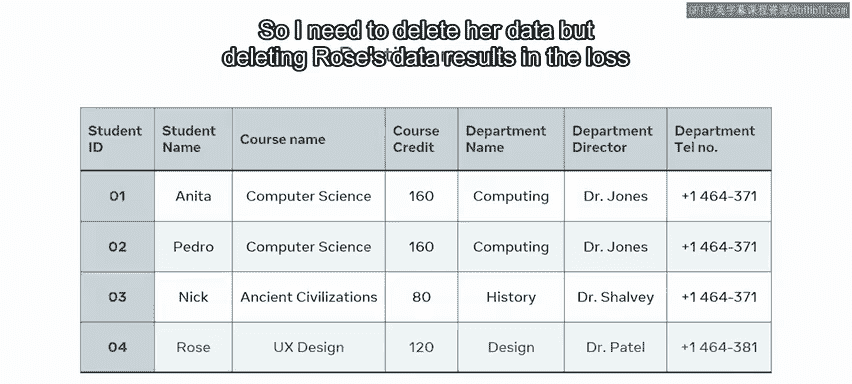

删除异常是指删除一条数据记录时，会导致数据库中多组所需的数据被删除。

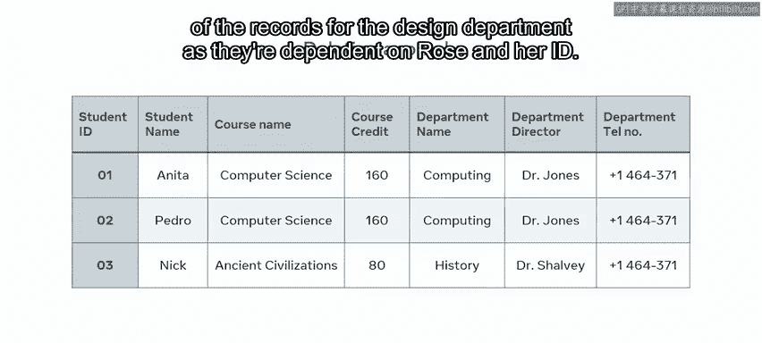

例如，ID为4的学生罗斯决定退课。所以我需要删除她的数据。但是，删除罗斯的数据会导致设计院的记录丢失，因为这些记录依赖于她的ID。这就是删除异常问题的一个例子。删除一个数据记录实例会导致其他记录被删除。

## 解决方案：数据库规范化

那么，如何解决这些问题呢？正如你之前学到的，答案在于数据库规范化。规范化通过为每个表创建单一用途来优化数据库设计。

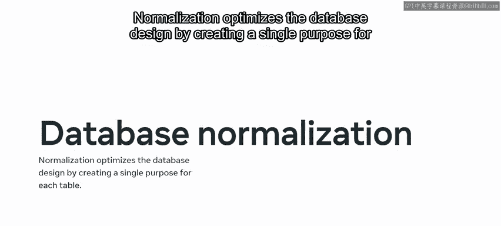

为了规范化大学选课表，我需要重新设计它。正如你之前发现的，该表当前的设计服务于三个不同的目的。因此，解决方案是将该表一分为三，实质上为每个目的创建一个单独的表。

这意味着我现在有了：
1.  一个包含每个学生信息的学生表。
2.  一个包含每门课程记录的课程表。
3.  一个包含每个院系信息的院系表。

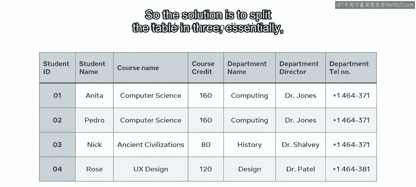

😊

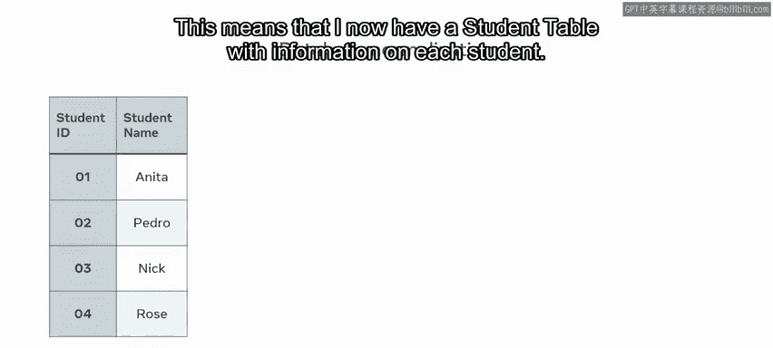

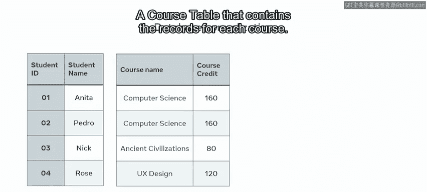

这种信息的分离有助于修复异常挑战，也使编写SQL查询以搜索、排序和分析数据变得更加容易。

## 总结

本节课中我们一起学习了数据库规范化的核心概念。我们了解到，不当的表设计会导致插入异常、更新异常和删除异常。规范化通过将具有多重功能的表拆分为多个单一用途的表，有效地解决了这些问题，从而确保了数据的一致性、完整性和查询效率。记住，规范化的目标是**减少冗余**、**防止异常**和**简化操作**。