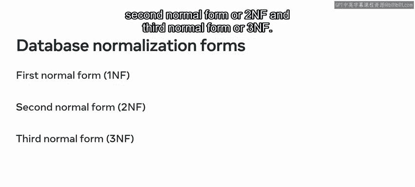
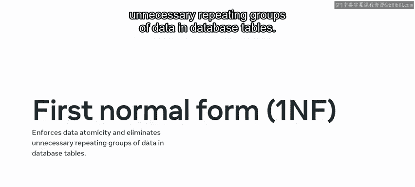
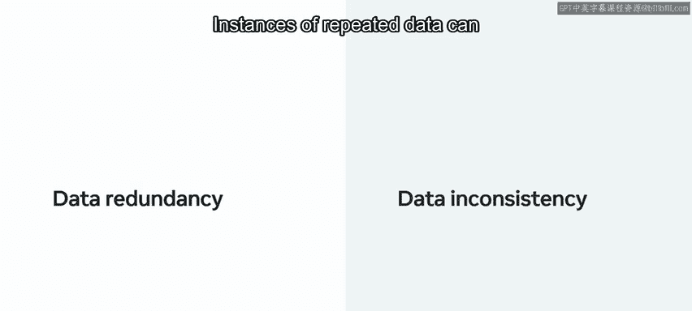
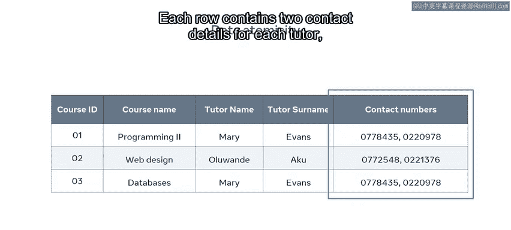
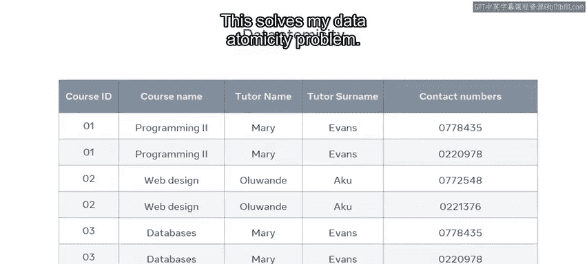
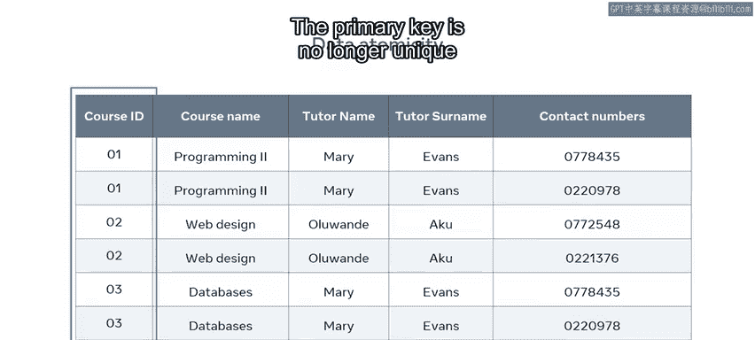
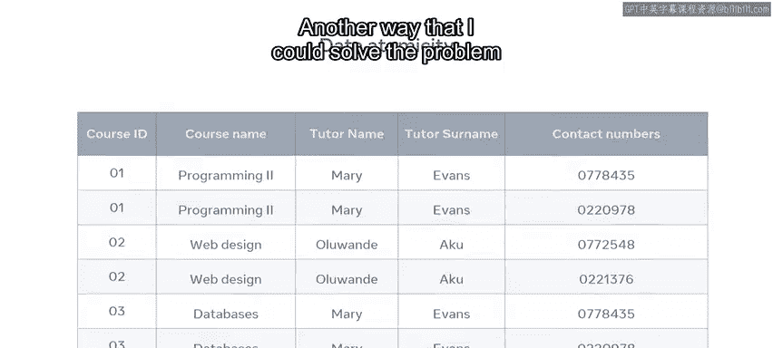
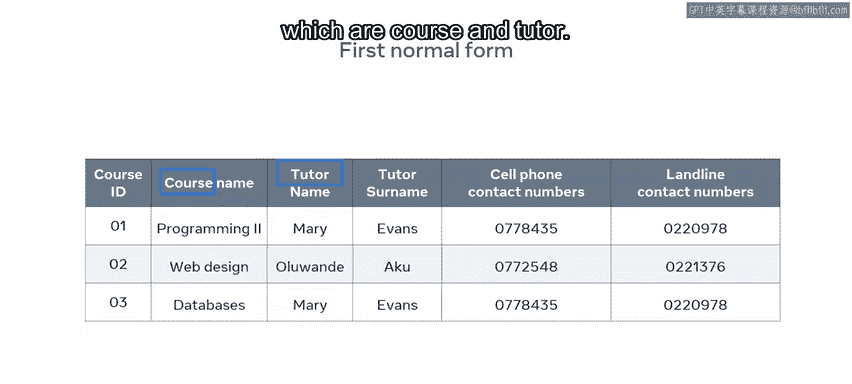
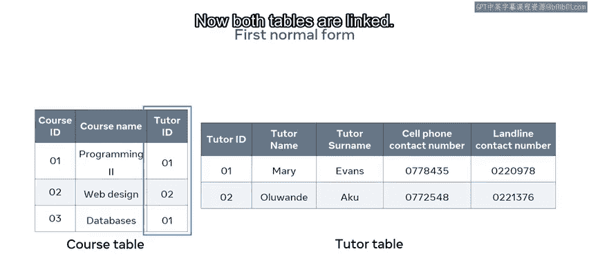

# 入门 41：第一范式(1NF) 🗂️

在本节课中，我们将学习数据库设计中的一个核心概念——第一范式。你将了解如何通过遵循原子性规则和消除重复数据组，来设计符合第一范式的数据库表，从而解决数据冗余和不一致的问题。

## 第一范式简介

作为数据库工程师，你经常会遇到表中某些列充满了重复数据或多个值的情况。这会使数据的查看、搜索和排序变得相当困难。然而，通过正确地实施规范化，可以应对这一挑战。

在本视频结束时，你将能够：
*   演示如何设计符合第一范式的数据库。
*   识别原子性规则及其执行方法。
*   分析消除数据集中重复数据组问题的有效方法。

## 规范化与第一范式

正如你可能从本课程之前的视频中了解到的，规范化过程使工程师执行基本数据库任务变得更简单、更高效。它对于帮助修复众所周知的插入、删除和更新异常尤其有用。

然而，为了实现数据库规范化，你首先需要完成三个基本的规范化形式。数据库规范化形式包括：
*   第一范式
*   第二范式
*   第三范式

本节视频重点介绍如何设计符合第一范式规则的数据库。这些规则强制执行数据原子性，并消除数据库表中不必要的重复数据组。

## 第一范式的核心规则

第一范式主要包含两条核心规则：

**1. 数据原子性**
数据原子性意味着表的任何字段中，列属性必须只有一个单一的实例值。换句话说，你的表中每个字段应该只包含一个值。

**2. 消除重复数据组**
通过消除重复的数据组，可以避免在数据库中不必要地重复数据。重复数据的实例会导致数据冗余和不一致。

为了更好地理解这一点，让我们来探索一个例子。

## 案例分析：违反原子性的表

为了演示数据原子性，我在一个学院数据库中构建了一个名为 `CourseTable` 的非规范化表。它包含了学院计算课程的信息，以及课程导师的姓名和联系方式。`CourseID` 列是表的主键。

然而，在 `ContactNumber` 列的每一行中都有多个值。每一行包含每位导师的两个联系方式：一个手机号码和一个座机号码。

这个表不符合第一范式。它在一个字段中包含多个值，违反了原子性规则。

## 初步尝试与问题

我可以尝试为每个号码创建新行来修复这个问题，这解决了我的数据原子性问题。

表现在每个字段中只有一个值，但这个解决方案也带来了另一个问题。😊

主键不再唯一，因为现在多行具有相同的课程ID。

## 另一种尝试及其局限性

另一种在保留主键的同时解决原子性问题的方法，是为联系方式创建两个列。

一个列用于手机，第二个列用于座机号码。

但我仍然有不必要的重复数据组问题。Mary Evans 是两门课程的指定导师，因此她的姓名在表中出现了两次，她的联系方式也是如此。如果她被分配教授更多课程，这些数据实例将继续重复出现。并且我们的详细信息很可能出现在数据库系统中的其他表中。这意味着我可能会有更多的重复数据组。

这带来了另一个问题：如果这位导师更改了任何详细信息，那么我将不得不更新此表以及出现该信息的其他所有表中的详细信息。如果我遗漏了其中任何一个表，那么我的数据库系统中就会出现不一致和无效的数据。😊

## 符合第一范式的解决方案

为了解决这个问题，我可以重新设计我的表以符合第一范式。

以下是实现步骤：

**第一步：识别重复数据组**
在本例中，重复数据组是导师的姓名和联系方式。

**第二步：识别涉及的实体**
我处理的实体是课程和导师。

**第三步：拆分表**
然后我拆分课程表，现在每个实体都有一个表。
*   一个 `Course` 表，包含课程信息。
*   一个 `Tutor` 表，维护每位导师的姓名和联系方式。

**第四步：分配主键和外键**
现在我需要为 `Tutor` 表分配一个主键，所以我选择 `TutorID` 列。我已经解决了数据原子性问题。但我还需要在两个表之间建立联系。

我可以通过使用外键来连接两个表。我只需将 `TutorID` 列添加到 `Course` 表中，现在两个表就链接起来了。

## 最终成果

我现在已经实现了数据原子性，并消除了不必要的重复数据组。

## 总结

本节课中，我们一起学习了第一范式。你现在应该熟悉了第一范式以及为避免违反它而应应用的规则。通过确保每个字段的原子性和消除重复数据组，我们可以设计出更高效、更一致且易于维护的数据库结构。干得好！