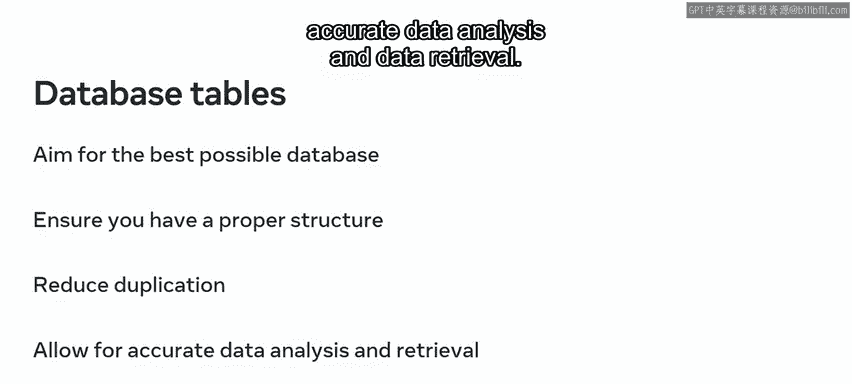
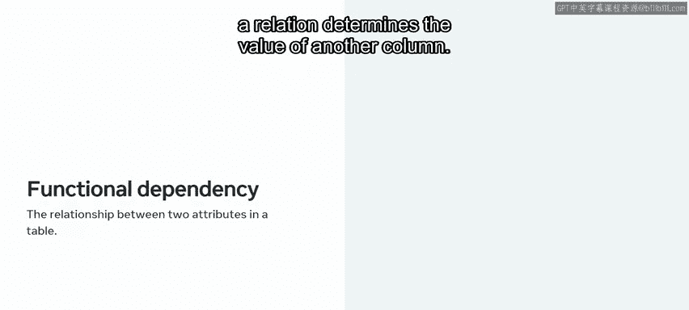
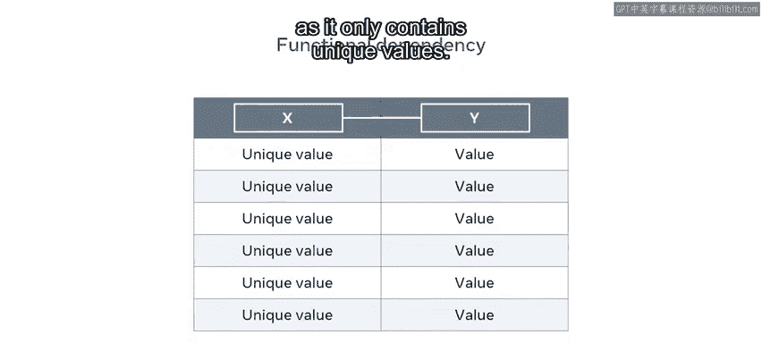
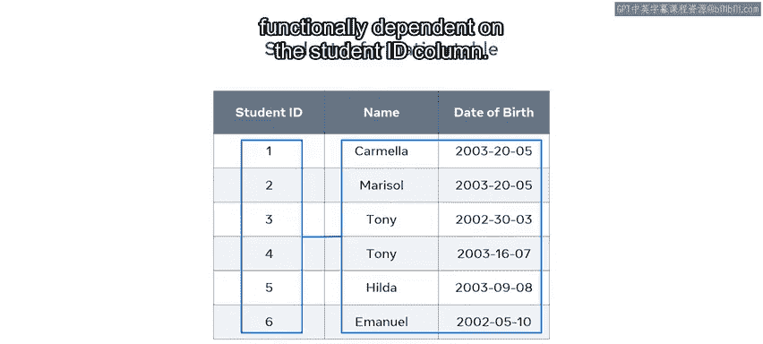
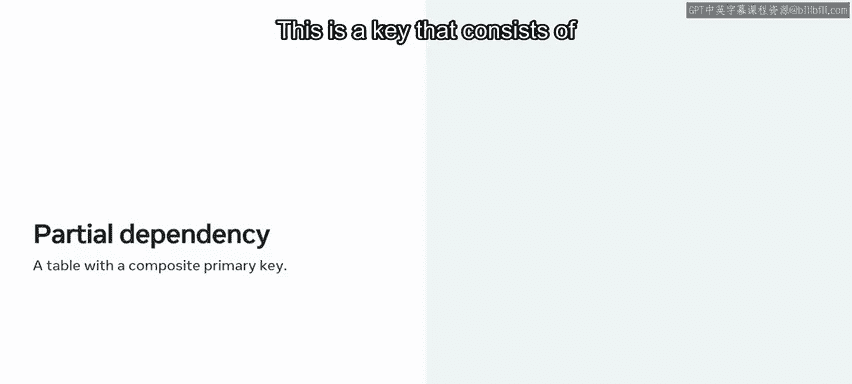
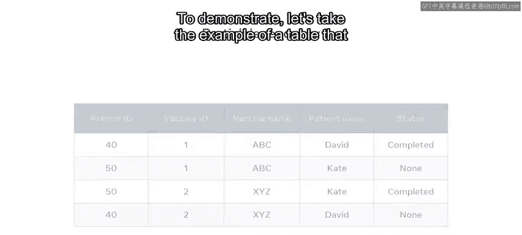
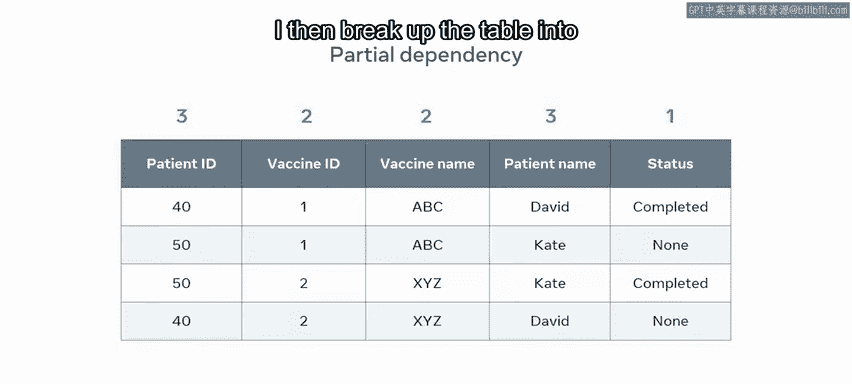
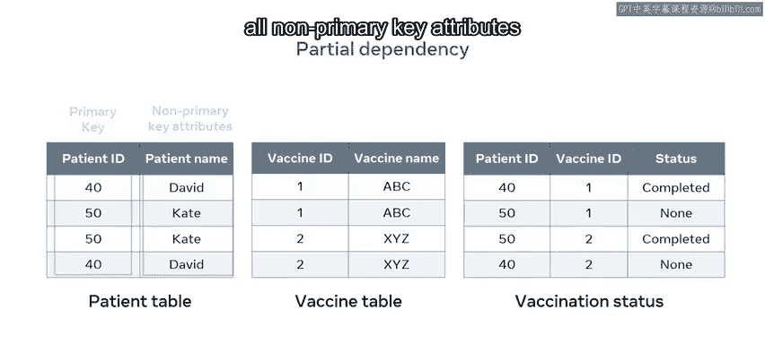
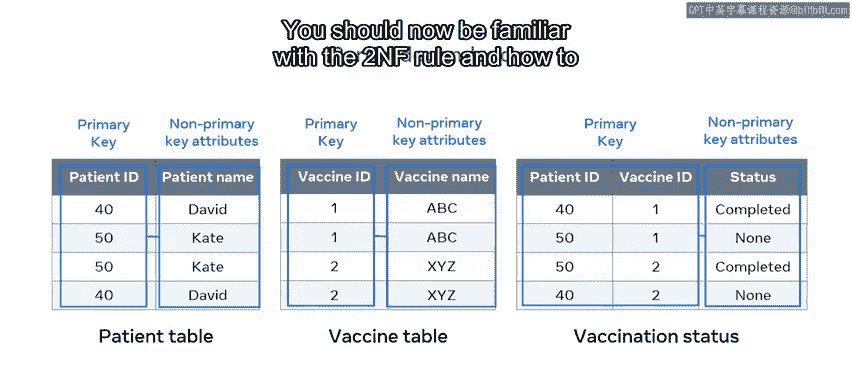

# 42：第二范式 (2NF) 🗂️

在本节课中，我们将学习数据库设计中的第二范式。我们将探讨如何通过规范化设计来减少数据冗余，并理解功能依赖和部分依赖这两个核心概念。

上一节我们介绍了第一范式，数据库规范化是一个渐进的过程。本节中，我们来看看如何将数据库设计提升到第二范式。

## 概述

作为数据库工程师，你经常会遇到表中某些列充满了重复数据或多个值的情况。这会使数据的查看、搜索和排序变得相当困难。然而，通过正确实施规范化，可以应对这一挑战。在本视频结束时，你将能够解释如何设计一个符合第二范式的数据库，概述功能依赖的概念，并定义部分依赖的概念。

在开始之前，请确保你已经观看了关于第一范式的视频。数据库规范化是一个渐进的过程，因此你必须熟悉第一范式，才能实施第二范式。

那么，为什么数据库开发者需要数据库规范化？如果你要存储内容，你的目标应该是拥有尽可能最佳的数据库。

“最佳”意味着它具有适当的结构，可以减少重复，并最终为准确的数据分析和数据检索提供支持。

为了获得最佳结果，工程师会以优化数据库结构的方式来构建表。本视频重点介绍如何在关系数据库中设计表以满足第二范式的标准。但在学习如何做到这一点之前，你需要理解功能依赖和部分依赖这两个术语的含义。

## 功能依赖

功能依赖指的是表中两个属性之间的关系。关系中某一列的唯一值决定了另一列的值。

为了演示这个概念，我们以名为 `R` 的表为例。该表包含两列，分别称为 `X` 和 `Y`。`X` 是一列具有一组唯一值的列，这些值在表中其他地方没有重复，例如主键。`Y` 是一列没有唯一值集合的列，例如非主键。`R` 是包含列 `X` 和 `Y` 的表或关系。`Y` 作为具有重复值的非主键，依赖于 `X`；这是因为 `X` 是表的主键，因为它只包含唯一值。

如果你还不完全理解这个概念，请不要担心。我将更详细地演示功能依赖。

我们以名为 `Student` 的表为例，该表保存了学院学生的关键信息。该表包含三列：学生ID列、姓名列和出生日期列。我需要使用此表来查找特定学生的出生日期。我不能使用姓名列，因为它有重复值。有两个名叫 Tony 的学生。如果我查询此列，只会收到两个 Tony 的实例。我也不能使用出生日期列，因为有两个学生共享相同的出生日期。但我可以通过使用学生ID列来完成此任务。此列中的所有值都是唯一的，因此它被指定为表的主键。并且这个主键列的值决定了其他列的信息。这意味着表中的每一列在功能上都依赖于学生ID列。

它是唯一可用于返回特定数据的列。

现在你已经探索了功能依赖的概念，让我们看看部分依赖。

## 部分依赖

部分依赖指的是具有复合主键的表。复合主键是由两列或更多列组合而成的键。

为了演示，我们以显示医院数据库中患者疫苗接种状态的表为例。

该表显示了两名患者 David 和 Kate 的疫苗接种状态。它还显示了患者ID、疫苗ID和疫苗名称。没有哪一列在每一行中都有唯一值，因此没有哪一列可以作为主键。因此，最好将患者ID和疫苗ID列组合为复合主键，以在每个记录中创建唯一值。

疫苗接种表必须满足第二范式。因此，所有非键属性（疫苗名称、患者姓名和状态）必须依赖于整个主键值（即患者ID和疫苗ID）。它不能只依赖于部分值，否则就会产生部分依赖。让我们应用此规则来检查它是否对每个非键列都成立。

那么，我如何检查ID为50的患者是否接种了疫苗1？我检查患者ID和疫苗ID键的值。组合值是返回特定患者疫苗接种状态值的唯一方式，这意味着状态值和主键值之间存在功能依赖关系。

但是，如果我只想找出疫苗名称，那么我不需要两个组合值，我返回疫苗名称所需的唯一信息是疫苗ID。正如你之前学到的，这称为部分依赖。在大多数情况下应避免这种情况，因为它违反了第二范式的规则。

同样，如果我想识别患者姓名，我不需要两个组合值，我只需使用患者ID即可返回患者姓名。

接下来，让我们看看如何将此表升级到第二范式。

## 升级到第二范式

首先，我需要使所有非键列都依赖于主键的所有组成部分。因此，我识别疫苗接种表中包含的实体。在本例中，有三个实体：疫苗接种状态（由状态列表示）、疫苗（由疫苗ID和疫苗名称列表示）以及患者（由患者姓名和患者ID列表示）。

然后，我将表分解为三个独立的表，如下所示：患者表、疫苗表和疫苗接种状态表。

现在，在这些新表中，所有非主键属性仅依赖于主键值。

我已经消除了疫苗接种表中疫苗和患者姓名所有不必要的重复。这三个表现在处于第二范式。

## 总结

本节课中，我们一起学习了第二范式的规则以及如何将表升级到第二范式。你现在应该熟悉了功能依赖和部分依赖的概念，并掌握了通过分解表来消除部分依赖、实现第二范式的数据库设计方法。