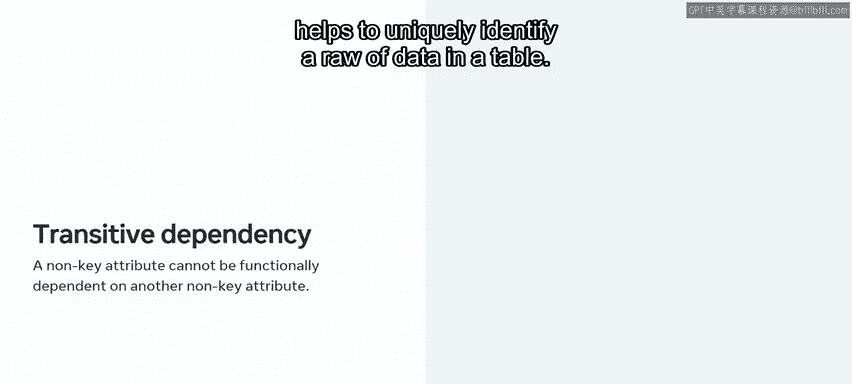
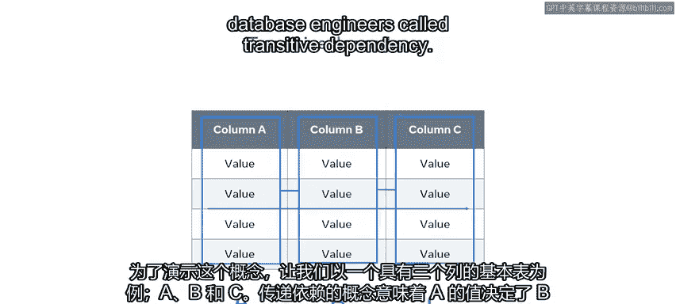
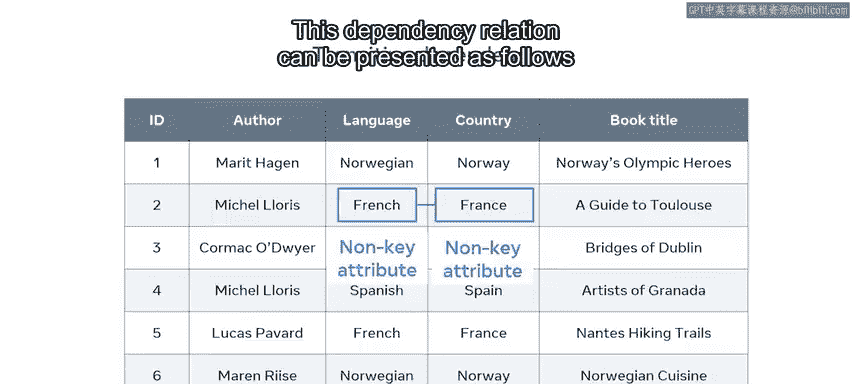
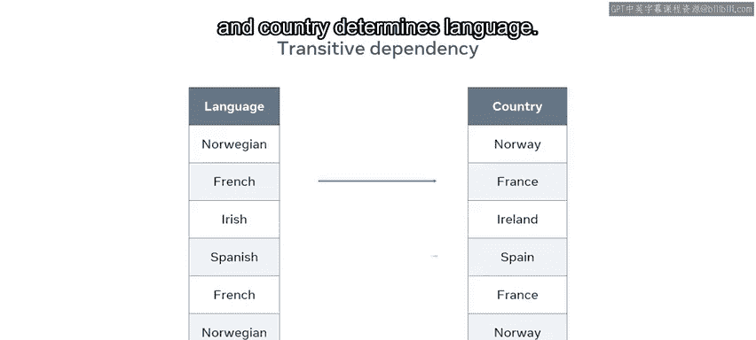
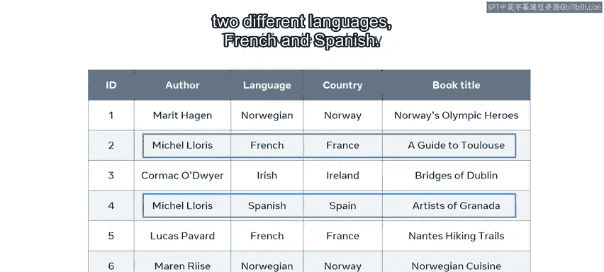
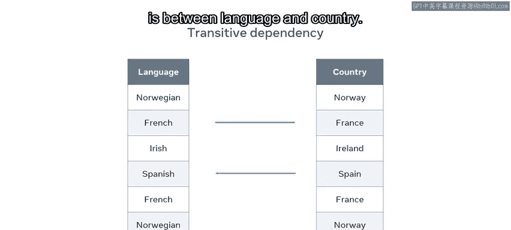
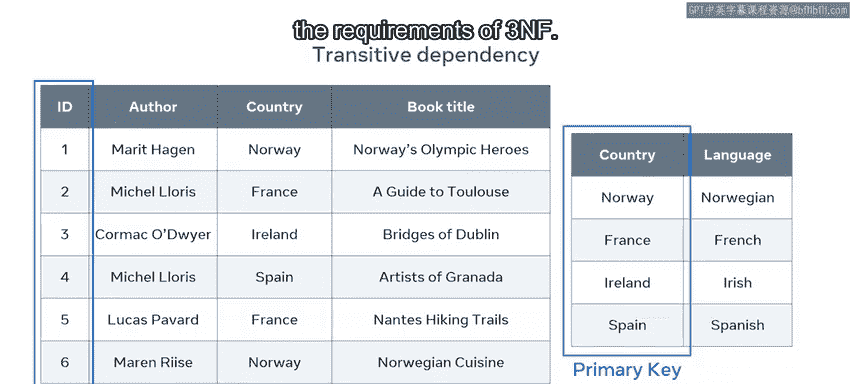

# 43：第三范式(3NF) 🗂️

在本节课中，我们将要学习数据库设计的第三范式。我们将理解什么是传递依赖，并掌握如何通过消除传递依赖来使数据库符合第三范式的要求。

上一节我们介绍了第一范式和第二范式，本节中我们来看看数据库设计的更高标准——第三范式。

## 第三范式的前提条件

一个数据库必须首先满足第一范式和第二范式，才能进入第三范式。

除了满足前两个范式的规则外，第三范式还要求数据库不能包含任何传递依赖的实例。

## 理解传递依赖 🔗

在第三范式的语境下，传递依赖意味着一个**非键属性**不能函数依赖于另一个**非键属性**。换句话说，非键属性之间不能相互依赖。

在数据库中，键属性是帮助唯一标识表中一行数据的属性。

为了演示这个概念，我们来看一个包含三列（A、B、C）的基本表格示例。

传递依赖的概念意味着A的值决定了B的值。同样，B的值决定了C的值。这些表列之间的关系可以表示为：`A -> B -> C`。这意味着A通过B决定了C。

数据库工程师将这种关系称为传递依赖。

## 一个复杂的例子 📚

让我们通过一个更复杂的例子来看看这是如何运作的。

假设我有一个来自在线书店数据库的“欧洲畅销书”表格。该表根据五个属性组织书籍：`ID`、`书名`、`作者姓名`、`作者语言`和`国家`。

在这个表中，`ID`是表中唯一存在的键或主键。所有其他属性都是非键属性。但要确定这些非键属性的值，我必须使用畅销书的`ID`。这意味着，如果我想查找任何属性的具体信息，我需要使用`ID`属性值来找到目标属性值。

例如，如果我使用`ID`为3，那么我可以定位到作者`Cormac McCarthy`、语言`英语`、国家`爱尔兰`等等。

然而，也有可能根据语言来确定国家，或者根据国家来确定语言。而国家和语言都是非键属性。例如，在欧洲的语境下，如果语言是法语，总是可以确定国家是法国，反之亦然。

这意味着我在这组关系中存在一个传递依赖：一个非键属性依赖于另一个非键属性。

这种依赖关系可以表示如下：
*   语言决定国家。
*   国家决定语言。

其余属性是正常的，因为它们只依赖于`ID`主键。例如，你不能说作者姓名决定了书名，或者作者姓名决定了语言。作者`Michelle Laurier`就用两种不同的语言（法语和西班牙语）写了两本书。

## 解决传递依赖 🛠️

正如刚才指出的，这个例子中唯一存在的传递依赖是在语言和国家之间。那么，我该如何解决表中的这个传递依赖并消除数据的重复呢？

我可以将表格拆分成两个表，同时将它们连接起来，以符合第三范式的规则。

以下是具体步骤：
1.  我保留“畅销书”表。
2.  我将`国家`和`语言`列拆分到一个名为`国家`的新表中。
3.  我同时在“畅销书”表中保留`国家`列，作为连接两个表的外键。

现在，`国家`表只包含四条记录，没有数据重复。在“畅销书”表中也不再需要`语言`列，陈述国家就足以确定语言。

最重要的是，每个表中的所有非键属性都仅由主键决定。这意味着我的表现在满足了第三范式的要求。

## 总结

本节课中我们一起学习了第三范式。你现在应该知道如何设计一个符合第三范式的数据库，并且能够解释传递依赖的概念。通过识别并消除非键属性之间的依赖关系，我们可以进一步优化数据库结构，减少数据冗余，确保数据的一致性。