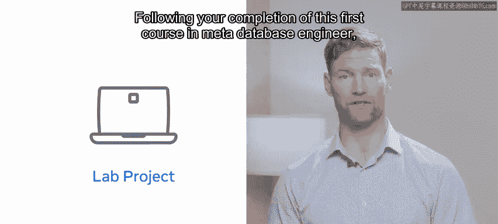
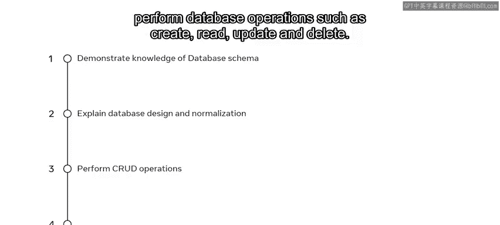
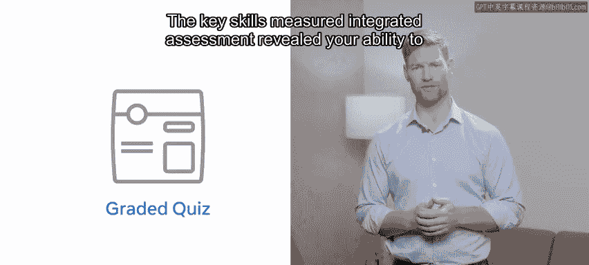
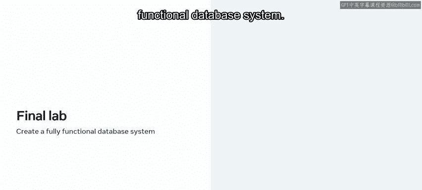
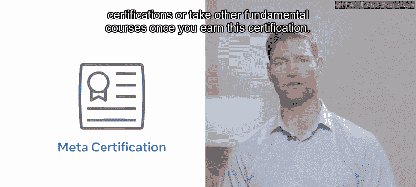

# 46：课程总结与后续步骤 🎉

在本节课中，我们将对《数据库介绍》课程进行总结，回顾已掌握的核心技能，并了解完成整个Meta数据库工程师专项认证的后续步骤与价值。

---

## 课程总结 🏁

恭喜您完成了Meta数据库工程师专项认证中的《数据库介绍》课程。您付出了辛勤努力，并在课程期间掌握了许多新技能。您的数据库学习之旅已经有了一个良好的开端，现在您应该对数据库和数据有了透彻的理解。

在项目实验环节，您通过创建和查询数据库，展示了部分学习成果以及实用的数据库技能集。

完成这门Meta数据库工程师的首门课程后，您现在应能：
*   **展示对不同数据库模式的理解。**
*   **解释关系型数据库设计和表规范化。**
*   **执行数据库操作**，例如创建、读取、更新和删除（即 **`CRUD`** 操作）。
*   **通过排序和筛选数据来演示SQL命令。**

课程的核心技能评估衡量了您以下几方面的能力：
*   展示对不同数据库模式的理解。
*   解释关系型数据库设计和表规范化。
*   执行诸如创建、读取、更新、删除等数据库操作。
*   通过排序和筛选数据来演示SQL命令。

---

## 后续步骤与展望 🚀

那么，接下来该做什么呢？

这是Meta数据库工程师专项认证的第一门课程，它为您初步介绍了几个关键领域。您可能已经意识到，还有更多知识需要学习。如果您觉得本课程有帮助并希望了解更多，何不注册学习第二门课程呢？

在每一门Meta数据库工程师课程中，您都将持续发展您的技能集。在最终的实验项目中，您将运用所学的一切知识，创建属于自己的全功能数据库系统。

无论您是刚起步的技术专业人士、学生还是业务用户，课程结束时的项目都能证明您对数据库系统价值和能力的理解。该实验项目通过实际应用来巩固您的技能。

此外，实验项目还带来另一个重要益处：它意味着您拥有了一个可以放入作品集、完全可运行的数据库。这有助于向潜在雇主展示您的技能。它不仅向雇主表明您具备自我驱动力和创新能力，也充分展现了您作为个人以及您新获得的知识。

一旦您完成了此专项认证中的所有课程，您将获得**Meta数据库工程师认证**。该认证也可作为进阶获取其他Meta认证的途径。根据您的目标，在获得此认证后，您可以选择深入学习高级的、基于角色的认证，或学习其他基础课程。

Meta认证为您的技术技能提供了全球认可且受行业背书的证明。

感谢您。很高兴能与您一同踏上这段探索之旅。祝您未来一切顺利！

---

**本节课中，我们一起学习了**《数据库介绍》课程的总结，回顾了包括数据库模式、关系设计、`CRUD`操作和SQL命令在内的核心技能，并明确了获得Meta数据库工程师认证的路径及其职业价值。