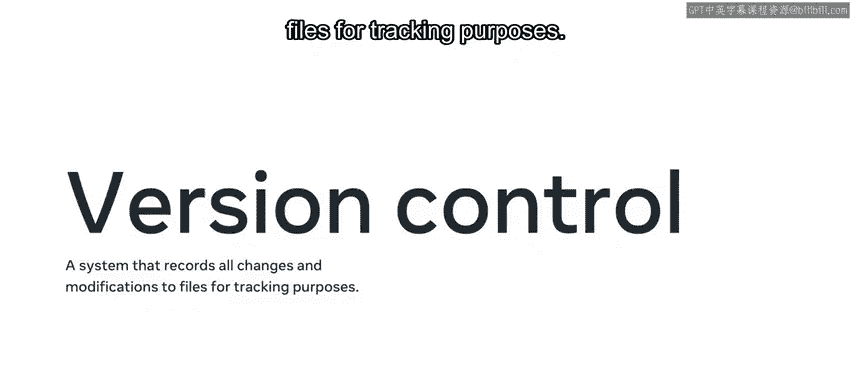
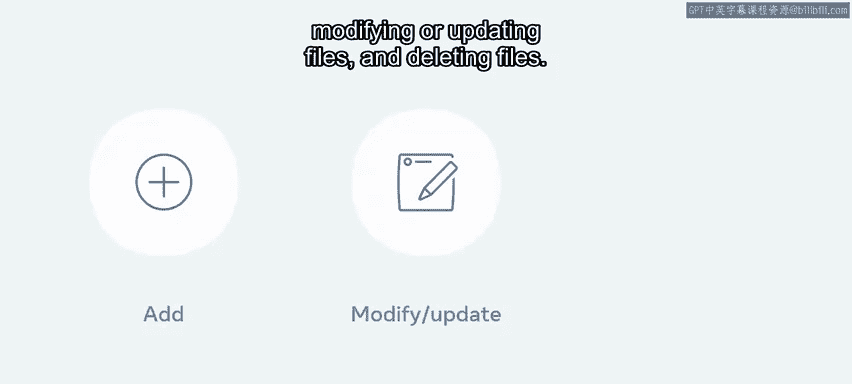
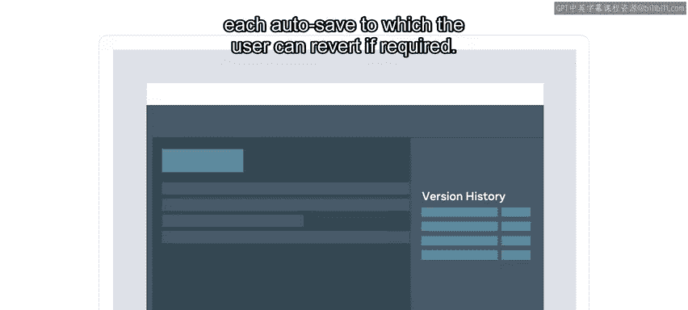

# 入门 49：什么是版本控制 📚

在本节课中，我们将要学习版本控制的核心概念、主要功能及其带来的诸多好处。版本控制是软件开发中不可或缺的工具，它帮助开发者高效地管理代码变更，并促进团队协作。

你是否曾经在编辑文档时，修改了内容，几天后又希望能回到最初的版本？你是否还记得那种希望时光倒流的感觉？对于开发者而言，这种“时光机”是存在的，它被称为版本控制。

## 版本控制的核心概念 🔍

上一节我们引出了版本控制的概念，本节中我们来看看它的具体定义和核心目标。

版本控制系统是一种为了追踪目的而记录文件所有变更和修改的系统。开发者有时也使用“源代码控制”或“源代码管理”这些术语。任何版本控制系统的主要目标都是**追踪变更**。

它通过允许开发者访问完整的变更历史来实现这一目标，开发者可以**回退**或**回滚**到之前的状态或时间点。变更的类型多种多样，例如添加新文件、修改或更新文件，以及删除文件。

版本控制系统是所有代码、资产乃至团队本身的**单一事实来源**。

## 版本控制的类比与重要性 💡

理解了基本概念后，我们通过一个熟悉的例子来加深理解，并探讨其对开发者的重要性。

让我举一个我们都熟悉的例子。在文字处理应用程序中，版本控制功能以“自动保存文档”的安全网形式提供给用户。应用程序在每次自动保存时创建一个还原点，用户可以在需要时回退到该点。

编码项目的版本控制系统往往更复杂一些，但其底层功能遵循相同的过程。作为一名开发者，你需要熟悉许多不同的工具，而版本控制就是其中之一。

对于开发者，尤其是在团队中工作的开发者，版本控制带来了许多好处。

以下是版本控制的主要优势：

*   **修订历史**：提供项目中所有变更的记录。它使开发者能够在代码编辑引发问题或错误时，有能力回退到一个稳定的时间点。回滚到特定版本或时间的能力让团队工作更快，交付代码更有信心。
*   **身份标识**：记录变更固然很好，但如果你不知道谁负责添加或更改了记录，其价值就大打折扣。所有做出的变更都会与做出更改的用户身份一同被记录。将此功能与修订历史结合，团队不仅能查看变更发生的时间，还能知道是谁做出了更改。团队还可以分析控制系统上文件的编辑、创建和删除情况。
*   **协作**：作为软件开发人员，你经常需要与团队合作以实现共同目标。这可能是在现有项目中添加新功能，或是创建全新的服务。在所有情况下，版本控制系统都允许团队提交代码，并跟踪需要进行的任何更改。版本控制系统的另一个重要方面是**同行评审**。处理任务的开发者在代码准备好接受检查时会创建一个同行评审。同行评审旨在让团队中的其他开发人员审查代码并在必要时提供反馈。
*   **自动化与效率**：大规模创建和交付代码的能力是复杂且耗时的。版本控制有助于跟踪所有变更。它在开发运维（DevOps）的普及中扮演着不可或缺的角色。DevOps 是一套实践、理念和工具，旨在提高组织高质量、高速度交付应用程序或服务的能力。版本控制是此过程中的关键工具，它不仅用于跟踪所有变更，还有助于软件质量、发布和部署。你和你的团队需要高效才能使项目成功。你和你的团队可能会使用敏捷方法论中的流程。在敏捷流程中，团队通常会计划并执行两周的工作来完成，这被称为一个迭代。每个迭代都有一份要在两周结束前完成的任务列表。这些任务在某些情况下可能很复杂，但通过使用版本控制可以得到帮助。在每个引入的任务上进行测试并建立一定程度的自动化，可以使团队更高效。这也确保了团队更有信心，任何新引入的功能都不会破坏现有的流程。

## 总结与展望 🎯

本节课中，我们一起学习了版本控制是什么。现在你已经更好地理解了版本控制的目标和好处，为开始学习如何使用它做好了准备。

版本控制是开发者工具箱中的基石，它不仅是管理代码历史的工具，更是现代团队协作和高效交付的保障。掌握它将为你的开发之旅奠定坚实的基础。