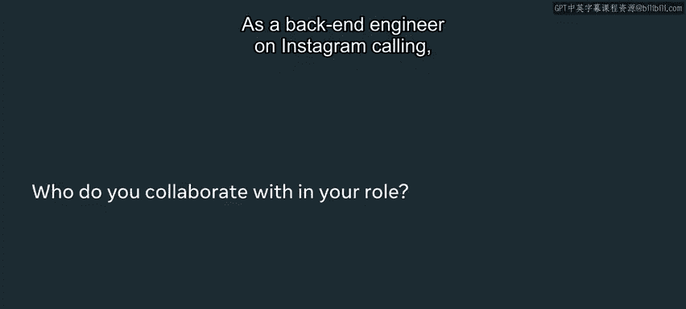
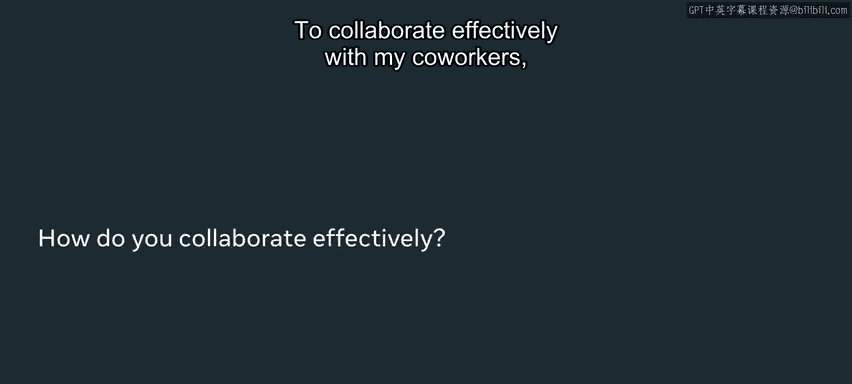
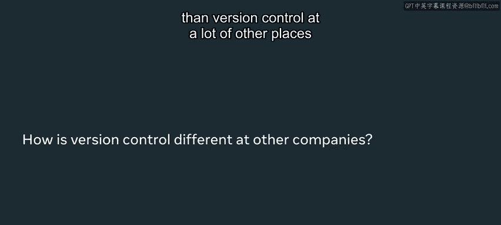
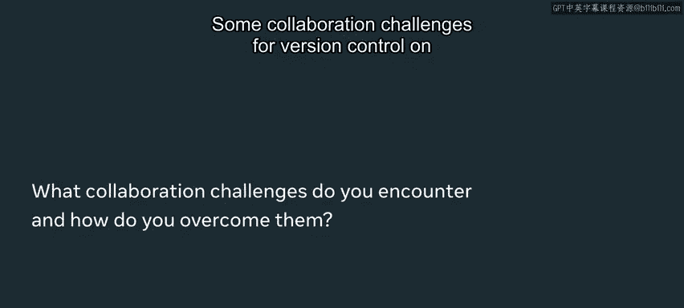
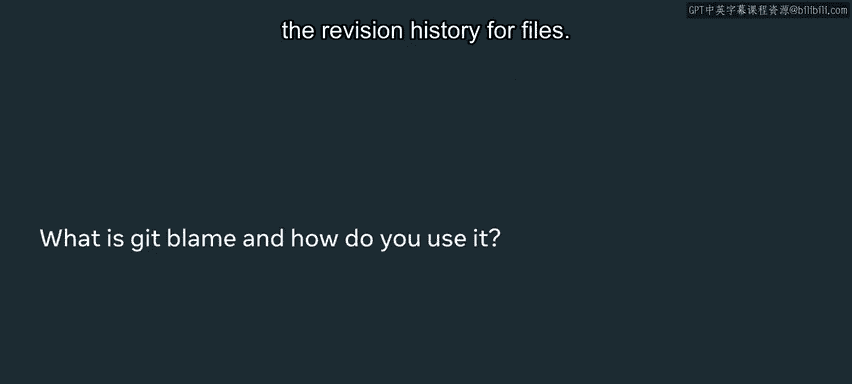
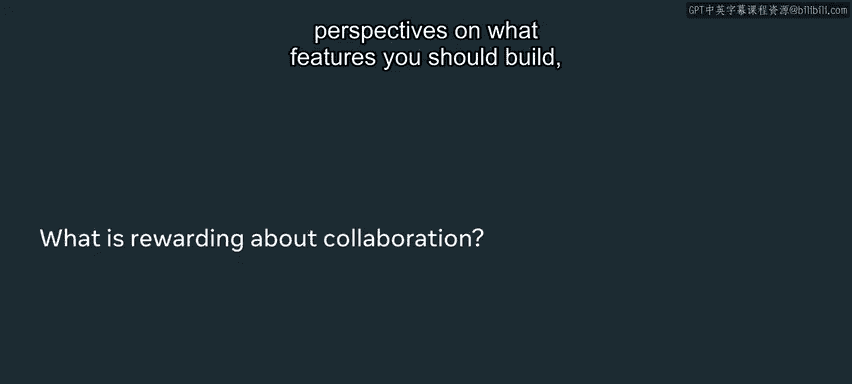

# 入门 50：案例研究 - Meta工程师如何协作 👥

在本节课中，我们将通过Meta工程师Leila Rizby的分享，了解在Meta公司内部工程师如何进行高效协作，以及版本控制（如Git）在大型项目中的独特应用和实践。这对于理解现代软件工程团队的工作方式至关重要。

## 概述

Meta公司的一个显著特点是，工程师在项目中扮演着核心驱动角色。他们负责与产品经理、数据科学家和研究人员协调，共同决定构建什么以及项目的时间线。这与许多其他公司由产品经理或领导层主导项目的方式有所不同。

## 工程师的日常协作

上一节我们介绍了工程师在Meta的核心地位，本节中我们来看看他们日常是如何进行协作的。

Leila Rizby是Instagram通话功能的后端软件工程师。在她的角色中，协作是日常工作的重要组成部分。

以下是Leila日常协作的主要对象和方式：

*   **与部门内移动工程师协作**：为了共同构建最佳产品，她需要与同部门的其他移动工程师进行日常协作。
*   **与Instagram消息团队协作**：因为通话功能与消息功能紧密相连，所以需要频繁与消息团队合作。
*   **与非工程师角色协作**：她还需要定期与产品经理、数据科学家等非工程师角色合作。

为了进行有效协作，团队会根据具体情况选择合适的沟通工具：





*   **即时消息**：当需要快速解决问题或解除阻碍时，他们会通过聊天工具互相发送消息。
*   **会议**：当某些事项需要深入讨论时，他们会安排会议。
*   **文档协作**：当需要详细规划或记录时，他们会共同在文档上协作，通过添加评论和留言进行交流。


## Meta的版本控制实践

了解了日常协作模式后，我们来看看支撑这种协作的技术基础——版本控制系统。在Meta，版本控制的使用有其独特之处。

Instagram的版本控制很有趣，因为所有后端代码都存放在一个**巨大的单体代码仓库**中。这意味着，每当Leila进行代码修改时，她所写的代码会与所有其他Instagram团队共享。

这种模式有其利弊：
*   **风险**：在某种程度上存在风险，因为改动会影响所有团队。
*   **优势**：好处是工程师可以方便地复用其他团队的代码。

Meta版本控制的另一个特点是，**任何工程师都可以审核（approve）任何代码变更**。Meta非常推崇“在Meta，没有问题是别人的问题”这一理念，这意味着工程师可以自由地参与他们想要进行的任何变更工作。

## 与其他公司版本控制策略的对比

上一节我们介绍了Meta独特的版本控制模式，本节中我们将其与其他常见模式进行对比，以加深理解。

Meta的版本控制与许多其他公司有所不同。



*   **Meta模式**：使用一个巨大的单体代码仓库，并持续发布代码。
*   **其他常见模式**：许多公司采用**微服务**架构，每个团队拥有自己独立的、更小的代码仓库。团队在自己的代码库中工作，使用分支（branch）来开发功能，最后再合并（merge）回主分支。

**代码示例：常见的分支操作**
```bash
# 创建并切换到一个新分支进行功能开发
git checkout -b feature-new-login

# 开发完成后，将分支合并回主分支（如main）
git checkout main
git merge feature-new-login
```

微服务模式对于小团队有其优点，但也存在缺点，例如可能会遇到大量的**合并冲突**。

在Meta，由于工程师数量庞大，如果每个团队都使用独立分支，将会产生难以管理的合并冲突。因此，他们采用了不同的策略来应对协作挑战。

## 应对协作与版本控制的挑战

既然Meta采用了独特的代码管理方式，那么他们如何应对由此带来的挑战呢？本节将探讨他们的解决方案。

对于Leila的团队来说，使用单体仓库的一个主要挑战是合并冲突经常发生。团队采取了一些策略来应对：



1.  **编写小型变更**：尽量使每次代码提交的改动范围较小，这样在需要时可以轻松回退。
2.  **设置守门员（Gatekeepers）**：部署到Instagram生产环境时，会添加许多“开关”，以便在出现问题时能立即关闭新功能，而无需等待漫长的回滚流程。
3.  **编写大量测试**：因为代码与Messenger通话功能共享，所以必须添加大量测试，以确保更改不会破坏Messenger的服务。



## 核心工具：Git Blame

在应对挑战的过程中，一个名为 **`git blame`** 的工具显得尤为重要。它帮助工程师理解代码历史和进行有效协作。

`git blame` 是一个用于查看文件修订历史的工具。它非常有用，例如：
*   当Leila看到一行不理解的代码时，她可以使用 `git blame` 找出是谁编写了这行代码，然后联系对方。
*   她还可以通过查看提交信息，了解作者当时试图实现什么功能。
*   当需要回退某个变更时，这个工具也能帮助她确定需要回退哪些修改。

**公式/命令表示核心功能：**
`git blame <file_name>` - 显示指定文件的每一行最后一次修改的提交信息和作者。

Leila每天都会使用这个工具。在Meta这样拥有大量工程师的公司，她经常需要联系不认识的代码作者，而 `git blame` 为她提供了直接的联系人（Point of Contact），极大地提升了协作效率。

## 总结

本节课中，我们一起学习了Meta工程师高效协作的实践。我们了解到，在Meta，工程师驱动项目，并与多方角色紧密协作。技术层面，他们采用独特的单体代码仓库模式进行版本控制，并通过编写小变更、添加“开关”和大量测试来应对挑战。工具方面，**`git blame`** 是理解代码历史和联系作者的关键。



掌握如何有效协作以及高效使用版本控制，对于在Meta取得成功至关重要。汇集关于功能构建、目标用户、需求定义或改进方向的多元化视角，非常有帮助。最终，这些努力会使你的项目和成果变得更好。