# 52：修订历史记录 📜

在本节课中，我们将要学习版本控制系统中的修订历史记录功能。你将了解开发者如何利用修订历史来追踪代码变更、解决团队协作中的冲突，并确保代码库有一个清晰、可追溯的“单一事实来源”。

---

回想一下，你是否曾因为工作被覆盖或删除而感到丢失了劳动成果。正如之前所学，版本控制和版本控制系统能帮助开发者追踪代码并与所有变更保持同步。

在本视频中，你将体会开发者如何使用版本控制来追踪变更，并在与开发团队协作时解决代码冲突。

---

## 修订历史的重要性 🔍

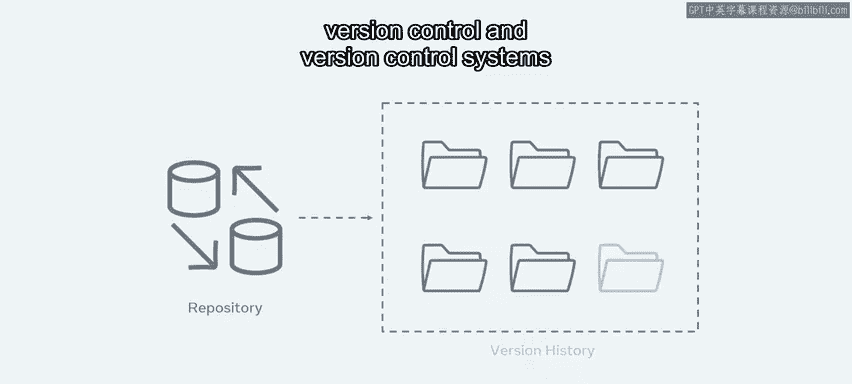

对于代码库而言，拥有一个记录所有历史变更的“单一事实来源”至关重要。版本控制系统通过提供添加到其仓库中的每个文件的完整变更历史，在这一过程中扮演着不可或缺的角色。

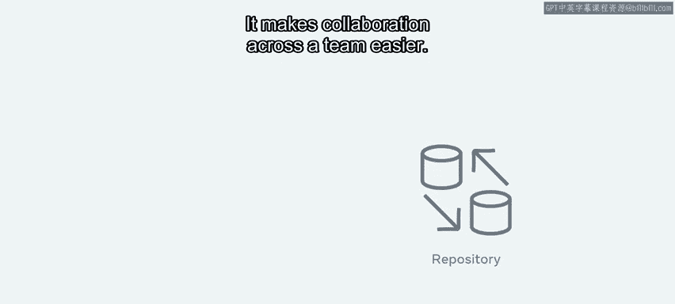

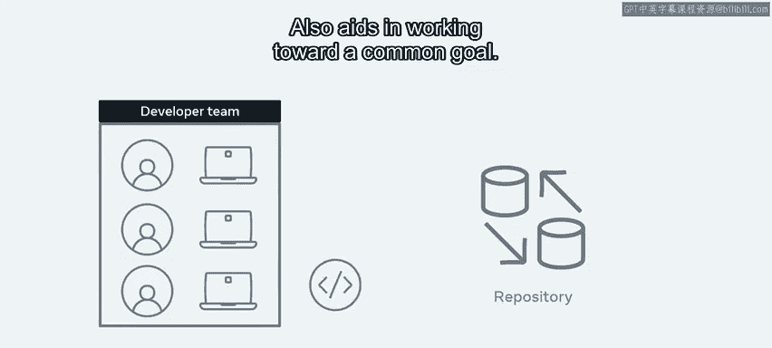

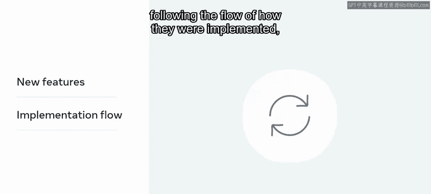

它使团队协作变得更加容易，并有助于朝着共同目标努力。无论是添加新功能并追踪其实现流程，还是发现潜在问题可能被引入的位置，能够准确 pinpoint **谁**、**何时**、**做了什么**变更都至关重要。

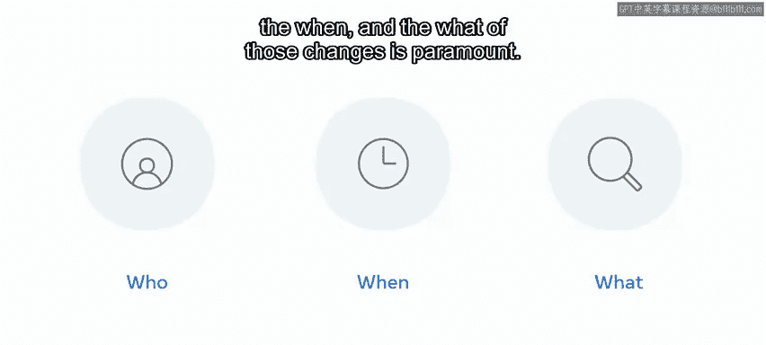

修订历史将记录这些关键数据点，因此任何开发者或团队成员都可以从头到尾浏览整个项目。项目中发生的每一次变更，都应该能通过简单命令或集成到开发者的 IDE 中轻松访问。

---

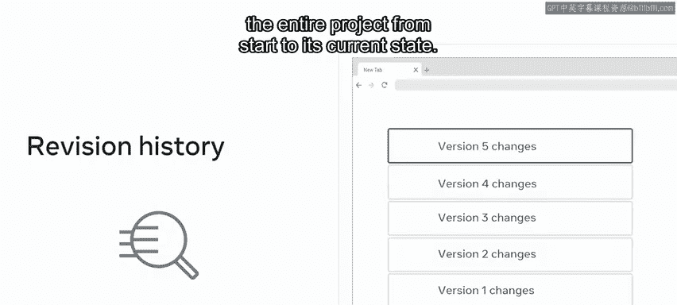

## 团队协作与沟通标准 🤝

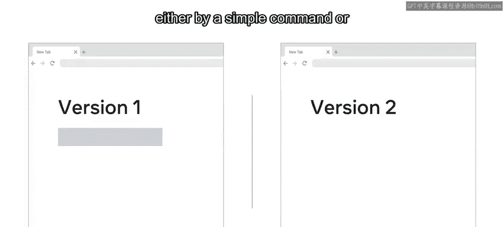

对于组织而言，定义开发者如何沟通其所作变更的标准非常重要。开发者在查看代码之前，需要了解主导开发者的目标是什么。信息越详细越好，这能创造一个更透明、更开放的强大团队环境。

---

## 实战示例：电商应用开发 🛒

现在，我将通过一个典型开发团队在电商应用上工作的例子来引导你。

假设你与另外三名开发者在一个团队中工作，目标是发布一个新功能。你的任务是创建一个新功能，以支持在网站上进行实验。这将允许市场部门测试用户行为。

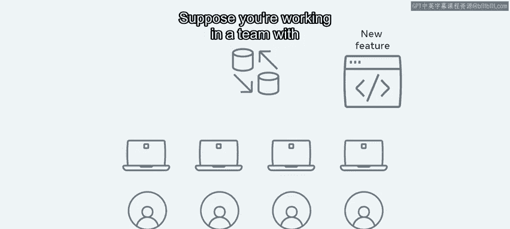

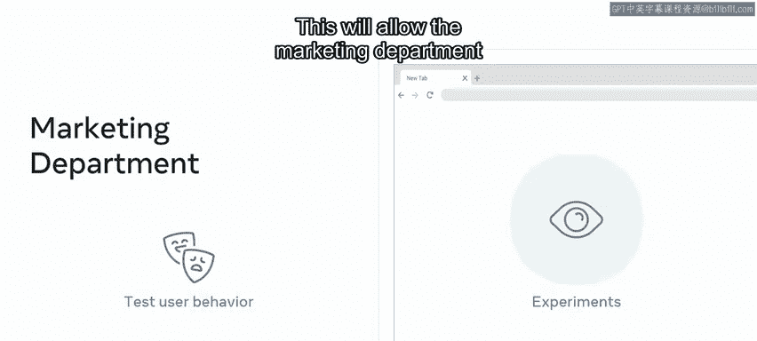

每日会生成一份报告，对每个实验的有效性进行排名。这些报告将提供每个实验进展情况的洞察，然后给出哪个实验最成功以及总体优胜者的结果。

---

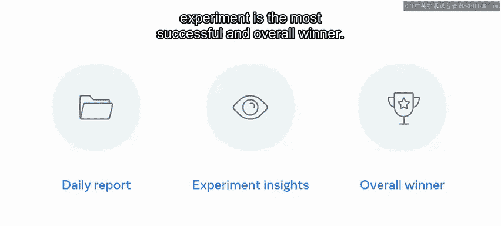

## 代码提交与同行评审 🔄

完成所有代码变更后，开发者会将其更改推送到仓库，并创建一个称为 **拉取请求（Pull Request）** 的东西。

随后，其他开发者将对拉取请求进行同行评审，以**批准**、**请求更改**或**拒绝**。

---

## 处理变更交叉与合并冲突 ⚙️

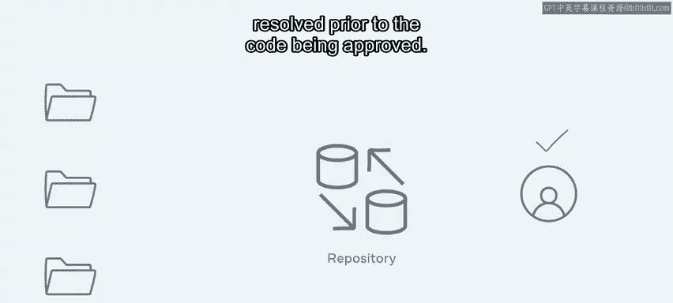

在单个项目上工作时，开发者之间通常存在某种程度的变更交叉。当这种情况发生时，修订历史可以帮助开发者查看已发生变更的完整生命周期。

这对于**合并冲突**也至关重要，即多名开发者所做的更改可能需要在代码获得批准之前进行解决。

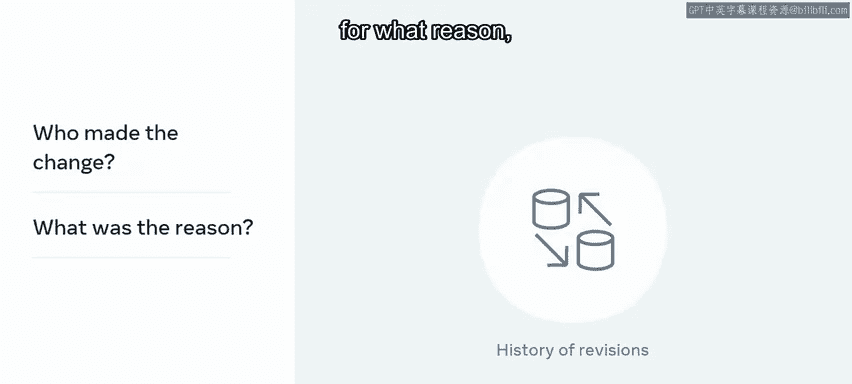

历史记录将显示：**谁**出于**什么原因**做出了更改、**代码本身及其变更**，以及变更发生的**日期和时间**。

通常，在新项目中，你会遇到一项任务中的变更可能导致与另一项任务产生潜在问题或冲突的情况。修订历史将使团队能够管理和合并这些变更，并及时实现业务目标。

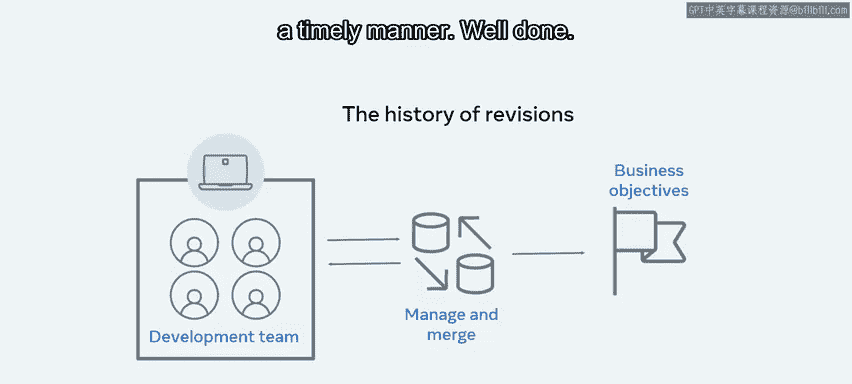

---

## 总结 📝

本节课中，我们一起学习了修订历史记录。记住，建立一个系统来记录代码库的所有变更至关重要，这在与其他开发者团队协作时尤为关键。现在，你应该能够描述开发者如何使用版本控制来解决生产过程中可能出现的任何冲突。