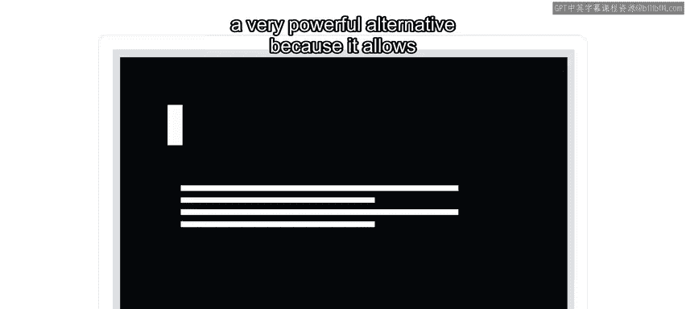
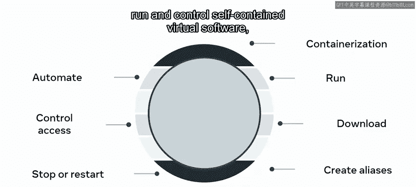
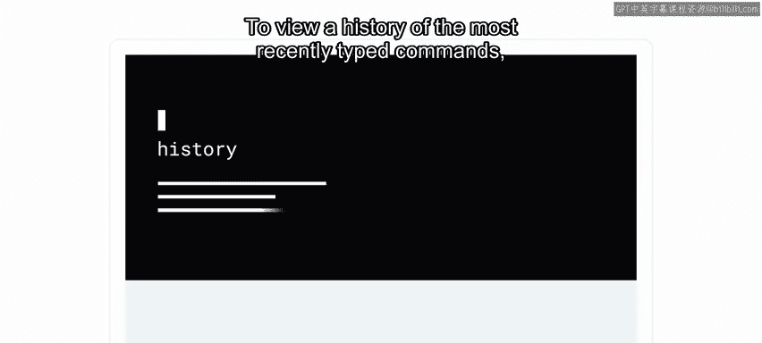
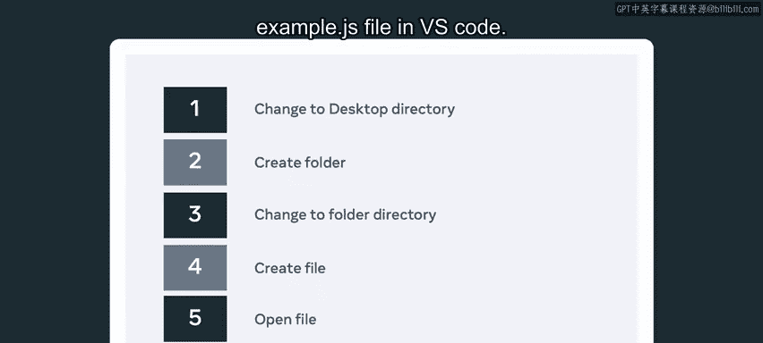
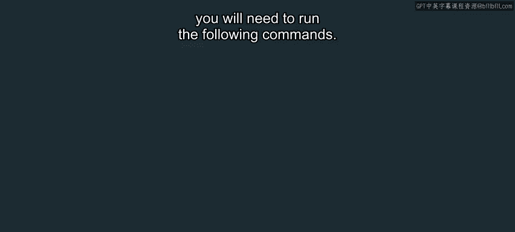
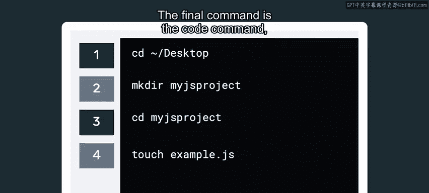
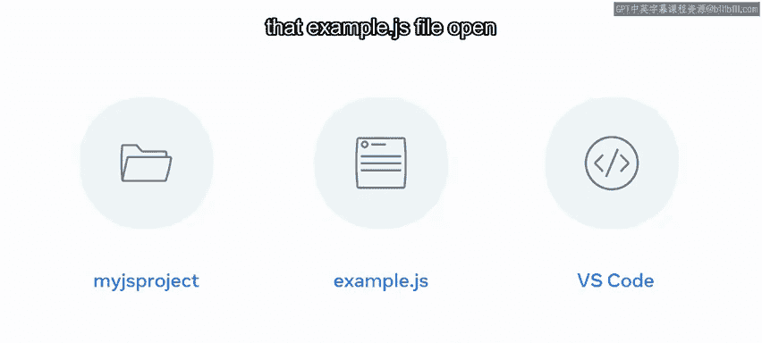

# 54：命令行入门 🖥️

在本节课中，我们将要学习如何通过命令行与计算机进行交互。你将了解到什么是命令行，它为何强大，并掌握一些基础命令来开始你的实践。

## 什么是人机交互？

当你第一次使用计算机时，最先学会的操作之一就是使用鼠标和键盘。起初可能很慢，但随着你越来越熟练，你就能与计算机顺畅交互，并让它按你的意愿响应。

在计算机使用语境中，“交互”一词简单来说就是交换信息，或者说，发送和接收信息。本质上，计算机向你发送数据，你接收它；反过来，你也向计算机发送数据，计算机接收它。

## 交互的方式：输入与输出设备

我们提到了鼠标和键盘，但你能想到其他与计算机交互的方式吗？计算机有多种输入和输出设备。输入设备包括键盘、鼠标、麦克风、摄像头、触摸感应设备等。输出设备则包括扬声器、显示器、耳机和触觉设备等。

你使用所有这些设备向计算机发送数据，并从它那里接收数据。但还有另一种东西支持着与设备的通信，那就是图形用户界面（GUI），它促进了你的交互。GUI之所以流行，是因为它几乎不需要培训就能使用。

## 超越GUI：命令行的力量

GUI提供了一种与设备交互的简单方式，但它也在一定程度上限制了人机交互的范围。作为GUI和麦克风等输入设备的替代方案，你将学习通过命令行与计算机交互。

命令行是一个非常强大的替代方案，因为它允许开发者更快地执行任务，并且随着经验积累，出错的潜在可能性更低。要有效使用这个强大工具，你需要具备一定水平的知识。你可能会觉得命令行的学习曲线有点陡峭，但请相信我，回报绝对是值得的。只需学习几个命令，你就能执行各种任务。

以下是使用命令行可以完成的一些基础任务：
*   创建新目录。
*   创建新文件。
*   合并目录。
*   在不同目录间复制和移动文件。
*   使用各种条件和关键字搜索文件。

## 命令行的进阶应用

随着你更熟练地使用命令行，你将能够执行更高级的任务，例如：
*   跟踪软件。
*   访问和控制远程服务器。
*   使用特定条件搜索文件。
*   解压归档文件。
*   访问软件手册并在命令行中显示。
*   安装、升级和卸载软件。
*   挂载和卸载计算机驱动器，或检查磁盘空间等。

这听起来很高级，不是吗？但列表还不止于此，你还可以：
*   编写脚本来自动化各种任务。
*   控制用户对文件和程序的访问。
*   停止、启动和重启程序。
*   创建仅几个字符长的别名来启动非常长的命令。
*   从互联网下载文件。
*   运行各种软件。
*   最后，运行和控制自包含的虚拟软件，这也被称为容器化。

## 基础命令入门

使用命令行的方式有很多，但现在我将指导你学习一些基本命令来入门。

首先，是 **`cd`** 命令，它代表“更改目录”。这用于将我们的命令行指向特定的目录，例如某个文件夹。例如，在Linux上，如果我输入 `cd ~/Desktop`，我将把命令行指向我计算机的桌面。当你输入 `cd ..` 时，你将移出当前目录并返回其父目录。

接下来是 **`touch`** 命令，它可以创建你指定的任何类型的新文件。例如，要创建一个全新的文件，你可以运行 `touch` 后跟新文件的名称，例如 `example.txt`。请注意，新创建的文件将是空的。

你还可以使用 **`mkdir`** 命令创建新文件夹。例如，`mkdir` 后跟你想给新文件夹起的标题。

要查看最近输入命令的历史记录，你可以使用 **`history`** 命令。

## 实践场景示例

还有很多其他命令可以使用，但仅凭我刚才介绍的这些，你已经可以做很多事情了。我将带你快速浏览一个示例场景。

假设你想将命令行指向桌面目录，然后在那里创建一个名为 `MyJSProject` 的新文件夹。接着，你想将命令行指向 `MyJSProject` 目录，并创建一个名为 `example.js` 的新文件。最后，你想在 VS Code 中打开这个 `example.js` 文件。

要完成所有这些操作，你需要运行以下命令：
1.  `cd ~/Desktop`
2.  `mkdir MyJSProject`
3.  `cd MyJSProject`
4.  `touch example.js`
5.  `code example.js`

第一个操作是使用更改目录或 `cd` 命令。然后，你想使用 `mkdir` 命令来创建新文件夹。要进入新文件夹目录，你再次使用 `cd` 命令，然后使用 `touch` 命令创建文件。最后的命令是 `code` 命令，它将在 VS Code 中打开文件。

如果你正确运行了所有这些命令，你最终会在桌面上得到一个 `MyJSProject` 目录，里面包含 `example.js` 文件，并且该 `example.js` 文件会在 VS Code 中打开，随时可以编辑。

## 总结

本节课中，我们一起学习了如何通过命令行与计算机进行更高级的交互。你现在对命令行允许你执行哪些高级任务有了更好的了解，并且也准备好尝试一些基本命令了。我鼓励你开始练习其中一些命令，就像你曾经在打字和用鼠标移动光标方面越来越熟练一样。我向你保证，通过练习，你很快就能像专业人士一样使用命令行。