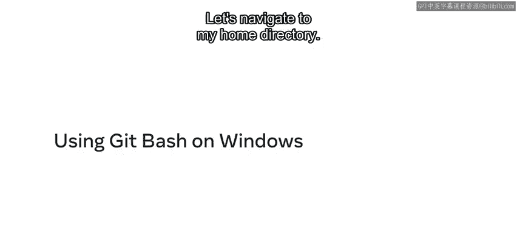
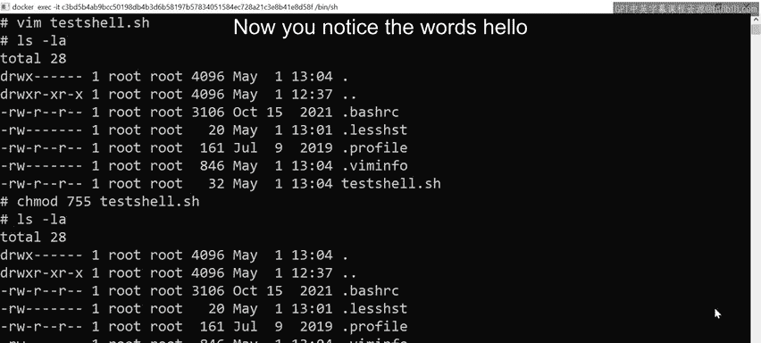
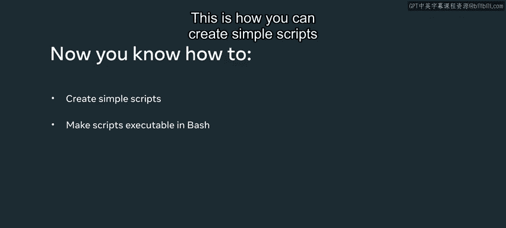

# 56：在Windows上使用Bash 🖥️



在本节课中，我们将学习如何在Windows环境下使用Bash终端，包括如何导航目录、查看和编辑配置文件，以及如何创建并运行一个简单的Bash脚本。这些技能是管理数据库和进行开发工作的基础。

## 导航与查看文件

首先，我们打开终端窗口并导航到主目录。使用 `cd ~` 命令可以快速返回主目录。


执行 `cd ~` 命令后，我们使用 `ls -la` 命令来列出当前目录下的所有文件，包括隐藏文件。

以下是 `ls -la` 命令的输出示例：
*   请注意两个文件：`.bashrc` 和 `.bash_profile`。

## 理解配置文件

上一节我们查看了目录内容，本节中我们来看看这两个配置文件的作用。首先，我们关注 `.bashrc` 文件。

使用 `less .bashrc` 命令可以查看该文件的内容。`.bashrc` 文件主要用于配置。它本质上是一个脚本文件，在你首次打开终端窗口时执行。其中的内容是对Shell本身的配置，例如使用的颜色类型。你也可以在其中添加关于Shell历史的设置，比如希望存储多少条历史命令记录。任何放在这里的配置选项都将在终端会话开始时执行。

按 `Q` 键可以退出 `less` 查看环境。

另一个文件是 `.bash_profile` 文件。我们可以再次运行 `less` 命令，这次查看 `.profile` 文件。这个文件通常用于设置**环境变量**。例如，你可以用它来设置 `JAVA_HOME` 或 `PYTHON_HOME` 等开发所需的环境变量。

再次按 `Q` 键退出。

## 创建Bash脚本

了解了配置文件后，现在我们来动手创建一个简单的Shell脚本。在这个例子中，我将使用 `Vim` 编辑器。

输入 `vim testhello.sh` 并按回车键，这将创建一个名为 `testhello.sh` 的新文件。

在文件顶部，我们需要声明这是一个什么类型的文件。这里，它将是一个Bash脚本。按键盘上的 `I` 键进入插入模式。

然后输入以下内容：
```bash
#!/bin/bash
```
这行代码（称为shebang）让操作系统知道这是一个Bash脚本。

接下来，我们编写一个非常简单的脚本：在屏幕上打印一段文本。我们使用 `echo` 命令。

在文件中继续输入：
```bash
echo "Hello World"
```

按 `Esc` 键退出插入模式。然后输入 `:wq!` 并按回车键来保存文件。

现在，如果我们查看目录，会注意到多了一个名为 `testhello.sh` 的文件。但需要注意的是，这个文件目前还不能运行。换句话说，它不可执行，只是一个可读写的文件。

## 设置脚本权限并执行

为了让脚本可执行，我们需要为其设置“执行（x）”权限。这需要使用另一个命令：`chmod`。

使用以下命令为文件添加权限：
```bash
chmod 755 testhello.sh
```

命令中的 `755` 表示我们想要的权限类型。执行后，如果我们再次使用 `ls -la` 命令，会注意到该文件现在已变为可执行文件。

这意味着我们现在可以从命令行运行这个文件了。要运行文件，请输入：
```bash
./testhello.sh
```

按回车键后，你会看到屏幕上打印出了“Hello World”字样。这就是在Bash中创建简单脚本并使其可执行的方法。


---





本节课中我们一起学习了在Windows Bash环境下的基本操作。我们首先导航到主目录并查看了包含隐藏文件在内的所有文件。接着，我们探讨了两个重要的配置文件：`.bashrc`（用于Shell配置）和 `.bash_profile`（用于环境变量）。最后，我们动手实践，使用Vim创建了一个Bash脚本，通过 `chmod` 命令赋予其执行权限，并成功运行了该脚本，输出了“Hello World”。这些是掌握命令行操作和自动化任务的基础步骤。