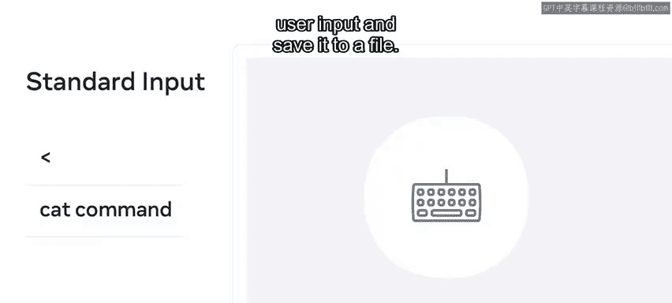
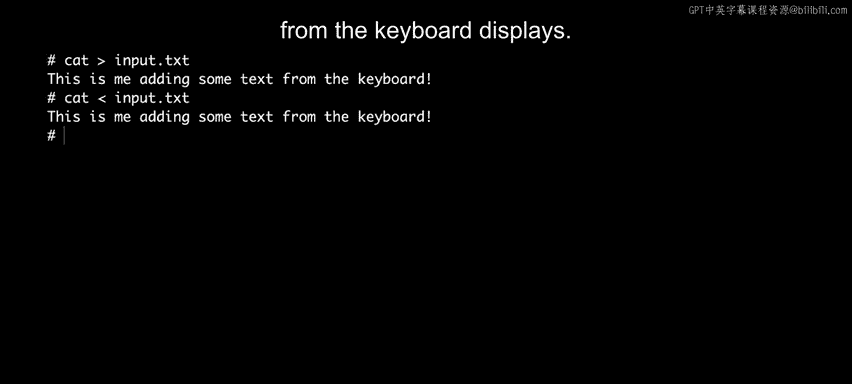
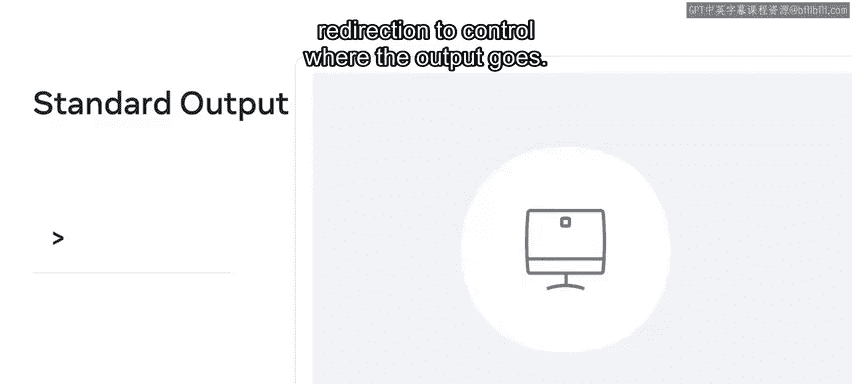
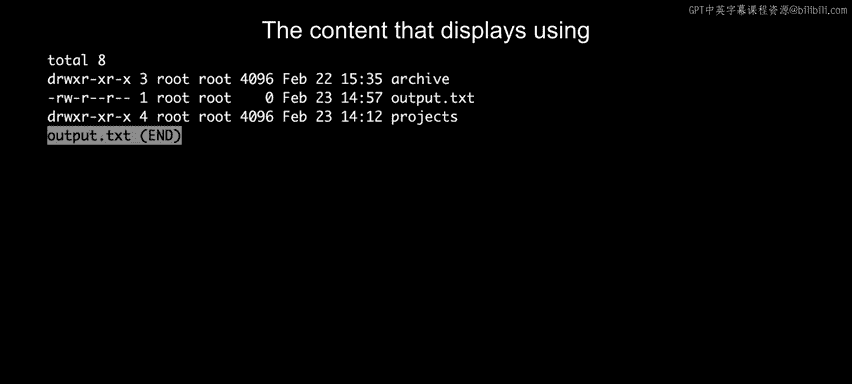
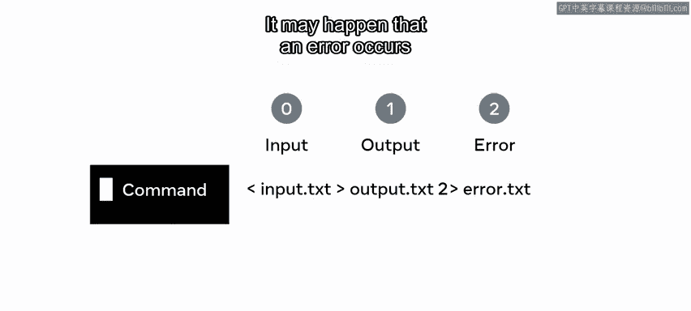
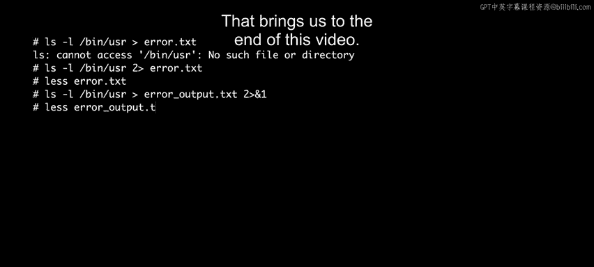

# 13：重定向 📥📤

在本节课中，我们将要学习Linux系统中的重定向概念。重定向允许我们改变命令输入和输出的默认来源与去向，是命令行操作中一项非常强大的功能。

## 概述

任何Linux命令的基本工作流程都是接收输入并产生输出。标准输入设备通常是键盘，标准输出设备通常是屏幕。通过重定向，我们可以改变这些标准输入和/或输出的目标。

## 重定向的类型

Linux Shell通过一个编号系统来追踪标准输入、输出和错误。以下是三种主要的输入/输出重定向类型：

*   **0**：代表标准输入。
*   **1**：代表标准输出。
*   **2**：代表标准错误。

上一节我们介绍了重定向的基本概念，本节中我们来看看第一种类型：标准输入。

## 标准输入 (`<`)

标准输入通常指用户从键盘键入信息。我们使用小于号 (`<`) 进行输入重定向。`cat` 命令可以用来接收用户输入并将其保存到文件中。

以下是使用 `cat` 命令将用户输入存储到文本文件的步骤：

1.  在终端输入命令：`cat > input.txt` 并按下回车。
2.  此时可以开始输入文本内容。
3.  输入完成后，按下 `Ctrl + D` 来告诉 `cat` 命令文件输入结束。
4.  要输出文件的内容，请输入命令：`cat < input.txt`。

## 标准输出 (`>`)

我们已经使用过的许多命令，例如 `ls`，都会将其输出发送到一个称为“标准输出”的特殊文件。输出重定向使用大于号 (`>`) 来处理。

在Unix/Linux系统中，一切皆文件。这意味着每次运行 `ls` 这样的命令时，其输出都会被发送到Linux中的一个标准输出文件。如果你想控制输出的去向，可以使用重定向。

以下是发送输出到文本文件的示例：

1.  输入命令：`ls -l > output.txt` 并按下回车。`output.txt` 文件将被创建（如果不存在）或覆盖。
2.  要查看该文件的内容，使用命令：`cat output.txt`。显示的内容与直接运行 `ls -l` 时在屏幕上看到的一致。

## 标准错误 (`2>`)

当操作出错时，就会产生错误。在使用重定向时，你也需要指定错误信息应被写入哪个文件。你可以通过在输出箭头前显式地设置数字 `2` 来实现这一点。

错误可能发生在向文本文件输出数据时。请注意，错误信息不会进入标准输出流，而是会切换到由数字 `2` 代表的错误流。

现在我们来演示这是如何工作的。假设我们尝试列出一个不存在的目录：

1.  输入命令：`ls -l /bin/usr > error.txt`。你会注意到错误信息“无法访问 /bin/usr: 没有那个文件或目录”仍然打印在控制台上，而不是写入 `error.txt`。
2.  要将错误信息重定向到文件，需要使用：`ls -l /bin/usr 2> error.txt`。
3.  使用 `cat error.txt` 查看文件内容，可以看到错误信息已被写入。

## 组合输出与错误 (`2>&1`)

如果你想同时处理可能找到数据或可能找不到数据的情况，可以传递不同的重定向指令，以便同时处理输出和错误。

以下是同时将标准输出和标准错误重定向到同一个文件的示例：

1.  输入命令：`ls -l /bin/usr > error_output.txt 2>&1`。
    *   `>` 将标准输出重定向到 `error_output.txt`。
    *   `2>&1` 表示将标准错误重定向到标准输出当前指向的地方（即同一个文件）。
2.  使用 `cat error_output.txt` 查看文件，可以看到错误信息被包含在该文件中。

## 总结

本节课中我们一起学习了Linux重定向的核心知识。你现在知道了什么是重定向，以及如何使用三种类型的输入/输出重定向：**标准输入 (`<`)**、**标准输出 (`>`)** 和 **标准错误 (`2>`)**。你还学会了如何将标准输出和标准错误合并重定向到同一个文件（`2>&1`）。掌握这些技巧将极大地增强你在命令行中处理数据流的能力。