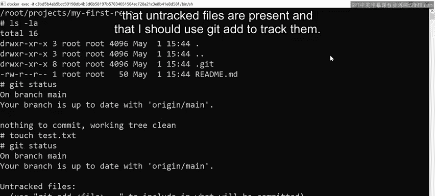
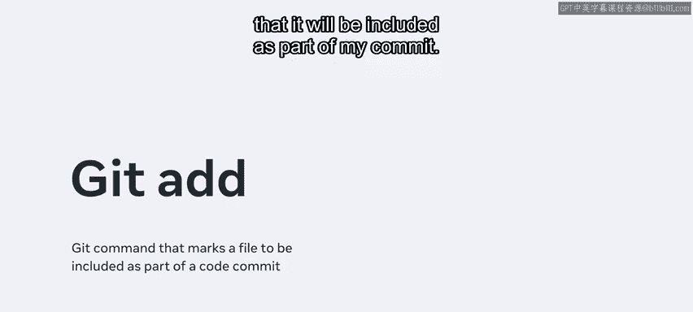
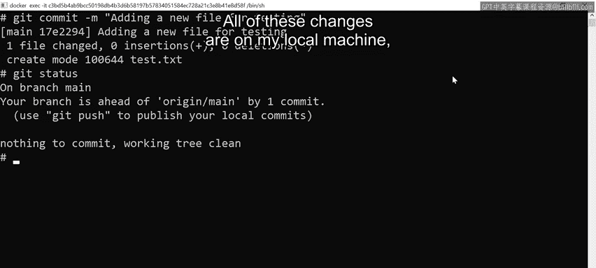
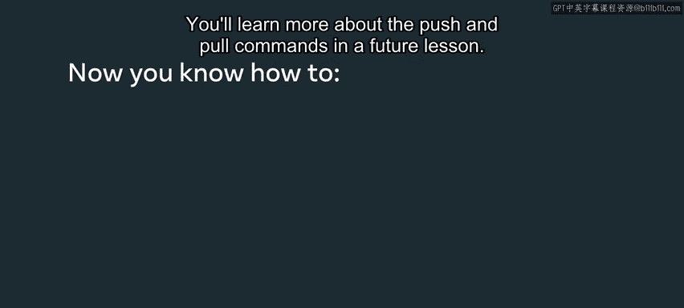

# 入门 66：添加与提交

## 概述

在本节课中，我们将学习Git版本控制系统中两个核心操作：`git add`与`git commit`。你将了解如何将新文件纳入Git的跟踪范围，以及如何将更改正式保存为一个版本记录。这是将本地工作成果转化为项目历史的关键步骤。

## 检查当前状态

在开始任何操作前，了解当前Git仓库的状态是良好的实践。

打开终端窗口，首先确认当前所在目录。可以使用`pwd`命令（print working directory的缩写）。假设当前位于`my_first_repo`目录中。

接下来，使用`ls -l`命令查看该目录下的内容。可以看到两个项目：一个`README.md`文件和一个名为`.git`的隐藏文件夹。

在添加文件或进行更改之前，最好先检查是否存在任何未提交的更改。这可以通过`git status`命令实现。

`git status`命令会显示当前所在的分支。在本例中，提示位于名为`main`的分支上，并且该分支与`origin/main`保持同步。这意味着本地机器上的所有最新文件与Github UI（即所有人提交到的服务器）上显示的内容完全一致。

`git status`还提示当前没有需要提交的内容，工作树是干净的。

## 创建并跟踪新文件

现在，我们来学习如何添加一个简单的文本文件。

使用`touch test.txt`命令创建一个名为`test.txt`的文件。

然后，再次运行`git status`命令。

此时，Git提示存在一个未跟踪的文件，即刚刚添加的`test.txt`文件。它还提示没有要添加到提交的内容，但存在未跟踪的文件，并建议使用`git add`命令来跟踪它们。

`git add`命令的目的是通知Git，你希望跟踪此文件，并将其包含在即将进行的提交中。

以下是添加文件到暂存区的步骤：

1.  运行命令`git add test.txt`。
2.  再次运行`git status`以确认该文件现在已被跟踪。

现在，通知显示分支是最新的，并且提示有已暂存的更改等待提交，即这个名为`test.txt`的新文件。

## 理解暂存区

上一节我们介绍了如何将文件添加到跟踪状态，本节中我们来深入理解“暂存区”的概念。

如果需要撤销暂存操作，可以使用`git restore`命令，配合`--staged`标志和文件名`test.txt`。

运行该命令将从提交中取消暂存该文件。

再次运行`git status`，可以看到文件恢复到了未跟踪状态。

然后，我们重新使用`git add test.txt`添加文件，并运行`git status`，确认文件回到了已跟踪（暂存）状态。

可以使用`clear`命令清屏。从现在起，所做的任何更改都将被跟踪，并在最后使用`git commit`命令提交。

暂存区非常重要，因为你本质上是在准备将所有希望作为当前工作特性一部分的文件和更改打包。基本上，你是在为提交准备所有相关内容。

必须记住，这仅发生在你的本地机器上。Git的分布式特性意味着，只有使用实际的`push`命令时，更改才会推送到服务器。你在此处所做的任何更改都仅针对你和你的本地机器。其他任何人从Github拉取项目时，只会获取远程服务器上可用的内容。

## 提交更改

在准备好所有更改后，下一步是将它们永久记录到项目历史中。

首先，输入`git commit`。可以传入`-m`标志（代表message），允许输入一条将附加到此次提交上的消息。

在本例中，消息是“adding a new file for testing”。

接下来，按键盘上的回车键。现在注意响应信息：一个文件被更改，零行插入，零行删除。还有一个关于文件`test.txt`的“create mode”声明。

最后，如果运行`git status`命令，响应会显示没有需要提交的内容，工作树是干净的。

但是，需要注意屏幕顶部的消息。该消息提示使用`git push`来发布本地提交。这与我之前提到的内容相关联：所有这些更改都在我的本地机器上，只有当我运行`push`命令时，它们才会被上传到远程服务器。你将在未来的课程中了解更多关于`push`和`pull`命令的内容。

## 总结

本节课中，我们一起学习了Git工作流中的关键环节：添加与提交。我们掌握了使用`git add`将新文件或更改放入暂存区，以及使用`git commit -m “提交信息”`将暂存区的内容创建为一个永久的版本记录。重要的是，我们理解了这些操作目前仅影响本地仓库，需要后续的`git push`命令才能与团队共享。通过实践`git status`来检查状态，你能够清晰地跟踪文件从“未跟踪”到“已暂存”再到“已提交”的整个生命周期。