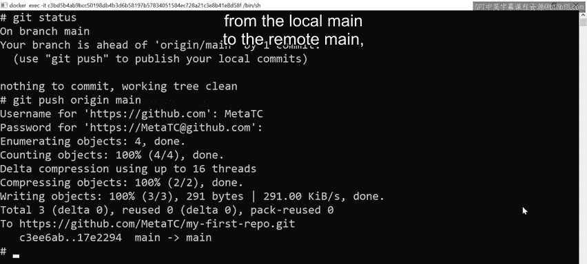
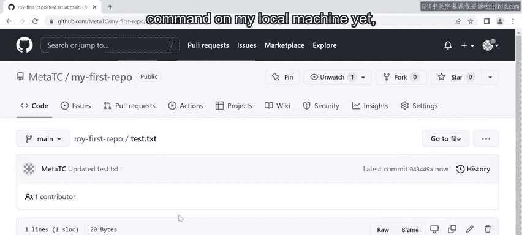
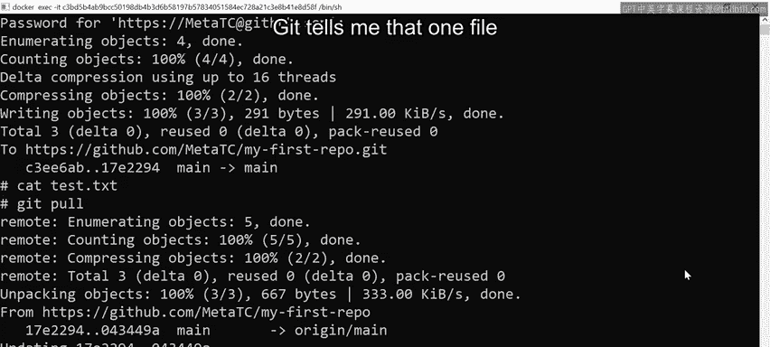
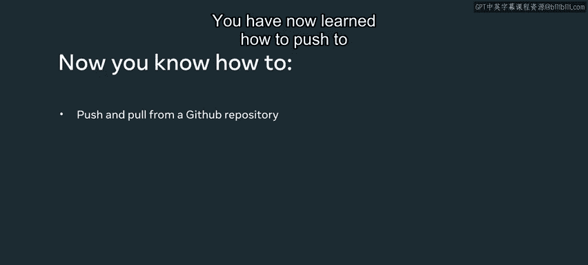

# 69：推送与拉取操作详解 🚀

在本节课中，我们将要学习Git版本控制系统中两个核心的协作命令：`git push` 和 `git pull`。你将学会如何将本地仓库的更改上传到远程仓库，以及如何从远程仓库获取最新的更改并同步到本地。

---


## 检查本地仓库状态

上一节我们介绍了如何使用 `git add` 和 `git commit` 来记录本地更改。在开始推送或拉取操作之前，首先需要检查当前仓库的状态。

以下是检查状态的命令：

*   **`git status`**：查看当前分支状态、暂存区和工作区的变化。
*   **`git branch`**：列出所有本地分支，并高亮显示当前所在分支。

执行 `git status` 后，你可能会看到类似这样的提示：
```
On branch main
Your branch is ahead of 'origin/main' by 1 commit.
```
这表示你的本地 `main` 分支比远程仓库（`origin`）的 `main` 分支领先一个提交。这体现了Git分布式工作流的优势：你可以在离线状态下工作，仅在需要同步时通过 `git push` 或 `git pull` 与远程仓库通信。

---

## 推送更改到远程仓库

了解了本地状态后，本节中我们来看看如何将本地的提交上传到远程仓库。

推送操作使用 `git push` 命令。其基本语法是：
```bash
git push <远程仓库名称> <本地分支名>:<远程分支名>
```
通常，远程仓库的默认名称是 `origin`。

**操作步骤如下：**

1.  确保你位于正确的分支上（例如 `main`）。
2.  执行推送命令。例如，将本地 `main` 分支推送到远程 `origin` 仓库的 `main` 分支：
    ```bash
    git push origin main
    ```
3.  如果使用HTTPS协议，系统会提示你输入GitHub（或其它平台）的用户名和密码。
4.  推送成功后，Git会将你本地仓库的提交快照上传到远程仓库。Git会比较远程和本地的文件，如果没有冲突，会自动合并，这称为 **自动合并**。如果存在冲突，推送会失败，你需要先在本地解决冲突。



推送完成后，你可以刷新GitHub等远程仓库的页面，确认你的文件（例如 `test.txt`）和提交已经成功显示。

---

## 从远程仓库拉取更改

在团队协作中，其他成员也会向远程仓库推送更改。为了保持本地代码最新，你需要定期从远程仓库拉取更新。

拉取操作使用 `git pull` 命令。其本质是执行了两个操作：`git fetch`（获取远程最新数据）和 `git merge`（将远程数据合并到本地当前分支）。

**操作步骤如下：**

1.  假设其他人在远程仓库的 `test.txt` 文件中添加了一行新内容并提交。
2.  此时，你的本地 `test.txt` 文件还没有这行内容。
3.  在本地仓库目录下，执行拉取命令：
    ```bash
    git pull origin main
    ```
4.  Git会从远程 `origin` 仓库的 `main` 分支获取最新更改。如果成功，终端会显示类似 `1 file changed, 1 insertion(+)` 的信息。
5.  拉取完成后，Git会尝试将远程的快照与你本地的快照自动合并。如果没有冲突，合并将自动完成。此时，你本地 `test.txt` 文件的内容就更新了，包含了远程的新增内容。



---

## 总结与最佳实践

本节课中我们一起学习了Git协作的核心流程。

**关键命令总结：**
*   **推送**：`git push` 将本地提交上传到远程仓库。
*   **拉取**：`git pull` 将远程仓库的最新更改下载并合并到本地。

**最佳实践建议：**
1.  在 `push` 之前，先执行 `git pull` 获取最新远程更改，这能极大降低代码冲突的概率。
2.  始终使用 `git status` 确认当前分支和状态，确保你在正确的分支上进行操作。
3.  理解 `git pull` 是 `fetch` 加 `merge` 的组合，遇到复杂合并情况时，可以分开执行这两个命令以便更清晰地处理。





通过掌握 `push` 和 `pull`，你已能够参与基本的Git团队协作，在分布式工作流中同步和贡献代码了。