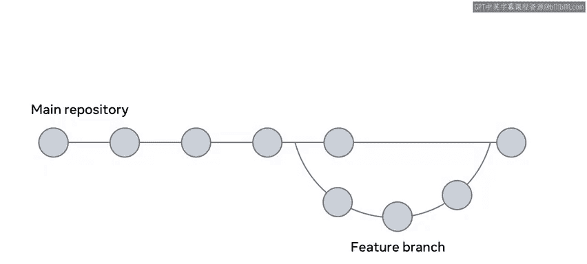
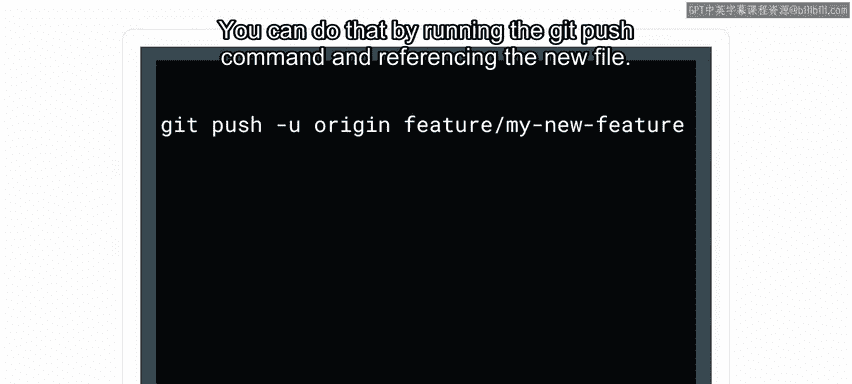

**P70：工作流范例**

在本节课中，我们将学习什么是工作流，并了解软件开发中一种常见的工作流模式——功能分支工作流。我们将通过一个简单的例子来理解其重要性，并学习如何使用 Git 和 GitHub 来实践它。

---

你是否曾申请过工作？这个过程包括准备简历、寻找职位、提交申请、准备面试。这就是一个工作流的例子。在计算机编程中，工作流非常重要。通过本视频，你将能够描述什么是工作流，并识别不同的可用工作流。

现在，让我们从一个例子开始，说明工作流为何重要。

作为一名在项目上工作的开发者，你首先需要将项目从远程仓库拉取到你的本地机器。这通常被称为检出项目或拉取项目。项目到了本地机器后，你可以构建、运行项目并进行修改。完成后，你必须将所做的更改推送回远程仓库，以便其他开发者能看到。

从这个例子中，你可以理解工作流的目的是指导你和团队中的其他成员。它不应该干扰或阻碍部署、测试，或任何其他为项目做出贡献的开发者。

选择工作流需要仔细考虑。这可能取决于团队的规模、工作场所的文化，以及你打算构建或更新的产品类型。考虑到这些，让我解释一下功能分支工作流，这是许多开发者使用的常见工作流。

功能分支工作流意味着你从主线创建一个新分支，并在这个专用分支上工作，直到任务完成。需要制定规则和条件，以确保这段代码分支保持良好的状态。

每个代码库都有一个主仓库，它本质上是应用程序的“单一事实来源”。所有更改，如添加、编辑或删除，都直接提交到功能分支。主分支保持不变。当你对你添加的代码感到满意并准备就绪时，你必须提交更改，然后推送到服务器仓库。提交时，你推送更改。由于它是一个功能分支，随后会有一个拉取请求。这个拉取请求会与主分支进行比较，以便进行代码同行评审的开发者能确切看到更改了什么。一旦经过评审并获得批准，它就可以被合并到主线中。



---

上一节我们介绍了功能分支工作流的概念，本节中我们来看看如何使用 Git 和 GitHub 来具体操作。

在创建新分支之前，始终确保你拥有最新的代码。你可以通过运行 `git pull` 命令从远程仓库拉取最新代码来实现。

接下来，你需要创建你的新分支。你可以通过使用带有 `-b` 标志的 `checkout` 操作来完成。

以下是创建并切换到新分支的命令：
```bash
git checkout -b feature-branch-name
```


现在，让我们向这个分支添加新内容。我们创建一个 `README.md` 文件。为此，你可以使用 `git add .` 来添加所有更改，或者使用 `git add README.md` 来添加特定文件。

接下来，你需要提交新文件，并提供一个有意义的提交信息，以便其他开发者了解你添加了什么。为此，运行 `git commit` 命令，并使用 `-m` 选项来包含一个简短描述更改的信息。

以下是提交更改的命令：
```bash
git commit -m "Add README.md file with project overview"
```

现在，文件已被添加到本地分支。这意味着该文件目前仅对你本地可见。为了让其他开发者看到更改，你需要将文件推送到远程仓库。你可以通过运行 `git push` 命令并引用新分支来实现。

以下是推送分支到远程仓库的命令：
```bash
git push origin feature-branch-name
```

更改现在被推送到了 GitHub 上的远程仓库。



你的下一步行动是将其作为拉取请求的一部分进行评审，但关于拉取请求的更多内容将在以后讨论。


---

本节课中我们一起学习了工作流的概念，特别是功能分支工作流。我们了解了它的目的、基本步骤，以及如何使用 Git 命令（如 `git checkout -b`、`git add`、`git commit` 和 `git push`）来实践它。掌握工作流对于团队协作和高效的项目管理至关重要。


