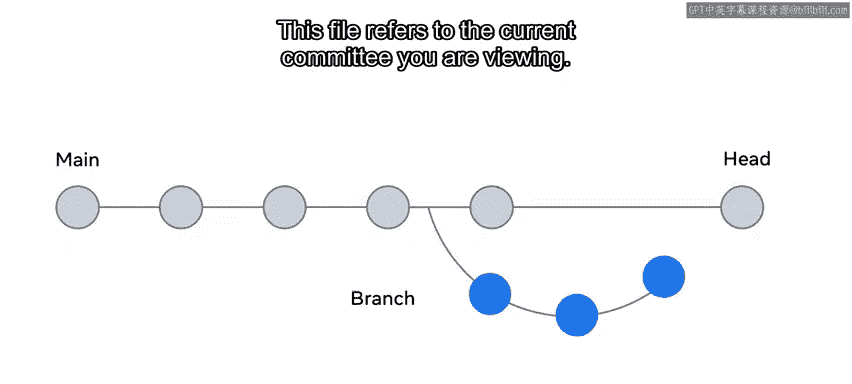
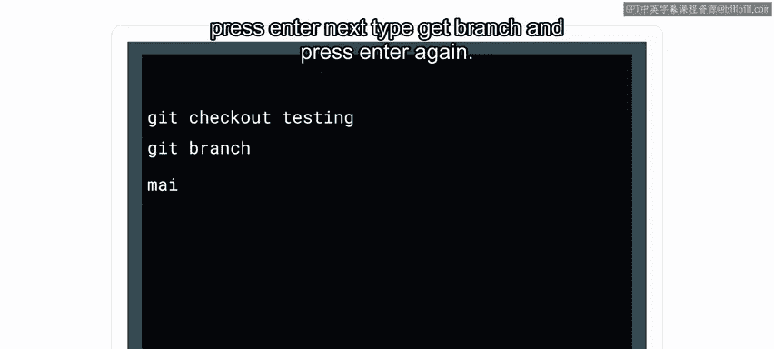
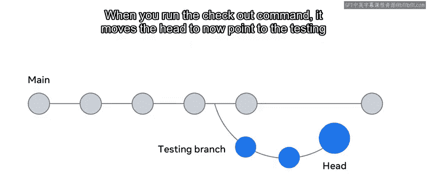
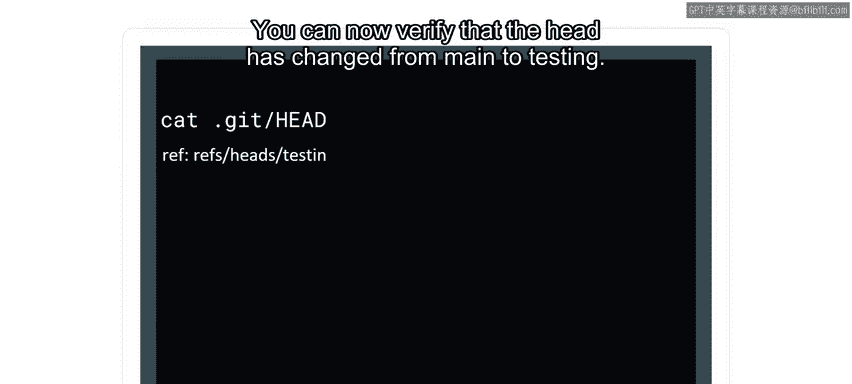
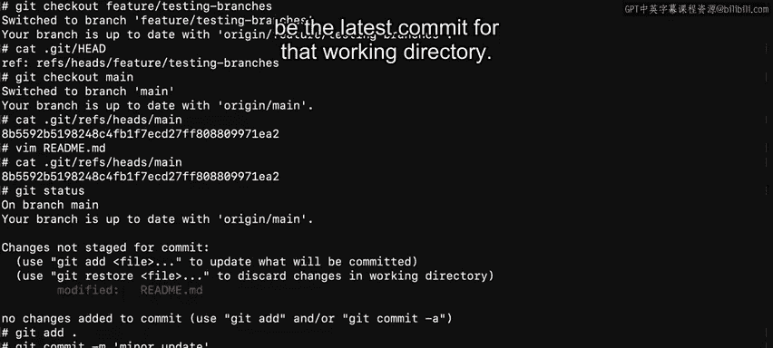

# 70：HEAD指针详解 🎯

在本节课中，我们将要学习Git中一个核心概念——HEAD指针。你将了解HEAD是什么，它如何工作，以及如何通过它来追踪和管理你当前所在的分支。

## 概述



上一节我们介绍了`.git`隐藏文件夹，它负责追踪项目的所有变更。本节中我们来看看Git是如何知道我们当前在哪个分支上工作的。答案就在于一个名为`HEAD`的特殊指针。

## 什么是HEAD指针？

Git通过一个名为`HEAD`的特殊指针来追踪当前所在的分支。这个指针是`.git`文件夹中的一个文件，它指向你当前正在查看的提交。

**核心概念**：`HEAD`是一个指向当前分支最新提交的引用指针。



## 如何查看HEAD指针？

以下是查看HEAD指针内容的步骤：

1.  首先，在终端中打开你的项目目录。
2.  进入`.git`文件夹：
    ```bash
    cd .git
    ```
3.  查看`HEAD`文件的内容：
    ```bash
    cat HEAD
    ```
    执行此命令后，通常会看到类似`ref: refs/heads/main`的内容。这表示`HEAD`当前指向`main`分支。



## HEAD与分支的关系



在Git中，我们一次只在一个分支上工作。每个分支的最新提交记录都存储在`.git/refs/heads/`路径下。

让我们查看`main`分支当前指向的提交：
```bash
cat .git/refs/heads/main
```
执行此命令后，会出现一个哈希ID。这个哈希ID就是`main`分支上最新提交的引用。

## 切换分支时HEAD如何移动？

当我们切换分支时，`HEAD`指针会随之移动，指向新的分支。

1.  切换到`testing`分支：
    ```bash
    git checkout testing
    ```
2.  再次查看当前分支，确认已切换：
    ```bash
    git branch
    ```
    此时，`HEAD`指针已从指向`main`分支改为指向`testing`分支。

我们可以通过查看`HEAD`文件来验证这一变化：
```bash
less .git/HEAD
```
你将看到内容从`ref: refs/heads/main`变为`ref: refs/heads/testing`。

## 实践演示：HEAD的工作流程

让我们通过一个简单的例子来演示`HEAD`如何工作。

1.  **确认当前分支**：
    运行`git branch`命令，可以看到当前位于`main`分支。
    通过`cat .git/HEAD`命令确认，它指向`refs/heads/main`。

2.  **切换分支**：
    使用`git checkout`命令切换到另一个分支，例如`feature/testing`：
    ```bash
    git checkout feature/testing
    ```
    再次查看`HEAD`文件，会发现它现在指向`refs/heads/feature/testing`。

3.  **返回主分支并查看提交哈希**：
    切换回`main`分支：
    ```bash
    git checkout main
    ```
    查看`main`分支指向的最新提交哈希ID：
    ```bash
    cat .git/refs/heads/main
    ```
    这会显示一个长字符串（如`8b55f...`），它是该工作目录最新提交的唯一标识。

## 提交如何更新HEAD引用？

提交操作会更新分支所指向的提交哈希，从而间接更新了`HEAD`的最终指向。

1.  **修改文件**：
    对项目中的文件进行修改，例如更新`README.md`文件。

2.  **检查哈希ID（提交前）**：
    在提交前，再次运行`cat .git/refs/heads/main`，哈希ID与之前相同，因为尚未创建新提交。

3.  **添加并提交更改**：
    ```bash
    git add .
    git commit -m “minor update”
    ```

4.  **验证哈希ID（提交后）**：
    提交后，再次检查`main`分支的引用文件：
    ```bash
    cat .git/refs/heads/main
    ```
    你会发现哈希ID已经更新为一个新的值（如`9c90a...`）。每当有新的提交发生时，这个ID就会更新为该工作目录的最新提交。



## 总结

本节课中我们一起学习了Git的`HEAD`指针。你现在知道了`HEAD`是一个指向当前所在分支最新提交的引用指针。通过切换分支，你可以改变`HEAD`指向的分支。而每次提交都会更新对应分支的提交哈希，从而让`HEAD`始终指向最新的工作状态。理解`HEAD`是掌握Git分支管理的基础。