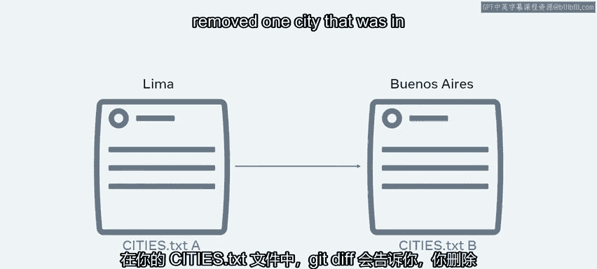
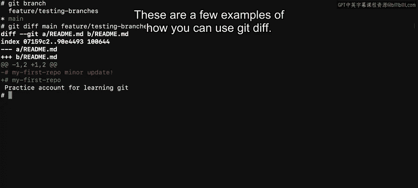

# 入门 72：使用Git diff命令追踪变更 🔍

在本节课中，我们将学习如何使用Git的`diff`命令来比较文件、分支和提交之间的差异。这个工具对于理解代码的演变过程至关重要。

## 概述

优秀的文学作品很少能一蹴而就，通常需要经过多次修改，作者才会对最终成果感到满意。编程工作亦是如此，有时你需要回顾旧的代码。本视频将指导你如何使用Git diff来比较文件、分支和提交之间的变更。

## Git diff的基本概念

你可能已经知道，`git status`命令可以告诉你哪些文件被修改过。而`git diff`命令则更进一步，它能精确地告诉你这些修改具体是什么。你可以将它们视为一个文件系统：`git status`告诉你文件名，但要打开文件查看内容，你需要使用`git diff`。

### 一个简单的例子

假设你有一个名为`cities.txt`的文本文件，其中记录了你访问过的城市名称。你在南美旅行期间一直在更新这个列表，但回家后却记不清具体记录了哪些内容。这时，`git diff`就派上用场了。

`git diff`会比较文件的先前版本与当前版本，找出所有差异。它会明确告诉你哪些内容被删除了，以及哪些内容被添加到了文件中。对于你的`cities.txt`文件，`git diff`会显示你删除了版本A中的一个城市，并添加了版本B中出现的一个新城市。

## Git diff的详细用法

上一节我们介绍了`git diff`的基本概念，本节中我们来看看它的几种具体使用场景。`git diff`可用于比较本地仓库中的文件，也可用于比较提交和分支。

### 1. 比较工作区与暂存区（或HEAD）

首先，我们来看一个简单的例子。进入本地仓库，找到一个名为`README.md`的文件，并稍作修改。你可以使用任何编辑器（如VS Code）进行修改，也可以通过执行`vim`命令进入文件编辑模式，删除几个词，然后保存。

如果你想了解更多关于Vim的信息，本课末尾提供了一个扩展阅读链接。

接下来，使用`git diff`工具将更新后的文件与HEAD进行比较。因为我们尚未完成提交，所以无法将其与另一个提交进行比较。

输入命令：`git diff HEAD -- <文件名>`。这将返回一个输出，显示每个文件中发生的更改。在这里，以减号（`-`）开头的行代表原始内容，而以加号（`+`）开头的行则代表当前内容。在我的例子中，输出告诉我“minor update”这几个词已被删除。

### 2. 比较两个提交

除了单个文件，你还可以比较之前的提交。

首先，使用`git log`命令显示提交历史。这里我也会使用`--pretty`标志，以便每行显示一个提交。开发者常用`--pretty`标志使输出更易读。

每个提交都有其唯一的ID代码。我将对最近一次提交和最早一次提交的ID代码执行`git diff`命令。

Git会遍历所有文件，记录发生的所有更改，并返回两者之间的差异。

### 3. 比较两个分支

最后，我将展示`git diff`的另一种用法：比较分支。

如果我执行`git branch`命令，它将显示仓库中所有可用的分支。然后，我可以使用`git diff`命令，传入我的主分支（`main`）作为第一个参数，功能分支（`feature`）作为第二个参数。同样，这将显示两个分支之间发生的所有更改。

输出显示，我的功能分支包含先前的更新，而主分支包含最新的更新。

## 总结

本节课中，我们一起学习了如何使用`git diff`命令来追踪文件、分支和提交之间的变更。这个工具可以帮助你及时了解更新情况，避免错误或工作重叠。下次见！