# 入门 74：模块小结 使用Git 🎯

在本节课中，我们将回顾并总结整个Git模块的核心知识点。你已经学习了Git的基本原理、GitHub仓库的使用，以及如何通过Forking创建仓库。本节将对所有关键概念进行梳理和总结。

## 概述 📋

上一节我们介绍了Git的高级操作，本节中我们来看看整个模块的知识体系。通过本模块的学习，你掌握了从Git基础概念到实际工作流的完整技能。

## 核心知识回顾

以下是本模块涵盖的所有核心知识点。

### Git基本原理与GitHub

你现在能够解释Git的工作原理并利用GitHub仓库，包括分支和代码合并。

### Git的安装与初始化

你学会了在Windows操作系统上本地安装Git，在GitHub上创建新仓库并将其克隆到本地机器。

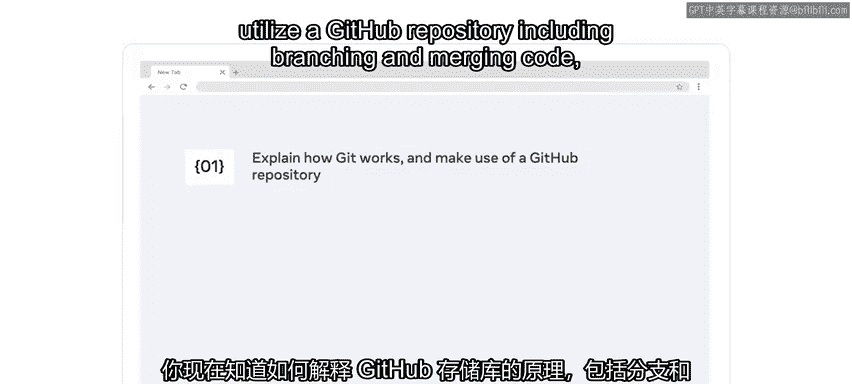

### Git工作流基础

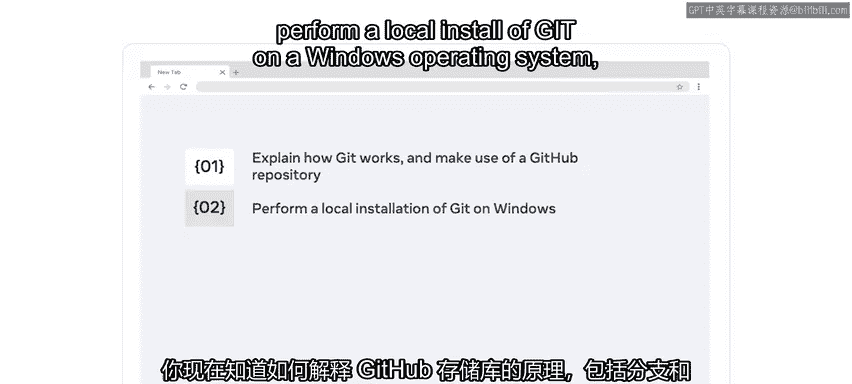

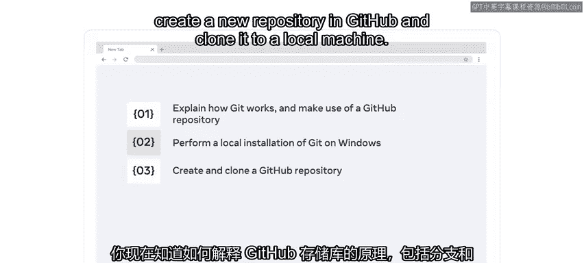

你掌握了Git的基础知识，并能概述Git的标准工作流程。同时，你能识别GitHub中远程仓库和本地仓库之间的区别。

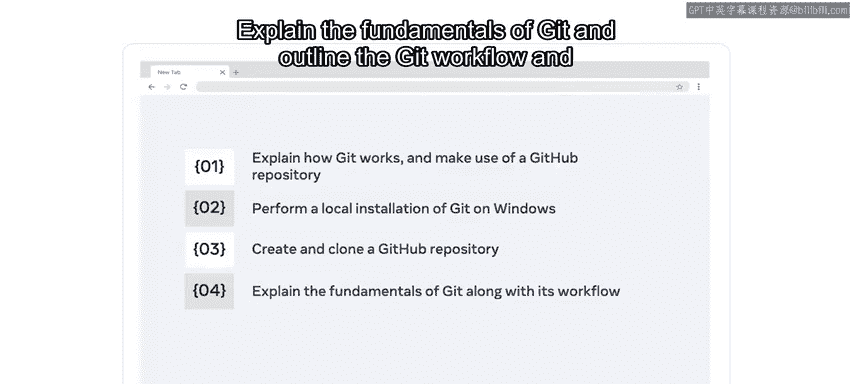

### 提交更改

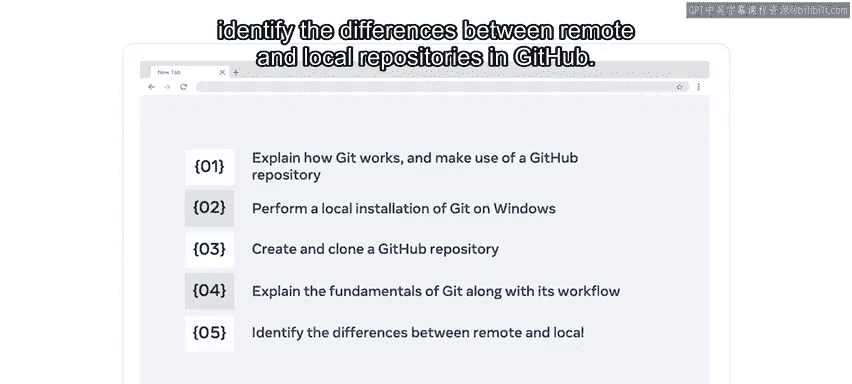

你理解了`git add`和`git commit`命令的作用，并能描述它们的工作方式。

**代码示例：**
```bash
git add <文件名>
git commit -m "提交信息"
```

### 远程同步

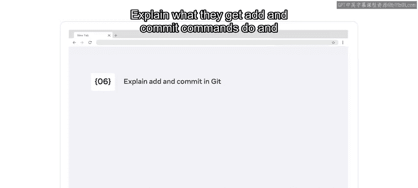

你学会了使用`git push`将内容推送到远程仓库，并使用`git pull`从远程服务器检索内容。

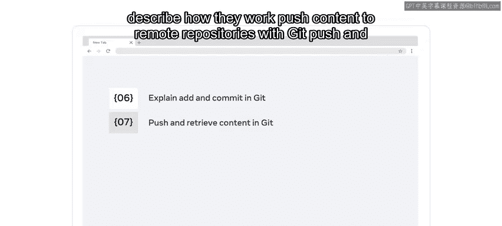

**代码示例：**
```bash
git push origin main
git pull origin main
```

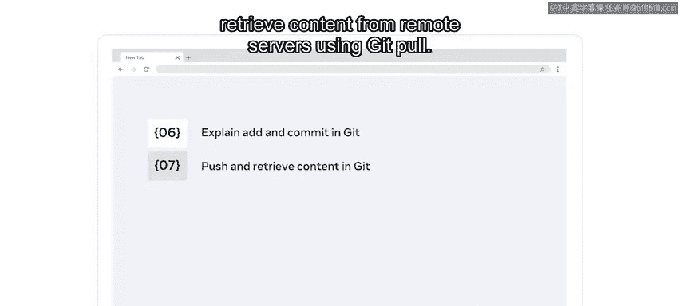

### 分支管理

你能够通过使用分支来保持工作流的清晰和稳定，并解释Git中如何使用`HEAD`来标识你当前正在工作的分支。

**概念公式：**
`HEAD` -> 当前分支 -> 最新提交

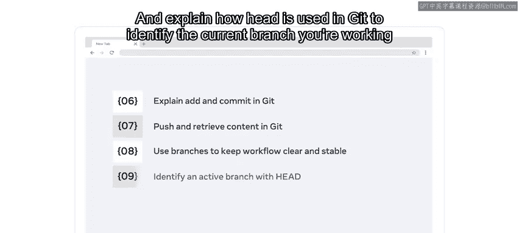

### 比较与追溯

你学会了使用`diff`命令比较跨文件、提交和分支的更改，使用`blame`命令检查文件的更改并识别其作者。

**代码示例：**
```bash
git diff <分支1> <分支2>
git blame <文件名>
```

### Forking创建仓库

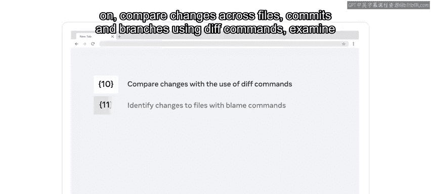

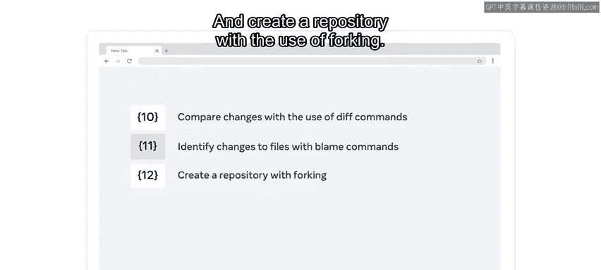

最后，你掌握了如何使用Forking功能来创建仓库。

## 总结 🏁

本节课中我们一起学习了Git和GitHub的完整知识体系，包括从安装配置、基础命令、分支管理到远程协作和Forking的全过程。你现在已经熟悉了Git、GitHub以及如何使用Forking创建仓库。出色的工作。