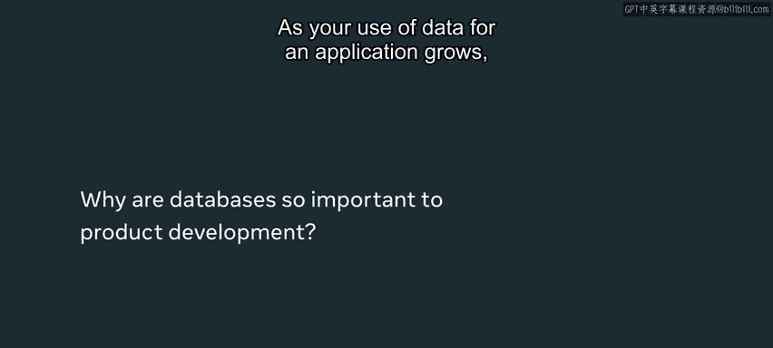
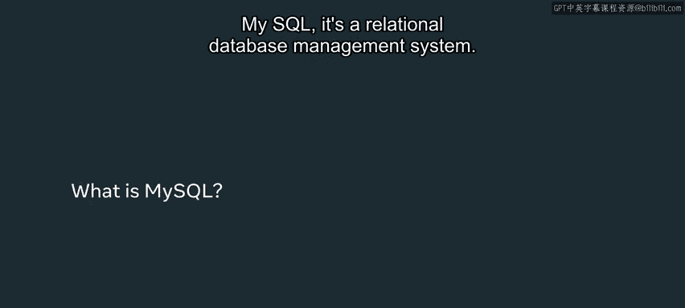
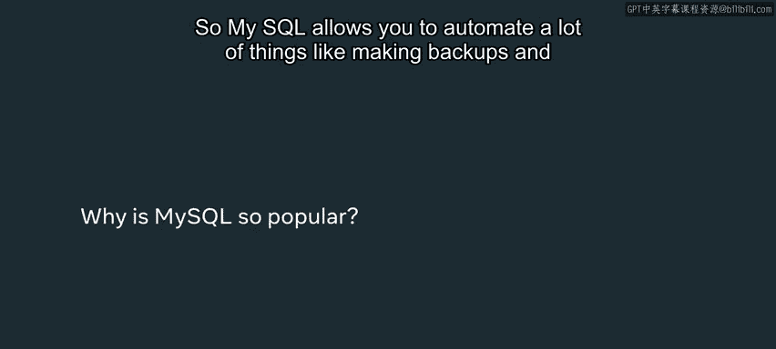
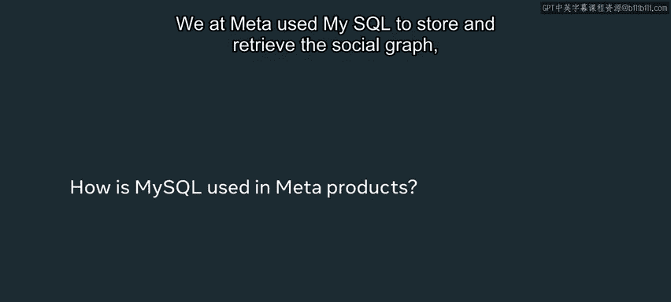
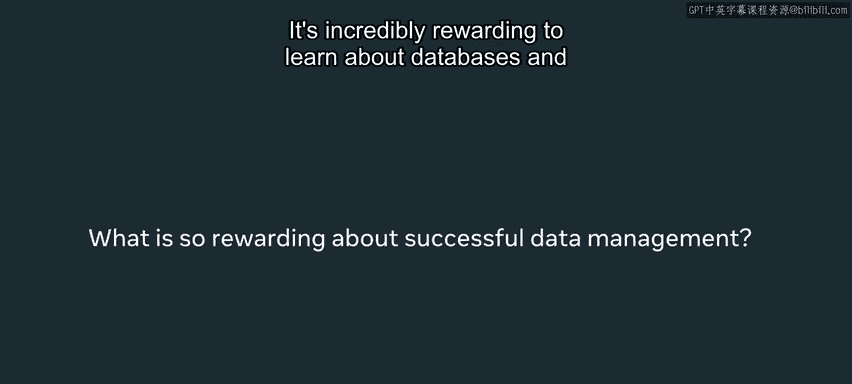
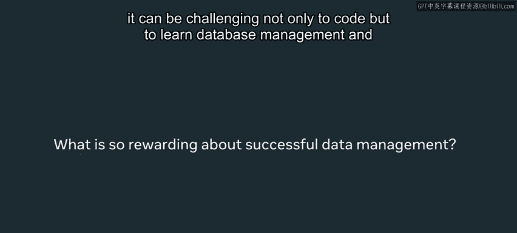

# 79：Meta如何使用MySQL 🗄️

在本节课中，我们将学习数据库在数字体验中的核心作用，并深入了解Meta公司为何以及如何使用MySQL这一流行的关系型数据库管理系统。我们将探讨MySQL的关键特性及其如何支撑大规模应用。

---

数据库存在于我们日常与数字体验的每一次互动中。无论是在智能手机上查找联系人电话、寻找下一部要播放的电影，还是在收银台扫描商品并完成支付，每一步都在与数据库交互。

我的名字是Daniel Bloomfield Ramenen，我是一名在Me DCC办公室工作的软件工程师。我的工作领域涉及安全、社区诚信，目前专注于隐私保护。

随着应用程序对数据的使用量增长，快速查找、管理、删除和更新信息的需求日益迫切。如果没有数据库管理系统，开发者就需要自行构建这些数据结构。初期或许可行，但随着业务规模扩大，难度会急剧增加。像**MySQL**这样的数据库管理系统几乎免费提供了这些服务与功能，使你能够专注于解决业务问题或用户问题，而无需过分担忧数据管理层的底层实现。

上一节我们介绍了数据库的普遍性，本节中我们来看看MySQL的具体定义。

**MySQL**是一个关系型数据库管理系统。它允许你存储数据、检索数据、管理数据，以及执行删除和更新操作。其应用范围广泛，适用于多种不同类型的应用。从机动车管理局管理驾驶记录，到Facebook应用中的点赞和分享，所有这些都可以通过数据库进行管理。MySQL是全球最流行的数据库之一。

以下是MySQL的一些核心优势：

*   **自动化能力**：MySQL允许你自动化许多任务，例如制作备份、设置故障转移和更新模式。
*   **高并发处理**：它擅长处理高并发请求，非常适合拥有大量访问量的Web应用。
*   **强大社区与开源**：它拥有一个活跃的社区，提供论坛、支持文档和帮助渠道。作为开源软件，你可以查看其代码，甚至向软件的创建者和贡献者提交请求。

了解了MySQL的优势后，我们来看看Meta是如何具体应用它的。

在Meta，我们使用MySQL来存储和检索社交图谱、用户互动、分享和点赞等数据。我知道，当我的朋友上周使用Facebook应用看到我的照片时，我可以想象，为了检索并展示这些信息，我们的MySQL服务器集群处理了成千上万的请求。MySQL为我们所有这些精彩的数字体验提供着动力。

我们选择MySQL，是因为它提供了自动化能力。这意味着一小群工程师就能管理庞大的服务器集群，执行备份、故障转移等操作，并将这些功能自动化。同时，它也非常擅长处理高事务性请求。Meta的许多业务都涉及短时间内大量精确的数据插入、删除和查询请求，而MySQL在这方面表现出色。

学习数据库知识非常有价值，它可能充满挑战，不仅涉及编码，还包括数据库管理、配置和数据结构的学习。但回报是，你将有能力构建令人惊叹的体验，为真实的用户问题提供出色的解决方案。你可以开发服务于娱乐等领域的应用程序。所有软件的各种用途，都将由组织良好、结构化的数据来驱动。坚持下去，完成本课程的学习，因为你将站在巨人的肩膀上，这些现成的数据层技术将为你所用，并推动你迈向新的高度。

---

本节课中我们一起学习了数据是每个应用的核心，有效地组织和管-理-数据至关重要。掌握数据库管理知识不仅能帮助你构建数据结构，还将影响后续的数据处理、API乃至用户界面。通过你的数据库管理和数据技能，你将拥有巨大的机会去影响从后端到前端体验的整个软件开发项目。希望你未来有机会应用这些知识，并祝愿你在接下来的努力中取得最佳成绩。