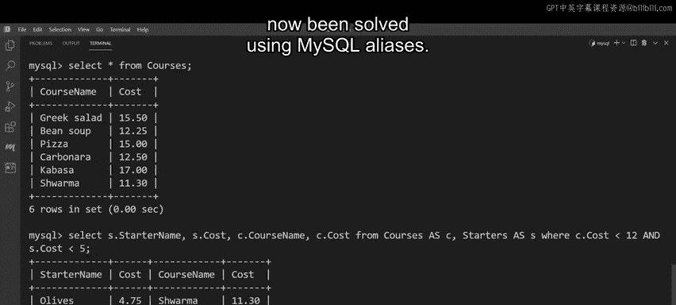

# 82：MySQL别名 🏷️

在本节课中，我们将要学习MySQL中别名的概念及其应用。别名可以为数据库中的表和列提供临时名称，使查询结果更易于使用、阅读和理解。我们将通过具体示例，学习在三种常见场景下如何使用别名。

## 概述

Little Lemon餐厅的数据库遇到了一些问题。部分表和列的名称过长，导致查询输出难以处理。他们需要找到一种方法来生成更简单、易读的结果。幸运的是，他们可以通过使用MySQL别名来解决这些问题。

接下来，我们将了解Little Lemon如何利用MySQL别名。通过本视频的学习，你将能够：理解数据库中别名的概念；识别使用别名有益的场景；并在MySQL查询中演示别名的使用。

## 什么是SQL别名？

SQL别名用于为数据库的列和表提供临时名称。这些临时名称使数据库的输出更易于使用、阅读和理解。例如，Little Lemon可以使用别名来缩短其数据库中表和列的名称。

有三种常见情况适合使用别名：
1.  重命名原始名称过长或过于技术化的表或列。
2.  与连接函数结合使用，将输出合并为一列而非两列。
3.  在处理多个表时，创建不同的表名。

然而，需要注意的是，创建和使用别名的语法会根据你试图解决的问题类型而有所不同。

## 别名语法详解

上一节我们介绍了别名的概念，本节中我们来看看在不同场景下的具体语法。

### 重命名表或列

以下是重命名表或列的语法步骤：
*   使用以 `SELECT` 关键字开头的 `SELECT` 语句。
*   输入原始列名，后跟别名。
*   两者必须用 `AS` 关键字分隔，`AS` 关键字用于创建别名。
*   你还可以包含表中的其他列，每列之间用逗号分隔。
*   然后写入 `FROM` 关键字，后跟表名。

如果你的表需要多个别名，则写出每个列名，并为每个需要创建别名的列使用 `AS` 关键字。

例如，在客户订单表中，Little Lemon可以使用别名将冗长的列名（如 `client_order_information`）重命名为 `orders`。

### 使用连接函数合并列

接下来，我们回顾一下使用连接函数将输出合并为一列的语法。

以下是使用连接函数和别名的语法步骤：
*   使用 `SELECT` 命令检索数据。
*   后跟 `CONCAT` 函数，该函数连接或组合从括号内列名中提取的信息。
*   这些名称必须用逗号和一对双引号分隔。双引号通过在连接的值之间创建空格来分隔输出。
*   然后添加 `AS` 关键字，后跟要分配给新连接列的名称或别名。
*   `FROM` 关键字指定SQL必须从中提取数据的表。

Little Lemon可以使用连接函数来合并其客户详细信息表中 `first_name` 和 `last_name` 列包含的值。这些值随后被放入一个名为 `client_names` 的新连接列中。

### 查询多个表

最后，让我们探讨查询多个表的语法。

查询多个表时，首先要注意的是，你可以使用一个字符的别名来代表每个表。例如，如果你要查询两个不同的表，则可以使用 `X` 代表表1，`Y` 代表表2。

以下是查询多个表并使用别名的语法步骤：
*   语法以 `SELECT` 命令开始，后跟要查询的表和列。
*   你可以使用点符号查询列。例如 `x.column1` 查询表1的列1，或 `y.column2` 查询表2的列2。
*   接下来添加 `FROM` 关键字，然后键入每个表的原始名称及其别名，两者用 `AS` 关键字分隔。
*   最后，根据需要添加 `WHERE` 子句和条件。

例如，假设你正在查询在线商店数据库中的价格，并希望返回表1中价格低于12美元且表2中价格低于5美元的商品列表。

以上是MySQL别名可以使用的三种主要情况及其相关语法。

## 实践应用

现在你已经熟悉了MySQL别名的概念，让我们看看能否帮助Little Lemon解决他们的数据库问题。

Little Lemon餐厅的数据库中有一个名为 `FoodOrdersDeliveryStatus` 的表，用于跟踪食品订单。该表有两个列，分别叫做 `DateFoodOrderPlacedWithSupplier` 和 `DateFoodOrderReceivedFromSupplier`。然而，这些列名太长且复杂，需要简化以提高数据库效率。

你可以使用别名来简化输出，使查询时的列名更易于阅读和理解。

以下是简化列名的操作步骤：
1.  以 `SELECT` 语句开始，并指定 `OrderID` 列。
2.  将 `DateFoodOrderPlacedWithSupplier` 列重命名为 `DateOrderPlaced`。
3.  将 `DateFoodOrderReceivedFromSupplier` 列重命名为 `Date Order Received`。

请注意，`Date Order Received` 使用了双引号，因为别名名称包含空格。在其他情况下，你可以不使用引号来声明别名。

4.  最后，键入 `FROM` 关键字，后跟表名，然后点击执行查询。

输出现在显示的是别名，而不是原始列名，这使得Little Lemon跟踪食品订单变得容易得多。

然而，你可以让这个表更高效。例如，你可以将 `OrderID` 和 `OrderStatus` 连接成一列，而不是两列。

正如之前所学，你可以将SQL别名与函数一起使用。按如下方式编写语句：

以下是连接列并创建别名的操作步骤：
1.  以 `SELECT` 命令开始，然后是 `CONCAT` 函数。
2.  将要连接的列放在一对括号内。
3.  还应确保包含引号以分隔输出。
4.  接下来，使用 `AS` 关键字创建别名。在本例中，可以将别名列称为 `OrderStatus`。
5.  然后使用 `FROM` 关键字来标识表。
6.  最后，点击执行查询。

输出显示了新的 `OrderStatus` 列及其连接的信息。

最后，让我们回顾一下如何处理数据库中的多个表。

餐厅将其菜单分为两个表，分别称为 `Starters` 和 `MainCourses`。这两个表都显示了可供订购的餐点名称及其各自的成本。作为新促销活动的一部分，Little Lemon希望推广价格不超过7美元的开胃菜和价格不超过15美元的主菜，因此你需要查询这些表并找出符合这些价格的餐点。

在这种情况下，你可以使用一个字符的别名 `S` 来代表 `Starters`，使用 `C` 来代表 `MainCourses`。

以下是查询多表并使用别名的操作步骤：
1.  将这些别名添加到 `SELECT` 语句中，并使用点符号来请求餐点的名称和成本。
2.  然后使用 `FROM` 关键字来标识表，并使用 `AS` 关键字为每个表创建别名（`MainCourses` 是 `C`，`Starters` 是 `S`）。
3.  最后，添加一个 `WHERE` 子句并指定条件。该条件返回所有价格低于7美元的开胃菜和所有价格低于15美元的主菜。
4.  最后，按Enter键执行查询。

SQL生成的输出在一个表中显示了所有相关的成本。

## 总结

本节课中我们一起学习了如何使用MySQL别名解决Little Lemon数据库的所有问题。在你的帮助下，Little Lemon的数据库现在使用起来更加高效，并且他们为下一次促销活动确定了一些很棒的餐点。

通过完成这些任务所获得的技能，你现在应该能够：理解数据库中别名的概念；识别使用别名有益的场景；并在MySQL查询中演示别名的使用。做得好！😊