# 83：联接 🧩

在本节课中，我们将要学习SQL中一个核心且强大的功能——**联接（JOIN）**。我们将了解联接的概念、主要类型及其基本语法，帮助你理解如何从多个数据库表中组合和提取数据。

---

## 概述

Lucy Shrub园艺中心需要收集关于其客户及其所下订单的信息，但这些记录分别存储在三个不同的表中。他们可以通过使用**联接（JOIN）** 子句，将这些表中所需的元素连接起来，从而提取出所需信息。

接下来，我们将探讨联接子句的工作原理。通过本视频的学习，你将能够：
*   理解数据库中联接的概念。
*   描述MySQL中主要的联接类型。

---

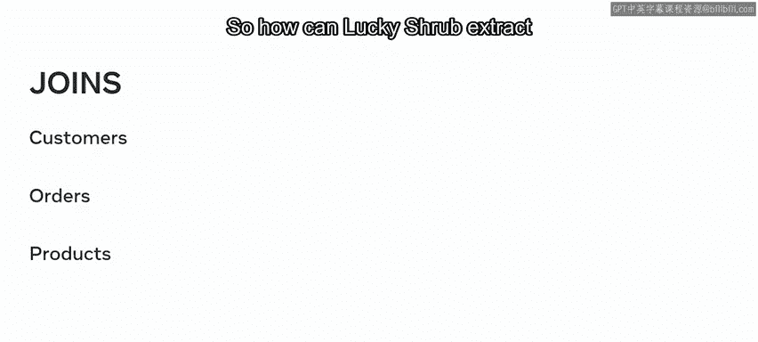

## 理解联接的概念

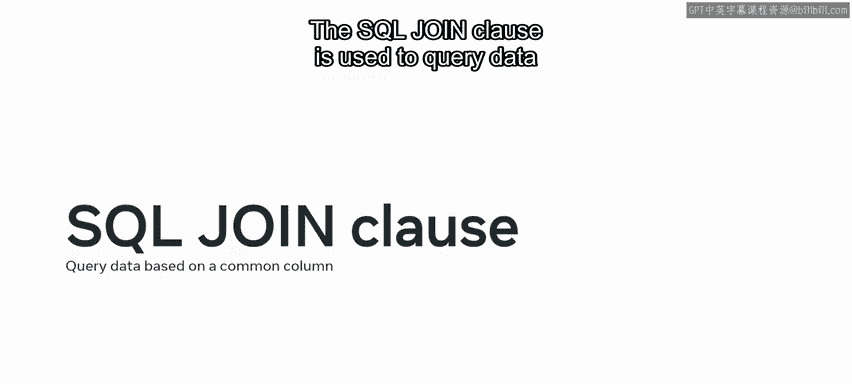

在开始帮助Lucy Shrub之前，我们首先需要理解联接的概念。


SQL的联接子句用于基于两个目标表之间的**公共列**来查询数据。

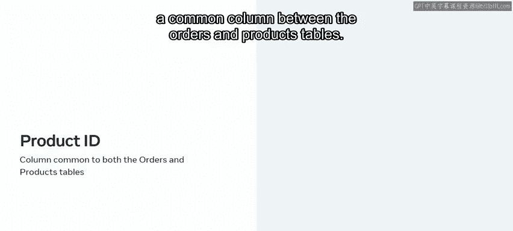

例如，`customers`（客户）表和`orders`（订单）表都包含一个`customer_id`（客户ID）列。同样，`product_id`（产品ID）列是`orders`（订单）表和`products`（产品）表之间的公共列。

这些公共列可以用来将这些表连接在一起，并提取所需的记录。

---

## 联接的主要类型

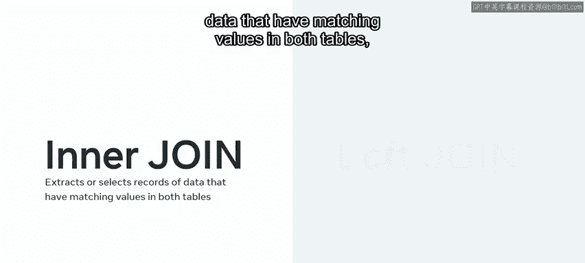

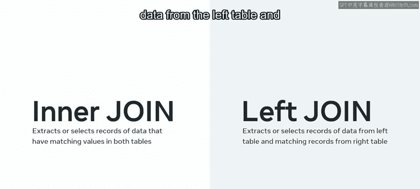

以下是用于组合表的四种主要联接类型：

*   **内联接（INNER JOIN）**：提取或选择两个表中具有匹配值的记录。
*   **左联接（LEFT JOIN）**：提取或选择左表中的所有记录，以及右表中的所有匹配记录。
*   **右联接（RIGHT JOIN）**：提取或选择右表中的所有记录，以及左表中的所有匹配记录。
*   **自联接（SELF JOIN）**：表与自身连接，以检索存在于同一表中的信息。

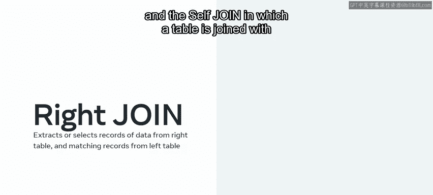

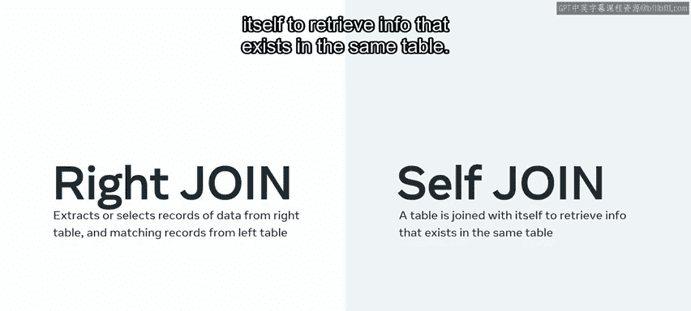

上一节我们介绍了联接的基本概念和主要类型，本节中我们来看看每种联接的具体细节。

---

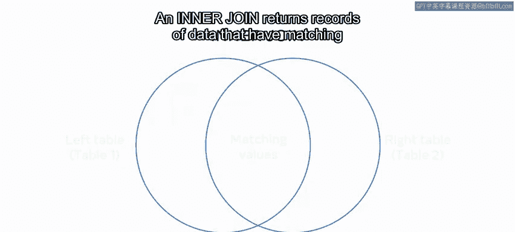

## 内联接详解

内联接返回在左表和右表中都具有匹配值（或列）的数据记录。

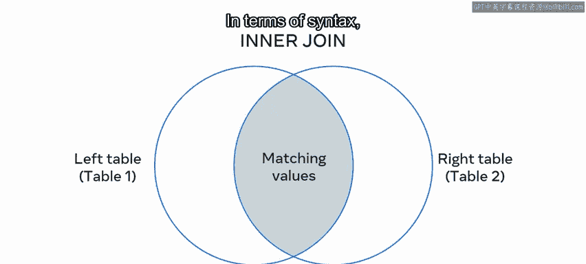

两个表之间的关系可以用维恩图来概念化表示，所有其他联接类型也是如此。在语法上，左表和右表分别被标识为`table1`和`table2`。

Lucy Shrub需要识别所有在该公司下过订单的客户的全名。要完成此查询，他们需要`clients`（客户）表和`orders`（订单）表。然后，他们可以使用两个表中都存在的`client_id`（客户ID）列来创建内联接。

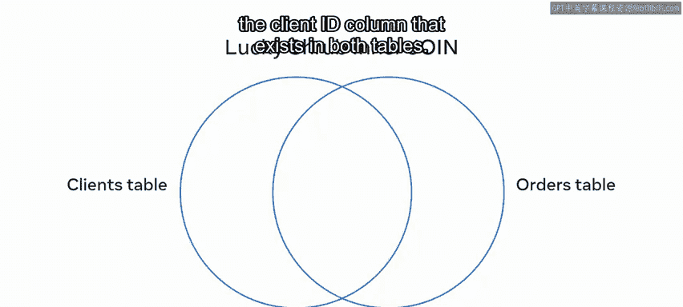

输出结果显示了所有下过订单的客户的记录，`client_id`代表了所有具有匹配ID的记录。

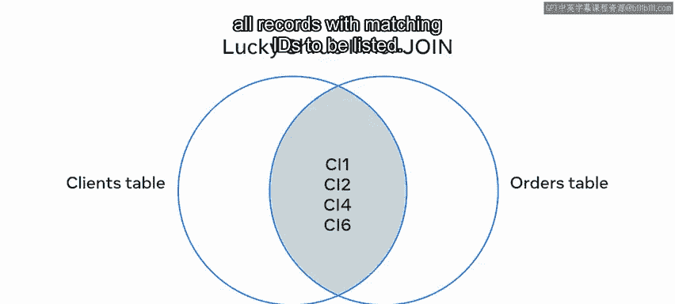

以下是内联接的基本语法结构：

```sql
SELECT table1.column1, table2.column2...
FROM table1
INNER JOIN table2
ON table1.matching_column = table2.matching_column;
```

*   `SELECT`语句查询左表和具有匹配值的列。
*   `FROM`关键字后跟左表的名称。
*   `INNER JOIN`子句后跟右表的名称。
*   `ON`关键字用于标识两个表共享的联接条件。

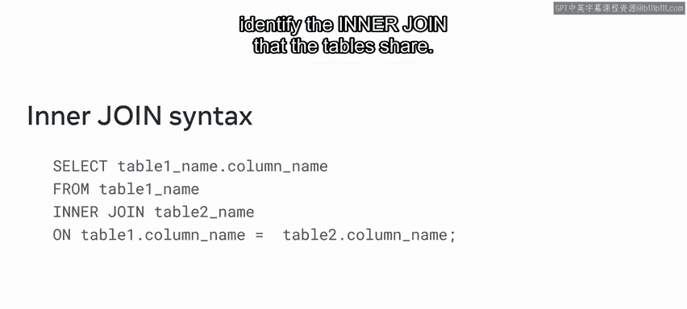

---

## 左联接详解

接下来，让我们继续学习左联接。左联接以与内联接类似的方式返回所有匹配的记录。此外，它还返回左表公共列的所有可用记录，即使右表中没有匹配项。

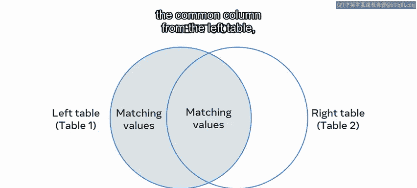

Lucy Shrub可以使用左联接，基于`client_id`值从`clients`和`orders`表中提取数据。联接会定位两个表之间的四个匹配记录，并将它们放在维恩图的公共区域。

以下是左联接的基本语法结构：

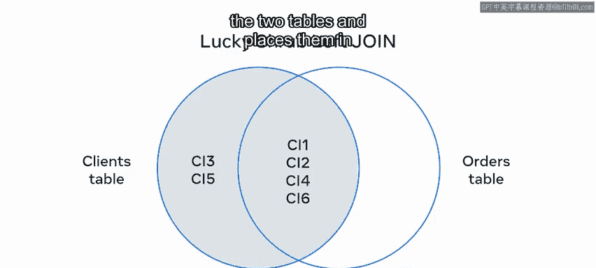

```sql
SELECT t1.column1 AS alias1, t2.column2 AS alias2...
FROM table1 AS t1
LEFT JOIN table2 AS t2
ON t1.matching_column = t2.matching_column;
```

*   `SELECT`语句标识`table1`中所需的列。
*   `AS`关键字用于为每个列创建别名。
*   `FROM`关键字用于标识需要查询的左表，并再次使用`AS`为其创建别名。
*   `LEFT JOIN`子句用于联接`table2`并分配别名。
*   `ON`关键字用于关联两个表之间的匹配列。

---

## 右联接详解

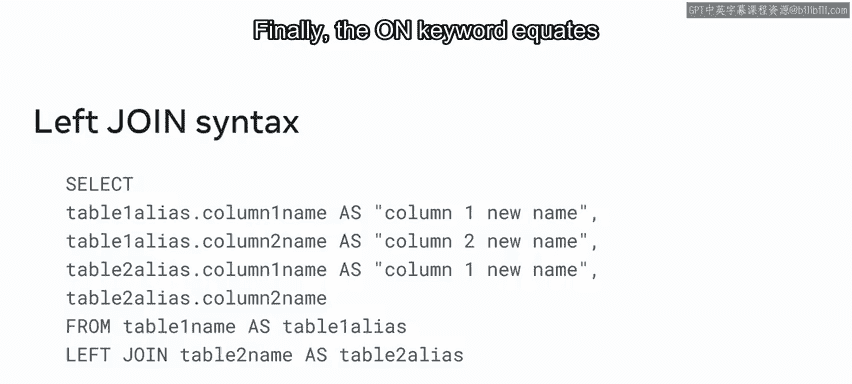

现在，让我们回顾一个右联接的例子。右联接返回右表和左表中的所有记录，但以右表为主要目标表。

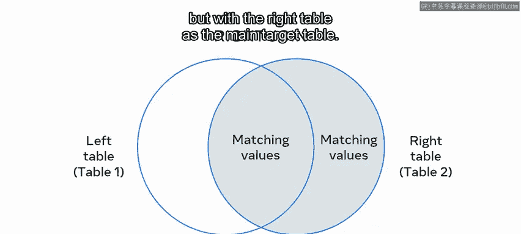

例如，Lucy Shrub可以使用右联接，基于`product_id`值从`orders`和`products`表中提取数据记录。这将列出`products`表中的所有产品，并与左表中匹配的相关订单详情连接起来。

右联接的语法与左联接非常相似，唯一的区别是使用`RIGHT JOIN`子句来提取数据记录。

```sql
SELECT t1.column1, t2.column2...
FROM table1 AS t1
RIGHT JOIN table2 AS t2
ON t1.matching_column = t2.matching_column;
```

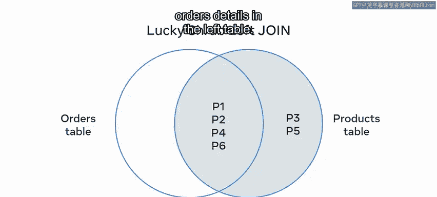

---

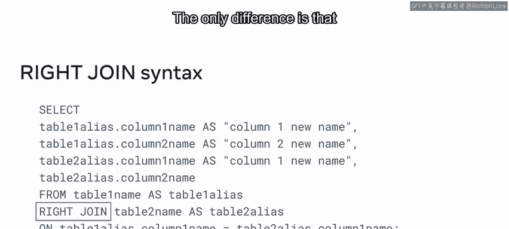

## 自联接详解

最后是自联接。自联接是一种特殊情况，即一个表必须与自身进行联接。换句话说，将一个表视为两个表，以便从左联接、右联接或内联接中提取特定信息。

以Lucy Shrub为例，该公司将所有员工的记录保存在一个`staff`（员工）表中。该表包含销售层员工和直线经理的记录。Lucy Shrub可以将该表视为两个表，以确定谁是直线经理，谁是销售层员工。

自联接的语法写成一个`SELECT`语句，其中为`table2`中的公共列创建别名。

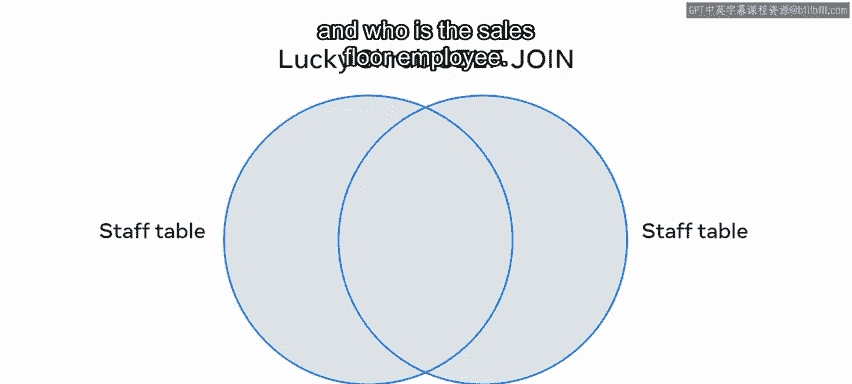

```sql
SELECT a.column1, b.column2...
FROM table_name AS a, table_name AS b
WHERE a.matching_column = b.matching_column;
```

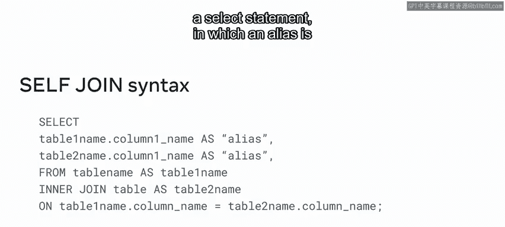

---

## 总结

本节课中我们一起学习了SQL联接的核心知识。我们首先了解了联接的概念，即通过公共列连接多个表以查询数据。接着，我们详细探讨了四种主要的联接类型：**内联接（INNER JOIN）**、**左联接（LEFT JOIN）**、**右联接（RIGHT JOIN）** 和**自联接（SELF JOIN）**，并分别介绍了它们的作用和基本语法结构。

本视频包含大量信息，特别是在语法方面。如果现阶段你还没有完全理解，请不要担心。在后续的视频中，你将更详细地学习如何创建每种类型的联接。目前，你应该能够理解数据库中的联接概念，并描述MySQL中的主要联接类型了。