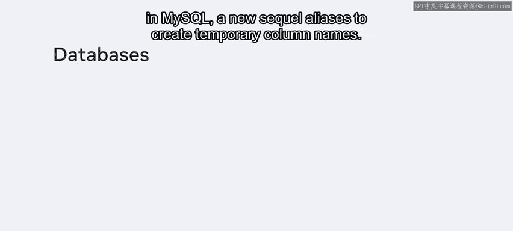
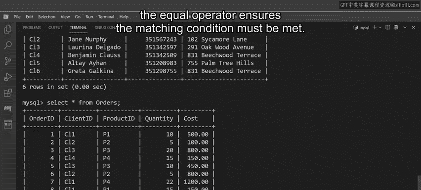
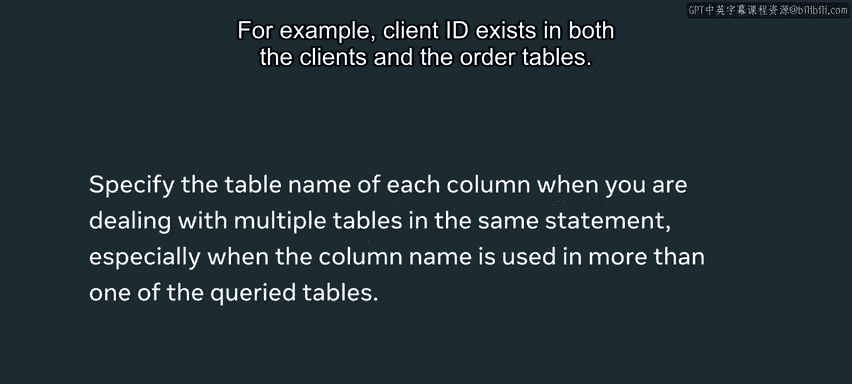
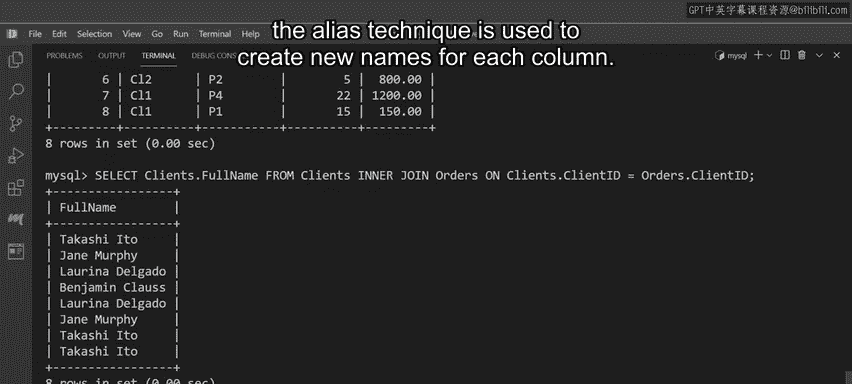
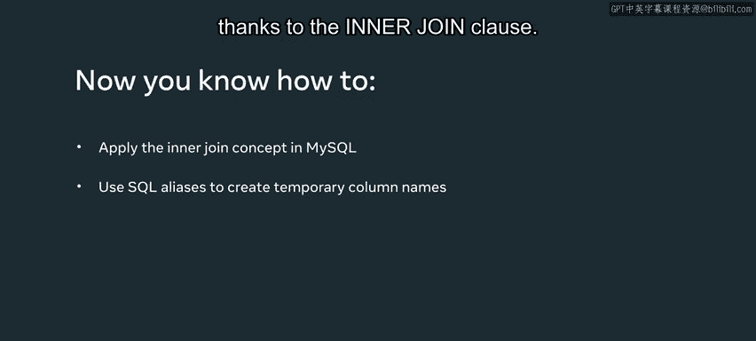

# 入门 84：内连接 🧩

在本节课中，我们将学习如何使用SQL的`INNER JOIN`子句，从两个相关联的表中查询匹配的数据。我们还将学习如何使用别名（Alias）为查询结果的列创建更易读的临时名称。

## 概述

Ly Shrub园艺中心需要查看其客户最近订单的信息。这些信息分别存储在`clients`（客户）表和`orders`（订单）表中。为了高效地查看信息，避免同时操作两个表，我们可以使用`INNER JOIN`。通过本课学习，你将能够应用`INNER JOIN`概念，并使用SQL别名。



## 表结构回顾

上一节我们了解了数据库规范化的概念，相关数据通常存储在不同的表中。本节中，我们先来回顾一下涉及的两个表。

`clients`表包含以下四列：
*   `client_id`
*   `full_name`
*   `contact_number`
*   `address`

`orders`表包含以下五列：
*   `order_id`
*   `client_id`
*   `product_id`
*   `quantity`
*   `cost`

## 使用INNER JOIN查询数据

我们的第一个任务是找出所有下过订单的客户的完整姓名。这可以通过在SQL `SELECT`语句中使用`INNER JOIN`子句来实现。

以下是实现此查询的SQL语句：



```sql
SELECT clients.full_name
FROM clients
INNER JOIN orders ON clients.client_id = orders.client_id;
```

**代码解析：**
*   `SELECT clients.full_name`: 指定要从`clients`表的`full_name`列查询数据。
*   `FROM clients`: 指定主查询表为`clients`表。
*   `INNER JOIN orders`: 表示要将`orders`表与`clients`表进行内连接。
*   `ON clients.client_id = orders.client_id`: 这是连接条件。它指定只有当`clients`表中的`client_id`与`orders`表中的`client_id`值相等时，两条记录才会被连接并返回。



**重要提示：** 当SQL语句涉及多个表时，必须使用`表名.列名`的格式来明确指定列所属的表。这在列名（例如`client_id`）同时出现在多个被查询表中时尤为重要。

执行上述查询后，结果集将列出所有下过订单的客户的完整姓名。

## 使用别名优化查询结果

上一节我们查询了客户姓名。本节中我们来看看如何查询更多信息，并使用别名让结果更易读。

我们可以从两个表中查询更多列，并使用`AS`关键字为列创建临时的、更友好的标签。

以下是查询客户ID、姓名、联系方式以及订单产品、数量和总成本的示例语句：



```sql
SELECT
    clients.client_id AS ‘客户ID‘,
    clients.full_name AS ‘姓名‘,
    clients.contact_number AS ‘联系方式‘,
    orders.product_id AS ‘产品ID‘,
    orders.quantity AS ‘数量‘,
    orders.cost AS ‘订单金额‘
FROM clients
INNER JOIN orders ON clients.client_id = orders.client_id;
```

**代码解析：**
*   在`SELECT`子句中，为每个列使用了`AS ‘新名称‘`的语法来创建别名。
*   例如，`clients.client_id AS ‘客户ID‘` 表示查询`clients.client_id`列，但在结果集中该列的标题显示为“客户ID”。

执行此查询后，将得到一个包含所有相关数据的表格，清晰地显示了客户C1、C2、C3和C4的订单信息。

## 总结



本节课中我们一起学习了如何在MySQL中使用`INNER JOIN`子句从数据库的两个表中查询匹配的数据。我们还学习了如何使用别名（Alias）为查询结果的列创建临时的、更易读的标签。现在，Ly Shrub园艺中心可以借助`INNER JOIN`子句，通过一个更高效的表格来查看所需数据。