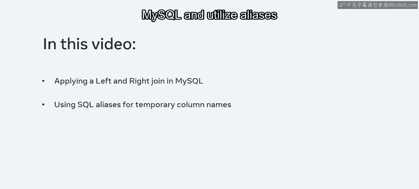
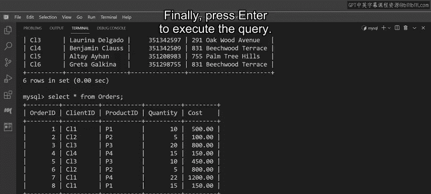
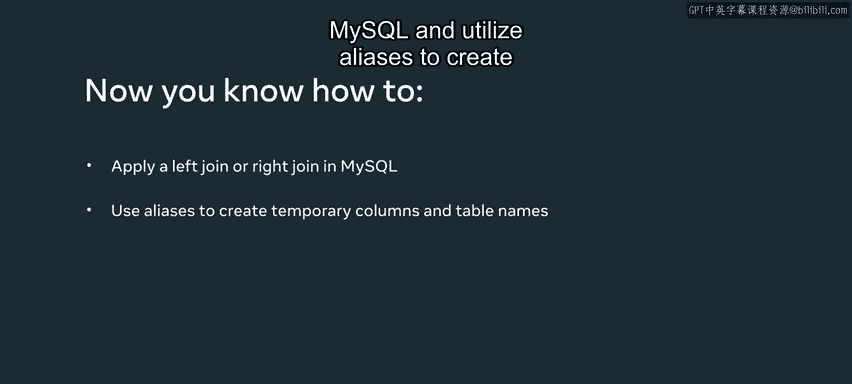

# 入门 85：左连接与右连接 🧭

在本节课中，我们将学习如何在MySQL中使用`LEFT JOIN`和`RIGHT JOIN`子句，从多个相关联的表中查询数据。我们还将学习如何使用别名来简化查询语句。

## 概述

Lucky Shrub公司需要审查其客户的订单数据。这些数据分别存储在`clients`（客户）表和`orders`（订单）表中。由于两个表共享`client_id`（客户ID）这一关键列，我们可以使用`LEFT JOIN`和`RIGHT JOIN`子句将它们连接起来进行查询。通过本课学习，你将能够演示如何应用左连接和右连接，并利用别名创建临时的列名和表名。



在开始编写查询之前，我们先快速回顾一下这两个表的结构。

## 数据表结构

`clients`表包含以下四列：
*   `client_id`：客户ID
*   `full_name`：客户全名
*   `contact_number`：联系电话
*   `address`：地址

`orders`表包含以下五列：
*   `order_id`：订单ID
*   `client_id`：客户ID
*   `product_id`：产品ID
*   `quantity`：数量
*   `cost`：成本

## 使用左连接（LEFT JOIN）

我们的第一个任务是创建一个查询，从`clients`表（左表）中获取`client_id`和`full_name`列，并从`orders`表（右表）中连接`order_id`、`quantity`和`cost`列。我们将使用`LEFT JOIN`子句来完成。

以下是构建查询的步骤：

首先，使用`SELECT`命令选择数据，并指定来自`clients`表的列。当在同一个语句中处理多个表时，使用点号`.`来指定列所属的表名非常重要，尤其是在列名（如`client_id`）在多个表中都存在的情况下。

```sql
SELECT clients.client_id, clients.full_name
```

接着，我们需要连接来自`orders`表的列。我们可以使用`AS`关键字为列名和表名创建别名，以使查询更简洁，输出结果更易读。

```sql
SELECT 
    c.client_id, 
    c.full_name, 
    o.order_id, 
    o.quantity, 
    o.cost
FROM clients AS c
LEFT JOIN orders AS o ON c.client_id = o.client_id;
```

在上面的语句中：
*   `clients AS c` 为`clients`表创建了别名 `c`。
*   `orders AS o` 为`orders`表创建了别名 `o`。
*   `LEFT JOIN` 子句会为左表（`clients`）中的每一行记录创建数据，**即使**在右表（`orders`）中没有匹配的记录。对于没有订单的客户（例如ID为C5和C6的客户），右表相关列的值将显示为`NULL`。

执行此查询后，输出结果表中，ID为C5和C6的客户对应的订单信息列将显示为`NULL`值，因为他们尚未下任何订单。

## 使用右连接（RIGHT JOIN）



接下来，我们使用`RIGHT JOIN`概念创建一个类似的查询。其语法与左连接相似，只需将`LEFT`关键字替换为`RIGHT`关键字。

在这个语句中，`clients`表是左表，`orders`表是右表。`RIGHT JOIN`子句会根据`client_id`值从两个表中提取数据。

```sql
SELECT 
    c.client_id, 
    c.full_name, 
    o.order_id, 
    o.quantity, 
    o.cost
FROM clients AS c
RIGHT JOIN orders AS o ON c.client_id = o.client_id;
```

执行此查询将返回右表（`orders`）中所有的请求信息，并根据共同的`client_id`列连接左表（`clients`）中的匹配信息。

输出结果显示，右连接返回了所有来自右表（`orders`）且客户已下订单的记录，并根据`client_id`值提取了左表（`clients`）中的匹配记录。输出结果表中没有打印`NULL`值，因为所有下过订单的客户都已存在于`clients`表中。

## 总结

本节课中，我们一起学习了MySQL中的`LEFT JOIN`和`RIGHT JOIN`操作。
*   **`LEFT JOIN`** 会返回左表的所有记录，以及右表中匹配的记录。如果右表无匹配，则结果中右表的部分为`NULL`。
*   **`RIGHT JOIN`** 会返回右表的所有记录，以及左表中匹配的记录。如果左表无匹配，则结果中左表的部分为`NULL`。
*   我们使用了 **`AS`关键字** 为表和列创建**别名**，这简化了查询语句并提高了可读性。
*   在连接查询中，使用**表名.列名**（或**别名.列名**）的格式来明确指定列所属的表是至关重要的，可以避免歧义。



现在，Lucky Shrub公司已经获得了他们所需的订单和客户信息。你也能在MySQL中演示如何应用左连接和右连接，并利用别名了。