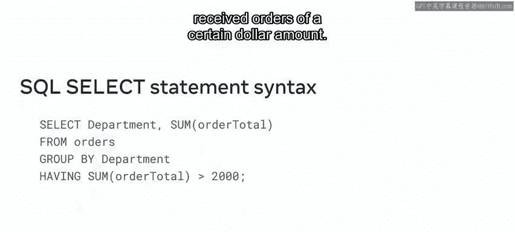
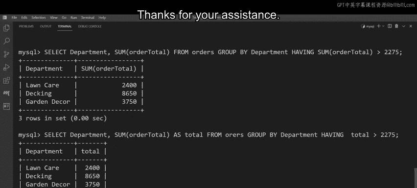

# 入门 89：MySQL HAVING子句详解 🎯

在本节课中，我们将要学习MySQL中一个非常重要的子句——`HAVING`子句。它用于对`GROUP BY`分组后的数据进行筛选，是进行数据聚合分析的关键工具。

## 什么是HAVING子句？🤔

在之前的课程中，我们学习了如何使用`GROUP BY`子句对数据进行分组。现在，Luc Shrub公司需要从已分组的客户订单数据中，筛选出符合特定条件的部门，以确定业务中表现最佳的部门。这时，就需要用到`HAVING`子句。

`HAVING`子句用于在SQL语句中，为`GROUP BY`子句生成的分组数据指定筛选条件。

## 语法回顾与对比 📝

首先，让我们快速回顾一下典型SQL语句的语法。在之前的视频中我们学过，`WHERE`子句用于在`SELECT`语句中指定一个或多个筛选条件，并且必须放在`GROUP BY`子句之前。

但是，`WHERE`子句**不能**用于对`GROUP BY`生成的分组数据指定筛选条件。那么，如何筛选这些分组后的数据呢？答案就是：在SQL语句中添加`HAVING`子句。

`HAVING`子句添加在`GROUP BY`子句之后，用于指定需要应用于分组数据的筛选条件。`HAVING`子句会针对`GROUP BY`子句返回的每个组评估筛选条件。如果结果为真，则该组包含在结果集中。

**重要提示**：如果省略了`GROUP BY`子句，那么`HAVING`子句的行为将与`WHERE`子句完全相同。

## HAVING子句基础示例 💡



Luc Shrub可以使用`HAVING`子句结合聚合函数，来确定哪些部门收到了特定金额的订单。

以下是`HAVING`子句的基本语法结构：
```sql
SELECT column1, aggregate_function(column2)
FROM table_name
GROUP BY column1
HAVING aggregate_function(column2) condition value;
```

## 实战演练：协助Luc Shrub进行数据分析 🛠️

现在，是时候运用你新学的`HAVING`子句知识来协助Luc Shrub了。正如之前所发现的，Luc Shrub需要筛选客户订单数据，以检查哪些部门达到了每月2275美元的销售目标。让我们看看能否帮助他们。

首先，我们来回顾一下存储所需数据的`orders`表。该表分为五列：`order_id`、`department`、`order_date`、`order_qty`和`order_total`。

第一个任务是识别哪些部门的订单总额大于2275美元。因此，我们只关心`department`和`order_total`这两列。

我们可以使用带有`GROUP BY`子句的`SELECT`语句来确定每个部门的总订单额。

以下是构建查询的步骤：

1.  **编写基础分组查询**：
    首先，输入`SELECT`子句，后跟`department`列。接着，需要包含`SUM`聚合函数，并将`order_total`列放在括号内。然后，添加`FROM`关键字，后跟表名`orders`。最后，包含`GROUP BY`子句并指定`department`列。
    ```sql
    SELECT department, SUM(order_total)
    FROM orders
    GROUP BY department;
    ```
    执行该语句，将检索出显示五个部门各自总销售额的输出。

2.  **使用HAVING添加筛选**：
    下一步是筛选这些数据，以检索订单总额大于2275美元的结果。我们可以使用之前的语句，但这次在`GROUP BY`子句后添加`HAVING`子句。
    `HAVING`子句后跟`SUM`聚合函数的第二个实例，再次针对`order_total`列。最后，使用大于运算符`>`，后跟数字2275。这指示SQL语句筛选大于2275美元的结果。
    ```sql
    SELECT department, SUM(order_total)
    FROM orders
    GROUP BY department
    HAVING SUM(order_total) > 2275;
    ```

3.  **使用别名优化查询**：
    现在这个SQL语句已经可以执行了。但是，我们可以通过使用别名使语法更高效。你应该从之前的课程中熟悉了别名的概念。我们可以在`SELECT`子句中为聚合函数使用一个名为`total`的别名。
    然后，在`HAVING`子句中就可以引用这个别名。这使得条件更简洁、更易读。
    ```sql
    SELECT department, SUM(order_total) AS total
    FROM orders
    GROUP BY department
    HAVING total > 2275;
    ```
    现在执行查询。生成的输出揭示了Luc Shrub公司中三个达到本月销售目标的部门。

感谢你的协助，Luc Shrub已经确定了他们表现最佳的部门。



## 总结 ✨

本节课中我们一起学习了MySQL的`HAVING`子句。你现在应该能够识别`HAVING`子句并解释其用途，同时也应该能够演示如何使用`HAVING`子句为行组指定筛选条件。你在数据分组方面的学习正在取得巨大进展。