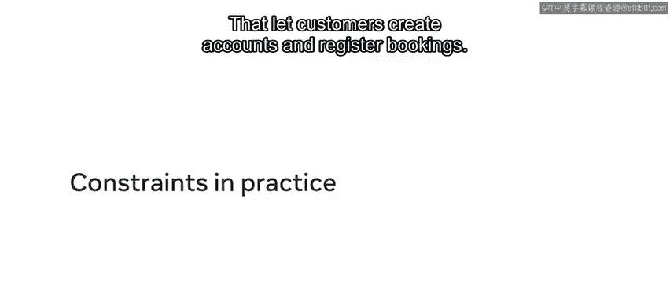
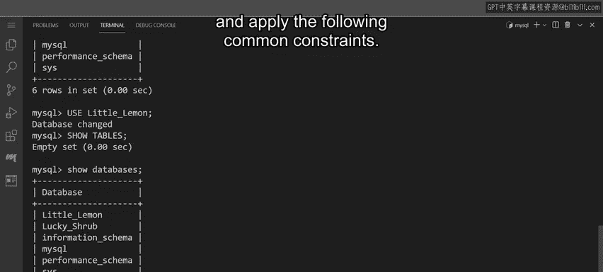
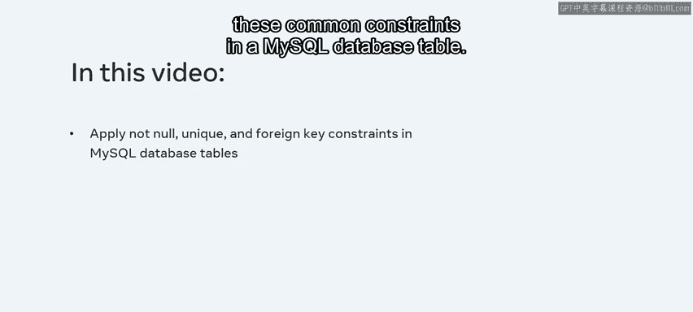
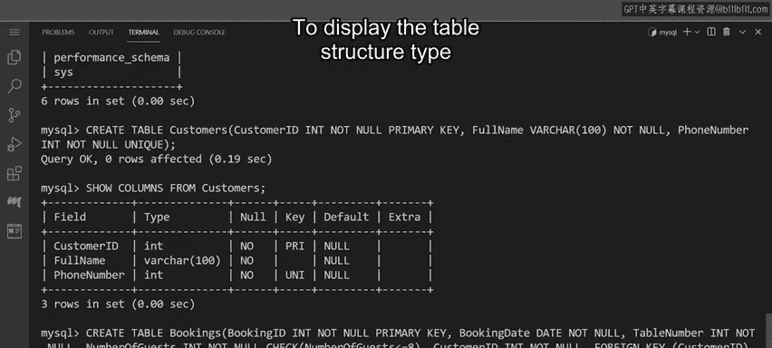
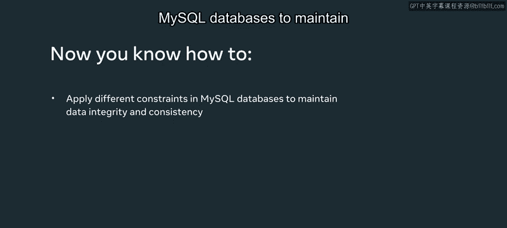

# 93：约束实践 🛠️

在本节课中，我们将学习如何在MySQL数据库中为表应用常见的约束，以确保数据的一致性和完整性。我们将通过为Little Lemon餐厅创建“顾客”和“预订”两个表来实践。





## 概述



我们将创建两个表，并应用以下四种常见约束：`NOT NULL`、`UNIQUE`、`CHECK`和`FOREIGN KEY`。通过这个过程，你将理解每种约束的作用及其对数据质量的重要性。

---

## 创建顾客表

首先，我们需要创建`Customers`表来记录顾客的详细信息。此表需要应用以下约束：
*   在`CustomerID`列上应用主键约束。
*   在`FullName`列上应用非空约束。
*   在`PhoneNumber`列上应用唯一约束，确保每个顾客的电话号码都是唯一的。

以下是创建该表的步骤和代码：

```sql
CREATE TABLE Customers (
    CustomerID INT NOT NULL PRIMARY KEY,
    FullName VARCHAR(100) NOT NULL,
    PhoneNumber INT NOT NULL UNIQUE
);
```

执行上述语句后，我们可以查看表的结构以确认约束已正确应用。

```sql
SHOW COLUMNS FROM Customers;
```

执行`SHOW COLUMNS`命令后，输出结果将显示`Customers`表的所有列及其约束。我们可以看到：
*   所有列都被定义为`NOT NULL`。
*   声明了两个键：`CustomerID`是主键，`PhoneNumber`被设置为唯一键，这意味着该列只接受唯一的值。

---

## 创建预订表

上一节我们创建了顾客表，本节中我们来看看如何创建预订表并建立表之间的关系。创建`Bookings`表的重点是应用参照完整性约束和一个`CHECK`约束，以将客人数量限制为最多8位。

以下是创建该表的完整代码：

```sql
CREATE TABLE Bookings (
    BookingID INT NOT NULL PRIMARY KEY,
    BookingDate DATE NOT NULL,
    TableNumber INT NOT NULL,
    NumberOfGuests INT NOT NULL CHECK (NumberOfGuests <= 8),
    CustomerID INT NOT NULL,
    FOREIGN KEY (CustomerID) REFERENCES Customers(CustomerID) ON DELETE CASCADE ON UPDATE CASCADE
);
```

在这段代码中，我们定义了以下列和约束：
*   `BookingID`：定义为主键。
*   `NumberOfGuests`：使用`CHECK`约束，通过`<=`运算符确保其值不超过8。
*   `CustomerID`：定义为外键，并通过`REFERENCES`约束使其引用`Customers`表中的`CustomerID`列。`ON DELETE CASCADE`和`ON UPDATE CASCADE`选项确保了当`Customers`表中的数据被更新或删除时，`Bookings`表中的相关记录也会自动同步。

现在，让我们查看`Bookings`表的结构。

```sql
SHOW COLUMNS FROM Bookings;
```



输出结果显示，所有列都被赋予了所需的约束和数据类型。值得注意的是，`CustomerID`列被标记为`MUL`（Multiple），这意味着它不是唯一键，多行可以拥有相同的键值。这是合理的，因为每位顾客可能在不同时间进行多次预订。

---

## 总结



本节课中，我们一起学习了如何在MySQL数据库表中应用`NOT NULL`、`UNIQUE`、`CHECK`和`FOREIGN KEY`约束。我们通过为Little Lemon餐厅创建`Customers`和`Bookings`两个表进行了实践，并理解了外键约束如何连接两个表并建立依赖关系。当主表中的数据发生变化时，相关子表中的数据会自动更新或删除，这有效地维护了数据的完整性和一致性。