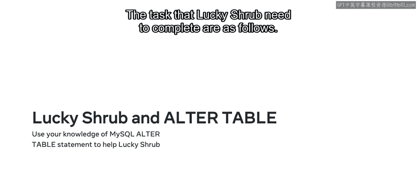
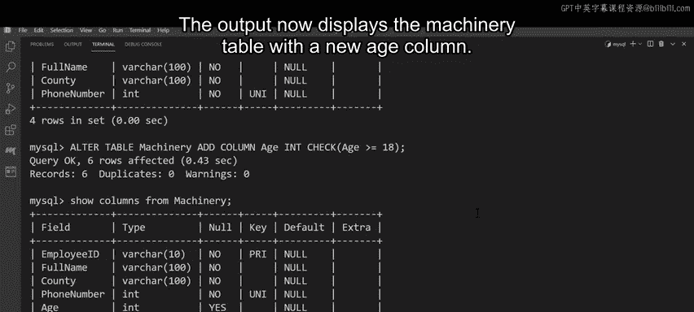

# 94：MySQL ALTER TABLE 语句详解 🛠️

在本节课中，我们将学习如何使用 MySQL 的 `ALTER TABLE` 语句来修改现有的数据库表。我们将通过一个实际案例，学习如何添加、删除和修改表中的列与约束。

## 概述

Lishhrub 园艺中心购置了新的重型机械，但只有合格的员工才能操作。公司有一个名为 `Machinery` 的数据库表，用于记录所有合格员工的联系信息。然而，该表在约束方面存在问题，并且缺少一些关键信息。我们可以使用 `ALTER TABLE` 语句来修复这些问题。通过本课学习，你将能够对现有表进行添加、删除和修改列与约束的操作。

## ALTER TABLE 语句简介

你可能会经常遇到数据库中的表缺少某些列或约束，或者现有的列和约束需要修改的情况。`ALTER TABLE` 语句就是用来实现这些更改的。它通常与不同的 SQL 命令结合使用。

以下是 `ALTER TABLE` 语句中常用的一些命令的快速概览：
*   `MODIFY` 命令用于针对特定列，并指示 SQL 对其进行更改。
*   `ADD` 命令用于向表中添加新列。
*   `DROP` 命令用于从表中删除或移除列。

## 语法与实践

那么，如何使用这些命令来修改表呢？`ALTER TABLE` 语句以 `ALTER TABLE` 子句开始，后跟要修改的表的名称。

接下来，插入一个 `MODIFY` 命令，后跟要修改的列名以及要进行的更改。例如，你可以更改列的数据类型并添加 `NOT NULL` 约束。然后，为所有其他要修改的列重复 `MODIFY` 命令。

你也可以通过添加另一列来修改表，只需使用 `ADD COLUMN` 命令，后跟新列的名称即可。

要从表中删除列，只需使用 `DROP` 命令，后跟要删除的列名。

现在你已经熟悉了 `ALTER TABLE` 语句，让我们看看能否帮助 Lishhrub 公司对他们的表进行必要的修改。

Lishhrub 需要完成的任务如下：
1.  将 `employee_id` 列设置为主键。
2.  更改列约束。
3.  向表中添加一个新列。

让我们开始吧。

## 任务实施

Lishhrub 的 `machinery` 表包含四列：`employee_id`、`full_name`、`phone_number` 和 `county`。该表缺少一个主键。幸运的是，`employee_id` 列是完美的候选者，因为所有值都是唯一的。



要将此列设置为主键，你可以编写一个 `ALTER TABLE` 语句。

```sql
ALTER TABLE machinery
MODIFY employee_id VARCHAR(10) NOT NULL PRIMARY KEY;
```

`employee_id` 列现在已成为表的主键。

看起来表中的每一列也都设置为接受 `NULL` 值。这意味着表中可以包含空字段或行，这在数据库实践中是不好的。因此，要将所有列更改为 `NOT NULL`，你可以编写另一个 `ALTER TABLE` 语句。实际上，你可以使用与之前相同的语句，只需为每一列添加一个新行。

对于 `full_name` 和 `county` 列，你可以编写以下语法：

```sql
ALTER TABLE machinery
MODIFY full_name VARCHAR(100) NOT NULL,
MODIFY county VARCHAR(100) NOT NULL;
```

对于 `phone_number` 列，你可以编写类似的语法，但使用 `INT` 数据类型和 `UNIQUE` 约束：

```sql
ALTER TABLE machinery
MODIFY phone_number INT UNIQUE;
```

这意味着该列现在只接受唯一的数值。这避免了任何重复的值。

要查看新的表结构，请编写以下语句：

```sql
SHOW COLUMNS FROM machinery;
```

此查询的输出显示：
*   `employee_id` 现在被设置为主键。
*   `phone_number` 是一个唯一值。
*   所有列都设置为 `NOT NULL`。

现在，你的最终任务是向表中添加一个新列。

Lishhrub 的重型机械只能由 18 岁及以上的员工操作，因此公司需要识别每位员工的年龄，并确定谁有资格操作机械。表中目前没有年龄列，因此你需要创建它并添加一个约束，以确保添加到表中的每位新员工至少年满 18 岁。

你可以按如下方式编写语句：

```sql
ALTER TABLE machinery
ADD COLUMN age INT CHECK (age >= 18);
```

然后点击执行查询。要查看表的新结构，请编写：

```sql
SHOW COLUMNS FROM machinery;
```



输出现在显示包含新 `age` 列的 `machinery` 表。

## 总结

在本节课中，我们一起学习了如何使用 MySQL 的 `ALTER TABLE` 语句。通过帮助 Lishhrub 公司修改 `machinery` 表，我们实践了如何设置主键、修改列的数据类型和约束（如 `NOT NULL` 和 `UNIQUE`），以及如何添加带有检查约束的新列。现在，你应该能够使用 `ALTER TABLE` 子句对现有表进行添加、删除和修改列与约束的操作了。