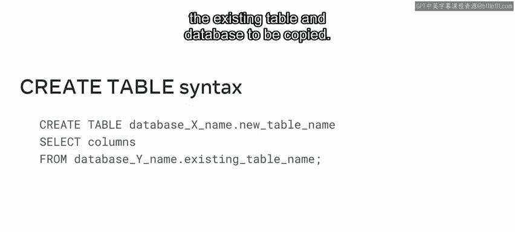
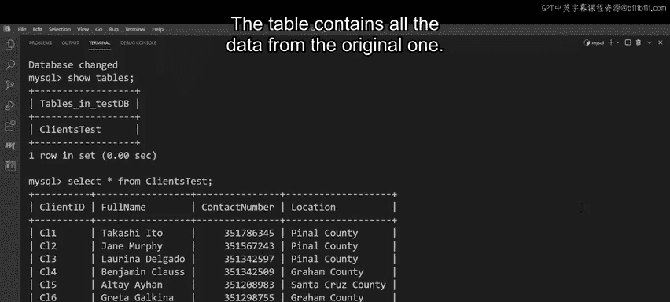

# 入门 95：MySQL 复制表教程 📋

在本节课中，我们将要学习如何在MySQL数据库中复制表。复制表是数据库管理中的一项常见任务，可以用于备份数据、创建测试环境或在数据库重构期间保护数据安全。

## 概述

Looky Shrub公司计划对其数据库进行重大改造。在准备过程中，他们需要创建数据的副本，以确保在重建期间数据的安全。他们可以通过复制表的过程来完成这项任务。接下来，你将学习复制表的过程，并帮助Looky Shrub复制其数据库中的表。完成本视频后，你将学会如何：
*   在同一数据库内，将数据从现有表复制到新表。
*   将表复制到新位置，同时确保其保留约束。
*   将数据从现有表复制到不同数据库的新表中。

这些任务是使用 `CREATE TABLE` 语法执行的。然而，在深入探讨此语法之前，让我们先回顾一下复制表的过程。

## 复制表流程回顾

在开始复制表之前，熟悉流程非常重要。

以下是复制表的基本步骤：
1.  **识别源**：首先，需要确定要从中复制数据的数据库和表。
2.  **选择列**：接下来，确定要复制的列，可以是所有列，也可以只是其中一部分。
3.  **创建新表**：然后，使用 `CREATE TABLE` 语句构建一个具有相关表名的新表。
4.  **填充数据**：最后，使用 `SELECT` 命令，通过指定要从中复制数据的列来构建新表的结构。

现在你已经熟悉了流程步骤，让我们来回顾一下 `CREATE TABLE` 语法。

## 复制表语法详解

上一节我们介绍了复制表的流程，本节中我们来看看实现这一流程的具体SQL语法。

### 在同一数据库内复制表



复制表的SQL语句以 `CREATE TABLE` 命令开始，后跟新表的名称。接着，编写 `SELECT` 命令，然后标识要复制的列。你可以复制一列、多列或所有列。最后，使用 `FROM` 命令，后跟要复制的现有表的名称。

其基本语法结构如下：
```sql
CREATE TABLE new_table_name
SELECT column1, column2, ...
FROM existing_table_name;
```

### 在不同数据库之间复制表

那么，如何在两个不同的数据库之间复制表呢？同样以 `CREATE TABLE` 命令开始。但是，在这种情况下，必须使用点符号来标识新数据库和表的名称。然后使用 `SELECT` 命令选择现有表的列。最后，使用 `FROM` 子句，后跟另一个点符号实例，该实例标识要复制的现有表和数据库的名称。

其语法结构如下：
```sql
CREATE TABLE new_database.new_table_name
SELECT column1, column2, ...
FROM existing_database.existing_table_name;
```

## 实践操作：帮助Looky Shrub复制表

现在，Looky Shrub已准备好开始复制其数据库中的表。他们希望按以下步骤执行此过程：
1.  将 `clients` 表复制到同一数据库中的名为 `clients_test` 的新表中。
2.  仅将几个选定的列复制到表中。
3.  确保原始表中的所有约束都复制到新表中。
4.  将表从一个数据库复制到另一个数据库。

运用你新学到的复制表知识来帮助他们。

### 任务一：复制整个表

首先，让我们通过输入 `SELECT * FROM clients;` 来查看Looky Shrub数据库中的 `clients` 表，然后单击“执行”以运行查询。这将在屏幕上生成 `clients` 表。该表包含四列：`client_id`、`full_name`、`contact_number` 和 `location`。

对于测试的第一部分，Looky Shrub需要将 `clients` 表复制到同一数据库中名为 `clients_test` 的新表中。

你可以使用 `CREATE TABLE` SQL查询来执行此任务。以下是具体操作：
```sql
CREATE TABLE clients_test
SELECT *
FROM clients;
```
此查询将所有列及其数据从 `clients` 表复制到新的 `clients_test` 表。

要检查查询是否成功，可以键入以下语句：`SELECT * FROM clients_test;`。此查询会生成 `clients_test` 表，并且该表按要求包含了所有数据的副本。

### 任务二：复制部分列数据

接下来，Looky Shrub需要你仅复制部分数据。他们需要将 `clients` 表中的 `full_name` 和 `contact_number` 列复制到另一个表中。

以下是操作步骤：
```sql
CREATE TABLE clients_test2
SELECT full_name, contact_number
FROM clients
WHERE location = ‘Palo Alto‘;
```
此查询创建了 `clients_test2` 表，并且该表包含了来自 `clients` 表中所有位于“Palo Alto”的员工的 `full_name` 和 `contact_number` 数据的副本。

### 任务三：复制表结构及约束

现在，你需要确保原始表中的所有约束都复制到新表中。重要的是要记住，使用目前遇到的方法复制数据**不会复制键约束**。

你可以通过键入并执行语句 `SHOW COLUMNS FROM clients;` 来检查原始表上的约束。查询会生成 `clients` 表的结构，显示为 `client_id` 和 `contact_number` 列设置的键约束。

现在，让我们通过键入并执行以下语句来检查 `clients_test` 表上的这些约束：`SHOW COLUMNS FROM clients_test;`。此语句显示 `clients_test` 表缺少原始表中定义的主键和唯一键。

那么，如何复制这些键呢？你可以使用以下语句：
```sql
CREATE TABLE clients_test3 LIKE clients;
```
`LIKE` 关键字创建现有表结构的精确副本。然后，键入并执行以下SQL语句以显示新表结构：`SHOW COLUMNS FROM clients_test3;`。输出显示这是初始 `clients` 表的精确副本，并且所有键约束都已按预期复制。

### 任务四：跨数据库复制表

你的最终任务是将 `clients` 表从Looky Shrub数据库复制到新的 `testdb` 数据库。

操作如下：
```sql
CREATE TABLE testdb.clients_test
SELECT *
FROM lookyshrub.clients;
```
现在，你只需通过进入 `test` 数据库来检查查询是否成功。键入 `USE testdb;`，然后 `SHOW TABLES;` 以显示测试数据库中的所有表。此语句显示了在 `testdb` 数据库中创建的所有表，包括你刚从Looky Shrub数据库复制过来的 `clients_test` 表，并且该表包含了原始表中的所有数据。



## 总结

本节课中我们一起学习了MySQL中复制表的核心操作。Looky Shrub现在在其数据库中拥有了所有需要的表副本。你现在应该能够：
*   在同一数据库内，将数据从现有表复制到新表。
*   将表复制到新位置，同时确保其保留约束。
*   将数据从现有表复制到不同数据库的新表中。

做得好！