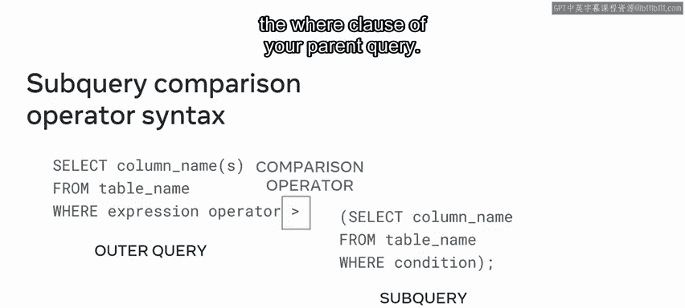
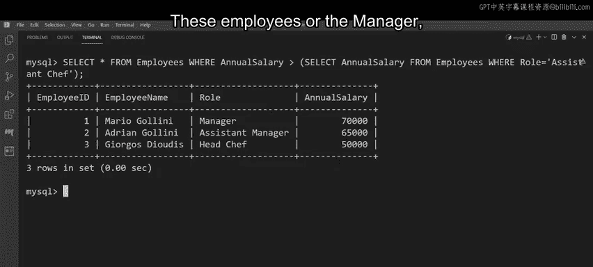

# 96：MySQL子查询 🧩

在本节课中，我们将要学习MySQL中的子查询概念。子查询是嵌套在另一个查询内部的查询，它可以帮助我们从数据库中提取更复杂、更精确的数据集。我们将了解子查询的基本语法、适用场景以及如何利用它来检索数据。

## 什么是子查询？

上一节我们介绍了课程目标，本节中我们来看看子查询的定义。子查询，顾名思义，是一个查询中的查询。换句话说，它是一个放置在外部查询内部的内部查询。内部查询可被视为子查询，而外部查询则可被视为父查询。

## 子查询的语法

为了理解子查询的工作原理，最好的方式是学习其语法。正如刚才所学，子查询是一个查询中的查询，即一个位于外部（父）查询内部的内部（子）查询。

内部查询（子查询）首先执行，其结果随后传递给外部（父）查询。在MySQL中，你也可以构建多个子查询。外部查询的写法与任何普通查询一样，包含`SELECT`、`FROM`和`WHERE`子句。同样，子查询也写作标准查询。

然而，子查询必须始终放置在一对括号内。执行时，子查询可以返回以下任何一种结果：一个**单个值**、**单行**、**单列**或**多行**（包含一列或多列）。

子查询的一个关键优势是，你可以使用比较运算符将其结果与其他值进行比较。



以下是子查询与比较运算符结合使用的语法示例。子查询可以放在父查询`WHERE`子句中比较运算符的前面或后面。

```sql
SELECT * FROM 表名
WHERE 列名 比较运算符 (SELECT 列名 FROM 表名 WHERE 条件);
```

## 子查询的演示应用

现在我们已经熟悉了子查询的基础知识，接下来通过一个演示来看看它们是如何被使用的。

假设Little Lemon餐厅需要从其数据库中提取员工薪资数据来完成财务核算。这些数据存储在`employees`表中。该表包含四列：`EmployeeID`、`EmployeeName`、`Role`和`AnnualSalary`。餐厅需要利用此表找出哪些员工的年薪高于助理厨师。

我们可以使用子查询来完成此任务。这个查询可以分两部分进行：
1.  外部（主）查询必须提取年薪大于指定值的所有员工的详细信息。
2.  子查询必须找出助理厨师的年薪。

执行时，子查询从员工数据库中提供一个数据子集，这个数据子集随后作为外部查询的输入。

以下是构建查询的步骤：

首先，编写外部查询：
```sql
SELECT *
FROM Employees
WHERE AnnualSalary >
```
接下来，我们需要确定`WHERE`子句中要比较的具体值。这通过子查询实现。

在大于运算符后添加括号，并在其中编写子查询：
```sql
(SELECT AnnualSalary FROM Employees WHERE Role = 'Assistant Chef')
```
现在，完整的查询语句如下：
```sql
SELECT *
FROM Employees
WHERE AnnualSalary > (SELECT AnnualSalary FROM Employees WHERE Role = 'Assistant Chef');
```
执行此查询。子查询首先执行，提取出助理厨师的年薪（例如45,000美元）。这个值现在成为外部查询`WHERE`子句的输入。接着，外部查询执行，筛选出年薪高于助理厨师的所有员工记录。

查询结果显示，助理厨师年薪为45,000美元，而外部查询显示有三名员工的薪资高于此数额，他们分别是经理、助理经理和主厨。



## 总结

本节课中我们一起学习了MySQL子查询。我们了解到子查询是一个嵌套在另一个查询内部的查询，它先于外部查询执行，并将其结果提供给外部查询使用。我们学习了子查询的基本语法，并通过一个实际案例演示了如何使用子查询来比较和筛选数据。掌握子查询能让你更灵活、更高效地从数据库中检索所需信息。