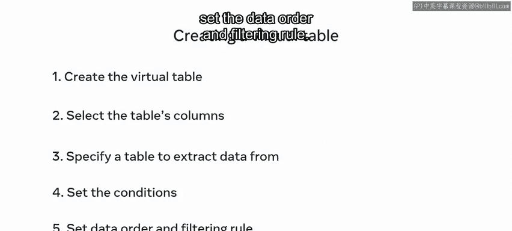
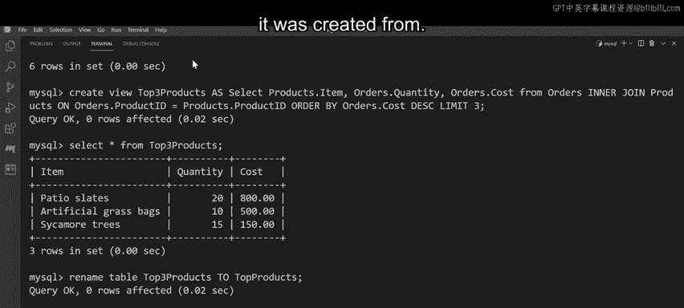

# 入门 98：创建与管理视图

## 概述
在本节课中，我们将要学习数据库中的一个重要概念——视图。我们将了解什么是视图，为什么需要使用视图，并掌握如何在MySQL数据库中创建、重命名和删除视图。通过一个帮助Lucy Shrub商店识别畅销商品的实例，我们将把理论知识应用到实践中。

## 什么是视图？👀
上一节我们介绍了课程概述，本节中我们来看看视图的基本概念。

视图是基于一个或多个数据库表的查询结果集生成的虚拟表。它本身不存储数据，而是提供一种访问和操作底层表中数据的接口。

以下是创建视图的核心语法：
```sql
CREATE VIEW view_name AS
SELECT column1, column2, ...
FROM table_name
WHERE condition;
```

## 为什么使用视图？
理解了视图是什么之后，我们来看看数据库工程师使用视图的几个常见原因。

以下是视图的主要用途：
*   **简化数据访问**：当表中列很多时，可以创建一个只包含必要列的视图，简化查询。
*   **数据整合**：可以将来自多个不同表的数据组合到一个虚拟表中，方便查询。
*   **增强安全性**：通过视图可以限制用户只能访问特定的行或列，保护敏感数据。
*   **逻辑抽象**：可以隐藏复杂的查询逻辑，为用户提供一个清晰、简单的数据接口。

## 如何创建视图？
了解了视图的用途，接下来我们学习创建视图的具体语法和步骤。

创建视图的语法遵循一个清晰的五步过程：
1.  使用 `CREATE VIEW` 语句开始创建。
2.  列出需要从原表移动到虚拟表的列。
3.  指定从中提取数据以创建视图的原表。
4.  设置数据筛选条件。
5.  设置数据排序规则。

### 从单表创建视图
从单个表创建视图相对简单。其基本语法结构如下：
```sql
CREATE VIEW view_name AS
SELECT table1.column1, table1.column2
FROM table1
WHERE condition
ORDER BY column1;
```
其中，点符号（`.`）用于将列与其所属的表关联起来，在查询单表时可省略。



### 从多表创建视图
当需要从多个表创建视图时，语法会稍有不同，关键在于需要使用 `JOIN` 来连接表。

从多表创建视图的语法示例如下：
```sql
CREATE VIEW view_name AS
SELECT table1.column1, table2.column2
FROM table1
INNER JOIN table2 ON table1.matching_column = table2.matching_column
WHERE condition;
```
点符号在这里尤为重要，它可以避免来自不同表但名称相同的列产生冲突。

## 实践：帮助Lucy Shrub商店
现在我们已经掌握了视图的理论知识和创建方法，是时候运用这些知识来帮助Lucy Shrub商店解决实际问题了。

Lucy Shrub商店今年销售业绩很好，他们需要找出销量前三的商品，以确保未来几个月有足够的库存。他们的数据库中有订单表（`orders`）和产品表（`products`）。

### 分析表结构
在创建视图前，我们先熟悉一下相关的表。
*   **`orders` 表**：包含 `order_id`、`client_id`、`product_id`、`quantity`、`cost` 五列。
*   **`products` 表**：包含 `product_id`、`item_name`、`price` 三列。

我们需要创建一个视图，包含产品名称、订单数量和总成本。

### 创建“畅销商品”视图
以下是创建该视图的完整SQL语句：
```sql
CREATE VIEW top_three_products AS
SELECT p.item_name AS item, o.quantity, o.cost
FROM orders o
INNER JOIN products p ON o.product_id = p.product_id
ORDER BY o.cost DESC
LIMIT 3;
```
执行此查询后，会生成一个名为 `top_three_products` 的虚拟表。我们可以像查询普通表一样查询它：
```sql
SELECT * FROM top_three_products;
```

## 管理视图：重命名与删除
视图创建后，我们还可以对它进行重命名或删除操作。

### 重命名视图
如果觉得视图名称太长，可以使用 `RENAME TABLE` 命令来重命名它。
```sql
RENAME TABLE top_three_products TO top_products;
```
执行后，视图名称就从 `top_three_products` 改为 `top_products` 了。



### 删除视图
当不再需要某个视图时，可以使用 `DROP VIEW` 命令将其删除。删除视图不会影响创建它的原始基表。
```sql
DROP VIEW top_products;
```
执行此命令后，`top_products` 视图即被移除。

## 总结
本节课中我们一起学习了数据库视图的核心知识。我们首先了解了视图是作为一种虚拟表存在的，它能够简化查询、整合数据并提升安全性。接着，我们详细学习了如何使用 `CREATE VIEW` 语法从单个或多个表创建视图，并理解了点符号在区分列时的重要性。最后，通过一个实际案例，我们实践了视图的创建，并学会了如何使用 `RENAME TABLE` 和 `DROP VIEW` 来管理视图。掌握视图的创建与管理，是高效进行数据库操作和维护的重要技能。