# 入门 99：模块小结 - 更新数据库和使用视图

在本节课中，我们将回顾本模块的核心内容，总结关于数据更新、约束、表结构修改、子查询以及视图的关键知识与技能。

恭喜你完成了本课程的第二个模块。现在，让我们花点时间回顾一下你在本模块课程中获得的一些关键技能。

## 📝 第一课：插入与更新数据

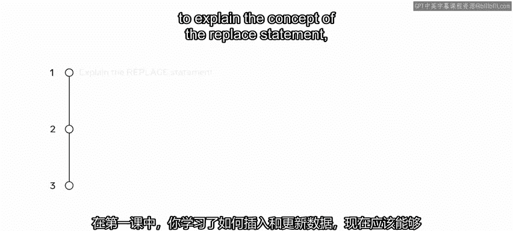

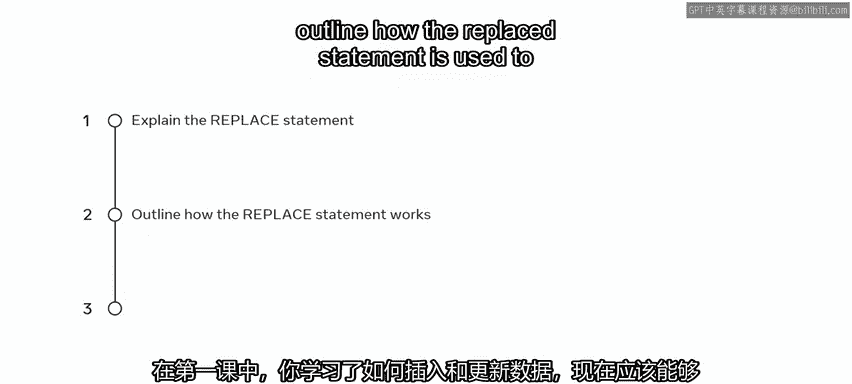

在第一课中，你学习了如何插入和更新数据。现在你应该能够解释 `REPLACE` 语句的概念，概述如何使用 `REPLACE` 语句在数据库表中插入或更新数据，并能在实验环境中完成项目后演示 `REPLACE` 语句。

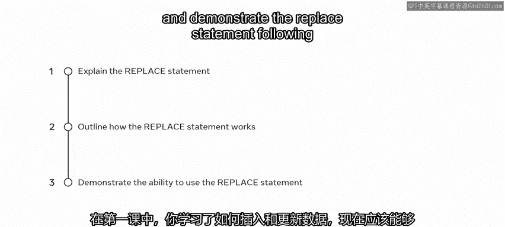

以下是 `REPLACE` 语句的基本语法：
```sql
REPLACE INTO table_name (column1, column2, ...) VALUES (value1, value2, ...);
```

## 🔧 第二课：值与约束

上一节我们介绍了数据更新，本节中我们来看看如何管理数据完整性。在第二课中，你学习了如何处理值和约束。完成本课后，你能够识别主要的约束类型，解释约束在数据库中的工作原理，概述 MySQL 中的 `ON DELETE CASCADE` 和 `ON UPDATE CASCADE` 选项，并能在实验环境中证明你运用值和约束的能力。

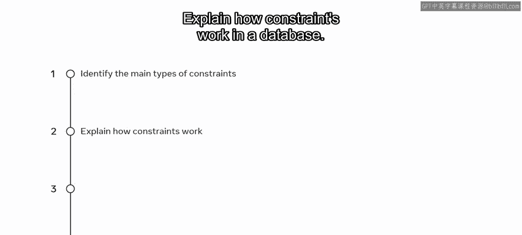

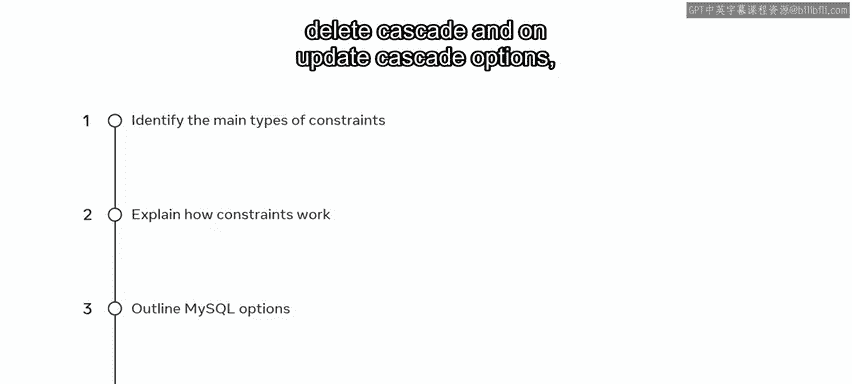

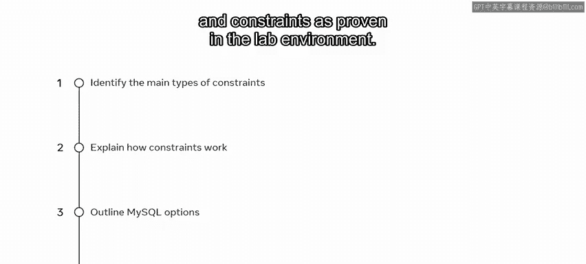

以下是定义外键约束并级联操作的示例：
```sql
CREATE TABLE orders (
    order_id INT PRIMARY KEY,
    customer_id INT,
    FOREIGN KEY (customer_id) REFERENCES customers(id) ON DELETE CASCADE ON UPDATE CASCADE
);
```

## 🏗️ 第三课：修改表结构

接着，你进入了第三课，学习了如何更改表的结构。完成本课后，你现在能够在现有的数据库表中添加、删除和修改列及约束，使用 `COPY TABLE` 语法在表内和数据库之间复制数据。你也在实验中展示了修改表的能力，并通过额外资源学习了更多相关概念。

以下是添加列和复制表的语法示例：
```sql
-- 添加列
ALTER TABLE employees ADD COLUMN hire_date DATE;

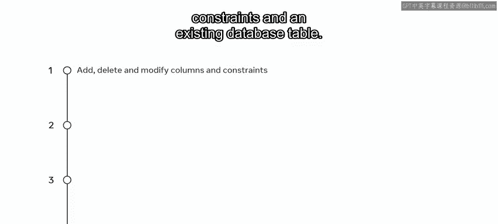

-- 复制表结构及数据
CREATE TABLE new_table LIKE original_table;
INSERT INTO new_table SELECT * FROM original_table;
```

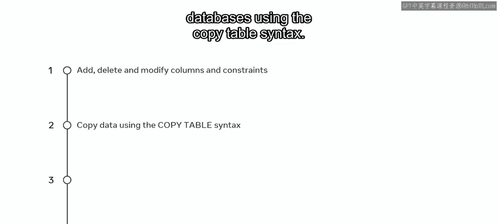

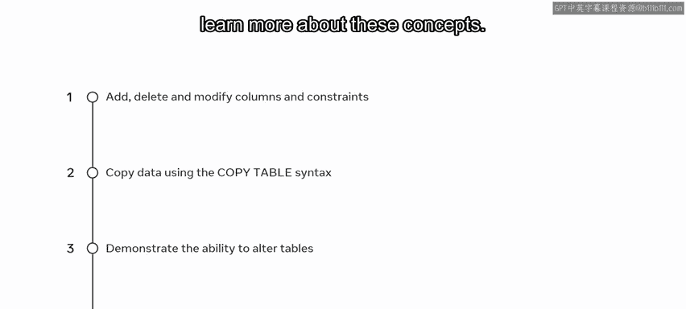

## 🔍 第四课：子查询

在第四课中，你探索了子查询的概念。完成本课后，你能够识别子查询并理解其语法，确定可以使用子查询的场景，并解释如何使用子查询来检索数据。你同样在实验环境中展示了运用子查询的能力。

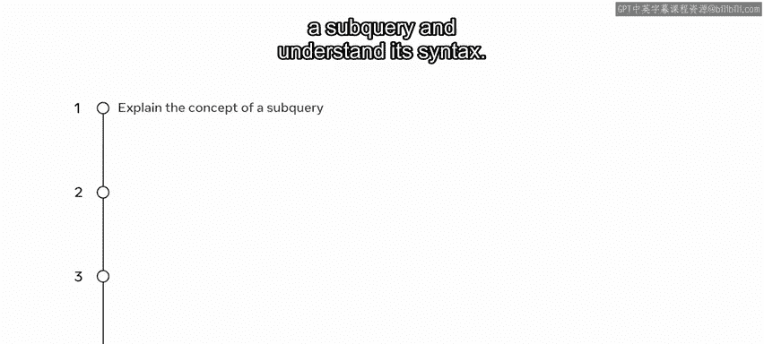

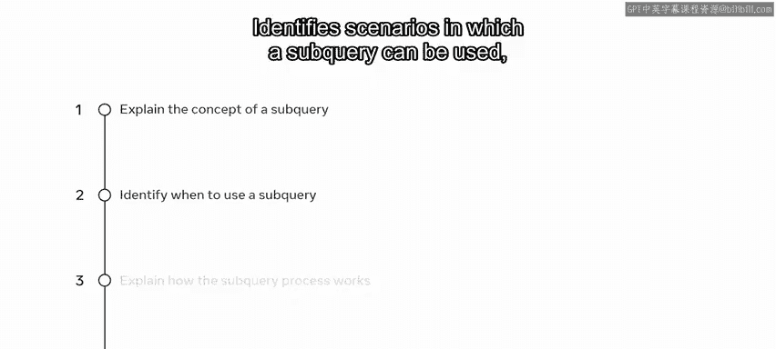

以下是一个使用子查询的示例：
```sql
SELECT name FROM products WHERE category_id IN (SELECT id FROM categories WHERE name = 'Electronics');
```

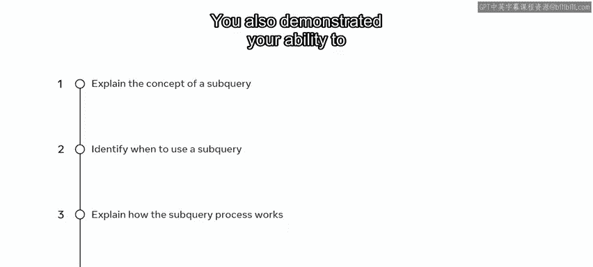

## 👁️ 第五课：虚拟表（视图）

最后，在第五课中，你学习了关于虚拟表或视图的知识。完成本课后，你能够解释数据库中视图的概念，演示如何在数据库中创建、重命名和删除视图，识别在 MySQL 中使用视图的优势，并通过阅读材料获得了关于视图主题的额外知识。

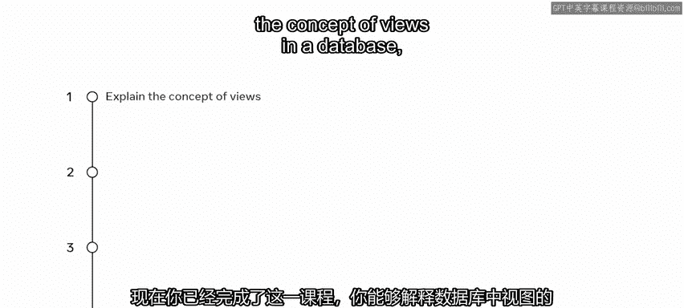

以下是创建和删除视图的语法：
```sql
-- 创建视图
CREATE VIEW customer_summary AS SELECT customer_id, COUNT(*) AS order_count FROM orders GROUP BY customer_id;

-- 删除视图
DROP VIEW IF EXISTS customer_summary;
```

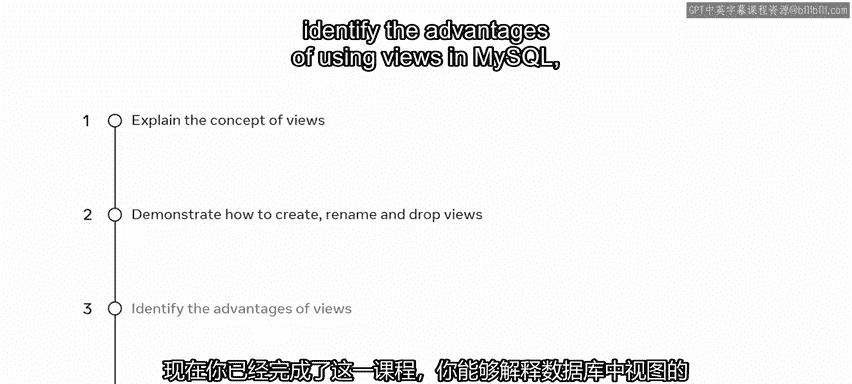

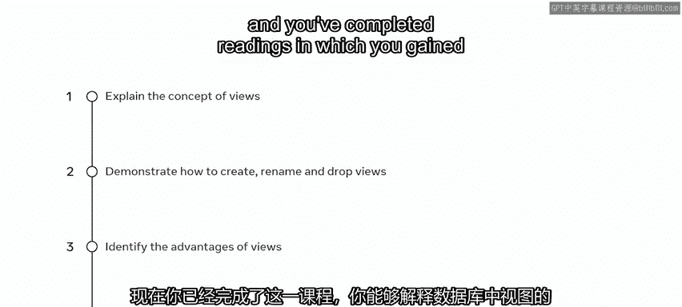

## ✅ 模块总结

本节课中我们一起学习了本模块的核心技能。完成本模块后，你现在应该能够：
*   更新数据。
*   处理值与约束。
*   更改表的结构。
*   运用子查询和虚拟表。

做得很好！我期待在下一个模块中继续指导你，在那里你将学习如何在 MySQL 中使用函数和存储过程。