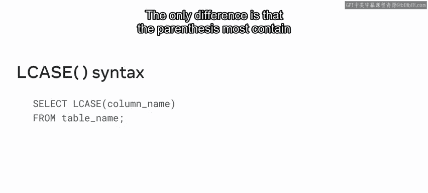
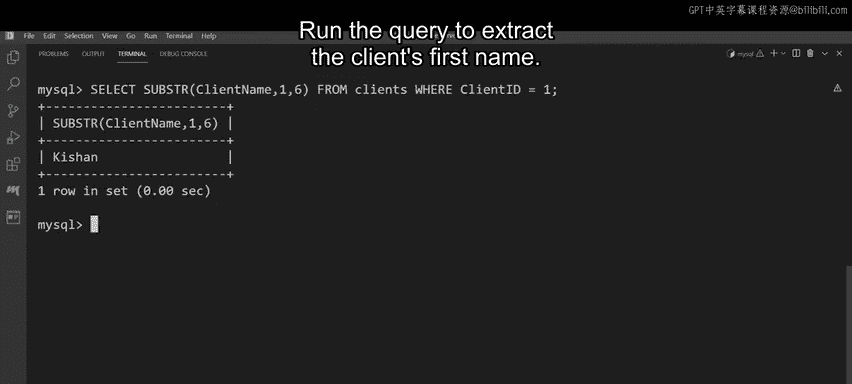

# 101：字符串函数 🧵

在本节课中，我们将学习MySQL中常用的字符串函数。字符串函数用于处理和操作文本数据，例如连接多个字符串、提取部分字符串或转换字母大小写。掌握这些函数对于从数据库中提取和格式化信息至关重要。

## 什么是字符串函数？

上一节我们介绍了课程目标，本节中我们来看看什么是字符串函数。

字符串函数用于操作字符串值。例如，将多个字符串连接在一起，或者从一个较长的字符串中提取出一段子字符串。

以下是几个常用字符串函数的例子：
*   **CONCAT** 函数用于将多个字符串连接在一起。
*   **SUBSTRING** 函数用于从主字符串中提取一段子字符串。
*   **UPPER** 函数将字符串转换为大写。
*   **LOWER** 函数将字符串转换为小写。

## 字符串函数的语法

了解了基本概念后，本节中我们来探索这些字符串函数在MySQL数据库中的具体语法。

### CONCAT 函数语法

一个非常简单的连接函数示例如下：
```sql
SELECT CONCAT("字符串1", "字符串2") FROM 表名;
```
它以 `SELECT` 命令开始，后跟 `CONCAT` 函数。在括号内，包含需要连接的字符串值。确保字符串用双引号括起来，并用逗号分隔。然后使用 `FROM` 关键字指定包含数据的表名。你还可以使用 `WHERE` 子句来指定条件。

一个更复杂的 `CONCAT` 函数示例可能涉及从两个独立的表中提取字符串值。例如，M&G公司需要的数据位于 `items` 和 `mg_orders` 两个表中。他们可以在 `SELECT` 子句中传递参数，在 `FROM` 子句中指定所需的两个表，并在 `WHERE` 子句中指定条件，以便SQL从两个表的组合中筛选出所需数据。

### SUBSTRING 函数语法

`SUBSTRING` 函数的语法类似，但括号内包含三个参数：
```sql
SUBSTRING(字符串, 起始索引, 长度)
```
第一个参数是字符串本身。下一个是起始索引，即子字符串必须开始的字符串位置。`长度` 参数指的是需要提取的字符串部分的长度。

### UPPER 和 LOWER 函数语法

M&G公司经常需要将表中某一列的值转换为大写，将另一列的值转换为小写。以下是他们执行此任务的方法。



大写字符串函数以 `SELECT` 语句开始，后跟 `UPPER` 函数。在括号内，写入需要转换为大写的列名。最后，指示SQL要操作的目标表。
```sql
SELECT UPPER(列名) FROM 表名;
```
小写字符串函数非常相似。唯一的区别是括号内必须包含需要转换为小写的列名。
```sql
SELECT LOWER(列名) FROM 表名;
```

## 实践应用：M&G公司的库存审查

学习了基本语法后，本节中我们来看看M&G公司如何在MySQL数据库中使用字符串函数。

### 任务一：连接商品名称与库存数量

如前所述，M&G需要一份商品名称及其可用数量的列表，格式为“商品名称 - 订单数量”。商品详情在 `items` 表中，订单详情在 `mg_orders` 表中。

`items` 表在以下列中记录M&G库存的商品信息：`item_id`, `name`, `cost`。
`mg_orders` 表在以下列中记录交货数据：`order_id`, `item_id`, `quantity`, `cost`, `order_date`, `delivery_date`, `order_status`。

你可以使用 `CONCAT` 字符串函数从这些表中提取所需数据。
```sql
SELECT CONCAT(name, ‘ - ‘, quantity) AS ‘item_name - order_quantity‘
FROM items, mg_orders
WHERE items.item_id = mg_orders.item_id;
```
查询以 `SELECT` 命令开始，然后调用 `CONCAT` 函数并写上一对括号。在括号内，传递参数 `name` 和 `quantity`。这些是你的输出列的名称，分别代表 `items` 表和 `mg_orders` 表。然后在参数之间添加一个连字符“-”以组合它们。连字符使用一对单引号，并确保所有参数用逗号分隔。使用 `FROM` 关键字指定两个表。最后，使用 `WHERE` 子句指定一个条件，从两个表的组合中筛选所需数据。然后执行查询。MySQL将提取一个显示库存中每种商品总数量的表。

### 任务二：转换订单状态的大小写

下一个任务是检索 `mg_orders` 表的 `order_status` 列中的所有字符串值，分别以大写和小写形式显示。

你可以使用 `UPPER` 和 `LOWER` 字符串函数来操作 `order_status` 列中的字符串值。
```sql
SELECT UPPER(order_status) FROM mg_orders;
```
在你的 `SELECT` 查询中，调用 `UPPER` 函数并传入列名 `order_status`。然后使用 `FROM` 关键字指定 `mg_orders` 表。执行查询以检索所有大写值。
要检索所有小写值，只需再次键入相同的查询，但这次调用 `LOWER` 函数。
```sql
SELECT LOWER(order_status) FROM mg_orders;
```
再次执行查询以检索所有小写值。

### 任务三：提取客户名字

作为下一项任务的一部分，M&G正在审查一位客户的订单。他们需要从 `clients` 表中提取该客户的名字。

`clients` 表记录客户的关键信息，并将其存储在以下列中：`client_id`（所需客户的ID为1）、`client_name`、`address` 和 `contact_number`。

你可以使用 `SUBSTRING` 函数从表的 `client_name` 列值中提取字符串的相关部分，从而检索M&G所需的信息。
```sql
SELECT SUBSTRING(client_name, 1, 6) AS first_name
FROM clients
WHERE client_id = 1;
```
首先，编写一个 `SELECT` 语句，调用 `SUBSTR` 函数，后跟一对括号。然后将 `client_name` 列作为第一个参数传递给子字符串函数。将起始索引作为第二个参数传入，即字符串的第一个字母或字符（索引为1）。并将需要提取的字符串部分的长度作为第三个参数传入。客户的名字是“Kisen”，有六个字母长。所以“6”是我们的第三个参数。然后使用 `FROM` 关键字指定目标表。最后，添加 `WHERE` 子句，以客户ID等于1作为条件。运行查询以提取客户的名字。



## 总结

本节课中我们一起学习了MySQL的核心字符串函数。我们首先了解了`CONCAT`、`SUBSTRING`、`UPPER`和`LOWER`函数的基本概念与语法。随后，我们通过M&G公司的实际案例，逐步实践了如何使用这些函数来连接字符串、转换文本大小写以及提取子字符串，从而完成具体的数据库查询任务。掌握这些字符串函数，能够帮助你有效地处理和格式化数据库中的文本数据。