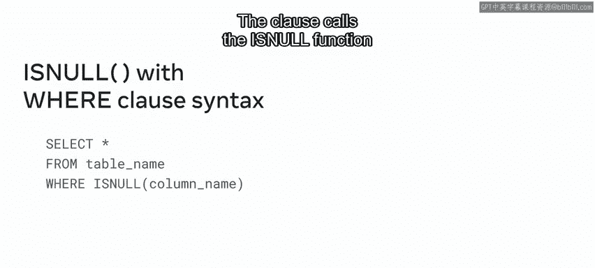
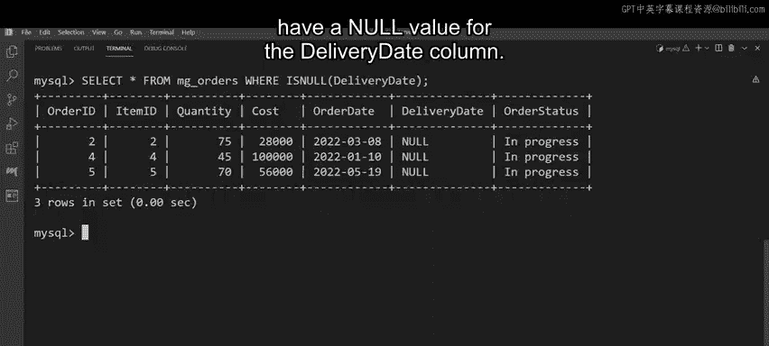

# 103：比较函数 🔍

在本节课中，我们将学习 MySQL 中的比较函数。这些函数用于比较数据库中的值，例如找出最大值、最小值或检查空值。掌握这些函数能帮助你更有效地处理和筛选数据。

## 什么是比较函数？

MySQL 比较函数允许你在数据库中比较数值。例如，这些函数可用于确定最高值、最低值等。比较函数的优势在于它们能处理多种类型的值，包括数字、字符串和字符。

以下是几个常见的 MySQL 比较函数示例：
- **GREATEST** 函数用于找出最高值。
- **LEAST** 函数用于确定最低值。
- **IS NULL** 函数用作等号运算符的替代方案，用于测试值是否为空。

## 比较函数的语法

上一节我们介绍了比较函数的基本概念，本节中我们来看看它们的语法结构。

### GREATEST 和 LEAST 函数

以下是针对仅包含数值的表格，找出最高和最低值的语法示例。

语法以 `SELECT` 命令开始，后跟所需列的名称（通常是包含主键或标识属性的列）。接着，输入 `GREATEST` 函数，括号内包含需要比较的列名。然后使用 `AS` 关键字和列别名（例如 `highest`），确保 SQL 在新表的该列下返回所需值。类似地使用 `LEAST` 函数。最后，指定要查询的表。

例如，M 和 G 可以使用以下语法提取销售数据，针对最近四个业务季度，找出每个季度的最高和最低值。

```sql
SELECT item_id,
       GREATEST(Q1, Q2, Q3, Q4) AS highest,
       LEAST(Q1, Q2, Q3, Q4) AS lowest
FROM sales_revenue;
```

### IS NULL 函数

`IS NULL` 通常与 `SELECT` 命令一起使用，后跟所需列的名称。然后使用 `FROM` 关键字指定目标表。`IS NULL` 函数也可以与 `WHERE` 子句结合使用，该子句调用 `IS NULL` 函数并指定其必须检查的列。

```sql
SELECT *
FROM mg_order
WHERE delivery_date IS NULL;
```

## 在 M&G 数据库中的应用



现在你已经熟悉了比较函数的语法，让我们花点时间看看它们如何在 M&G 数据库中使用。

### 提取销售数据

如前所述，M&G 需要获取库存中每个物品在过去四个业务季度的销售数据。销售数据存储在 `sales_revenue` 表中，该表包含五列：`item_id` 列标识每个库存物品，以及四个季度各占一列。

M&G 首先需要找出每个物品在过去四个季度中的最高和最低收入。你可以使用 `GREATEST` 和 `LEAST` 比较函数来帮助他们，就像之前的语法示例一样。

以下是具体步骤：
1.  以 `SELECT` 命令开始，并将 `item_id` 列为第一列。
2.  为找出带来最高收入的物品，调用 `GREATEST` 函数，并将四个业务季度列作为参数传递。
3.  创建别名 `highest`。
4.  为 `LEAST` 函数编写类似的语法行，并分配别名 `lowest`。
5.  最后，使用 `FROM` 关键字指定 `sales_revenue` 表。

执行后，查询输出将显示每个物品在过去四个业务季度中的最高和最低销售值。例如，ID 为 1 的物品在销售高峰时价值 138,000 美元，在销售最低时期价值 60,000 美元。

### 筛选未交付订单

M&G 需要确定哪些最近订单尚未交付。交付数据保存在 `mg_order` 表中，该表包含七列：`order_id`、`item_id`、`quantity`、`cost`、`order_date`、`delivery_date` 和 `order_status`。这里主要关注 `delivery_date` 列。所有尚未交付的订单在该列中都有一个空值。

因此，你可以在此列上使用 `IS NULL` 函数，并结合 `WHERE` 子句来筛选这些订单。

以下是具体步骤：
1.  像往常一样编写 `SELECT` 语句，后跟一个星号 `*`。
2.  使用 `FROM` 关键字指定目标表。
3.  最后，编写 `WHERE` 子句并调用 `IS NULL` 函数来检查 `delivery_date` 列。

执行后，查询返回值为 3；这是所有 `delivery_date` 列为空值的记录的真实值。



## 总结

本节课中我们一起学习了 MySQL 中的比较函数。我们了解了 `GREATEST` 和 `LEAST` 函数用于找出数据中的最大值和最小值，以及 `IS NULL` 函数用于检查空值。通过 M&G 数据库的实际示例，我们看到了这些函数如何应用于提取销售数据和筛选未交付订单。掌握这些函数将帮助你在数据库管理中更有效地处理和分析数据。